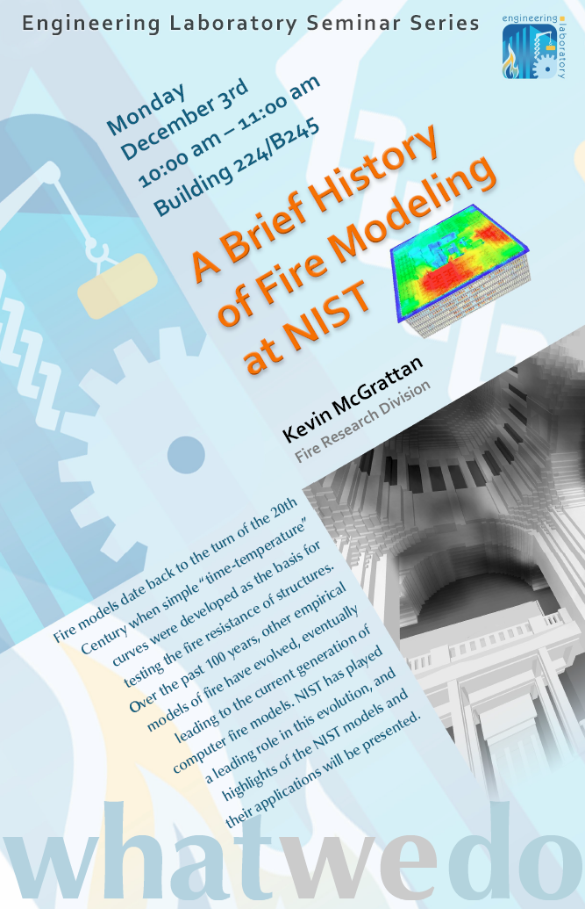
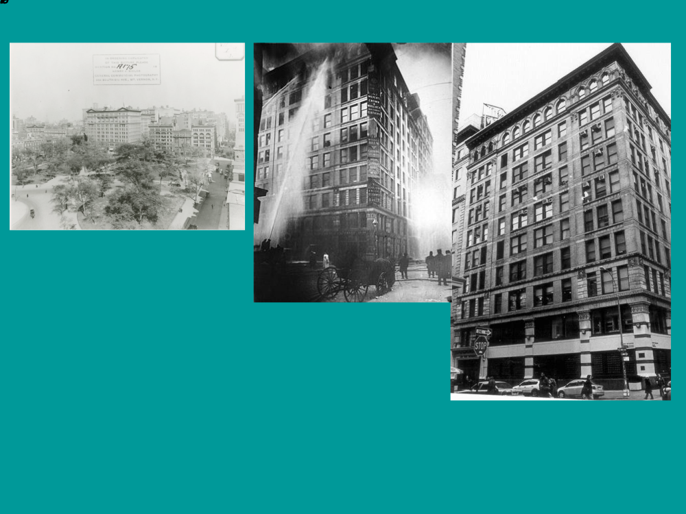
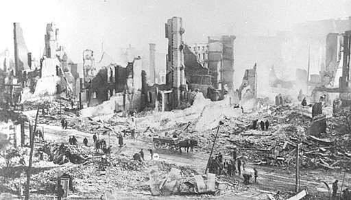
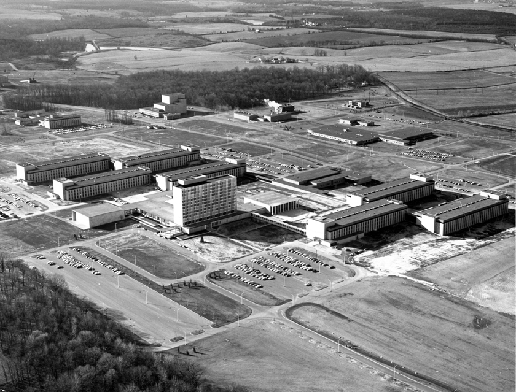
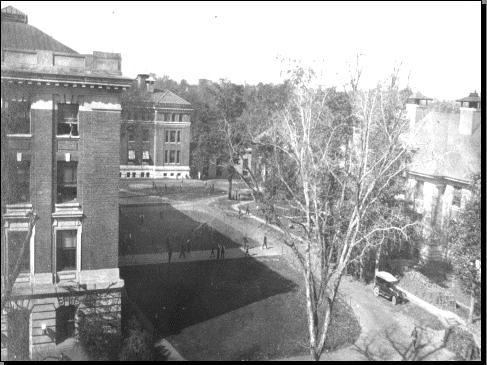
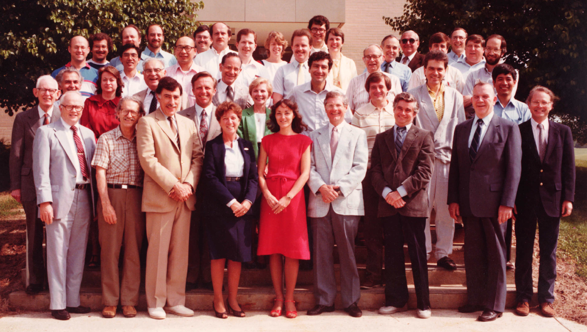

## Fire Research at NIST {#welcome-01 .welcome-slide}

<!-- Source: History_of_Fire_Modeling_4.pptx, slide 1. -->

```{=html}
<div class="slide-canvas">

</div>
```

## History of Fire Modeling {#welcome-02 .welcome-slide}

<!-- Source: History_of_Fire_Modeling_4.pptx, slide 2. -->

```{=html}
<div class="slide-canvas">

</div>
```

## NIST and Fire {#welcome-03 .welcome-slide}

<!-- Source: History_of_Fire_Modeling_4.pptx, slide 3. -->

```{=html}
<div class="slide-canvas">
<div class="ppt-text" style="left:5.0000%;top:0.0000%;width:90.0000%;height:8.2629%;padding:6.0px 12.0px 6.0px 12.0px;"><p style="text-align:left;"><span style="font-size:60.00px;">NIST and Fire</span></p></div>


<div class="ppt-crop" style="left:50.0000%;top:50.0000%;width:48.4966%;height:44.9118%;"></div>
<div class="ppt-crop" style="left:2.5508%;top:50.0000%;width:45.1253%;height:44.9118%;"></div>
<div class="ppt-text" style="left:5.8104%;top:44.0523%;width:38.6060%;height:4.9366%;padding:6.0px 12.0px 6.0px 12.0px;white-space:nowrap;"><p style="text-align:left;"><span style="font-size:26.67px;">Great Baltimore Fire aftermath, 1904</span></p></div>
<div class="ppt-text" style="left:54.9762%;top:44.0523%;width:38.5443%;height:4.9366%;padding:6.0px 12.0px 6.0px 12.0px;white-space:nowrap;"><p style="text-align:left;"><span style="font-size:26.67px;">Present day, Gaithersburg, Maryland</span></p></div>
<div class="ppt-text" style="left:59.3893%;top:94.9118%;width:29.7180%;height:4.9366%;padding:6.0px 12.0px 6.0px 12.0px;white-space:nowrap;"><p style="text-align:left;"><span style="font-size:26.67px;">Gaithersburg campus, 1964</span></p></div>
<div class="ppt-text" style="left:13.1542%;top:94.9118%;width:25.1951%;height:4.9366%;padding:6.0px 12.0px 6.0px 12.0px;white-space:nowrap;"><p style="text-align:left;"><span style="font-size:26.67px;">NBS DC campus, 1920</span></p></div>
</div>
```

## Staff photo, Center for Fire Research, 1985 {#welcome-04 .welcome-slide}

<!-- Source: History_of_Fire_Modeling_4.pptx, slide 4. -->

```{=html}
<div class="slide-canvas">

<div class="ppt-text" style="left:16.5653%;top:90.5556%;width:66.5064%;height:6.7318%;padding:6.0px 12.0px 6.0px 12.0px;white-space:nowrap;"><p style="text-align:left;"><span style="font-size:30.00px;">Staff photo, Center for Fire Research, 1985</span></p></div>
</div>
```
