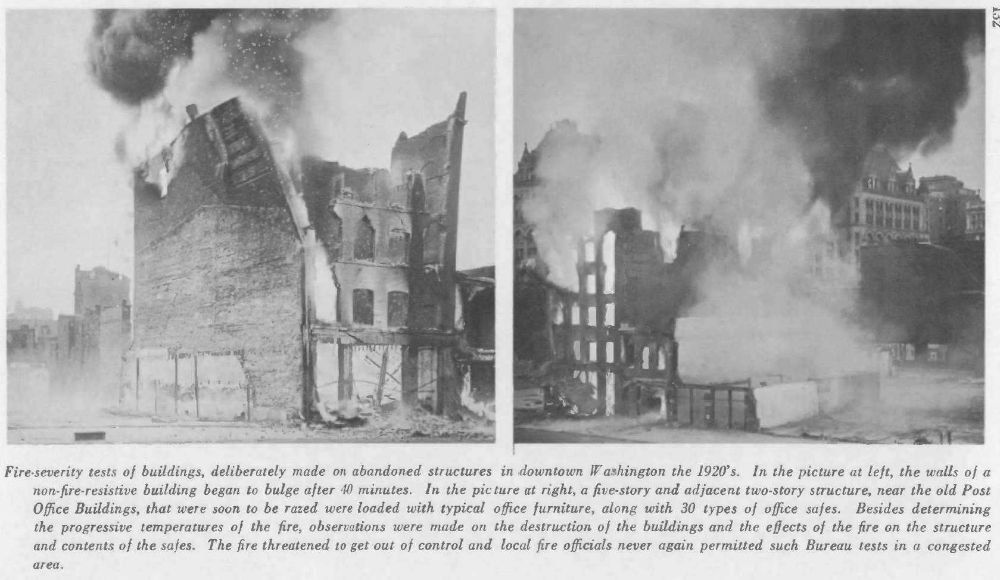
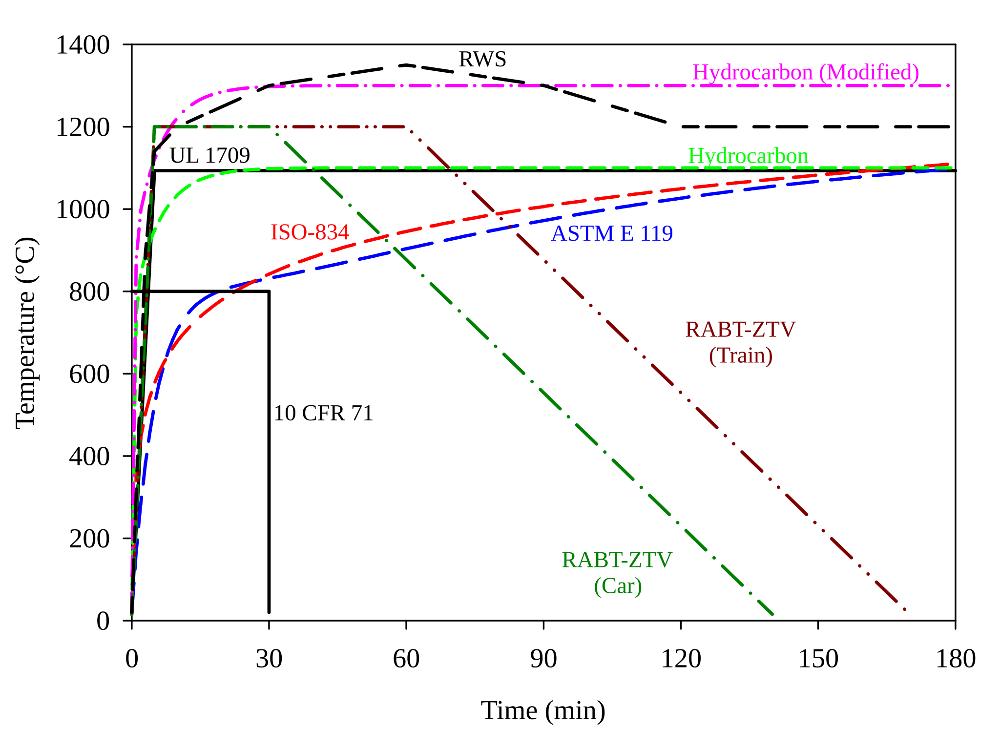

## 1900 -- 1970 {#welcome-05 .welcome-slide}

<!-- Source: History_of_Fire_Modeling_4.pptx, slide 5. -->

```{=html}
<div class="slide-canvas">
<div class="ppt-text" style="left:17.4167%;top:31.7778%;width:65.6667%;height:37.2491%;padding:6.0px 12.0px 6.0px 12.0px;"><p style="text-align:left;"><span style="font-size:66.67px;">1900 -- 1970</span></p><p style="text-align:left;">&nbsp;</p><p style="text-align:left;"><span style="font-size:66.67px;">Fire Resistance and Passive Fire Protection</span></p></div>
</div>
```

## R. Cochrane,  {#welcome-06 .welcome-slide}

<!-- Source: History_of_Fire_Modeling_4.pptx, slide 6. -->

```{=html}
<div class="slide-canvas">

<div class="ppt-text" style="left:24.1195%;top:90.9783%;width:74.3805%;height:4.4879%;padding:6.0px 12.0px 6.0px 12.0px;white-space:nowrap;"><p style="text-align:left;"><span style="font-size:23.33px;">R. Cochrane, </span><span style="font-size:23.33px;font-style:italic;">Measures for Progress, A History of the National Bureau of Standards</span></p></div>
<div class="ppt-text" style="left:10.2352%;top:3.7094%;width:79.1129%;height:6.7318%;padding:6.0px 12.0px 6.0px 12.0px;"><p style="text-align:left;"><span style="font-size:30.00px;">Simon </span><span style="font-size:30.00px;">Ingberg</span><span style="font-size:30.00px;"> and Fire Resistance Testing at NBS</span></p></div>
</div>
```

## Fire resistance testing {#welcome-07 .welcome-slide}

<!-- Source: History_of_Fire_Modeling_4.pptx, slide 7. -->

```{=html}
<div class="slide-canvas">

</div>
```
