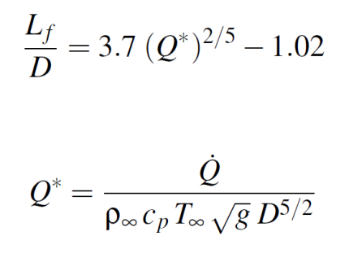
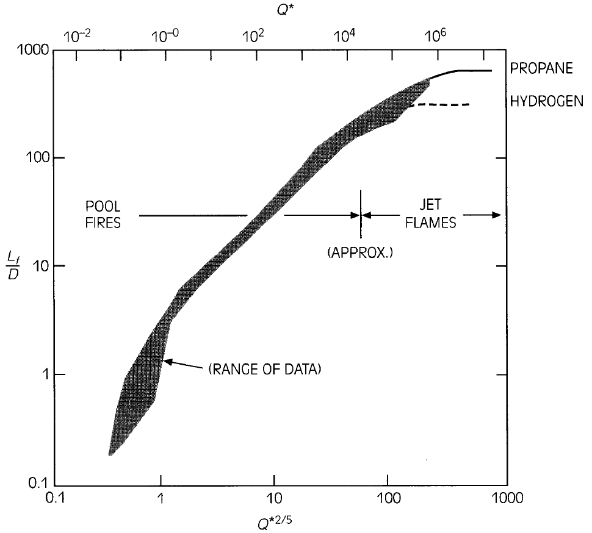
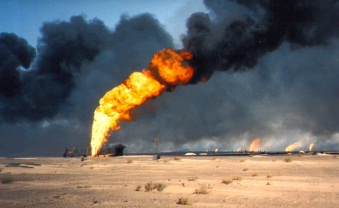
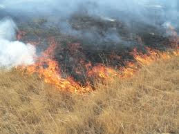
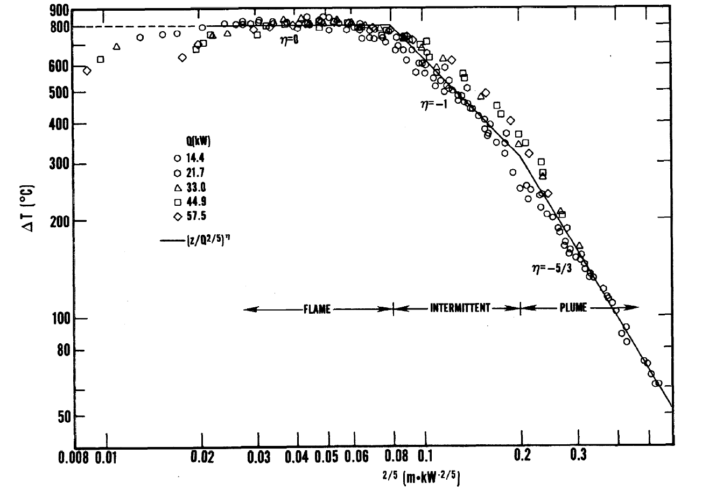
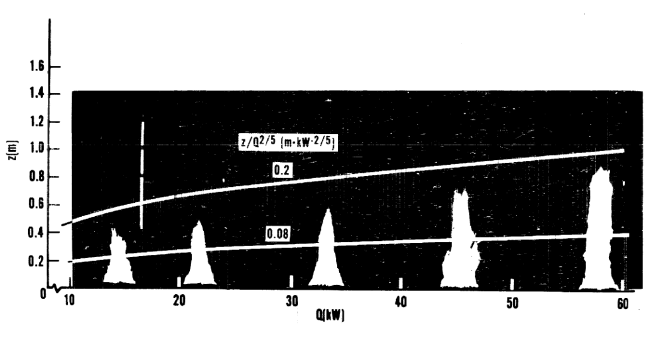
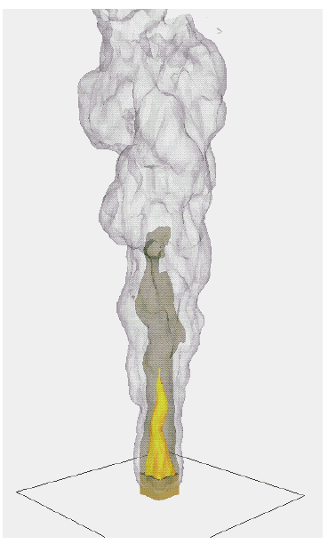

## The 1970s {#welcome-08 .decade-slide}

The 1970’s

$$Q^*$$

## Dimensionless fire scaling {#welcome-09 .scaling-slide}

Start with a very simple form of the energy transport equation:

$$\rho c_p\frac{DT}{Dt}=\dot{q}^{\prime\prime\prime}+k\nabla^2T$$

Write it in non-dimensional form:

$$\rho^*\frac{DT^*}{Dt^*}=\frac{L}{\rho_\infty c_p T_\infty U}\dot{q}^{\prime\prime\prime}+\frac{1}{\mathrm{Re}\,\mathrm{Pr}}\nabla^2T^*$$

Define the Froude number:

$$\mathrm{Fr}=\frac{U}{\sqrt{gL}}\equiv Q^*=\frac{\dot{Q}}{\rho_\infty c_p T_\infty\sqrt{g}\,D^{5/2}}$$

## Heskestad {#welcome-10 .welcome-slide}

<!-- Source: History_of_Fire_Modeling_4.pptx, slide 10. -->

```{=html}
<div class="slide-canvas">
<div class="ppt-text" style="left:5.0000%;top:4.0046%;width:90.0000%;height:8.0384%;padding:6.0px 12.0px 6.0px 12.0px;"><p style="text-align:left;"><span style="font-size:46.67px;">Heskestad</span><span style="font-size:46.67px;"> Flame Height Correlation</span></p></div>




</div>
```

## McCaffrey’s Plume {#welcome-11 .welcome-slide}

<!-- Source: History_of_Fire_Modeling_4.pptx, slide 11. -->

```{=html}
<div class="slide-canvas">




<div class="ppt-text" style="left:1.5378%;top:6.8889%;width:25.4447%;height:10.3220%;padding:6.0px 12.0px 6.0px 12.0px;white-space:nowrap;"><p style="text-align:left;"><span style="font-size:33.33px;">McCaffrey’s Plume</span></p><p style="text-align:left;"><span style="font-size:33.33px;">Correlation</span></p></div>
</div>
```

## MQH Correlation {#welcome-12 .mqh-slide}

McCaffrey – Quintiere – Harkleroad

$$
\frac{T-T_\infty}{T_\infty}
=1.6\left(\frac{\dot{Q}}{\rho_\infty c_p T_\infty\sqrt{g}\,A_0\sqrt{H_0}}\right)^{2/3}
\left(\frac{h_k A_s}{\rho_\infty c_p\sqrt{g}\,A_0\sqrt{H_0}}\right)^{-1/3}
$$

::: {.mqh-annotations}

Air supply to room: $A_0\sqrt{H_0}$

Thermal penetration into walls: $h_k A_s$

:::
