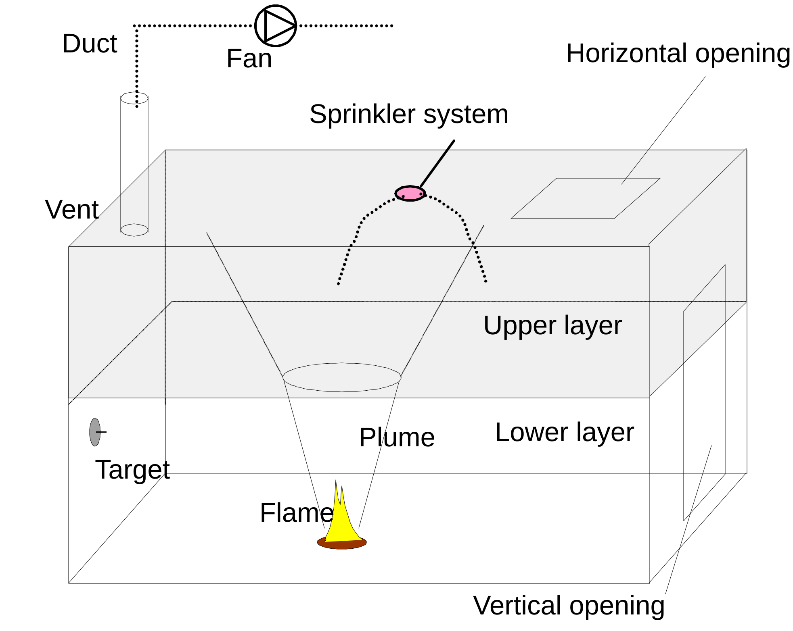
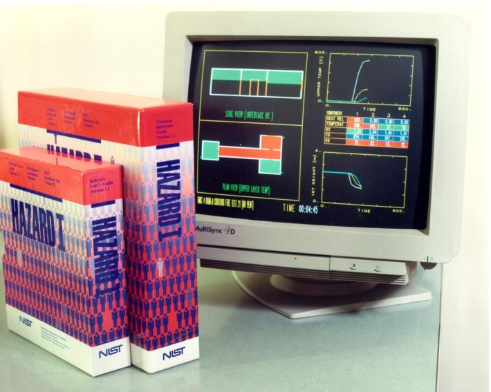
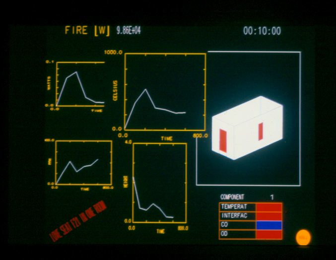
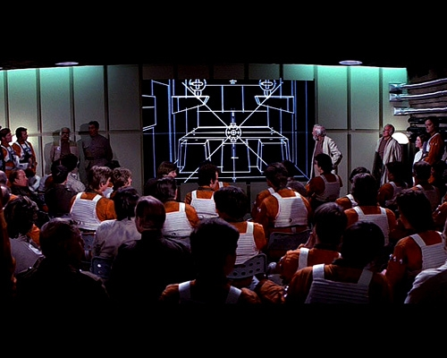
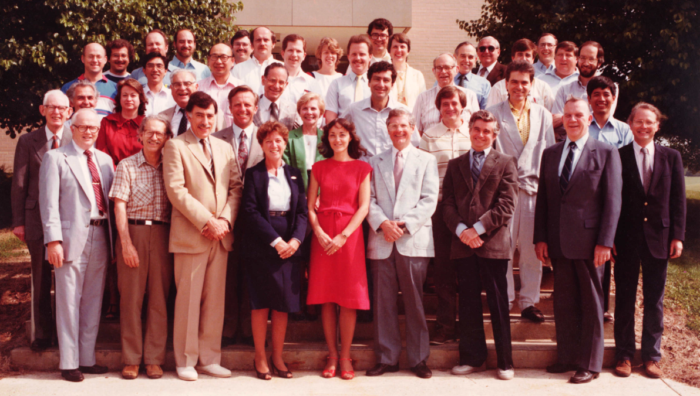
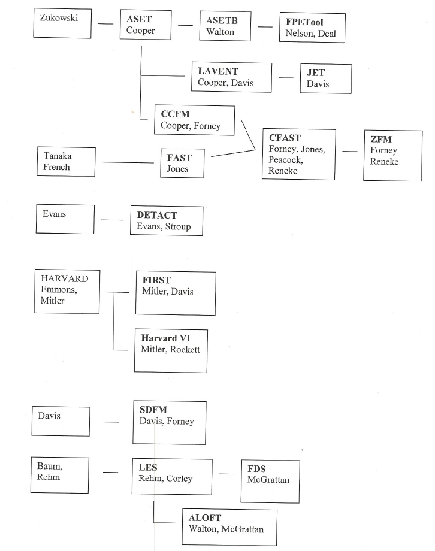
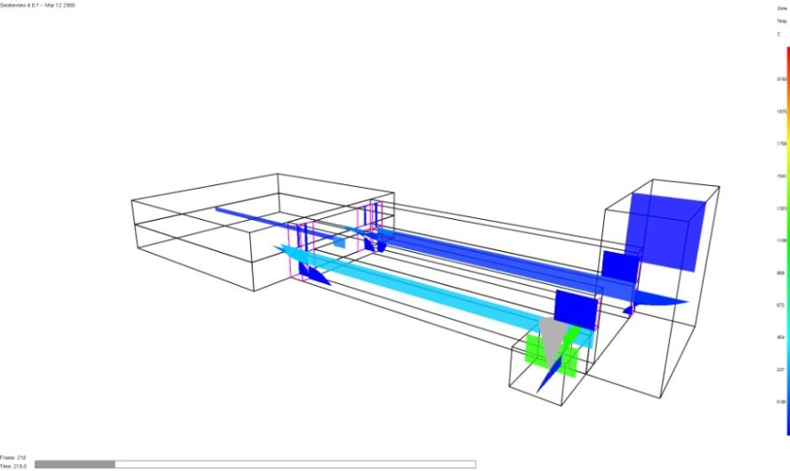
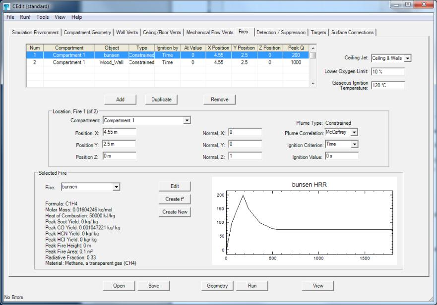

## The 1980’s {#welcome-13 .welcome-slide}

<!-- Source: History_of_Fire_Modeling_4.pptx, slide 13. -->

```{=html}
<div class="slide-canvas">
<div class="ppt-text" style="left:22.3333%;top:31.7778%;width:57.2500%;height:28.2734%;padding:6.0px 12.0px 6.0px 12.0px;"><p style="text-align:left;"><span style="font-size:66.67px;">The 1980’s</span></p><p style="text-align:left;">&nbsp;</p><p style="text-align:left;"><span style="font-size:66.67px;">Pie Fight with Physics</span></p></div>
</div>
```

## Courtesy Dan  {#welcome-14 .welcome-slide}

<!-- Source: History_of_Fire_Modeling_4.pptx, slide 14. -->

```{=html}
<div class="slide-canvas">
<div class="ppt-text" style="left:39.2521%;top:92.7778%;width:60.0355%;height:5.3854%;padding:6.0px 12.0px 6.0px 12.0px;white-space:nowrap;"><p style="text-align:left;"><span style="font-size:30.00px;">Courtesy Dan </span><span style="font-size:30.00px;">Madrzykowski</span><span style="font-size:30.00px;"> and Craig Weinschenk</span></p></div>
<video class="ppt-media" style="left:-0.0000%;top:12.5952%;width:100.0000%;height:75.0000%;" controls playsinline preload="none" poster="figs/image21.png" aria-label="Courtesy Dan  figure" src="https://github.com/rmcdermo/Juelich_Summer_School/releases/download/2026/welcome-compartment-fire-dynamics.mp4"></video>
<div class="ppt-text" style="left:27.5590%;top:3.7590%;width:44.8820%;height:6.7318%;padding:6.0px 12.0px 6.0px 12.0px;white-space:nowrap;"><p style="text-align:left;"><span style="font-size:30.00px;">Compartment Fire Dynamics</span></p></div>
</div>
```

## Compartment fire models {#welcome-15 .welcome-slide}

<!-- Source: History_of_Fire_Modeling_4.pptx, slide 15. -->

```{=html}
<div class="slide-canvas">

</div>
```

## Early computer fire models {#welcome-16 .welcome-slide}

<!-- Source: History_of_Fire_Modeling_4.pptx, slide 16. -->

```{=html}
<div class="slide-canvas">



</div>
```

## CFAST {#welcome-17 .welcome-slide}

<!-- Source: History_of_Fire_Modeling_4.pptx, slide 17. -->

```{=html}
<div class="slide-canvas">

<div class="ppt-text" style="left:12.9132%;top:12.8103%;width:12.8605%;height:6.7318%;padding:6.0px 12.0px 6.0px 12.0px;white-space:nowrap;"><p style="text-align:left;"><span style="font-size:30.00px;color:#FF0000;">CFAST</span></p></div>
<svg class="ppt-shape" style="left:19.3435%;top:19.5421%;width:2.0732%;height:21.9349%;overflow:visible" viewBox="0 0 24.878346456692913 197.41404199475065" aria-hidden="true"><line x1="0" y1="0" x2="24.878346456692913" y2="197.41404199475065" fill="#4f81bd" stroke="#FF0000" stroke-width="1.6666666666666667"/></svg>
<svg class="ppt-shape" style="left:24.4167%;top:19.3984%;width:26.0267%;height:22.7127%;overflow:visible" viewBox="0 0 312.3200787401575 204.41404199475065" aria-hidden="true"><line x1="0" y1="0" x2="312.3200787401575" y2="204.41404199475065" fill="#4f81bd" stroke="#FF0000" stroke-width="1.6666666666666667"/></svg>
<div class="ppt-text" style="left:41.8023%;top:8.8889%;width:11.7490%;height:6.7318%;padding:6.0px 12.0px 6.0px 12.0px;white-space:nowrap;"><p style="text-align:left;"><span style="font-size:30.00px;color:#FFFF00;">CCFM</span></p></div>
<svg class="ppt-shape" style="left:51.0833%;top:15.6207%;width:21.0000%;height:25.8563%;overflow:visible" viewBox="0 0 252.0 232.70695538057743" aria-hidden="true"><line x1="0" y1="0" x2="252.0" y2="232.70695538057743" fill="#4f81bd" stroke="#FFFF00" stroke-width="1.6666666666666667"/></svg>
<svg class="ppt-shape" style="left:49.0833%;top:15.6207%;width:4.4680%;height:23.2682%;overflow:visible" viewBox="0 0 53.61587926509186 209.41404199475065" aria-hidden="true"><line x1="0" y1="0" x2="53.61587926509186" y2="209.41404199475065" fill="#4f81bd" stroke="#FFFF00" stroke-width="1.6666666666666667"/></svg>
<div class="ppt-text" style="left:57.7531%;top:12.2548%;width:16.8154%;height:6.7318%;padding:6.0px 12.0px 6.0px 12.0px;white-space:nowrap;"><p style="text-align:left;"><span style="font-size:30.00px;color:#C00000;">Harvard 1</span></p></div>
<svg class="ppt-shape" style="left:54.2500%;top:18.9865%;width:5.1667%;height:27.1571%;overflow:visible" viewBox="0 0 62.0001312335958 244.41404199475065" aria-hidden="true"><line x1="0" y1="0" x2="62.0001312335958" y2="244.41404199475065" fill="#4f81bd" stroke="#C00000" stroke-width="1.6666666666666667"/></svg>
<div class="ppt-text" style="left:24.4167%;top:4.0786%;width:13.9824%;height:6.7318%;padding:6.0px 12.0px 6.0px 12.0px;white-space:nowrap;"><p style="text-align:left;"><span style="font-size:30.00px;">ASET-B</span></p></div>
<svg class="ppt-shape" style="left:42.6667%;top:21.6667%;width:1.1667%;height:19.8103%;overflow:visible" viewBox="0 0 14.0 178.29291338582678" aria-hidden="true"><line x1="0" y1="0" x2="14.0" y2="178.29291338582678" fill="#4f81bd" stroke="#00B0F0" stroke-width="1.6666666666666667"/></svg>
<svg class="ppt-shape" style="left:31.4079%;top:10.8103%;width:8.6754%;height:29.5230%;overflow:visible" viewBox="0 0 104.10524934383201 265.70708661417325" aria-hidden="true"><line x1="0" y1="0" x2="104.10524934383201" y2="265.70708661417325" fill="#4f81bd" stroke="#000000" stroke-width="1.6666666666666667"/></svg>
<div class="ppt-text" style="left:6.5434%;top:25.1829%;width:9.8733%;height:6.7318%;padding:6.0px 12.0px 6.0px 12.0px;white-space:nowrap;"><p style="text-align:left;"><span style="font-size:30.00px;color:#66FFFF;">MQH</span></p></div>
<svg class="ppt-shape" style="left:12.9132%;top:31.9147%;width:19.1701%;height:19.4186%;overflow:visible" viewBox="0 0 230.04146981627298 174.76771653543307" aria-hidden="true"><line x1="0" y1="0" x2="230.04146981627298" y2="174.76771653543307" fill="#4f81bd" stroke="#66FFFF" stroke-width="1.6666666666666667"/></svg>
<svg class="ppt-shape" style="left:15.5000%;top:31.9147%;width:48.8333%;height:22.8631%;overflow:visible" viewBox="0 0 586.0 205.76771653543307" aria-hidden="true"><line x1="0" y1="0" x2="586.0" y2="205.76771653543307" fill="#4f81bd" stroke="#66FFFF" stroke-width="1.6666666666666667"/></svg>
<div class="ppt-text" style="left:81.4551%;top:13.8238%;width:15.6100%;height:6.7318%;padding:6.0px 12.0px 6.0px 12.0px;white-space:nowrap;"><p style="text-align:left;"><span style="font-size:30.00px;color:#FFC000;">FPE Tool</span></p></div>
<svg class="ppt-shape" style="left:77.0833%;top:20.5556%;width:12.1768%;height:30.7778%;overflow:visible" viewBox="0 0 146.12165354330708 277.0" aria-hidden="true"><line x1="0" y1="0" x2="146.12165354330708" y2="277.0" fill="#4f81bd" stroke="#FFC000" stroke-width="1.6666666666666667"/></svg>
<div class="ppt-text" style="left:34.1856%;top:16.0325%;width:15.2334%;height:6.7318%;padding:6.0px 12.0px 6.0px 12.0px;white-space:nowrap;"><p style="text-align:left;"><span style="font-size:30.00px;color:#00B0F0;">DETACT</span></p></div>
<div class="ppt-text" style="left:68.1274%;top:22.2059%;width:15.2943%;height:6.7318%;padding:6.0px 12.0px 6.0px 12.0px;"><p style="text-align:left;"><span style="font-size:30.00px;color:#7030A0;">LAVENT</span></p></div>
<svg class="ppt-shape" style="left:73.1912%;top:28.9377%;width:2.5834%;height:12.5393%;overflow:visible" viewBox="0 0 31.0002624671916 112.85354330708661" aria-hidden="true"><line x1="0" y1="0" x2="31.0002624671916" y2="112.85354330708661" fill="#4f81bd" stroke="#7030A0" stroke-width="1.6666666666666667"/></svg>
</div>
```

## The Evolution of Fire Modeling by Bill Davis {#welcome-18 .welcome-slide}

<!-- Source: History_of_Fire_Modeling_4.pptx, slide 18. -->

```{=html}
<div class="slide-canvas">

<div class="ppt-text" style="left:2.6300%;top:22.7778%;width:38.1200%;height:12.1172%;padding:6.0px 12.0px 6.0px 12.0px;"><p style="text-align:left;"><span style="font-size:30.00px;">The Evolution of Fire Modeling by Bill Davis</span></p></div>
<svg class="ppt-shape" style="left:71.0000%;top:24.3333%;width:11.5833%;height:14.1111%;overflow:visible" viewBox="0 0 139.0 127.0" aria-hidden="true"><ellipse cx="69.5" cy="63.5" rx="69.5" ry="63.5" fill="none" stroke="#FF0000" stroke-width="1.6666666666666667"/></svg>
<svg class="ppt-shape" style="left:68.0833%;top:74.6667%;width:11.5833%;height:14.1111%;overflow:visible" viewBox="0 0 139.0 127.0" aria-hidden="true"><ellipse cx="69.5" cy="63.5" rx="69.5" ry="63.5" fill="none" stroke="#FF0000" stroke-width="1.6666666666666667"/></svg>
</div>
```

## CFAST Today {#welcome-19 .welcome-slide}

<!-- Source: History_of_Fire_Modeling_4.pptx, slide 19. -->

```{=html}
<div class="slide-canvas">


<div class="ppt-text" style="left:68.5989%;top:17.1111%;width:22.6559%;height:6.7318%;padding:6.0px 12.0px 6.0px 12.0px;white-space:nowrap;"><p style="text-align:left;"><span style="font-size:30.00px;">CFAST Today</span></p></div>
<div class="ppt-text" style="left:4.7141%;top:65.6667%;width:16.3596%;height:19.2977%;padding:6.0px 12.0px 6.0px 12.0px;white-space:nowrap;"><p style="text-align:left;"><span style="font-size:33.33px;">W. Jones</span></p><p style="text-align:left;"><span style="font-size:33.33px;">R. Peacock</span></p><p style="text-align:left;"><span style="font-size:33.33px;">P. </span><span style="font-size:33.33px;">Reneke</span></p><p style="text-align:left;"><span style="font-size:33.33px;">G. Forney</span></p></div>
</div>
```
