## 1990’s {#welcome-20 .welcome-slide}

<!-- Source: History_of_Fire_Modeling_4.pptx, slide 20. -->

```{=html}
<div class="slide-canvas">
<div class="ppt-text" style="left:17.4167%;top:31.7778%;width:65.6667%;height:28.2734%;padding:6.0px 12.0px 6.0px 12.0px;"><p style="text-align:left;"><span style="font-size:66.67px;">1990’s</span></p><p style="text-align:left;">&nbsp;</p><p style="text-align:left;"><span style="font-size:66.67px;">Colorful Fluid Dynamics</span></p></div>
</div>
```

## Computational Fluid Dynamics (CFD) {#welcome-21 .welcome-slide}

<!-- Source: History_of_Fire_Modeling_4.pptx, slide 21. -->

```{=html}
<div class="slide-canvas">
<div class="ppt-text" style="left:4%;top:2%;width:92%;height:12%;padding:6.0px 12.0px 6.0px 12.0px;"><p style="text-align:left;"><span style="font-size:46.67px;">Computational Fluid Dynamics (CFD)</span></p></div>
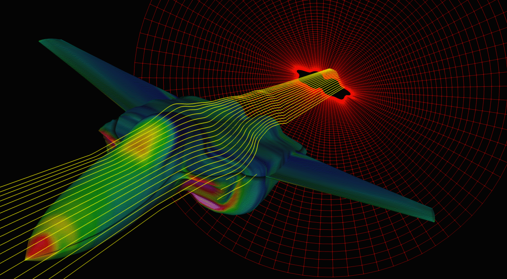
<div class="ppt-text" style="left:54.7912%;top:63.1968%;width:38.8755%;height:15.7075%;padding:6.0px 12.0px 6.0px 12.0px;"><p style="text-align:left;"><span style="font-size:26.67px;color:#000000;">Air flow over proposed jet aircraft design, courtesy Numerical Aerospace Simulation Facility, NASA Ames Research Center </span></p></div>
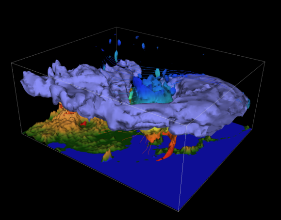
<div class="ppt-text" style="left:6.3730%;top:71.0505%;width:38.9167%;height:12.1172%;padding:6.0px 12.0px 6.0px 12.0px;"><p style="text-align:left;"><span style="font-size:26.67px;color:#000000;">Development of a cyclone in the Sea of Japan, courtesy National Center for Atmospheric Research (NCAR)</span></p></div>
</div>
```

## Howard Baum and Ron Rehm {#welcome-22 .welcome-slide}

<!-- Source: History_of_Fire_Modeling_4.pptx, slide 22. -->

```{=html}
<div class="slide-canvas">
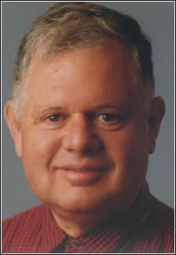

<div class="ppt-text" style="left:29.0733%;top:89.5443%;width:14.5657%;height:7.6293%;padding:6.0px 12.0px 6.0px 12.0px;white-space:nowrap;"><p style="text-align:left;"><span style="font-size:23.33px;">Howard Baum</span></p><p style="text-align:left;"><span style="font-size:23.33px;">NIST Fellow</span></p></div>
<div class="ppt-text" style="left:56.0782%;top:89.5443%;width:12.3977%;height:7.6293%;padding:6.0px 12.0px 6.0px 12.0px;white-space:nowrap;"><p style="text-align:left;"><span style="font-size:23.33px;">Ron </span><span style="font-size:23.33px;">Rehm</span></p><p style="text-align:left;"><span style="font-size:23.33px;">NIST Fellow</span></p></div>
<div class="ppt-crop" style="left:12.5023%;top:1.2625%;width:74.1503%;height:39.9997%;">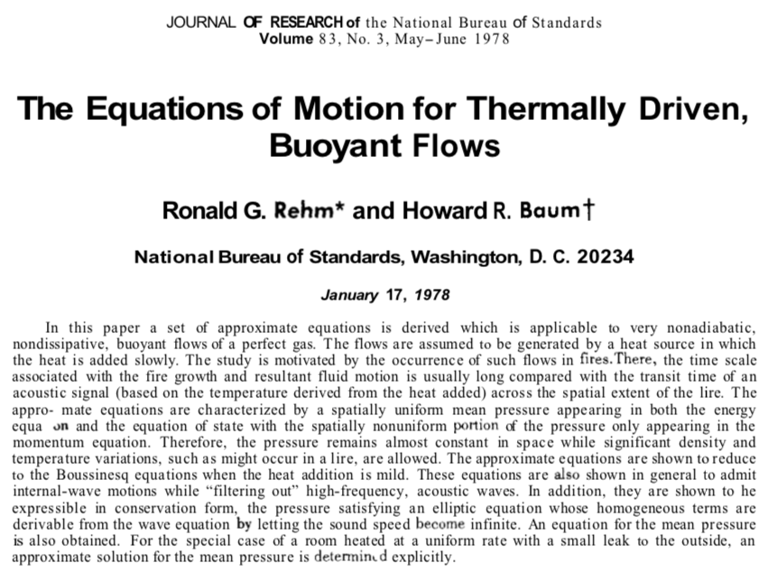</div>
</div>
```

## Sandia methane pool fire {#welcome-23 .welcome-slide}

<!-- Source: History_of_Fire_Modeling_4.pptx, slide 23. -->

```{=html}
<div class="slide-canvas">
<div class="ppt-text" style="left:13.3993%;top:5.0463%;width:75.0521%;height:5.3472%;padding:6.0px 12.0px 6.0px 12.0px;"><p style="text-align:left;"><span style="font-size:30.00px;color:#000000;">Sandia 1 m CH4, Test 17, Measured Puffing Frequency = 1.65 Hz</span></p></div>
<div class="ppt-text" style="left:44.2361%;top:90.1389%;width:53.8542%;height:8.0093%;padding:6.0px 12.0px 6.0px 12.0px;"><p style="text-align:left;"><span style="font-size:16.67px;color:#000000;">S. R. Tieszen, T. J. O’Hern, R. W. Schefer, E. J. Weckman, and T. K. Blanchat, Experimental study of the flow field in and around a one meter diameter methane fire, Comb. Flame, 129:378-391, 2002.</span></p></div>
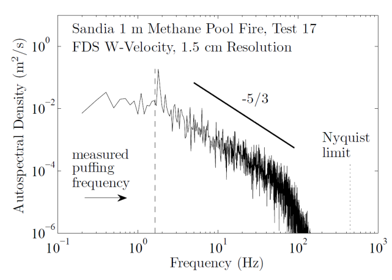
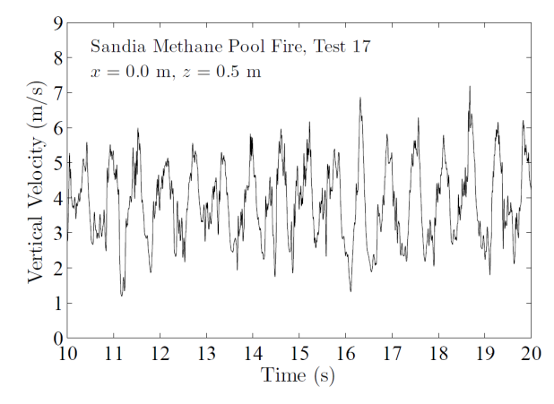
<video class="ppt-media" style="left:7.4097%;top:13.5463%;width:41.1632%;height:58.2176%;" controls playsinline preload="none" poster="figs/image37.png" aria-label="Sandia methane pool fire figure" src="https://github.com/rmcdermo/Juelich_Summer_School/releases/download/2026/welcome-sandia-methane-pool-fire.mp4"></video>
<div class="ppt-text" style="left:61%;top:84%;width:35%;height:10%;font-size:34px;text-align:center;"><span class="math inline">\(f\simeq\frac{1.5}{\sqrt{D}}\;\mathrm{Hz}\)</span></div>
</div>
```

## Large Scale Pool Fire Experiments, Mobile Bay, Alabama {#welcome-24 .welcome-slide}

<!-- Source: History_of_Fire_Modeling_4.pptx, slide 24. -->

```{=html}
<div class="slide-canvas">
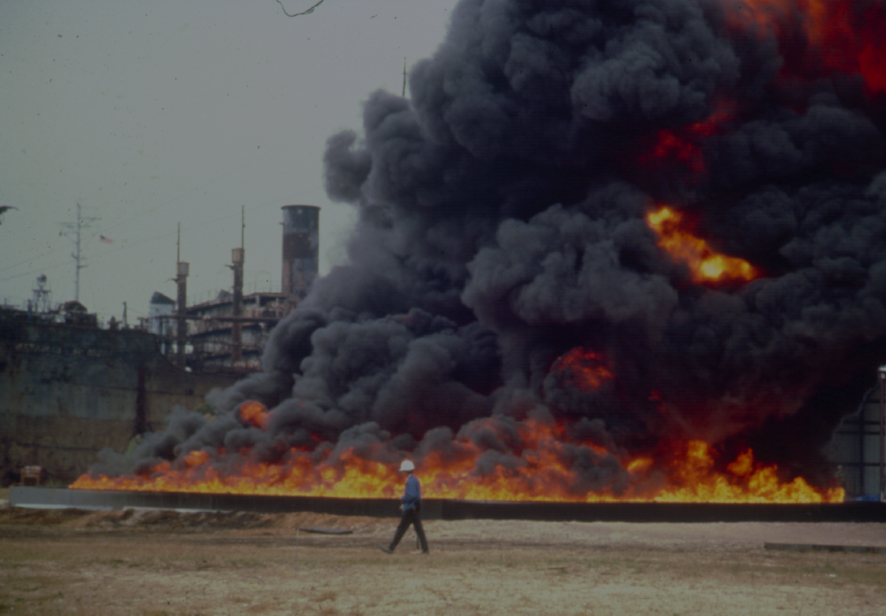
<div class="ppt-text" style="left:8.3333%;top:91.1111%;width:84.2535%;height:6.6667%;padding:6.0px 12.0px 6.0px 12.0px;white-space:nowrap;"><p style="text-align:left;"><span style="font-size:30.00px;">Large Scale Pool Fire Experiments, Mobile Bay, Alabama</span></p></div>
</div>
```

## In Situ  {#welcome-25 .welcome-slide}

<!-- Source: History_of_Fire_Modeling_4.pptx, slide 25. -->

```{=html}
<div class="slide-canvas">
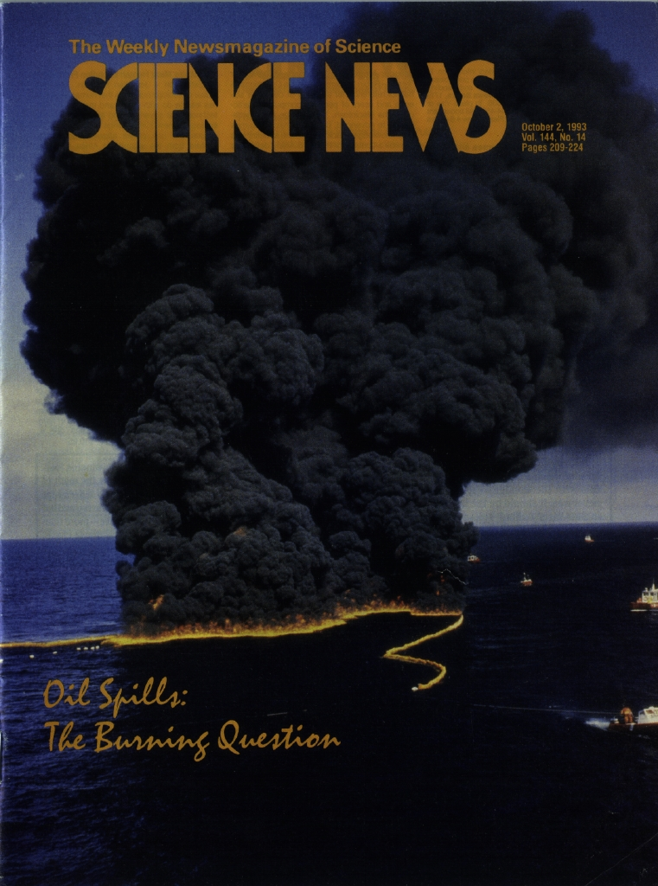
<div class="ppt-text" style="left:57.5000%;top:12.2222%;width:42.5000%;height:50.7127%;padding:6.0px 12.0px 6.0px 12.0px;"><p style="text-align:left;">&nbsp;</p><p style="text-align:left;">&nbsp;</p><p style="text-align:left;"><span style="font-size:33.33px;font-weight:700;font-style:italic;color:#1f497d;">In Situ </span><span style="font-size:33.33px;font-weight:700;color:#1f497d;">Burning of Oil Spills</span></p><p style="text-align:left;">&nbsp;</p><p style="text-align:left;"><span style="font-size:33.33px;">US Minerals Management Service</span></p><p style="text-align:left;">&nbsp;</p><p style="text-align:left;"><span style="font-size:33.33px;">Alaska Department of Environmental Conservation</span></p><p style="text-align:left;">&nbsp;</p><p style="text-align:left;"><span style="font-size:33.33px;">US Coast Guard</span></p></div>
</div>
```

## H. Baum, R.  {#welcome-26 .welcome-slide}

<!-- Source: History_of_Fire_Modeling_4.pptx, slide 26. -->

```{=html}
<div class="slide-canvas">
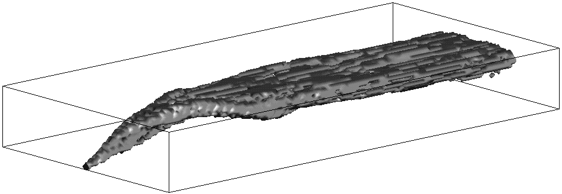
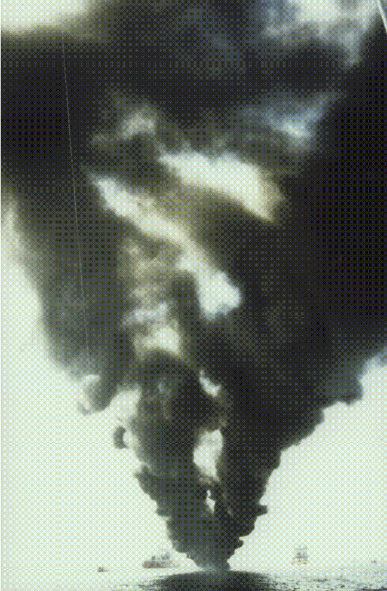
<div class="ppt-text" style="left:52.9845%;top:90.7958%;width:43.6724%;height:5.3854%;padding:6.0px 12.0px 6.0px 12.0px;white-space:nowrap;"><p style="text-align:left;"><span style="font-size:30.00px;">H. Baum, R. </span><span style="font-size:30.00px;">Rehm</span><span style="font-size:30.00px;"> and K. </span><span style="font-size:30.00px;">McGrattan</span></p></div>

<div class="ppt-text" style="left:64.3260%;top:48.9359%;width:17.2354%;height:7.6293%;padding:6.0px 12.0px 6.0px 12.0px;white-space:nowrap;"><p style="text-align:left;"><span style="font-size:23.33px;">Kevin </span><span style="font-size:23.33px;">McGrattan</span></p><p style="text-align:left;"><span style="font-size:23.33px;">NIST Fellow</span></p></div>
<div class="ppt-text" style="left:68.3939%;top:82.5357%;width:12.8535%;height:6.7318%;padding:6.0px 12.0px 6.0px 12.0px;white-space:nowrap;"><p style="text-align:left;"><span style="font-size:30.00px;">ALOFT</span></p></div>
<div class="ppt-text" style="left:2.7569%;top:95.0545%;width:42.3351%;height:4.0391%;padding:6.0px 12.0px 6.0px 12.0px;white-space:nowrap;"><p style="text-align:left;"><span style="font-size:20.00px;">View from Doug Walton in a boat downwind of the fire.</span></p></div>
</div>
```

## Smoke Trajectory from hypothetical burn, Valdez, Alaska {#welcome-27 .welcome-slide}

<!-- Source: History_of_Fire_Modeling_4.pptx, slide 27. -->

```{=html}
<div class="slide-canvas">
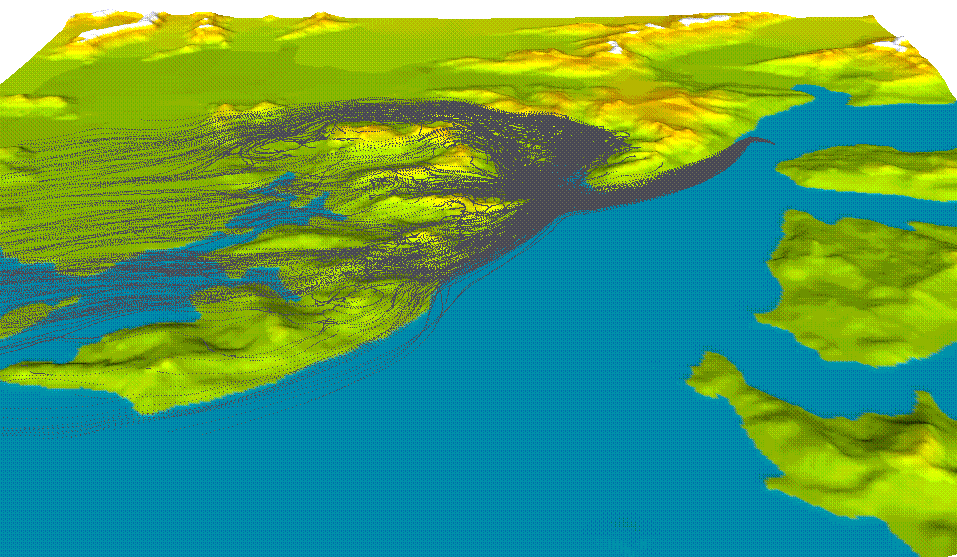
<div class="ppt-text" style="left:6.6667%;top:2.2222%;width:84.9653%;height:6.6667%;padding:6.0px 12.0px 6.0px 12.0px;white-space:nowrap;"><p style="text-align:left;"><span style="font-size:30.00px;">Smoke Trajectory from hypothetical burn, Valdez, Alaska</span></p></div>
<div class="ppt-text" style="left:27.8855%;top:85.0000%;width:68.7812%;height:4.9366%;padding:6.0px 12.0px 6.0px 12.0px;white-space:nowrap;"><p style="text-align:left;"><span style="font-size:26.67px;">Terrain data courtesy US Geological Survey, Digital Elevation Maps</span></p></div>
</div>
```

## In Situ Burning Guidelines {#welcome-28 .welcome-slide}

<!-- Source: History_of_Fire_Modeling_4.pptx, slide 28. -->

```{=html}
<div class="slide-canvas">
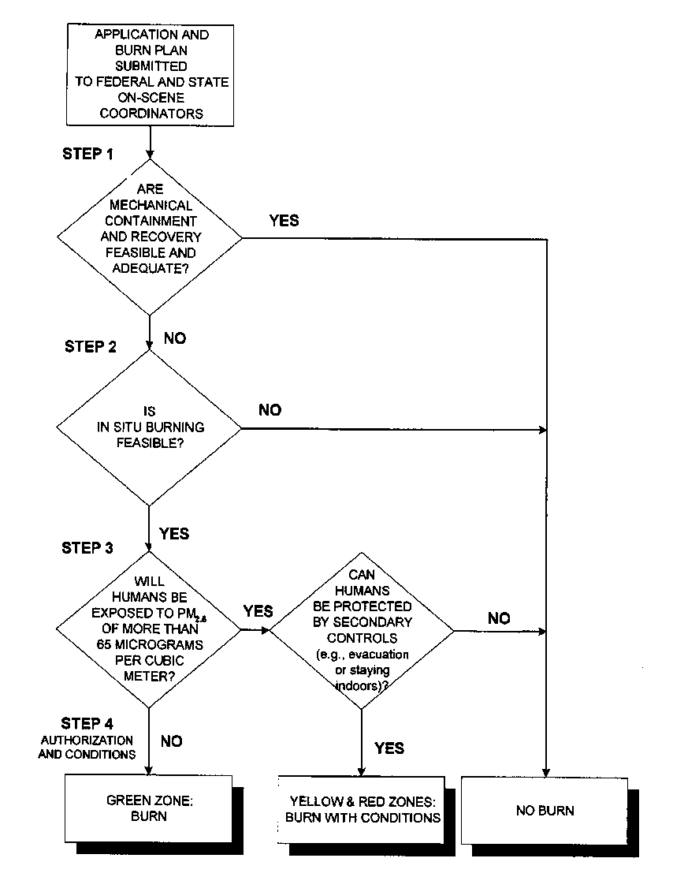
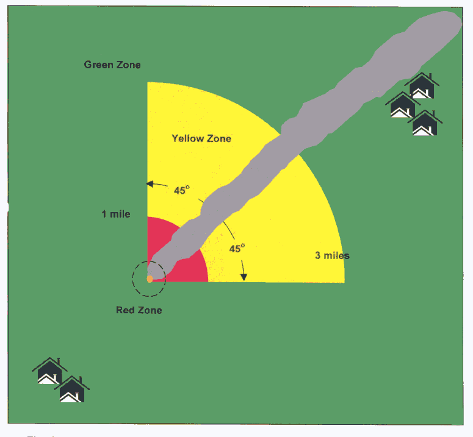
<div class="ppt-text" style="left:61.4931%;top:66.8750%;width:33.9931%;height:10.2315%;padding:6.0px 12.0px 6.0px 12.0px;white-space:nowrap;"><p style="text-align:left;"><span style="font-size:33.33px;">In Situ Burning Guidelines</span></p><p style="text-align:left;"><span style="font-size:33.33px;">for Alaska</span></p></div>
<svg class="ppt-shape" style="left:6.7500%;top:44.1111%;width:10.4167%;height:8.6667%;overflow:visible" viewBox="0 0 125.0 78.0" aria-hidden="true"><ellipse cx="62.5" cy="39.0" rx="62.5" ry="39.0" fill="none" stroke="#FF0000" stroke-width="1.6666666666666667"/></svg>
<svg class="ppt-shape" style="left:6.7500%;top:63.3241%;width:10.4167%;height:14.6759%;overflow:visible" viewBox="0 0 125.0 132.08346456692914" aria-hidden="true"><ellipse cx="62.5" cy="66.04173228346457" rx="62.5" ry="66.04173228346457" fill="none" stroke="#FF0000" stroke-width="1.6666666666666667"/></svg>
</div>
```

## In situ burning of oil spills {#welcome-29 .welcome-slide}

<!-- Source: History_of_Fire_Modeling_4.pptx, slide 29. -->

```{=html}
<div class="slide-canvas">
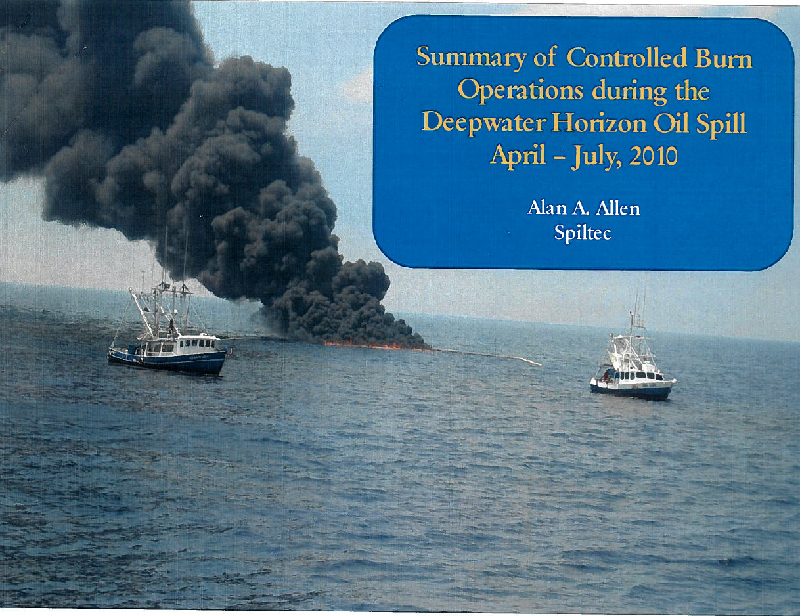
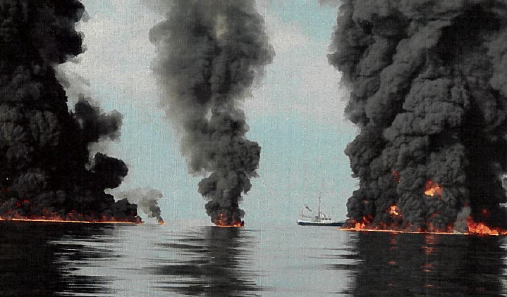
</div>
```

## Introduction {#welcome-30 .welcome-slide}

<!-- Source: History_of_Fire_Modeling_4.pptx, slide 30. -->

```{=html}
<div class="slide-canvas">
<div class="ppt-text" style="left:4%;top:2%;width:92%;height:12%;padding:6.0px 12.0px 6.0px 12.0px;"><p style="text-align:left;"><span style="font-size:30.00px;">Introduction</span></p></div>
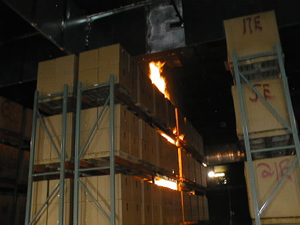
<div class="ppt-text" style="left:1.1667%;top:81.5881%;width:98.2500%;height:12.1172%;padding:6.0px 12.0px 6.0px 12.0px;"><p style="text-align:left;"><span style="font-size:30.00px;color:#FFFF00;">NFPA Research Foundation, Sprinkler, Vent and Draft Curtain Project. Full-Scale experiments, Underwriters Labs, Chicago</span></p></div>
</div>
```

## Sprinkler, vent and draft curtain simulations {#welcome-31 .welcome-slide}

<!-- Source: History_of_Fire_Modeling_4.pptx, slide 31. -->

```{=html}
<div class="slide-canvas">
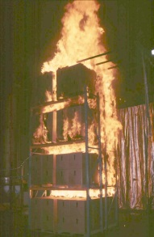
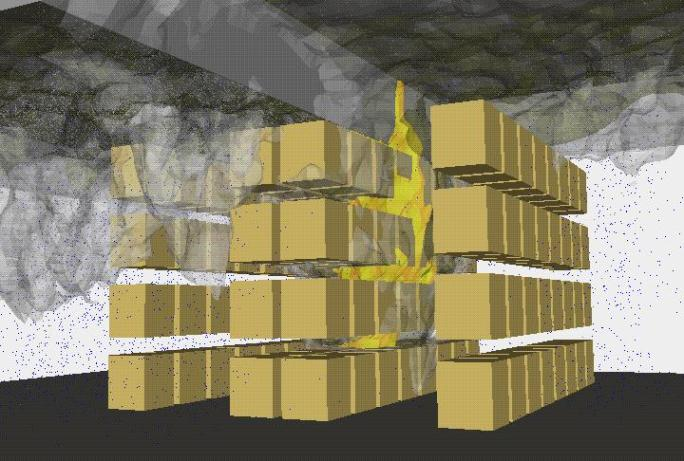
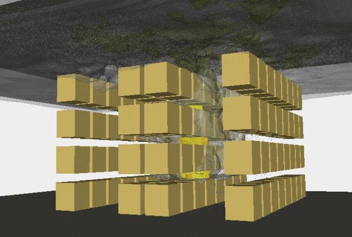
<video class="ppt-media" style="left:35.5418%;top:33.6775%;width:16.6948%;height:57.4444%;" controls playsinline preload="none" poster="figs/image52.png" aria-label="Sprinkler, vent and draft curtain simulations figure" src="https://github.com/rmcdermo/Juelich_Summer_School/releases/download/2026/welcome-sprinkler-vent-draft-curtain.mp4"></video>
</div>
```

## Smokeview {#welcome-32 .welcome-slide}

<!-- Source: History_of_Fire_Modeling_4.pptx, slide 32. -->

```{=html}
<div class="slide-canvas">
<div class="ppt-text" style="left:5.0000%;top:4.0046%;width:90.0000%;height:9.6104%;padding:6.0px 12.0px 6.0px 12.0px;"><p style="text-align:left;"><span style="font-size:30.00px;">Smokeview</span></p></div>

<div class="ppt-text" style="left:77.9063%;top:50.6120%;width:13.3612%;height:7.3494%;padding:6.0px 12.0px 6.0px 12.0px;white-space:nowrap;"><p style="text-align:left;"><span style="font-size:23.33px;">Glenn Forney</span></p><p style="text-align:left;"><span style="font-size:23.33px;">NIST</span></p></div>
<svg class="ppt-shape" style="left:23.3597%;top:36.6828%;width:0.9757%;height:1.3009%;overflow:visible" viewBox="0 0 11.708247332027659 11.708247534092262" aria-hidden="true"><ellipse cx="5.854123666013829" cy="5.854123767046131" rx="5.854123666013829" ry="5.854123767046131" fill="#000000" stroke="#000000" stroke-width="1.6666666666666667"/></svg>
<svg class="ppt-shape" style="left:20.9205%;top:37.3295%;width:2.4392%;height:0.0075%;overflow:visible" viewBox="0 0 29.270618330069148 1" aria-hidden="true"><line x1="0" y1="0" x2="29.270618330069148" y2="1" fill="none" stroke="#000000" stroke-width="3.75"/></svg>
<svg class="ppt-shape" style="left:38.3888%;top:36.8092%;width:0.9757%;height:1.3009%;overflow:visible" viewBox="0 0 11.708247332027659 11.708247534092262" aria-hidden="true"><ellipse cx="5.854123666013829" cy="5.854123767046131" rx="5.854123666013829" ry="5.854123767046131" fill="#FFC000" stroke="#FFC000" stroke-width="1.6666666666666667"/></svg>
<svg class="ppt-shape" style="left:39.3374%;top:37.4558%;width:2.4392%;height:0.0075%;overflow:visible" viewBox="0 0 29.270618330069148 1" aria-hidden="true"><line x1="0" y1="0" x2="29.270618330069148" y2="1" fill="none" stroke="#FFC000" stroke-width="3.75"/></svg>
<svg class="ppt-shape" style="left:28.3567%;top:37.4596%;width:2.4392%;height:0.0075%;overflow:visible" viewBox="0 0 29.270618330069148 1" aria-hidden="true"><line x1="0" y1="0" x2="29.270618330069148" y2="1" fill="none" stroke="#000000" stroke-width="3.75"/></svg>
<svg class="ppt-shape" style="left:31.7445%;top:35.6837%;width:2.4392%;height:1.8068%;overflow:visible" viewBox="0 0 29.270618330069148 16.261454908461474" aria-hidden="true"><line x1="0" y1="16.261454908461474" x2="29.270618330069148" y2="0" fill="none" stroke="#000000" stroke-width="3.75"/></svg>
<svg class="ppt-shape" style="left:30.7620%;top:36.8129%;width:0.9757%;height:1.3009%;overflow:visible" viewBox="0 0 11.708247332027659 11.708247534092262" aria-hidden="true"><ellipse cx="5.854123666013829" cy="5.854123767046131" rx="5.854123666013829" ry="5.854123767046131" fill="#000000" stroke="#000000" stroke-width="1.6666666666666667"/></svg>
<svg class="ppt-shape" style="left:58.6962%;top:37.9241%;width:2.4392%;height:0.0075%;overflow:visible" viewBox="0 0 29.270618330069148 1" aria-hidden="true"><line x1="0" y1="0" x2="29.270618330069148" y2="1" fill="none" stroke="#000000" stroke-width="3.75"/></svg>
<svg class="ppt-shape" style="left:55.2406%;top:35.8320%;width:2.4392%;height:2.1757%;overflow:visible" viewBox="0 0 29.270618330069148 19.581523292764366" aria-hidden="true"><line x1="0" y1="0" x2="29.270618330069148" y2="19.581523292764366" fill="none" stroke="#000000" stroke-width="3.75"/></svg>
<svg class="ppt-shape" style="left:57.6798%;top:37.2774%;width:0.9757%;height:1.3009%;overflow:visible" viewBox="0 0 11.708247332027659 11.708247534092262" aria-hidden="true"><ellipse cx="5.854123666013829" cy="5.854123767046131" rx="5.854123666013829" ry="5.854123767046131" fill="#000000" stroke="#000000" stroke-width="1.6666666666666667"/></svg>
<div class="ppt-text" style="left:18.4161%;top:32.0347%;width:9.0682%;height:3.6490%;padding:6.0px 12.0px 6.0px 12.0px;white-space:nowrap;"><p style="text-align:left;"><span style="font-size:23.33px;">absorption</span></p></div>
<div class="ppt-text" style="left:53.0135%;top:31.2068%;width:10.3083%;height:3.6490%;padding:6.0px 12.0px 6.0px 12.0px;white-space:nowrap;"><p style="text-align:left;"><span style="font-size:23.33px;">in-scattering</span></p></div>
<div class="ppt-text" style="left:25.4008%;top:29.2017%;width:11.2775%;height:3.6490%;padding:6.0px 12.0px 6.0px 12.0px;white-space:nowrap;"><p style="text-align:left;"><span style="font-size:23.33px;">out-scattering</span></p></div>
<div class="ppt-text" style="left:36.1284%;top:32.0347%;width:7.9279%;height:3.6490%;padding:6.0px 12.0px 6.0px 12.0px;white-space:nowrap;"><p style="text-align:left;"><span style="font-size:23.33px;">emission</span></p></div>


<div class="ppt-text" style="left:47.1622%;top:55.6417%;width:16.1596%;height:4.9366%;padding:6.0px 12.0px 6.0px 12.0px;"><p style="text-align:left;"><span style="font-size:26.67px;">Beer’s law</span></p></div>
<svg class="ppt-shape" style="left:33.8604%;top:52.2335%;width:8.1307%;height:1.8068%;overflow:visible" viewBox="0 0 97.56872776689715 16.261454908461474" aria-hidden="true"><polygon points="0,0 58.54123666013829,0 58.54123666013829,4.065363727115368 97.56872776689715,8.130727454230737 58.54123666013829,12.196091181346105 58.54123666013829,16.261454908461474 0,16.261454908461474" fill="#000000" stroke="#000000" stroke-width="1.6666666666666667"/></svg>
<svg class="ppt-shape" style="left:25.5563%;top:71.9101%;width:2.5013%;height:3.2759%;overflow:visible" viewBox="0 0 30.015285619389065 29.483531029491505" aria-hidden="true"><rect width="30.015285619389065" height="29.483531029491505" fill="#eeece1" stroke="none" stroke-width="1"/></svg>
<svg class="ppt-shape" style="left:28.0765%;top:71.9101%;width:2.5013%;height:3.2759%;overflow:visible" viewBox="0 0 30.015285619389065 29.483531029491505" aria-hidden="true"><rect width="30.015285619389065" height="29.483531029491505" fill="#ffffff" stroke="none" stroke-width="1"/></svg>
<svg class="ppt-shape" style="left:30.5967%;top:71.9101%;width:2.5013%;height:3.2759%;overflow:visible" viewBox="0 0 30.015285619389065 29.483531029491505" aria-hidden="true"><rect width="30.015285619389065" height="29.483531029491505" fill="#FFD214" stroke="none" stroke-width="1"/></svg>
<svg class="ppt-shape" style="left:33.1169%;top:71.9101%;width:2.5013%;height:3.2759%;overflow:visible" viewBox="0 0 30.015285619389065 29.483531029491505" aria-hidden="true"><rect width="30.015285619389065" height="29.483531029491505" fill="#ffffff" stroke="none" stroke-width="1"/></svg>
<svg class="ppt-shape" style="left:38.1573%;top:71.9101%;width:2.5013%;height:3.2759%;overflow:visible" viewBox="0 0 30.015285619389065 29.483531029491505" aria-hidden="true"><rect width="30.015285619389065" height="29.483531029491505" fill="#ffffff" stroke="none" stroke-width="1"/></svg>
<svg class="ppt-shape" style="left:35.6371%;top:71.9101%;width:2.5013%;height:3.2759%;overflow:visible" viewBox="0 0 30.015285619389065 29.483531029491505" aria-hidden="true"><rect width="30.015285619389065" height="29.483531029491505" fill="#ffffff" stroke="none" stroke-width="1"/></svg>
<svg class="ppt-shape" style="left:24.9973%;top:78.4200%;width:2.5013%;height:3.2759%;overflow:visible" viewBox="0 0 30.015285619389065 29.48345774315963" aria-hidden="true"><rect width="30.015285619389065" height="29.48345774315963" fill="#eeece1" stroke="none" stroke-width="1"/></svg>
<svg class="ppt-shape" style="left:27.5175%;top:78.4200%;width:2.5013%;height:3.2759%;overflow:visible" viewBox="0 0 30.015285619389065 29.48345774315963" aria-hidden="true"><rect width="30.015285619389065" height="29.48345774315963" fill="#ffffff" stroke="none" stroke-width="1"/></svg>
<svg class="ppt-shape" style="left:30.0377%;top:78.4200%;width:2.5013%;height:3.2759%;overflow:visible" viewBox="0 0 30.015285619389065 29.48345774315963" aria-hidden="true"><rect width="30.015285619389065" height="29.48345774315963" fill="#FFD214" stroke="none" stroke-width="1"/></svg>
<svg class="ppt-shape" style="left:32.5579%;top:78.4200%;width:2.5013%;height:3.2759%;overflow:visible" viewBox="0 0 30.015285619389065 29.48345774315963" aria-hidden="true"><rect width="30.015285619389065" height="29.48345774315963" fill="#ffffff" stroke="none" stroke-width="1"/></svg>
<svg class="ppt-shape" style="left:37.5982%;top:78.4200%;width:2.5013%;height:3.2759%;overflow:visible" viewBox="0 0 30.015285619389065 29.48345774315963" aria-hidden="true"><rect width="30.015285619389065" height="29.48345774315963" fill="#ffffff" stroke="none" stroke-width="1"/></svg>
<svg class="ppt-shape" style="left:35.0780%;top:78.4200%;width:2.5013%;height:3.2759%;overflow:visible" viewBox="0 0 30.015285619389065 29.48345774315963" aria-hidden="true"><rect width="30.015285619389065" height="29.48345774315963" fill="#ffffff" stroke="none" stroke-width="1"/></svg>
<svg class="ppt-shape" style="left:24.8876%;top:65.7137%;width:2.5013%;height:3.2759%;overflow:visible" viewBox="0 0 30.015285619389065 29.483531029491505" aria-hidden="true"><rect width="30.015285619389065" height="29.483531029491505" fill="#ffffff" stroke="none" stroke-width="1"/></svg>
<svg class="ppt-shape" style="left:27.4077%;top:65.7137%;width:2.5013%;height:3.2759%;overflow:visible" viewBox="0 0 30.015285619389065 29.483531029491505" aria-hidden="true"><rect width="30.015285619389065" height="29.483531029491505" fill="#ffffff" stroke="none" stroke-width="1"/></svg>
<svg class="ppt-shape" style="left:29.9279%;top:65.7137%;width:2.5013%;height:3.2759%;overflow:visible" viewBox="0 0 30.015285619389065 29.483531029491505" aria-hidden="true"><rect width="30.015285619389065" height="29.483531029491505" fill="#FFC000" stroke="none" stroke-width="1"/></svg>
<svg class="ppt-shape" style="left:32.4481%;top:65.7137%;width:2.5013%;height:3.2759%;overflow:visible" viewBox="0 0 30.015285619389065 29.483531029491505" aria-hidden="true"><rect width="30.015285619389065" height="29.483531029491505" fill="#F8E6A0" stroke="none" stroke-width="1"/></svg>
<svg class="ppt-shape" style="left:37.4885%;top:65.7137%;width:2.5013%;height:3.2759%;overflow:visible" viewBox="0 0 30.015285619389065 29.483531029491505" aria-hidden="true"><rect width="30.015285619389065" height="29.483531029491505" fill="#ffffff" stroke="none" stroke-width="1"/></svg>
<svg class="ppt-shape" style="left:34.9683%;top:65.7137%;width:2.5013%;height:3.2759%;overflow:visible" viewBox="0 0 30.015285619389065 29.483531029491505" aria-hidden="true"><rect width="30.015285619389065" height="29.483531029491505" fill="#ffffff" stroke="none" stroke-width="1"/></svg>

<svg class="ppt-shape" style="left:26.6989%;top:62.5175%;width:0.7514%;height:1.1169%;overflow:visible" viewBox="0 0 9.01679868834915 10.051953279357143" aria-hidden="true"><ellipse cx="4.508399344174575" cy="5.0259766396785714" rx="4.508399344174575" ry="5.0259766396785714" fill="#000000" stroke="#000000" stroke-width="1.6666666666666667"/></svg>
<svg class="ppt-shape" style="left:29.2423%;top:62.5175%;width:0.7514%;height:1.1169%;overflow:visible" viewBox="0 0 9.01679868834915 10.051953279357143" aria-hidden="true"><ellipse cx="4.508399344174575" cy="5.0259766396785714" rx="4.508399344174575" ry="5.0259766396785714" fill="#000000" stroke="#000000" stroke-width="1.6666666666666667"/></svg>
<svg class="ppt-shape" style="left:31.7470%;top:62.5175%;width:0.7514%;height:1.1169%;overflow:visible" viewBox="0 0 9.01679868834915 10.051953279357143" aria-hidden="true"><ellipse cx="4.508399344174575" cy="5.0259766396785714" rx="4.508399344174575" ry="5.0259766396785714" fill="#000000" stroke="#000000" stroke-width="1.6666666666666667"/></svg>
<svg class="ppt-shape" style="left:34.2516%;top:62.5175%;width:0.7514%;height:1.1169%;overflow:visible" viewBox="0 0 9.01679868834915 10.051953279357143" aria-hidden="true"><ellipse cx="4.508399344174575" cy="5.0259766396785714" rx="4.508399344174575" ry="5.0259766396785714" fill="#000000" stroke="#000000" stroke-width="1.6666666666666667"/></svg>
<svg class="ppt-shape" style="left:36.7563%;top:62.5175%;width:0.7514%;height:1.1169%;overflow:visible" viewBox="0 0 9.01679868834915 10.051953279357143" aria-hidden="true"><ellipse cx="4.508399344174575" cy="5.0259766396785714" rx="4.508399344174575" ry="5.0259766396785714" fill="#000000" stroke="#000000" stroke-width="1.6666666666666667"/></svg>
<svg class="ppt-shape" style="left:39.2610%;top:62.5175%;width:0.7514%;height:1.1169%;overflow:visible" viewBox="0 0 9.01679868834915 10.051953279357143" aria-hidden="true"><ellipse cx="4.508399344174575" cy="5.0259766396785714" rx="4.508399344174575" ry="5.0259766396785714" fill="#000000" stroke="#000000" stroke-width="1.6666666666666667"/></svg>
<svg class="ppt-shape" style="left:26.7376%;top:66.2404%;width:0.7514%;height:1.1169%;overflow:visible" viewBox="0 0 9.01679868834915 10.051953279357143" aria-hidden="true"><ellipse cx="4.508399344174575" cy="5.0259766396785714" rx="4.508399344174575" ry="5.0259766396785714" fill="#000000" stroke="#000000" stroke-width="1.6666666666666667"/></svg>
<svg class="ppt-shape" style="left:29.2423%;top:66.2404%;width:0.7514%;height:1.1169%;overflow:visible" viewBox="0 0 9.01679868834915 10.051953279357143" aria-hidden="true"><ellipse cx="4.508399344174575" cy="5.0259766396785714" rx="4.508399344174575" ry="5.0259766396785714" fill="#000000" stroke="#000000" stroke-width="1.6666666666666667"/></svg>
<svg class="ppt-shape" style="left:31.7470%;top:66.2404%;width:0.7514%;height:1.1169%;overflow:visible" viewBox="0 0 9.01679868834915 10.051953279357143" aria-hidden="true"><ellipse cx="4.508399344174575" cy="5.0259766396785714" rx="4.508399344174575" ry="5.0259766396785714" fill="#000000" stroke="#000000" stroke-width="1.6666666666666667"/></svg>
<svg class="ppt-shape" style="left:34.2516%;top:66.2404%;width:0.7514%;height:1.1169%;overflow:visible" viewBox="0 0 9.01679868834915 10.051953279357143" aria-hidden="true"><ellipse cx="4.508399344174575" cy="5.0259766396785714" rx="4.508399344174575" ry="5.0259766396785714" fill="#000000" stroke="#000000" stroke-width="1.6666666666666667"/></svg>
<svg class="ppt-shape" style="left:36.7563%;top:66.2404%;width:0.7514%;height:1.1169%;overflow:visible" viewBox="0 0 9.01679868834915 10.051953279357143" aria-hidden="true"><ellipse cx="4.508399344174575" cy="5.0259766396785714" rx="4.508399344174575" ry="5.0259766396785714" fill="#000000" stroke="#000000" stroke-width="1.6666666666666667"/></svg>
<svg class="ppt-shape" style="left:39.2610%;top:66.2404%;width:0.7514%;height:1.1169%;overflow:visible" viewBox="0 0 9.01679868834915 10.051953279357143" aria-hidden="true"><ellipse cx="4.508399344174575" cy="5.0259766396785714" rx="4.508399344174575" ry="5.0259766396785714" fill="#000000" stroke="#000000" stroke-width="1.6666666666666667"/></svg>
<svg class="ppt-shape" style="left:26.7376%;top:69.9634%;width:0.7514%;height:1.1169%;overflow:visible" viewBox="0 0 9.01679868834915 10.051953279357143" aria-hidden="true"><ellipse cx="4.508399344174575" cy="5.0259766396785714" rx="4.508399344174575" ry="5.0259766396785714" fill="#000000" stroke="#000000" stroke-width="1.6666666666666667"/></svg>
<svg class="ppt-shape" style="left:29.2423%;top:69.9634%;width:0.7514%;height:1.1169%;overflow:visible" viewBox="0 0 9.01679868834915 10.051953279357143" aria-hidden="true"><ellipse cx="4.508399344174575" cy="5.0259766396785714" rx="4.508399344174575" ry="5.0259766396785714" fill="#000000" stroke="#000000" stroke-width="1.6666666666666667"/></svg>
<svg class="ppt-shape" style="left:31.7470%;top:69.9634%;width:0.7514%;height:1.1169%;overflow:visible" viewBox="0 0 9.01679868834915 10.051953279357143" aria-hidden="true"><ellipse cx="4.508399344174575" cy="5.0259766396785714" rx="4.508399344174575" ry="5.0259766396785714" fill="#000000" stroke="#000000" stroke-width="1.6666666666666667"/></svg>
<svg class="ppt-shape" style="left:34.2516%;top:69.9634%;width:0.7514%;height:1.1169%;overflow:visible" viewBox="0 0 9.01679868834915 10.051953279357143" aria-hidden="true"><ellipse cx="4.508399344174575" cy="5.0259766396785714" rx="4.508399344174575" ry="5.0259766396785714" fill="#000000" stroke="#000000" stroke-width="1.6666666666666667"/></svg>
<svg class="ppt-shape" style="left:36.7563%;top:69.9634%;width:0.7514%;height:1.1169%;overflow:visible" viewBox="0 0 9.01679868834915 10.051953279357143" aria-hidden="true"><ellipse cx="4.508399344174575" cy="5.0259766396785714" rx="4.508399344174575" ry="5.0259766396785714" fill="#000000" stroke="#000000" stroke-width="1.6666666666666667"/></svg>
<svg class="ppt-shape" style="left:39.2610%;top:69.9634%;width:0.7514%;height:1.1169%;overflow:visible" viewBox="0 0 9.01679868834915 10.051953279357143" aria-hidden="true"><ellipse cx="4.508399344174575" cy="5.0259766396785714" rx="4.508399344174575" ry="5.0259766396785714" fill="#000000" stroke="#000000" stroke-width="1.6666666666666667"/></svg>
<svg class="ppt-shape" style="left:26.7376%;top:73.6863%;width:0.7514%;height:1.1169%;overflow:visible" viewBox="0 0 9.01679868834915 10.051953279357143" aria-hidden="true"><ellipse cx="4.508399344174575" cy="5.0259766396785714" rx="4.508399344174575" ry="5.0259766396785714" fill="#000000" stroke="#000000" stroke-width="1.6666666666666667"/></svg>
<svg class="ppt-shape" style="left:29.2423%;top:73.6863%;width:0.7514%;height:1.1169%;overflow:visible" viewBox="0 0 9.01679868834915 10.051953279357143" aria-hidden="true"><ellipse cx="4.508399344174575" cy="5.0259766396785714" rx="4.508399344174575" ry="5.0259766396785714" fill="#000000" stroke="#000000" stroke-width="1.6666666666666667"/></svg>
<svg class="ppt-shape" style="left:31.7470%;top:73.6863%;width:0.7514%;height:1.1169%;overflow:visible" viewBox="0 0 9.01679868834915 10.051953279357143" aria-hidden="true"><ellipse cx="4.508399344174575" cy="5.0259766396785714" rx="4.508399344174575" ry="5.0259766396785714" fill="#000000" stroke="#000000" stroke-width="1.6666666666666667"/></svg>
<svg class="ppt-shape" style="left:34.2516%;top:73.6863%;width:0.7514%;height:1.1169%;overflow:visible" viewBox="0 0 9.01679868834915 10.051953279357143" aria-hidden="true"><ellipse cx="4.508399344174575" cy="5.0259766396785714" rx="4.508399344174575" ry="5.0259766396785714" fill="#000000" stroke="#000000" stroke-width="1.6666666666666667"/></svg>
<svg class="ppt-shape" style="left:36.7563%;top:73.6863%;width:0.7514%;height:1.1169%;overflow:visible" viewBox="0 0 9.01679868834915 10.051953279357143" aria-hidden="true"><ellipse cx="4.508399344174575" cy="5.0259766396785714" rx="4.508399344174575" ry="5.0259766396785714" fill="#000000" stroke="#000000" stroke-width="1.6666666666666667"/></svg>
<svg class="ppt-shape" style="left:39.2610%;top:73.6863%;width:0.7514%;height:1.1169%;overflow:visible" viewBox="0 0 9.01679868834915 10.051953279357143" aria-hidden="true"><ellipse cx="4.508399344174575" cy="5.0259766396785714" rx="4.508399344174575" ry="5.0259766396785714" fill="#000000" stroke="#000000" stroke-width="1.6666666666666667"/></svg>
<svg class="ppt-shape" style="left:26.7376%;top:77.4092%;width:0.7514%;height:1.1169%;overflow:visible" viewBox="0 0 9.01679868834915 10.051953279357143" aria-hidden="true"><ellipse cx="4.508399344174575" cy="5.0259766396785714" rx="4.508399344174575" ry="5.0259766396785714" fill="#000000" stroke="#000000" stroke-width="1.6666666666666667"/></svg>
<svg class="ppt-shape" style="left:29.2423%;top:77.4092%;width:0.7514%;height:1.1169%;overflow:visible" viewBox="0 0 9.01679868834915 10.051953279357143" aria-hidden="true"><ellipse cx="4.508399344174575" cy="5.0259766396785714" rx="4.508399344174575" ry="5.0259766396785714" fill="#000000" stroke="#000000" stroke-width="1.6666666666666667"/></svg>
<svg class="ppt-shape" style="left:31.7470%;top:77.4092%;width:0.7514%;height:1.1169%;overflow:visible" viewBox="0 0 9.01679868834915 10.051953279357143" aria-hidden="true"><ellipse cx="4.508399344174575" cy="5.0259766396785714" rx="4.508399344174575" ry="5.0259766396785714" fill="#000000" stroke="#000000" stroke-width="1.6666666666666667"/></svg>
<svg class="ppt-shape" style="left:34.2516%;top:77.4092%;width:0.7514%;height:1.1169%;overflow:visible" viewBox="0 0 9.01679868834915 10.051953279357143" aria-hidden="true"><ellipse cx="4.508399344174575" cy="5.0259766396785714" rx="4.508399344174575" ry="5.0259766396785714" fill="#000000" stroke="#000000" stroke-width="1.6666666666666667"/></svg>
<svg class="ppt-shape" style="left:36.7563%;top:77.4092%;width:0.7514%;height:1.1169%;overflow:visible" viewBox="0 0 9.01679868834915 10.051953279357143" aria-hidden="true"><ellipse cx="4.508399344174575" cy="5.0259766396785714" rx="4.508399344174575" ry="5.0259766396785714" fill="#000000" stroke="#000000" stroke-width="1.6666666666666667"/></svg>
<svg class="ppt-shape" style="left:39.2610%;top:77.4092%;width:0.7514%;height:1.1169%;overflow:visible" viewBox="0 0 9.01679868834915 10.051953279357143" aria-hidden="true"><ellipse cx="4.508399344174575" cy="5.0259766396785714" rx="4.508399344174575" ry="5.0259766396785714" fill="#000000" stroke="#000000" stroke-width="1.6666666666666667"/></svg>
<svg class="ppt-shape" style="left:26.7376%;top:81.1322%;width:0.7514%;height:1.1169%;overflow:visible" viewBox="0 0 9.01679868834915 10.051953279357143" aria-hidden="true"><ellipse cx="4.508399344174575" cy="5.0259766396785714" rx="4.508399344174575" ry="5.0259766396785714" fill="#000000" stroke="#000000" stroke-width="1.6666666666666667"/></svg>
<svg class="ppt-shape" style="left:29.2423%;top:81.1322%;width:0.7514%;height:1.1169%;overflow:visible" viewBox="0 0 9.01679868834915 10.051953279357143" aria-hidden="true"><ellipse cx="4.508399344174575" cy="5.0259766396785714" rx="4.508399344174575" ry="5.0259766396785714" fill="#000000" stroke="#000000" stroke-width="1.6666666666666667"/></svg>
<svg class="ppt-shape" style="left:31.7470%;top:81.1322%;width:0.7514%;height:1.1169%;overflow:visible" viewBox="0 0 9.01679868834915 10.051953279357143" aria-hidden="true"><ellipse cx="4.508399344174575" cy="5.0259766396785714" rx="4.508399344174575" ry="5.0259766396785714" fill="#000000" stroke="#000000" stroke-width="1.6666666666666667"/></svg>
<svg class="ppt-shape" style="left:34.2516%;top:81.1322%;width:0.7514%;height:1.1169%;overflow:visible" viewBox="0 0 9.01679868834915 10.051953279357143" aria-hidden="true"><ellipse cx="4.508399344174575" cy="5.0259766396785714" rx="4.508399344174575" ry="5.0259766396785714" fill="#000000" stroke="#000000" stroke-width="1.6666666666666667"/></svg>
<svg class="ppt-shape" style="left:36.7563%;top:81.1322%;width:0.7514%;height:1.1169%;overflow:visible" viewBox="0 0 9.01679868834915 10.051953279357143" aria-hidden="true"><ellipse cx="4.508399344174575" cy="5.0259766396785714" rx="4.508399344174575" ry="5.0259766396785714" fill="#000000" stroke="#000000" stroke-width="1.6666666666666667"/></svg>
<svg class="ppt-shape" style="left:39.2610%;top:81.1322%;width:0.7514%;height:1.1169%;overflow:visible" viewBox="0 0 9.01679868834915 10.051953279357143" aria-hidden="true"><ellipse cx="4.508399344174575" cy="5.0259766396785714" rx="4.508399344174575" ry="5.0259766396785714" fill="#000000" stroke="#000000" stroke-width="1.6666666666666667"/></svg>
<svg class="ppt-shape" style="left:23.3900%;top:59.3552%;width:0.4914%;height:27.9819%;overflow:visible" viewBox="0 0 5.896418354861392 251.83733995051298" aria-hidden="true"><line x1="0" y1="0" x2="5.896418354861392" y2="251.83733995051298" fill="none" stroke="#000000" stroke-width="6.666666666666667"/></svg>
<svg class="ppt-shape" style="left:21.7202%;top:62.0233%;width:20.1669%;height:11.4966%;overflow:visible" viewBox="0 0 242.00289604754573 103.4694542240226" aria-hidden="true"><line x1="0" y1="103.4694542240226" x2="242.00289604754573" y2="0" fill="none" stroke="#000000" stroke-width="3.3333333333333335"/></svg>
<svg class="ppt-shape" style="left:21.7693%;top:73.5481%;width:20.2287%;height:12.1841%;overflow:visible" viewBox="0 0 242.74390913310327 109.65701922384854" aria-hidden="true"><line x1="0" y1="0" x2="242.74390913310327" y2="109.65701922384854" fill="none" stroke="#000000" stroke-width="3.3333333333333335"/></svg>
<div class="ppt-text" style="left:12.9237%;top:88.0938%;width:22.2176%;height:5.8342%;padding:6.0px 12.0px 6.0px 12.0px;"><p style="text-align:left;"><span style="font-size:33.33px;color:#0000CC;">Image plane</span></p></div>
<svg class="ppt-shape" style="left:23.6357%;top:75.4654%;width:0.0000%;height:0.0000%;overflow:visible" viewBox="0 0 1 1" aria-hidden="true"><line x1="0" y1="0" x2="1" y2="1" fill="none" stroke="#FFCC66" stroke-width="6.666666666666667"/></svg>
<svg class="ppt-shape" style="left:21.8010%;top:73.5087%;width:21.7285%;height:0.0000%;overflow:visible" viewBox="0 0 260.74200730236714 1" aria-hidden="true"><line x1="0" y1="0" x2="260.74200730236714" y2="1" fill="none" stroke="#000000" stroke-width="3.3333333333333335"/></svg>
<svg class="ppt-shape" style="left:23.6357%;top:75.1860%;width:0.0000%;height:1.6627%;overflow:visible" viewBox="0 0 1 14.963952994505494" aria-hidden="true"><line x1="0" y1="0" x2="1" y2="14.963952994505494" fill="#4f81bd" stroke="#FFC000" stroke-width="3.75"/></svg>
<svg class="ppt-shape" style="left:23.6438%;top:72.9791%;width:0.0000%;height:1.6627%;overflow:visible" viewBox="0 0 1 14.963952994505494" aria-hidden="true"><line x1="0" y1="0" x2="1" y2="14.963952994505494" fill="#4f81bd" stroke="#FFC000" stroke-width="3.75"/></svg>
<svg class="ppt-shape" style="left:23.5394%;top:70.9357%;width:0.0000%;height:1.6627%;overflow:visible" viewBox="0 0 1 14.963952994505494" aria-hidden="true"><line x1="0" y1="0" x2="1" y2="14.963952994505494" fill="#4f81bd" stroke="#FFC000" stroke-width="3.75"/></svg>
<div class="ppt-text" style="left:12.2609%;top:18.5360%;width:50.4937%;height:6.7034%;padding:6.0px 12.0px 6.0px 12.0px;justify-content:center;"><p style="text-align:center;"><span style="font-size:30.00px;vertical-align:0.0%;color:#1f497d;">Radiation Transport Equation</span></p></div>
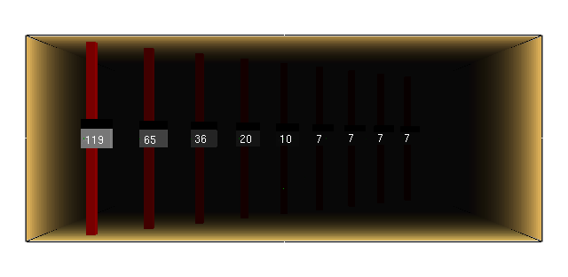
<div class="ppt-text" style="left:67.8634%;top:93.9280%;width:10.0430%;height:4.9366%;padding:6.0px 12.0px 6.0px 12.0px;white-space:nowrap;"><p style="text-align:left;"><span style="font-size:26.67px;">Visibility</span></p></div>
</div>
```

## Fire Reconstruction (Cherry Road Fire, NE DC, 1999) {#welcome-33 .welcome-slide}

<!-- Source: History_of_Fire_Modeling_4.pptx, slide 33. -->

```{=html}
<div class="slide-canvas">
<div class="ppt-text" style="left:5.0000%;top:1.1877%;width:90.0000%;height:6.5118%;padding:6.0px 12.0px 6.0px 12.0px;"><p style="text-align:left;"><span style="font-size:40.00px;">Fire Reconstruction (Cherry Road Fire, NE DC, 1999)</span></p></div>
<video class="ppt-media" style="left:5.0000%;top:8.8123%;width:90.0000%;height:90.0000%;" controls playsinline preload="none" poster="figs/image59.png" aria-label="Fire Reconstruction (Cherry Road Fire, NE DC, 1999) figure" src="https://github.com/rmcdermo/Juelich_Summer_School/releases/download/2026/welcome-cherry-road-reconstruction.mp4"></video>
</div>
```
