## 2000’s {#welcome-34 .welcome-slide}

<!-- Source: History_of_Fire_Modeling_4.pptx, slide 34. -->

```{=html}
<div class="slide-canvas">
<div class="ppt-text" style="left:17.4167%;top:31.7778%;width:65.6667%;height:28.2734%;padding:6.0px 12.0px 6.0px 12.0px;"><p style="text-align:left;"><span style="font-size:66.67px;">2000’s</span></p><p style="text-align:left;">&nbsp;</p><p style="text-align:left;"><span style="font-size:66.67px;">Making LES practical</span></p></div>
</div>
```

## Enter Simo and Jason {#welcome-35 .welcome-slide}

<!-- Source: History_of_Fire_Modeling_4.pptx, slide 35. -->

```{=html}
<div class="slide-canvas">
<div class="ppt-text" style="left:4%;top:2%;width:92%;height:12%;padding:6.0px 12.0px 6.0px 12.0px;"><p style="text-align:left;"><span style="font-size:60.00px;">Enter Simo and Jason</span></p></div>


<div class="ppt-text" style="left:18.5975%;top:80.0718%;width:29.5141%;height:13.7098%;padding:6.0px 12.0px 6.0px 12.0px;white-space:nowrap;"><p style="text-align:left;"><span style="font-size:23.33px;">Simo</span><span style="font-size:23.33px;"> </span><span style="font-size:23.33px;">Hostikka</span></p><p style="text-align:left;"><span style="font-size:23.33px;">Aalto University, Finland</span></p><p style="text-align:left;"><span style="font-size:23.33px;">(Radiation, Pyrolysis)</span></p></div>
<div class="ppt-text" style="left:50.7955%;top:79.3287%;width:31.7491%;height:13.9123%;padding:6.0px 12.0px 6.0px 12.0px;"><p style="text-align:left;"><span style="font-size:23.33px;">Jason Floyd</span></p><p style="text-align:left;"><span style="font-size:23.33px;">Underwriters Laboratories (UL) - Fire Safety Research Institute</span></p><p style="text-align:left;"><span style="font-size:23.33px;">(Combustion, HVAC, Particles)</span></p></div>
</div>
```

## Applications of FDS {#welcome-36 .welcome-slide}

<!-- Source: History_of_Fire_Modeling_4.pptx, slide 36. -->

```{=html}
<div class="slide-canvas">
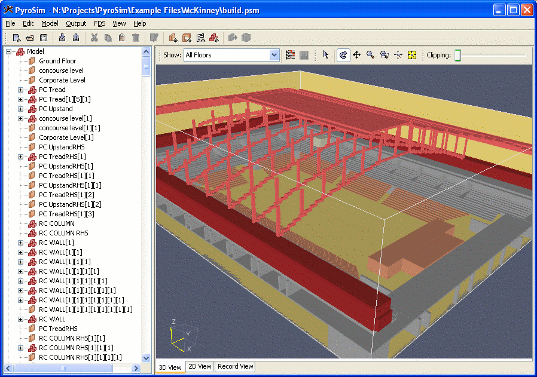
<div class="ppt-text" style="left:59.8958%;top:82.3611%;width:35.8333%;height:12.1172%;padding:6.0px 12.0px 6.0px 12.0px;"><p style="text-align:center;"><span style="font-size:26.67px;color:#000000;">PyroSim</span><span style="font-size:26.67px;color:#000000;">, courtesy Thunderhead</span></p><p style="text-align:center;"><span style="font-size:26.67px;color:#000000;">Engineering Consultants,</span></p><p style="text-align:center;"><span style="font-size:26.67px;color:#000000;">Manhattan, Kansas</span></p></div>
<div class="ppt-crop" style="left:46.8977%;top:2.5000%;width:38.2064%;height:26.1343%;">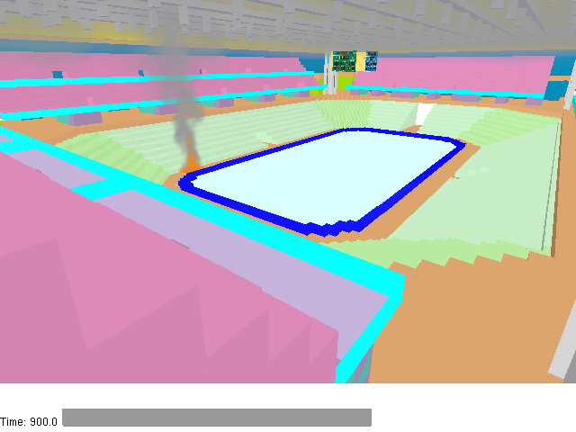</div>
<div class="ppt-text" style="left:46.1456%;top:29.8611%;width:39.8268%;height:8.5269%;padding:6.0px 12.0px 6.0px 12.0px;white-space:nowrap;"><p style="text-align:center;"><span style="font-size:26.67px;color:#000000;">2006 Olympic Ice Hockey Stadium, </span></p><p style="text-align:center;"><span style="font-size:26.67px;color:#000000;">Turin, Italy, courtesy ArupFire, London</span></p></div>
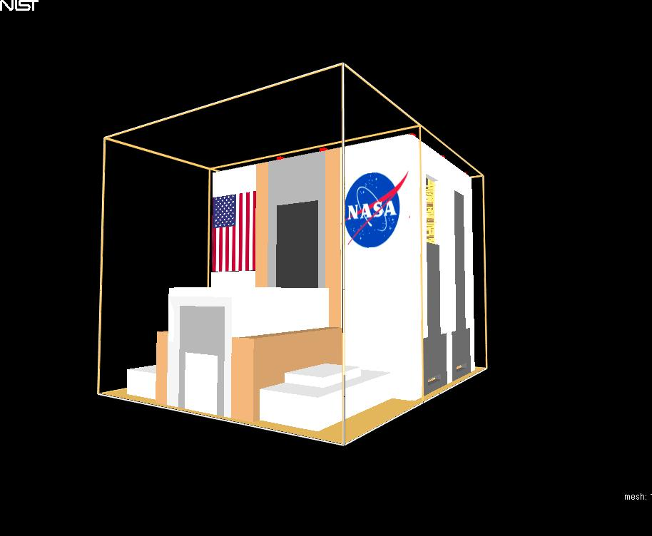
<div class="ppt-text" style="left:3.2271%;top:39.3056%;width:34.6048%;height:12.1172%;padding:6.0px 12.0px 6.0px 12.0px;white-space:nowrap;"><p style="text-align:center;"><span style="font-size:26.67px;">NASA Vehicle Assembly Building</span></p><p style="text-align:center;"><span style="font-size:26.67px;">Kennedy Space Center</span></p><p style="text-align:center;"><span style="font-size:26.67px;">courtesy Rolf Jensen</span></p></div>
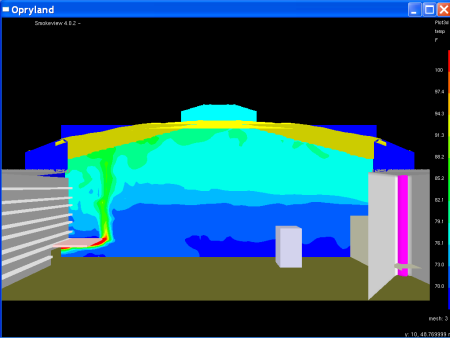
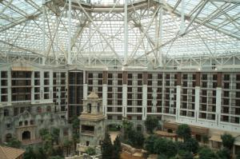
<div class="ppt-text" style="left:13.6596%;top:90.0000%;width:33.6357%;height:8.5269%;padding:6.0px 12.0px 6.0px 12.0px;white-space:nowrap;"><p style="text-align:left;"><span style="font-size:26.67px;">Opryland USA, Nashville, TN</span></p><p style="text-align:left;"><span style="font-size:26.67px;">Courtesy, Schirmer Engineering</span></p></div>
</div>
```

## Fire modeling in buildings {#welcome-37 .welcome-slide}

<!-- Source: History_of_Fire_Modeling_4.pptx, slide 37. -->

```{=html}
<div class="slide-canvas">
<div class="ppt-text" style="left:1.7134%;top:3.4491%;width:27.3700%;height:8.3287%;padding:6.0px 12.0px 6.0px 12.0px;"><p style="text-align:left;"><span style="font-size:46.67px;">RI Statehouse</span></p></div>
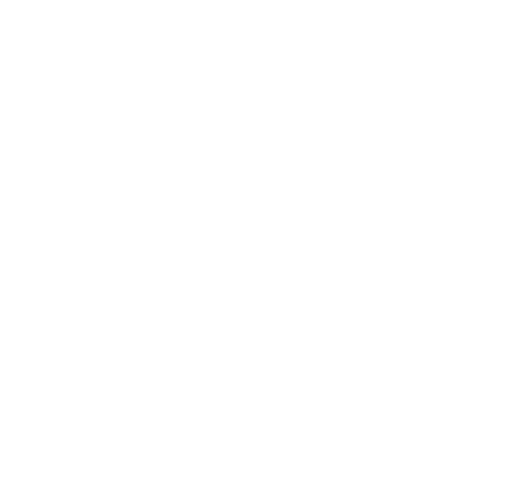
<div class="ppt-crop" style="left:3.3333%;top:90.0000%;width:29.9618%;height:8.1574%;"></div>
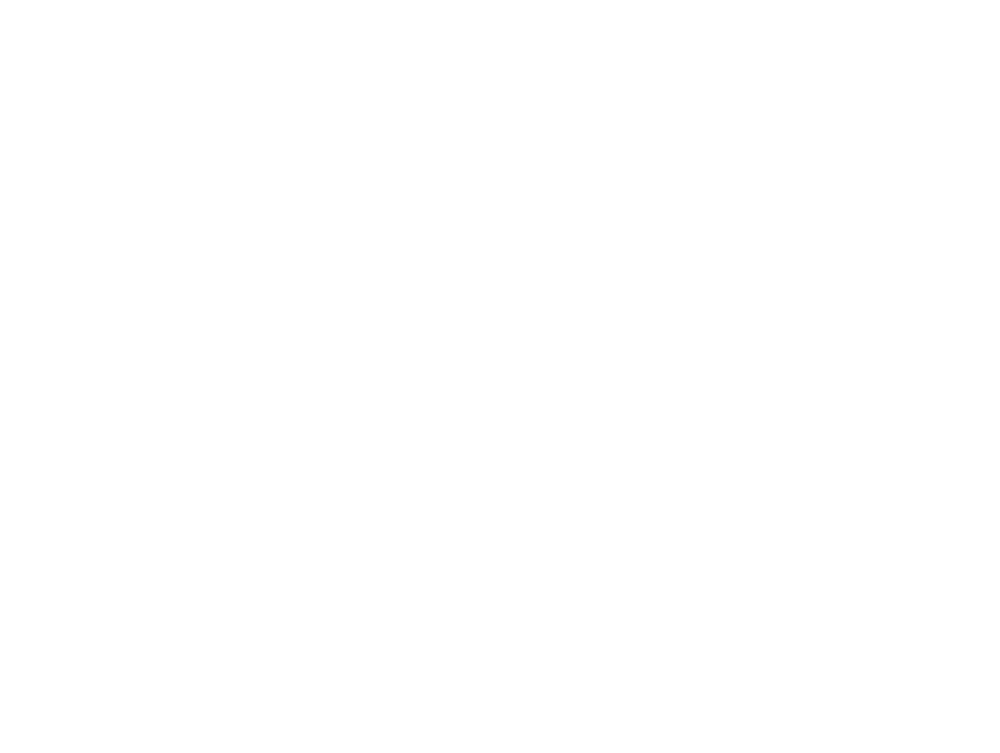
<div class="ppt-text" style="left:50.8989%;top:31.2504%;width:48.7941%;height:5.8342%;padding:6.0px 12.0px 6.0px 12.0px;white-space:nowrap;"><p style="text-align:left;"><span style="font-size:33.33px;">Bank of America Building, Providence</span></p></div>
</div>
```

## Model 2: Fire {#welcome-38 .welcome-slide}

<!-- Source: History_of_Fire_Modeling_4.pptx, slide 38. -->

```{=html}
<div class="slide-canvas">
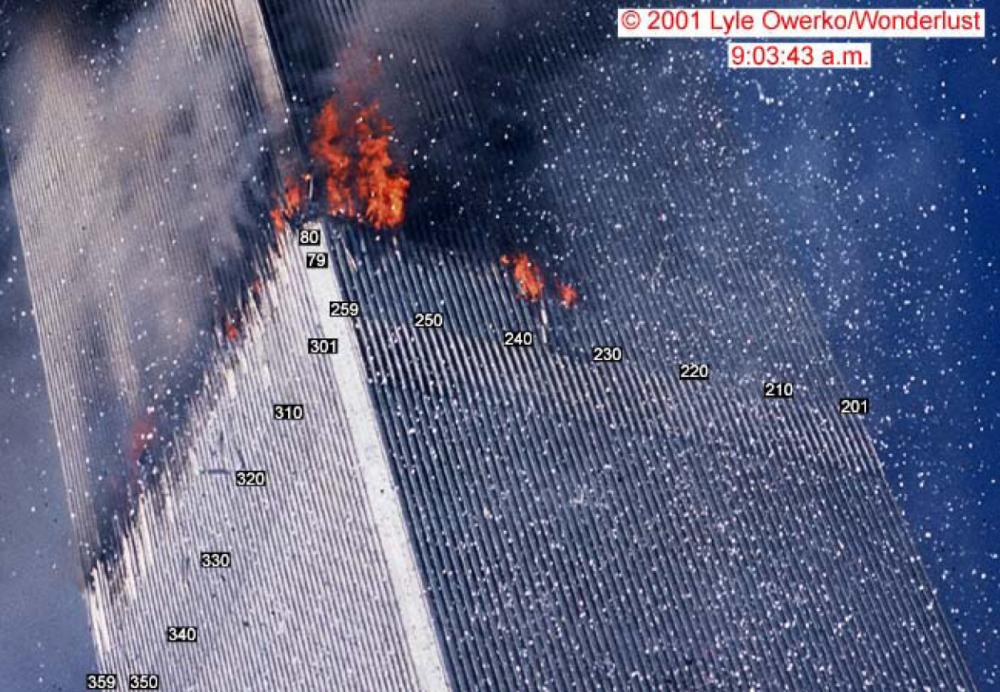
<div class="ppt-crop" style="left:47.6563%;top:51.3195%;width:50.1562%;height:46.0185%;">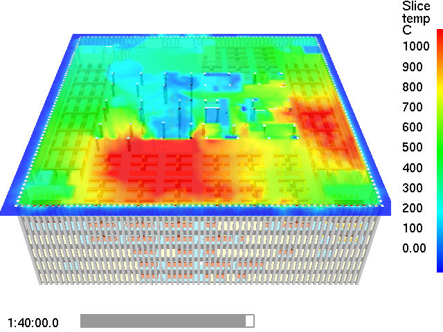</div>
<div class="ppt-text" style="left:53.6285%;top:71.7361%;width:32.8472%;height:9.3519%;padding:6.0px 12.0px 6.0px 12.0px;white-space:nowrap;"><p style="text-align:left;"><span style="font-size:60.00px;font-weight:700;">Model 2: Fire</span></p></div>
</div>
```

## Coupled fire and structural analysis {#welcome-39 .welcome-slide}

<!-- Source: History_of_Fire_Modeling_4.pptx, slide 39. -->

```{=html}
<div class="slide-canvas">
<div class="ppt-text" style="left:55.6267%;top:29.3981%;width:40.5870%;height:9.4245%;padding:6.0px 12.0px 6.0px 12.0px;white-space:nowrap;"><p style="text-align:left;"><span style="font-size:30.00px;font-weight:700;color:#000000;">Fire Analysis</span></p><p style="text-align:left;"><span style="font-size:30.00px;color:#000000;">Program: Fire Dynamics Simulator</span></p></div>
<div class="ppt-text" style="left:20.2315%;top:59.4803%;width:22.8221%;height:9.4245%;padding:6.0px 12.0px 6.0px 12.0px;white-space:nowrap;"><p style="text-align:left;"><span style="font-size:30.00px;font-weight:700;color:#000000;">Thermal Analysis</span></p><p style="text-align:left;"><span style="font-size:30.00px;color:#000000;">Program: ANSYS</span></p></div>
<div class="ppt-crop" style="left:70.5382%;top:67.0833%;width:28.1076%;height:29.9537%;">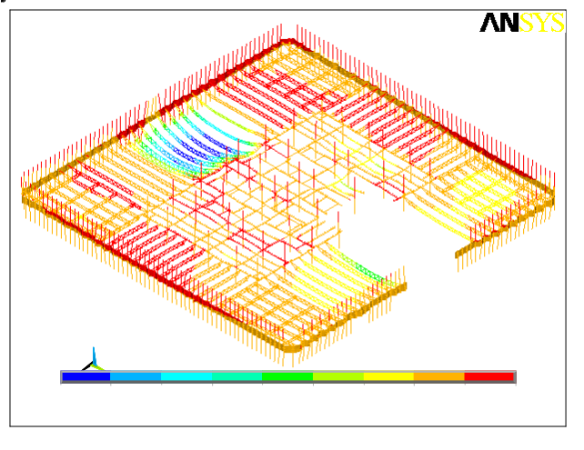</div>
<svg class="ppt-shape" style="left:89.8264%;top:67.3148%;width:8.8542%;height:4.8611%;overflow:visible" viewBox="0 0 106.24997935560337 43.75" aria-hidden="true"><rect width="106.24997935560337" height="43.75" fill="#ffffff" stroke="none" stroke-width="1.25"/></svg>
<svg class="ppt-shape" style="left:70.6424%;top:67.2685%;width:4.3229%;height:9.0278%;overflow:visible" viewBox="0 0 51.874989920676946 81.25" aria-hidden="true"><rect width="51.874989920676946" height="81.25" fill="#ffffff" stroke="none" stroke-width="1.25"/></svg>
<div class="ppt-text" style="left:43.7128%;top:81.0573%;width:25.8619%;height:9.4245%;padding:6.0px 12.0px 6.0px 12.0px;white-space:nowrap;"><p style="text-align:left;"><span style="font-size:30.00px;font-weight:700;color:#000000;">Structural Analysis</span></p><p style="text-align:left;"><span style="font-size:30.00px;color:#000000;">Program: ANSYS</span></p></div>
<div class="ppt-text" style="left:35.5116%;top:6.9878%;width:30.8161%;height:9.4245%;padding:6.0px 12.0px 6.0px 12.0px;white-space:nowrap;"><p style="text-align:left;"><span style="font-size:30.00px;font-weight:700;color:#000000;">Aircraft Impact Analysis</span></p><p style="text-align:left;"><span style="font-size:30.00px;color:#000000;">Program: LS-DYNA</span></p></div>
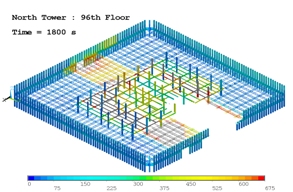
<svg class="ppt-shape" style="left:44.4341%;top:49.8542%;width:12.9711%;height:1.8286%;overflow:visible" viewBox="0 0 155.65322302654258 16.457093253968253" aria-hidden="true"><rect width="155.65322302654258" height="16.457093253968253" fill="#ffffff" stroke="none" stroke-width="1.25"/></svg>
<svg class="ppt-shape" style="left:43.8337%;top:51.7026%;width:8.3420%;height:1.6298%;overflow:visible" viewBox="0 0 100.1034126163392 14.668278769841269" aria-hidden="true"><rect width="100.1034126163392" height="14.668278769841269" fill="#ffffff" stroke="none" stroke-width="1.25"/></svg>
<svg class="ppt-shape" style="left:1.7882%;top:1.9213%;width:32.1741%;height:26.5278%;overflow:visible" viewBox="0 0 386.08979823813587 238.75" aria-hidden="true"><rect width="386.08979823813587" height="238.75" fill="#ffffff" stroke="#000000" stroke-width="1.6666666666666667"/></svg>
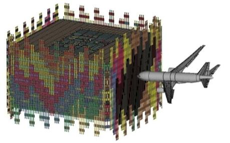
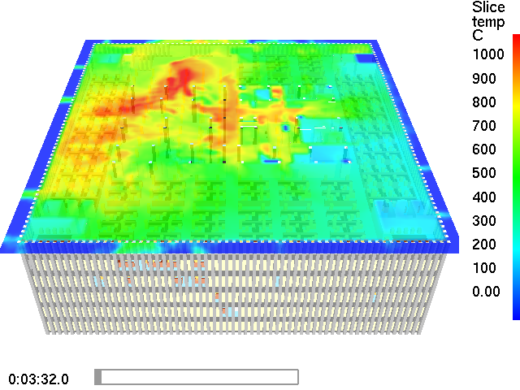
</div>
```

::: {.notes}

The fire structure interface was developed to couple the fire dynamic simulations with the 

Structure response of WTC towers. The thermal response of the structural elements is at the 

Heart of this process. The thermal analysis is linked to the FDS simulations through an interface and I will briefly discuss the challenges that are faced  in the development of this interface. The thermal data that is computed as 

Part of the analysis is transferred to the structural models  and this was also not a straight forward process and I will briefly touch upon the challenges during the data transfer process.

The aircraft impact analysis provides very important input data in the form of structural and fireproofing damage and this information was incorporated into the thermal models.


The fire structure interface and thermal response is coupled with FDS simulations, the impact analysis and 

Provides input data for structural analysis. Project 6 provides very important data on the thicknesses of the fireproofing


:::

## World Trade Center office interiors {#welcome-40 .welcome-slide}

<!-- Source: History_of_Fire_Modeling_4.pptx, slide 40. -->

```{=html}
<div class="slide-canvas">
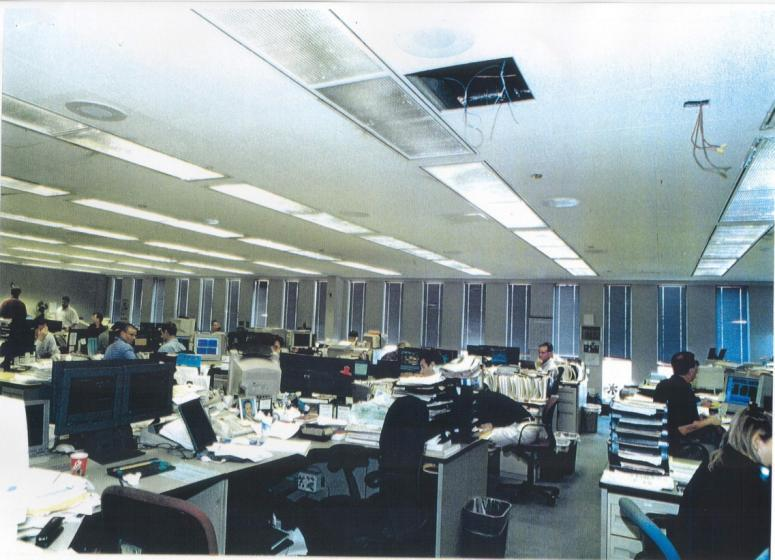
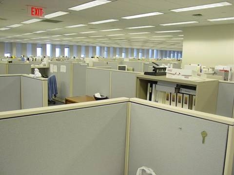

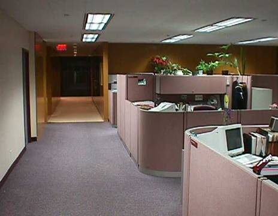
<div class="ppt-text" style="left:57.5000%;top:93.3333%;width:41.6667%;height:4.9074%;padding:6.0px 12.0px 6.0px 12.0px;white-space:nowrap;"><p style="text-align:left;"><span style="font-size:26.67px;font-weight:700;color:#ffffff;">Photos courtesy of the Port Authority</span></p></div>
</div>
```

## Workstation fire modeling {#welcome-41 .welcome-slide}

<!-- Source: History_of_Fire_Modeling_4.pptx, slide 41. -->

```{=html}
<div class="slide-canvas">
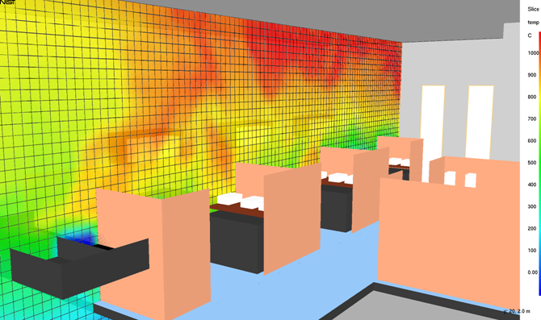
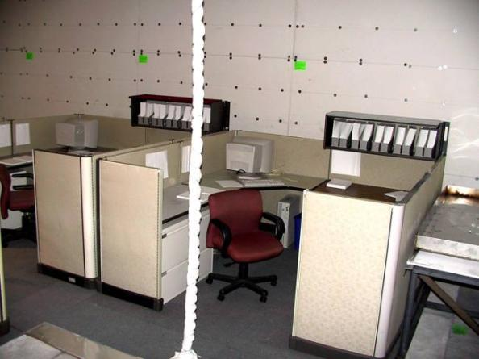
<div class="ppt-text" style="left:3.6632%;top:91.5509%;width:9.6007%;height:6.6667%;padding:6.0px 12.0px 6.0px 12.0px;white-space:nowrap;"><p style="text-align:left;"><span style="font-size:30.00px;color:#ffffff;">NIST</span></p></div>
<video class="ppt-media" style="left:44.3333%;top:44.8843%;width:53.3333%;height:53.3333%;" controls playsinline preload="none" poster="figs/image82.png" aria-label="Workstation fire modeling figure" src="https://github.com/rmcdermo/Juelich_Summer_School/releases/download/2026/welcome-nist-workstation-simulation.mp4"></video>
</div>
```

## Workstation fire experiments {#welcome-42 .welcome-slide}

<!-- Source: History_of_Fire_Modeling_4.pptx, slide 42. -->

```{=html}
<div class="slide-canvas">
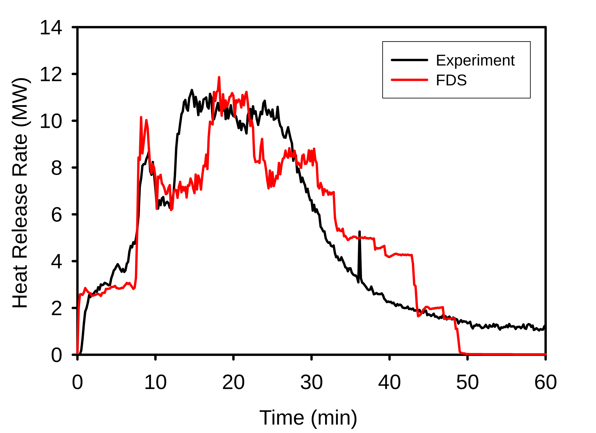
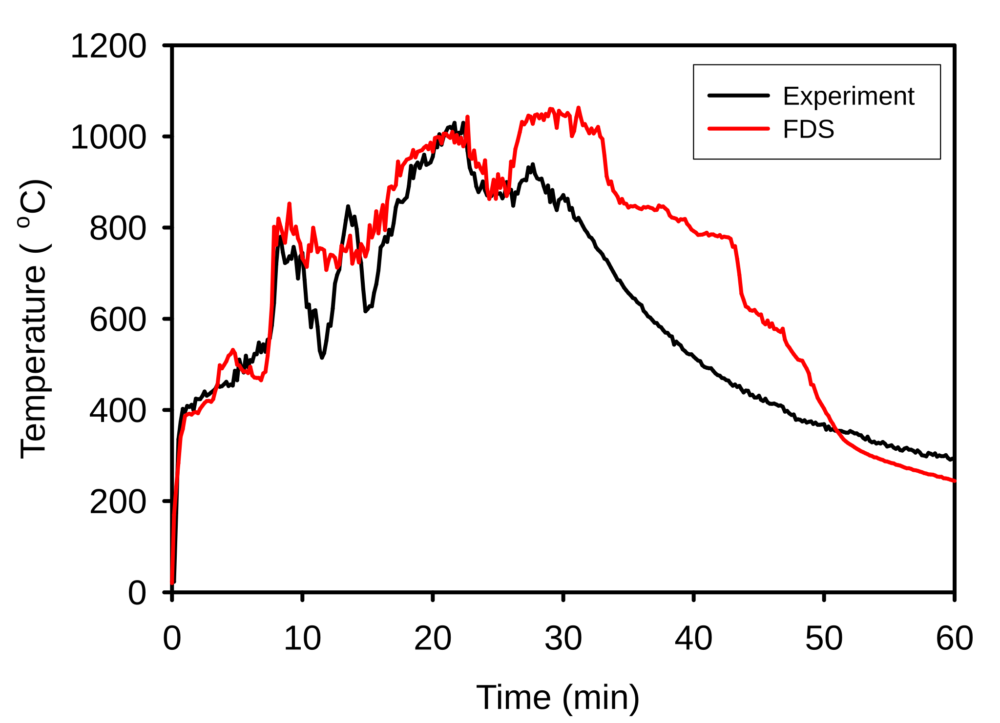
<div class="ppt-text" style="left:65.0868%;top:1.6667%;width:18.8194%;height:4.4444%;padding:6.0px 12.0px 6.0px 12.0px;white-space:nowrap;"><p style="text-align:left;"><span style="font-size:23.33px;font-weight:700;color:#1f497d;">Heat Release Rate</span></p></div>
<div class="ppt-text" style="left:67.7431%;top:51.6667%;width:13.7674%;height:4.4444%;padding:6.0px 12.0px 6.0px 12.0px;white-space:nowrap;"><p style="text-align:left;"><span style="font-size:23.33px;font-weight:700;color:#1f497d;">Temperature</span></p></div>
<div class="ppt-text" style="left:5.1389%;top:88.5880%;width:43.4028%;height:9.3519%;padding:6.0px 12.0px 6.0px 12.0px;white-space:nowrap;"><p style="text-align:left;"><span style="font-size:30.00px;">Video courtesy of Alex Maranghides, </span></p><p style="text-align:left;"><span style="font-size:30.00px;">Anthony Hamins, NIST</span></p></div>
<video class="ppt-media" style="left:8.1250%;top:6.1111%;width:36.6667%;height:33.3254%;" controls playsinline preload="none" poster="figs/image85.png" aria-label="Workstation fire experiments figure" src="https://github.com/rmcdermo/Juelich_Summer_School/releases/download/2026/welcome-nist-workstation-test-1.mp4"></video>
<video class="ppt-media" style="left:8.1250%;top:46.7407%;width:36.5312%;height:33.2024%;" controls playsinline preload="none" poster="figs/image86.png" aria-label="Workstation fire experiments figure" src="https://github.com/rmcdermo/Juelich_Summer_School/releases/download/2026/welcome-nist-workstation-test-2.mp4"></video>
</div>
```

## South Face of WTC 1 at 10:23 {#welcome-43 .welcome-slide}

<!-- Source: History_of_Fire_Modeling_4.pptx, slide 43. -->

```{=html}
<div class="slide-canvas">
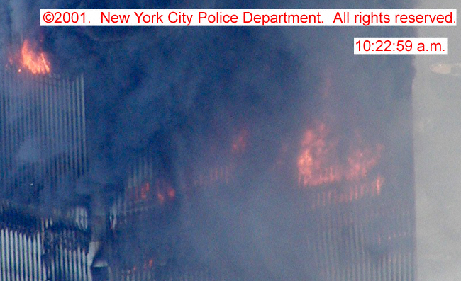
<div class="ppt-text" style="left:29.5833%;top:88.5648%;width:40.8854%;height:5.7870%;padding:6.0px 12.0px 6.0px 12.0px;white-space:nowrap;"><p style="text-align:left;"><span style="font-size:33.33px;font-weight:700;">South Face of WTC 1 at 10:23</span></p></div>
</div>
```

::: {.notes}

Include to remind audience of large fires on south face of WTC 1 just prior to collapse.

:::

## Multi-Floor WTC Geometry {#welcome-44 .welcome-slide}

<!-- Source: History_of_Fire_Modeling_4.pptx, slide 44. -->

```{=html}
<div class="slide-canvas">
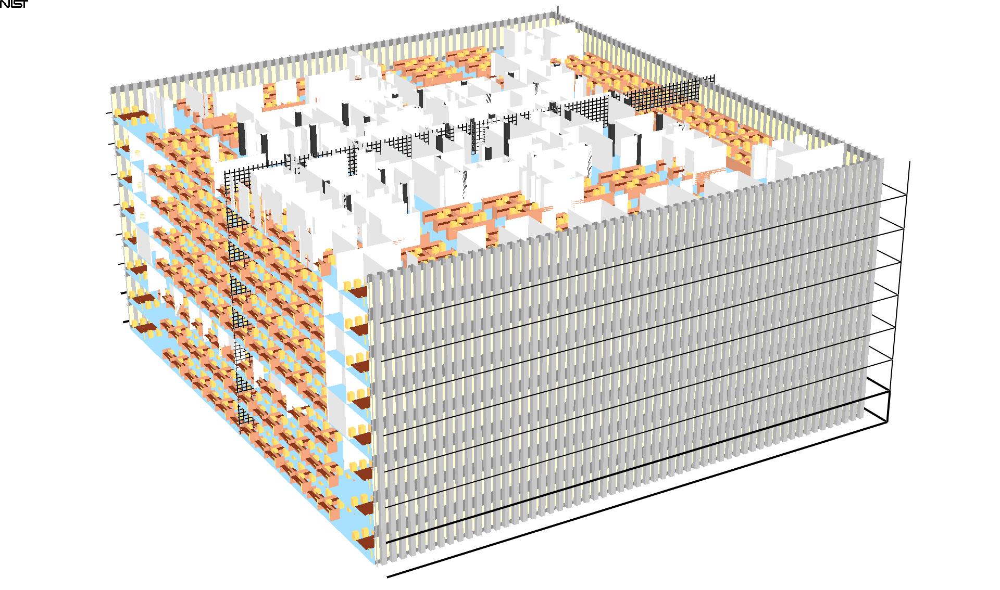
<div class="ppt-text" style="left:24.2535%;top:4.0972%;width:51.3021%;height:7.5694%;padding:6.0px 12.0px 6.0px 12.0px;white-space:nowrap;"><p style="text-align:left;"><span style="font-size:46.67px;font-weight:700;color:#1f497d;">Multi-Floor WTC Geometry</span></p></div>
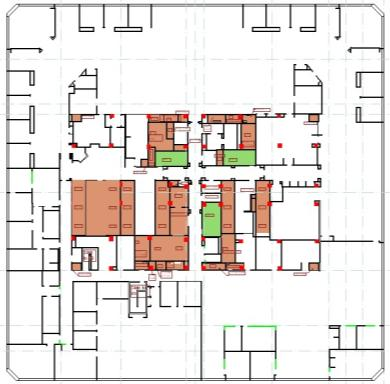
</div>
```

::: {.notes}

Quick reminder of the basic geometry of the calcs.

:::

## Upper Layer Gas Temperatures {#welcome-45 .welcome-slide}

<!-- Source: History_of_Fire_Modeling_4.pptx, slide 45. -->

```{=html}
<div class="slide-canvas">
<div class="ppt-text" style="left:19.9306%;top:4.0972%;width:60.0174%;height:12.8935%;padding:6.0px 12.0px 6.0px 12.0px;white-space:nowrap;"><p style="text-align:left;"><span style="font-size:46.67px;font-weight:700;color:#1f497d;">Upper Layer Gas Temperatures</span></p><p style="text-align:left;"><span style="font-size:46.67px;color:#1f497d;">WTC 1 - Floor 97</span></p></div>


<div class="ppt-text" style="left:8.4028%;top:86.9213%;width:47.8472%;height:5.3472%;padding:6.0px 12.0px 6.0px 12.0px;white-space:nowrap;"><p style="text-align:left;"><span style="font-size:30.00px;">Graphics courtesy of Glenn Forney, NIST</span></p></div>
<video class="ppt-media" style="left:4.5000%;top:27.8889%;width:53.3333%;height:53.3333%;" controls playsinline preload="none" poster="figs/image90.png" aria-label="Upper Layer Gas Temperatures figure" src="https://github.com/rmcdermo/Juelich_Summer_School/releases/download/2026/welcome-wtc-floor-97-temperatures.mp4"></video>
<svg class="ppt-shape" style="left:26.3542%;top:19.2361%;width:6.3368%;height:10.8102%;overflow:visible" viewBox="0 0 76.04173228346457 97.29160104986876" aria-hidden="true"><polygon points="0,0 76.04173228346457,0 76.04173228346457,63.2395406824147 76.04173228346457,63.2395406824147 38.020866141732284,97.29160104986876 0,63.2395406824147" fill="#FF3300" stroke="#000000" stroke-width="1.6666666666666667"/></svg>
</div>
```

::: {.notes}

Floor 97 fires behaved in a very predictable way. Good floor to test parameter sensitivity.

:::
