## 2010’s {#welcome-46 .welcome-slide}

<!-- Source: History_of_Fire_Modeling_4.pptx, slide 46. -->

```{=html}
<div class="slide-canvas">
<div class="ppt-text" style="left:17.4167%;top:31.7778%;width:65.6667%;height:28.2734%;padding:6.0px 12.0px 6.0px 12.0px;"><p style="text-align:left;"><span style="font-size:66.67px;">2010’s</span></p><p style="text-align:left;">&nbsp;</p><p style="text-align:left;"><span style="font-size:66.67px;">Going under-ventilated</span></p></div>
</div>
```

## New faces… {#welcome-47 .welcome-slide}

<!-- Source: History_of_Fire_Modeling_4.pptx, slide 47. -->

```{=html}
<div class="slide-canvas">
<div class="ppt-text" style="left:30.2817%;top:1.0329%;width:39.4366%;height:6.7318%;padding:6.0px 12.0px 6.0px 12.0px;"><p style="text-align:left;"><span style="font-size:30.00px;">New faces…</span></p></div>

<div class="ppt-crop" style="left:50.8876%;top:21.1919%;width:22.6302%;height:42.1930%;"></div>
<div class="ppt-crop" style="left:26.6517%;top:21.1919%;width:22.6302%;height:42.1930%;"></div>
<div class="ppt-text" style="left:28.3162%;top:63.8387%;width:19.3012%;height:10.7708%;padding:6.0px 12.0px 6.0px 12.0px;white-space:nowrap;"><p style="text-align:left;"><span style="font-size:23.33px;">Randy McDermott</span></p><p style="text-align:left;"><span style="font-size:23.33px;">NIST</span></p><p style="text-align:left;"><span style="font-size:23.33px;">(Hydro, Turbulence)</span></p></div>
<div class="ppt-text" style="left:53.2607%;top:63.8387%;width:17.8841%;height:10.7708%;padding:6.0px 12.0px 6.0px 12.0px;white-space:nowrap;"><p style="text-align:left;"><span style="font-size:23.33px;">Craig </span><span style="font-size:23.33px;">Weinschenk</span></p><p style="text-align:left;"><span style="font-size:23.33px;">UL</span></p><p style="text-align:left;"><span style="font-size:23.33px;">(Chemistry)</span></p></div>
<div class="ppt-text" style="left:79.7531%;top:63.3848%;width:13.3443%;height:10.7708%;padding:6.0px 12.0px 6.0px 12.0px;white-space:nowrap;"><p style="text-align:left;"><span style="font-size:23.33px;">Kris </span><span style="font-size:23.33px;">Overholt</span></p><p style="text-align:left;"><span style="font-size:23.33px;">R</span></p><p style="text-align:left;"><span style="font-size:23.33px;">(</span><span style="font-size:23.33px;">Firebot</span><span style="font-size:23.33px;">)</span></p></div>
<div class="ppt-crop" style="left:2.2304%;top:21.1919%;width:22.8155%;height:42.1930%;"></div>
<div class="ppt-text" style="left:1.1130%;top:63.8387%;width:24.6341%;height:17.0538%;padding:6.0px 12.0px 6.0px 12.0px;white-space:nowrap;"><p style="text-align:left;"><span style="font-size:23.33px;">Bryan Klein</span></p><p style="text-align:left;"><span style="font-size:23.33px;">Thunderhead Engineering</span></p><p style="text-align:left;"><span style="font-size:23.33px;">PyroSim</span></p><p style="text-align:left;"><span style="font-size:23.33px;">(Version Control,</span></p><p style="text-align:left;"><span style="font-size:23.33px;">Discussion Forum)</span></p></div>
</div>
```

## NIST Full Scale Experiments (2008) {#welcome-48 .welcome-slide}

<!-- Source: History_of_Fire_Modeling_4.pptx, slide 48. -->

```{=html}
<div class="slide-canvas">
<video class="ppt-media" style="left:48.1154%;top:29.2828%;width:46.5145%;height:49.6154%;" controls playsinline preload="none" poster="figs/image95.png" aria-label="NIST Full Scale Experiments (2008) figure" src="https://github.com/rmcdermo/Juelich_Summer_School/releases/download/2026/welcome-nist-full-scale-simulation.mp4"></video>
<div class="ppt-text" style="left:3.4088%;top:2.8389%;width:93.1824%;height:8.3508%;padding:11.998031496062993px 11.998031496062993px 11.998031496062993px 11.998031496062993px;"><p style="text-align:left;"><span style="font-size:60.00px;">NIST Full Scale Experiments (2008)</span></p></div>
<video class="ppt-media" style="left:6.0000%;top:29.2828%;width:38.0000%;height:46.4193%;" controls playsinline preload="none" poster="figs/image96.png" aria-label="NIST Full Scale Experiments (2008) figure" src="https://github.com/rmcdermo/Juelich_Summer_School/releases/download/2026/welcome-nist-full-scale-experiment.mp4"></video>
<div class="ppt-text" style="left:2.1640%;top:77.6450%;width:45.9513%;height:6.7318%;padding:6.0px 12.0px 6.0px 12.0px;white-space:nowrap;"><p style="text-align:left;"><span style="font-size:20.00px;">A. Lock, M. Bundy, E. Johnson, A. </span><span style="font-size:20.00px;">Hamins</span><span style="font-size:20.00px;">, G. H. </span><span style="font-size:20.00px;">Ko</span><span style="font-size:20.00px;">,</span></p><p style="text-align:left;"><span style="font-size:20.00px;">C. Hwang, P. Fuss, R. Harris, NIST Tech Note 1603, 2008.</span></p></div>
</div>
```

## NIST FSE, Isoheptane {#welcome-49 .welcome-slide}

<!-- Source: History_of_Fire_Modeling_4.pptx, slide 49. -->

```{=html}
<div class="slide-canvas">
<div class="ppt-text" style="left:1.6949%;top:3.0025%;width:93.1824%;height:8.3508%;padding:11.998031496062993px 11.998031496062993px 11.998031496062993px 11.998031496062993px;"><p style="text-align:left;"><span style="font-size:60.00px;">NIST FSE, </span><span style="font-size:60.00px;">Isoheptane</span></p></div>
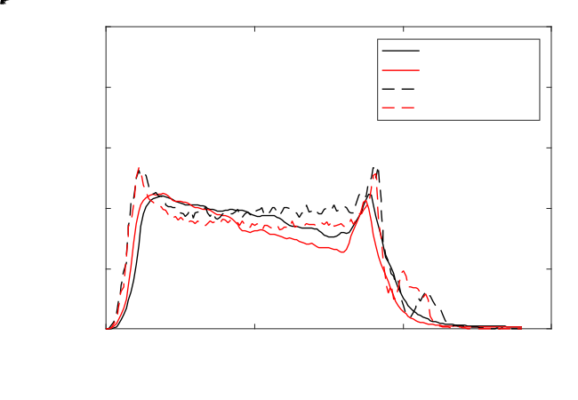
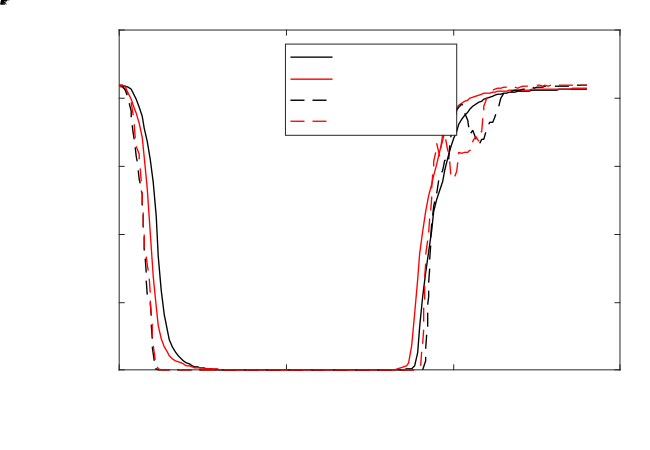
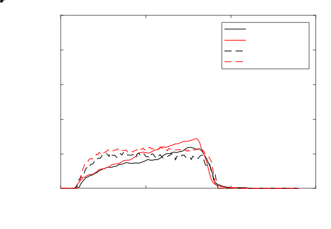
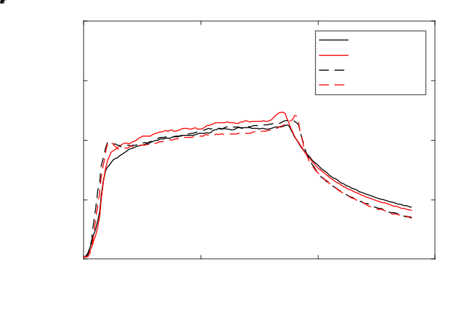
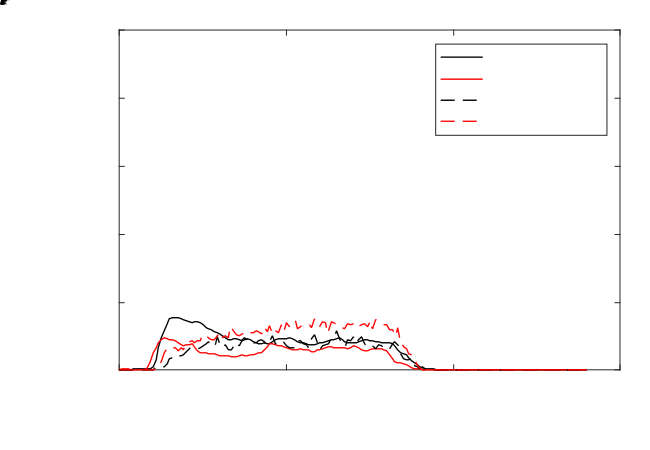
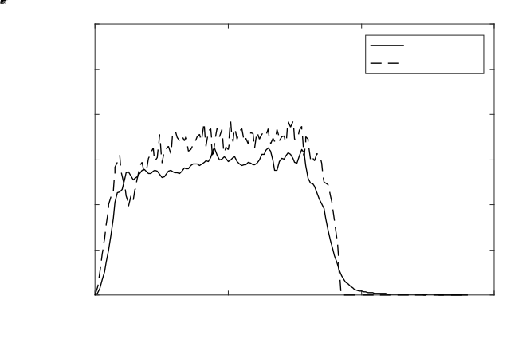
</div>
```

## Scaling up {#welcome-50 .welcome-slide}

<!-- Source: History_of_Fire_Modeling_4.pptx, slide 50. -->

```{=html}
<div class="slide-canvas">
<div class="ppt-text" style="left:4.1834%;top:2.1523%;width:35.9574%;height:8.9275%;padding:6.0px 12.0px 6.0px 12.0px;"><p style="text-align:left;"><span style="font-size:60.00px;">Scaling up</span></p></div>
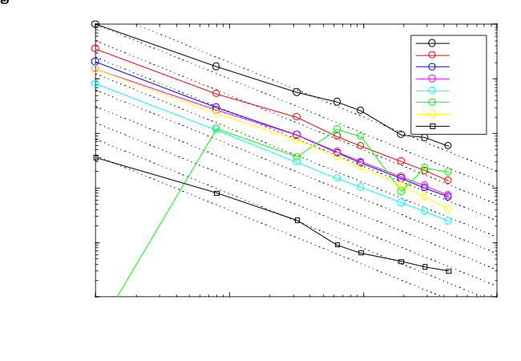
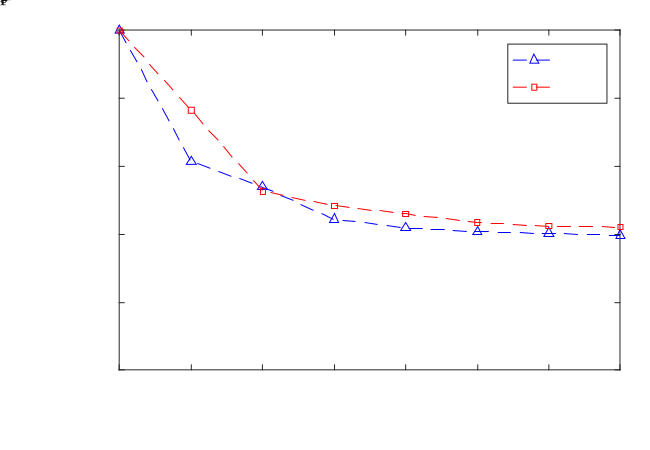
<div class="ppt-text" style="left:5.5874%;top:16.5258%;width:31.4710%;height:22.8880%;padding:6.0px 12.0px 6.0px 12.0px;white-space:nowrap;"><p style="text-align:left;"><span style="font-size:30.00px;">Christian </span><span style="font-size:30.00px;">Rogsch</span></p><p style="text-align:left;"><span style="font-size:30.00px;">Susan Kilian</span></p><p style="text-align:left;"><span style="font-size:30.00px;">Lukas Arnold</span></p><p style="text-align:left;"><span style="font-size:30.00px;">Daniel </span><span style="font-size:30.00px;">Harhoff</span></p></div>
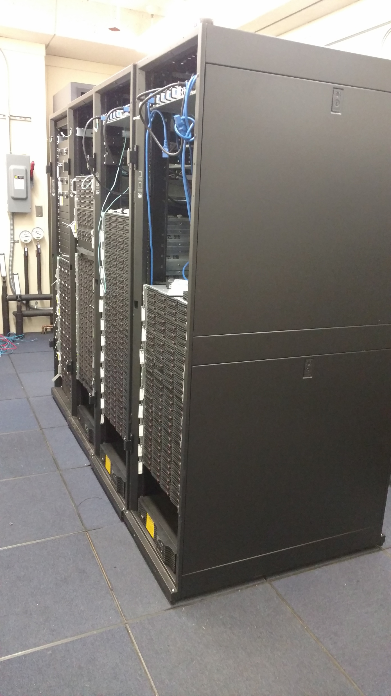
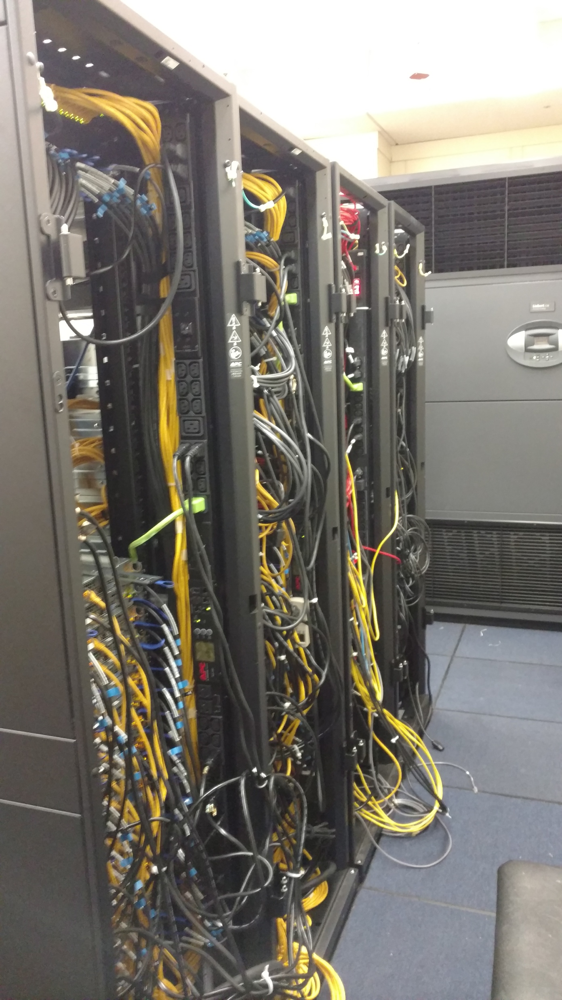
<div class="ppt-text" style="left:6.5493%;top:90.1977%;width:31.2256%;height:8.5269%;padding:6.0px 12.0px 6.0px 12.0px;white-space:nowrap;"><p style="text-align:left;"><span style="font-size:26.67px;">burn compute cluster at NIST</span></p><p style="text-align:left;"><span style="font-size:26.67px;">432 cores</span></p></div>
</div>
```

## University of Maryland {#welcome-51 .welcome-slide}

<!-- Source: History_of_Fire_Modeling_4.pptx, slide 51. -->

```{=html}
<div class="slide-canvas">
<video class="ppt-media" style="left:35.3796%;top:2.9386%;width:63.3484%;height:58.0783%;" controls playsinline preload="none" poster="figs/image107.png" aria-label="University of Maryland figure" src="https://github.com/rmcdermo/Juelich_Summer_School/releases/download/2026/welcome-umd-line-burner-history.mp4"></video>
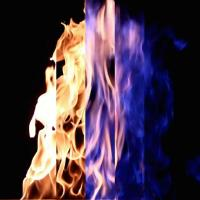
<div class="ppt-text" style="left:0.3044%;top:41.9652%;width:35.0753%;height:12.1172%;padding:6.0px 12.0px 6.0px 12.0px;"><p style="text-align:left;"><span style="font-size:26.67px;">University of Maryland</span></p><p style="text-align:left;"><span style="font-size:26.67px;">Turbulent Line Burner</span></p><p style="text-align:left;"><span style="font-size:26.67px;">James White, PhD Thesis, 2016</span></p></div>
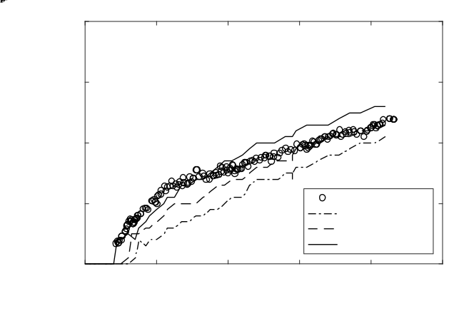
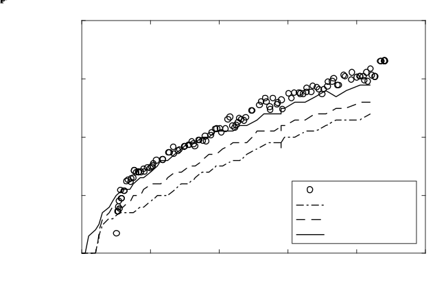
<div class="ppt-text" style="left:15.1409%;top:94.5193%;width:69.7183%;height:4.9366%;padding:6.0px 12.0px 6.0px 12.0px;"><p style="text-align:left;"><span style="font-size:26.67px;">Exp</span><span style="font-size:26.67px;"> data from </span><span style="font-size:26.67px;">MaCFP</span><span style="font-size:26.67px;"> database, J. White, PhD Thesis, UMD, 2016.</span></p></div>
</div>
```

## FM Global {#welcome-52 .welcome-slide}

<!-- Source: History_of_Fire_Modeling_4.pptx, slide 52. -->

```{=html}
<div class="slide-canvas">
<video class="ppt-media" style="left:2.5821%;top:0.0000%;width:40.0000%;height:100.0000%;" controls playsinline preload="none" poster="figs/image111.png" aria-label="FM Global figure" src="https://github.com/rmcdermo/Juelich_Summer_School/releases/download/2026/welcome-fm-propylene-wall-fire.mp4"></video>
<div class="ppt-text" style="left:54.7388%;top:7.8484%;width:33.5200%;height:33.6589%;padding:6.0px 12.0px 6.0px 12.0px;white-space:nowrap;"><p style="text-align:left;"><span style="font-size:30.00px;">FM Global</span></p><p style="text-align:left;"><span style="font-size:30.00px;">Propylene Wall Fire</span></p><p style="text-align:left;"><span style="font-size:30.00px;">in </span><span style="font-size:30.00px;">MaCFP</span></p><p style="text-align:left;">&nbsp;</p><p style="text-align:left;"><span style="font-size:30.00px;">Trying to predict heat</span></p><p style="text-align:left;"><span style="font-size:30.00px;">flux to the surface</span></p></div>
<div class="ppt-crop" style="left:44.4154%;top:48.2090%;width:54.1667%;height:50.0000%;">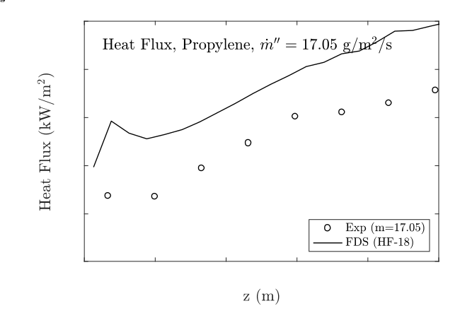</div>
</div>
```

## Wildland Fire Modeling {#welcome-53 .welcome-slide}

<!-- Source: History_of_Fire_Modeling_4.pptx, slide 53. -->

```{=html}
<div class="slide-canvas">
<div class="ppt-text" style="left:31.8453%;top:2.7230%;width:36.3095%;height:6.7318%;padding:6.0px 12.0px 6.0px 12.0px;white-space:nowrap;"><p style="text-align:left;"><span style="font-size:30.00px;">Wildland Fire Modeling</span></p></div>

<div class="ppt-text" style="left:68.2280%;top:57.5307%;width:22.0087%;height:12.1172%;padding:6.0px 12.0px 6.0px 12.0px;white-space:nowrap;"><p style="text-align:left;"><span style="font-size:26.67px;">Ruddy Mell</span></p><p style="text-align:left;"><span style="font-size:26.67px;">US Forest Service</span></p><p style="text-align:left;"><span style="font-size:26.67px;">Seattle, Washington</span></p></div>
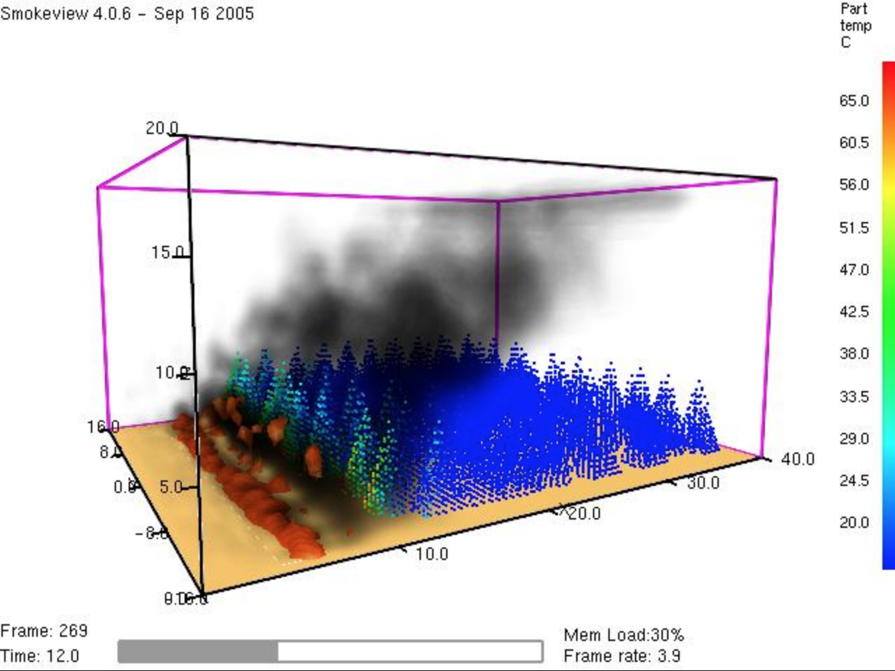
<div class="ppt-text" style="left:7.0537%;top:70.5164%;width:48.4407%;height:12.1172%;padding:6.0px 12.0px 6.0px 12.0px;white-space:nowrap;"><p style="text-align:left;"><span style="font-size:30.00px;">WFDS</span></p><p style="text-align:left;"><span style="font-size:30.00px;">(branched from FDS 6 in 2013)</span></p></div>
<div class="ppt-text" style="left:15.9754%;top:84.9955%;width:68.0491%;height:12.1172%;padding:6.0px 12.0px 6.0px 12.0px;white-space:nowrap;"><p style="text-align:left;"><span style="font-size:30.00px;">We are currently working closely with Ruddy</span></p><p style="text-align:left;"><span style="font-size:30.00px;">to include WFDS features into latest FDS</span></p></div>
</div>
```

## CSIRO Australian Grassland Fire Experiments {#welcome-54 .welcome-slide}

<!-- Source: History_of_Fire_Modeling_4.pptx, slide 54. -->

```{=html}
<div class="slide-canvas">
<video class="ppt-media" style="left:8.2587%;top:14.1791%;width:83.4826%;height:83.4826%;" controls playsinline preload="none" poster="figs/image115.png" aria-label="CSIRO Australian Grassland Fire Experiments figure" src="https://github.com/rmcdermo/Juelich_Summer_School/releases/download/2026/welcome-csiro-grassland-fire.mp4"></video>
<div class="ppt-text" style="left:2.1641%;top:3.1076%;width:93.9482%;height:8.5269%;padding:6.0px 12.0px 6.0px 12.0px;white-space:nowrap;"><p style="text-align:left;"><span style="font-size:53.33px;">CSIRO Australian Grassland Fire Experiments</span></p></div>
</div>
```
