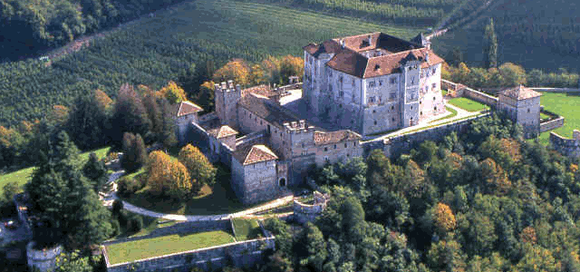
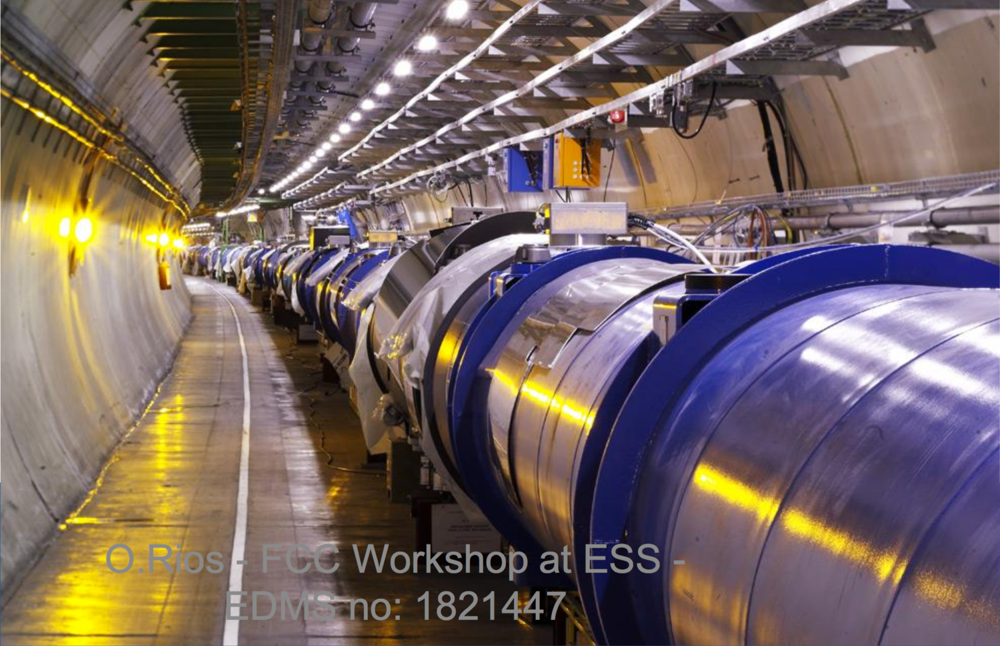
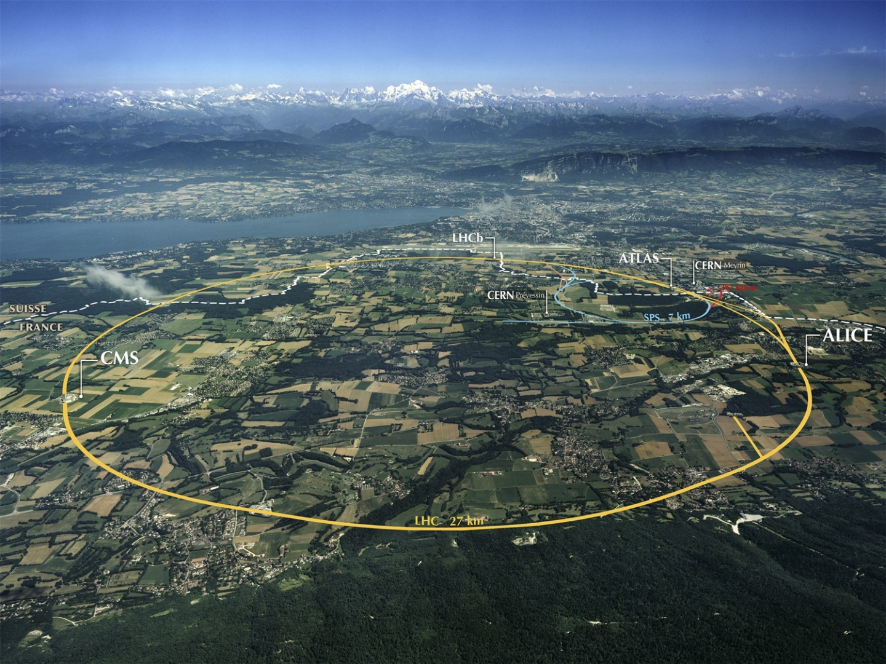
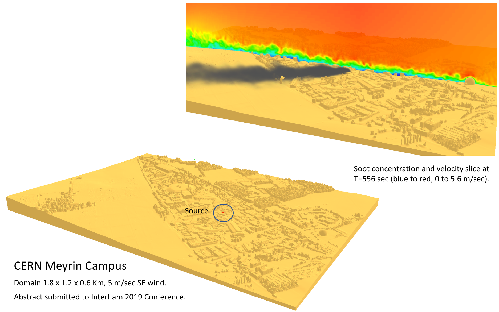
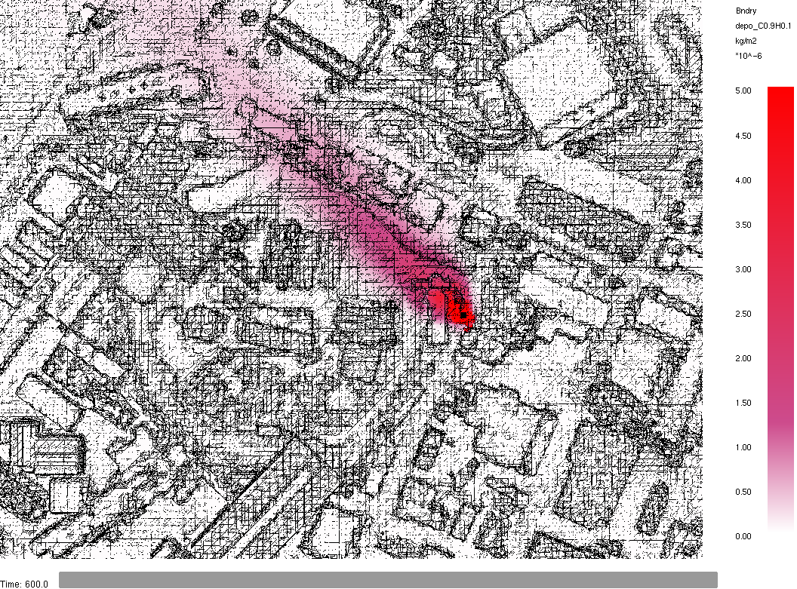
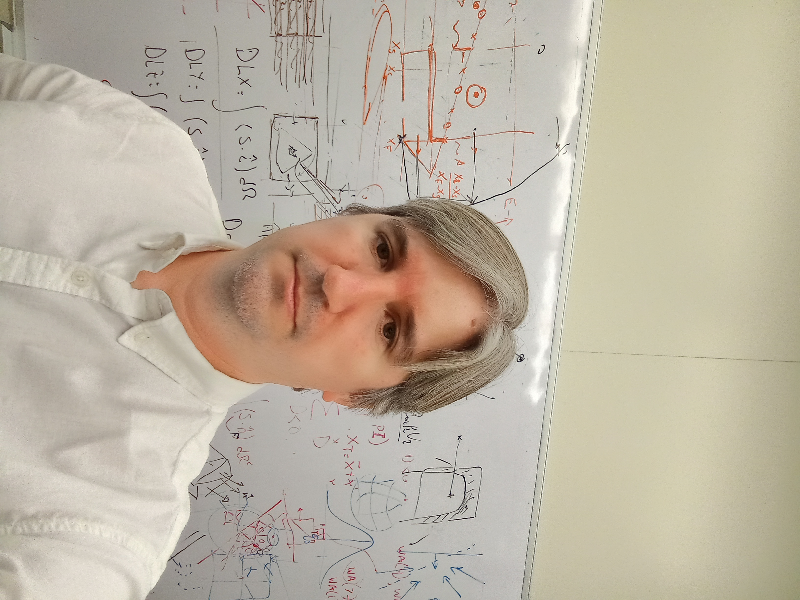
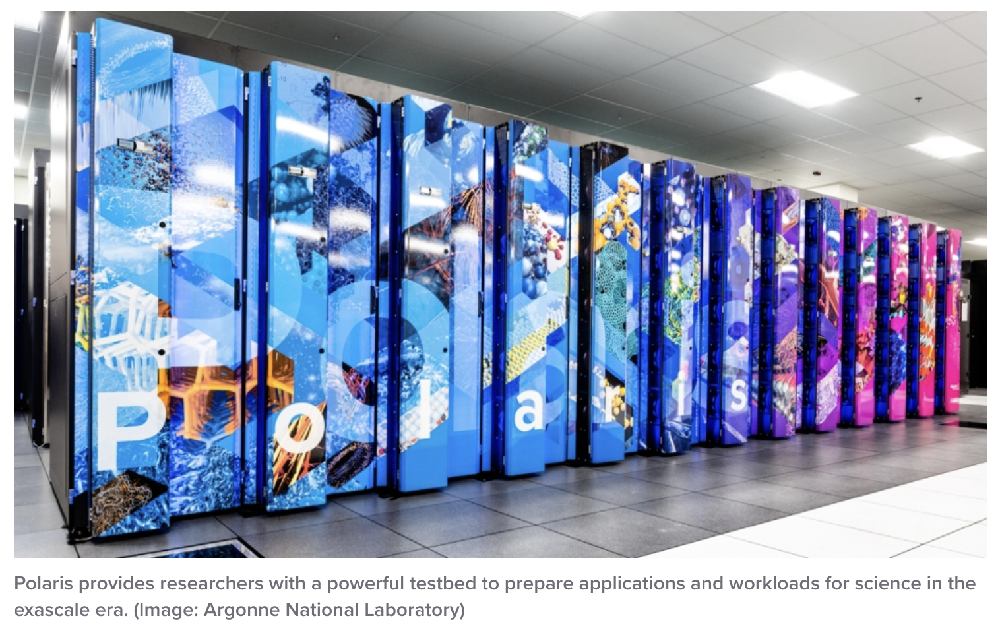
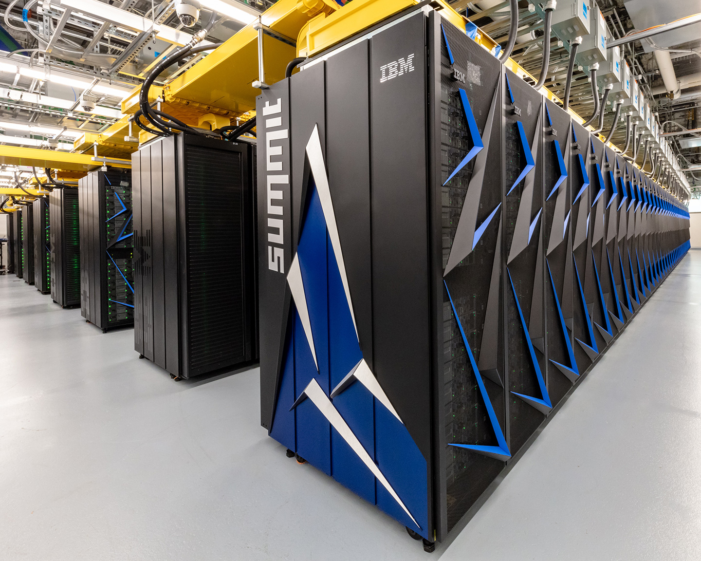
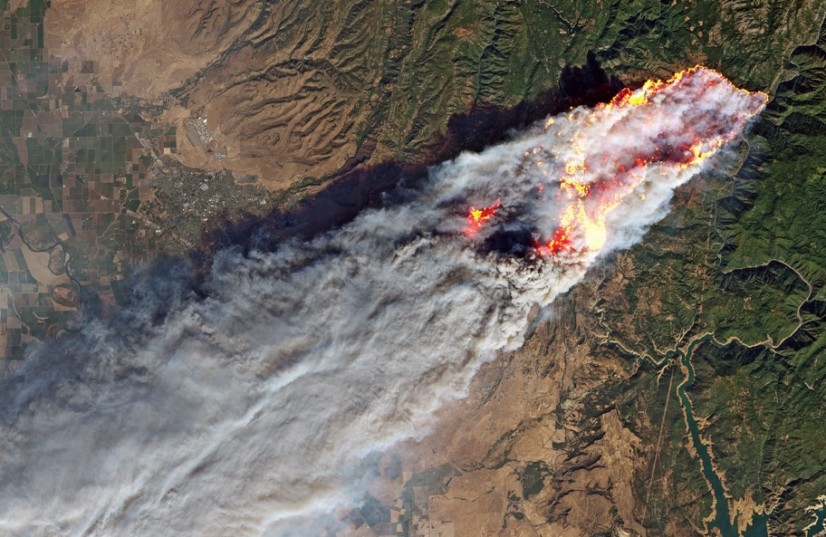
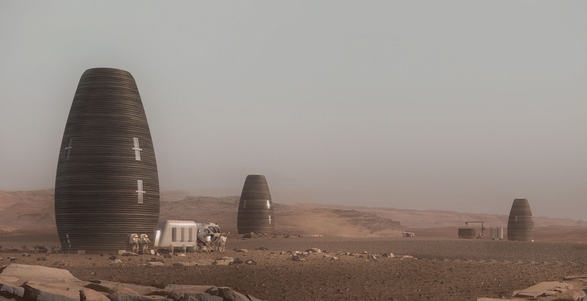

## 2020’s {#welcome-55 .welcome-slide}

<!-- Source: History_of_Fire_Modeling_4.pptx, slide 55. -->

```{=html}
<div class="slide-canvas">
<div class="ppt-text" style="left:17.4167%;top:31.7778%;width:65.6667%;height:19.2977%;padding:6.0px 12.0px 6.0px 12.0px;"><p style="text-align:left;"><span style="font-size:66.67px;">2020’s</span></p><p style="text-align:left;"><span style="font-size:66.67px;">Predicting Flame Spread</span></p></div>
</div>
```

## Large Outdoor Fire Modeling (LOFM) {#welcome-56 .welcome-slide}

<!-- Source: History_of_Fire_Modeling_4.pptx, slide 56. -->

```{=html}
<div class="slide-canvas">
<video class="ppt-media" style="left:0.2612%;top:18.4774%;width:99.4776%;height:74.6082%;" controls playsinline preload="none" poster="figs/image116.png" aria-label="Large Outdoor Fire Modeling (LOFM) figure" src="https://github.com/rmcdermo/Juelich_Summer_School/releases/download/2026/welcome-large-outdoor-fire-modeling.mp4"></video>
<div class="ppt-text" style="left:7.3374%;top:3.1841%;width:85.3252%;height:9.4245%;padding:6.0px 12.0px 6.0px 12.0px;white-space:nowrap;"><p style="text-align:left;"><span style="font-size:60.00px;">Large Outdoor Fire Modeling (LOFM)</span></p></div>
</div>
```

## BlenderFDS {#welcome-57 .welcome-slide}

<!-- Source: History_of_Fire_Modeling_4.pptx, slide 57. -->

```{=html}
<div class="slide-canvas">
<div class="ppt-text" style="left:30.3731%;top:5.5650%;width:55.6716%;height:16.6667%;padding:6.0px 12.0px 6.0px 12.0px;"><p style="text-align:left;"><span style="font-size:30.00px;">BlenderFDS</span><br><span style="font-size:30.00px;">by Emanuele </span><span style="font-size:30.00px;">Gissi</span></p></div>


</div>
```

## FDS at CERN {#welcome-58 .welcome-slide}

<!-- Source: History_of_Fire_Modeling_4.pptx, slide 58. -->

```{=html}
<div class="slide-canvas">
<div class="ppt-text" style="left:5.0000%;top:0.3774%;width:90.0000%;height:7.7866%;padding:6.0px 12.0px 6.0px 12.0px;"><p style="text-align:left;"><span style="font-size:60.00px;">FDS at CERN</span></p></div>


<div class="ppt-text" style="left:66.2345%;top:54.8142%;width:16.1142%;height:8.5269%;padding:6.0px 12.0px 6.0px 12.0px;white-space:nowrap;"><p style="text-align:left;"><span style="font-size:26.67px;color:#FFFF00;">27 km</span></p><p style="text-align:left;"><span style="font-size:26.67px;color:#FFFF00;">circumference</span></p></div>
<div class="ppt-text" style="left:73.0822%;top:5.1682%;width:24.1257%;height:4.9366%;padding:6.0px 12.0px 6.0px 12.0px;white-space:nowrap;"><p style="text-align:left;"><span style="font-size:26.67px;font-weight:700;">electrical cable trays</span></p></div>
<svg class="ppt-shape" style="left:79.5522%;top:9.7209%;width:5.5928%;height:6.6970%;overflow:visible" viewBox="0 0 67.11391076115486 60.272965879265094" aria-hidden="true"><line x1="0" y1="0" x2="67.11391076115486" y2="60.272965879265094" fill="none" stroke="#000000" stroke-width="3.3333333333333335"/></svg>
<div class="ppt-text" style="left:58.4396%;top:17.6016%;width:32.1428%;height:6.7318%;padding:6.0px 12.0px 6.0px 12.0px;white-space:nowrap;"><p style="text-align:left;"><span style="font-size:40.00px;font-weight:700;color:#FFFF00;">Large Hadron Collider</span></p></div>


<div class="ppt-text" style="left:10.1914%;top:93.4045%;width:38.2301%;height:4.9366%;padding:6.0px 12.0px 6.0px 12.0px;"><p style="text-align:left;"><span style="font-size:26.67px;">Map of soot deposition after 10 min</span></p></div>
<div class="ppt-text" style="left:55.1765%;top:89.6442%;width:38.2301%;height:4.9366%;padding:6.0px 12.0px 6.0px 12.0px;"><p style="text-align:left;"><span style="font-size:26.67px;">Courtesy: Oriol Rios, CERN</span></p></div>
</div>
```

## NIST National Fire Research Laboratory {#welcome-59 .welcome-slide}

<!-- Source: History_of_Fire_Modeling_4.pptx, slide 59. -->

```{=html}
<div class="slide-canvas">
<div class="ppt-text" style="left:5.0000%;top:2.4126%;width:90.0000%;height:8.7317%;padding:6.0px 12.0px 6.0px 12.0px;"><p style="text-align:left;"><span style="font-size:53.33px;">NIST National Fire Research Laboratory</span></p></div>
<video class="ppt-media" style="left:0.0000%;top:14.4282%;width:100.0000%;height:75.0000%;" controls playsinline preload="none" poster="figs/image123.png" aria-label="NIST National Fire Research Laboratory figure" src="https://github.com/rmcdermo/Juelich_Summer_School/releases/download/2026/welcome-national-fire-research-laboratory.mp4"></video>
</div>
```

## Fire Structure Modeling at NIST {#welcome-60 .welcome-slide}

<!-- Source: History_of_Fire_Modeling_4.pptx, slide 60. -->

```{=html}
<div class="slide-canvas">
<div class="ppt-text" style="left:5.0000%;top:1.3930%;width:90.0000%;height:8.5269%;padding:6.0px 12.0px 6.0px 12.0px;"><p style="text-align:left;"><span style="font-size:60.00px;">Fire Structure Modeling at NIST</span></p></div>

<div class="ppt-text" style="left:13.3553%;top:43.2786%;width:19.5446%;height:8.5269%;padding:6.0px 12.0px 6.0px 12.0px;white-space:nowrap;"><p style="text-align:left;"><span style="font-size:26.67px;">Chao Zhang</span></p><p style="text-align:left;"><span style="font-size:26.67px;">Wuhan University</span></p></div>

<video class="ppt-media" style="left:45.8157%;top:18.0400%;width:52.2199%;height:77.2834%;" controls playsinline preload="none" poster="figs/image126.png" aria-label="Fire Structure Modeling at NIST figure" src="https://github.com/rmcdermo/Juelich_Summer_School/releases/download/2026/welcome-fire-structure-modeling.mp4"></video>
</div>
```

## High-Performance Computing {#welcome-61 .welcome-slide}

<!-- Source: History_of_Fire_Modeling_4.pptx, slide 61. -->

```{=html}
<div class="slide-canvas">
<div class="ppt-text" style="left:4%;top:2%;width:92%;height:12%;padding:6.0px 12.0px 6.0px 12.0px;"><p style="text-align:left;"><span style="font-size:60.00px;">High-Performance Computing</span></p></div>

<div class="ppt-crop" style="left:0.5260%;top:22.5547%;width:29.0225%;height:35.6463%;transform:rotate(270.0deg);"></div>
<div class="ppt-text" style="left:1.6942%;top:60.1432%;width:26.6150%;height:10.7708%;padding:6.0px 12.0px 6.0px 12.0px;white-space:nowrap;"><p style="text-align:left;"><span style="font-size:23.33px;">Marcos </span><span style="font-size:23.33px;">Vanella</span></p><p style="text-align:left;"><span style="font-size:23.33px;">NIST</span></p><p style="text-align:left;"><span style="font-size:23.33px;">(Fluids, applied math, HPC)</span></p></div>
<div class="ppt-text" style="left:37.0602%;top:60.1432%;width:30.6296%;height:10.7708%;padding:6.0px 12.0px 6.0px 12.0px;white-space:nowrap;"><p style="text-align:left;"><span style="font-size:23.33px;">Eric Mueller</span></p><p style="text-align:left;"><span style="font-size:23.33px;">NIST</span></p><p style="text-align:left;"><span style="font-size:23.33px;">(WUI modeling and experiments)</span></p></div>

<div class="ppt-text" style="left:74.7089%;top:59.7261%;width:20.5789%;height:10.7708%;padding:6.0px 12.0px 6.0px 12.0px;white-space:nowrap;"><p style="text-align:left;"><span style="font-size:23.33px;">Chandan Paul</span></p><p style="text-align:left;"><span style="font-size:23.33px;">GWU PREP Fellow</span></p><p style="text-align:left;"><span style="font-size:23.33px;">(Chemistry, radiation)</span></p></div>
</div>
```

## 50,000 node hours on  {#welcome-62 .welcome-slide}

<!-- Source: History_of_Fire_Modeling_4.pptx, slide 62. -->

```{=html}
<div class="slide-canvas">

<svg class="ppt-shape" style="left:3.2052%;top:74.4611%;width:40.0815%;height:10.3220%;overflow:visible" viewBox="0 0 480.9782152230971 92.8984251968504" aria-hidden="true"><rect width="480.9782152230971" height="92.8984251968504" fill="none" stroke="#000000" stroke-width="1.6666666666666667"/></svg>
<div class="ppt-text" style="left:3.2052%;top:74.4611%;width:40.0815%;height:10.3220%;padding:6.0px 5.9998687664042px 6.0px 5.9998687664042px;"><p style="text-align:left;"><span style="font-size:30.00px;">50,000 node hours on </span><span style="font-size:30.00px;font-weight:700;">Summit</span><span style="font-size:30.00px;"> at Oak Ridge</span></p></div>
<svg class="ppt-shape" style="left:49.5348%;top:74.7776%;width:42.1383%;height:10.3220%;overflow:visible" viewBox="0 0 505.65971128608925 92.8984251968504" aria-hidden="true"><rect width="505.65971128608925" height="92.8984251968504" fill="none" stroke="#000000" stroke-width="1.6666666666666667"/></svg>
<div class="ppt-text" style="left:49.5348%;top:74.7776%;width:42.1383%;height:10.3220%;padding:6.0px 5.9998687664042px 6.0px 5.9998687664042px;"><p style="text-align:left;"><span style="font-size:30.00px;">500,000 node hours on </span><span style="font-size:30.00px;font-weight:700;">Polaris</span><span style="font-size:30.00px;"> at Argonne</span></p></div>

<div class="ppt-text" style="left:8.0851%;top:65.3428%;width:17.4104%;height:2.6976%;padding:5.9998687664042px 5.9998687664042px 5.9998687664042px 5.9998687664042px;white-space:nowrap;"><p style="text-align:left;"><span style="font-size:30.00px;">https://</span><span style="font-size:30.00px;">www.olcf.ornl.gov</span><span style="font-size:30.00px;">/summit/</span></p></div>
<svg class="ppt-shape" style="left:17.0781%;top:89.8311%;width:65.8438%;height:4.9366%;overflow:visible" viewBox="0 0 790.1250656167979 44.42965879265092" aria-hidden="true"><rect width="790.1250656167979" height="44.42965879265092" fill="none" stroke="#000000" stroke-width="1.6666666666666667"/></svg>
<div class="ppt-text" style="left:17.0781%;top:89.8311%;width:65.8438%;height:4.9366%;padding:6.0px 5.9998687664042px 6.0px 5.9998687664042px;"><p style="text-align:left;"><span style="font-size:26.67px;">In collaboration with Barry Schneider from ITL</span></p></div>
<div class="ppt-text" style="left:4%;top:2%;width:92%;height:12%;padding:6.0px 12.0px 6.0px 12.0px;"><p style="text-align:left;"><span style="font-size:60.00px;">Leadership Class Supercomputing</span></p></div>
</div>
```

## Frontera at TACC* {#welcome-63 .welcome-slide}

<!-- Source: History_of_Fire_Modeling_4.pptx, slide 63. -->

```{=html}
<div class="slide-canvas">
<video class="ppt-media" style="left:0.0000%;top:16.6667%;width:100.0000%;height:75.0000%;" controls playsinline preload="none" poster="figs/image132.png" aria-label="Frontera at TACC* figure" src="https://github.com/rmcdermo/Juelich_Summer_School/releases/download/2026/welcome-frontera-fire-simulation.mp4"></video>
<div class="ppt-text" style="left:0.0000%;top:0.0000%;width:100.0000%;height:16.6667%;padding:6.0px 12.0px 6.0px 12.0px;"><p style="text-align:left;"><span style="font-size:60.00px;">Frontera at TACC*</span></p></div>
<div class="ppt-text" style="left:43.8612%;top:93.2682%;width:56.1388%;height:6.7318%;padding:6.0px 12.0px 6.0px 12.0px;white-space:nowrap;"><p style="text-align:left;"><span style="font-size:30.00px;">*Texas Advanced Computing Center</span></p></div>
</div>
```

## Past - Present - Future {#welcome-64 .welcome-slide}

<!-- Source: History_of_Fire_Modeling_4.pptx, slide 64. -->

```{=html}
<div class="slide-canvas">
<div class="ppt-text" style="left:5.0000%;top:0.0000%;width:90.0000%;height:9.3287%;padding:6.0px 12.0px 6.0px 12.0px;"><p style="text-align:left;"><span style="font-size:60.00px;">Past - Present - Future</span></p></div>


<div class="ppt-text" style="left:53.6267%;top:43.2682%;width:38.1979%;height:6.7318%;padding:6.0px 12.0px 6.0px 12.0px;white-space:nowrap;"><p style="text-align:left;"><span style="font-size:20.00px;color:#FFFF00;">Camp Fire, Paradise, CA, Nov 2018</span></p><p style="text-align:left;"><span style="font-size:20.00px;color:#FFFF00;">(Image: NASA Earth Observatory/Aqua/MODIS) </span></p></div>

<div class="ppt-text" style="left:18.8009%;top:54.4526%;width:43.7600%;height:6.7318%;padding:6.0px 12.0px 6.0px 12.0px;white-space:nowrap;"><p style="text-align:left;"><span style="font-size:20.00px;">Welcome to your new home on Mars.</span></p><p style="text-align:left;"><span style="font-size:20.00px;">From The Future of Everything, The Wall Street Journal.</span></p></div>
</div>
```
