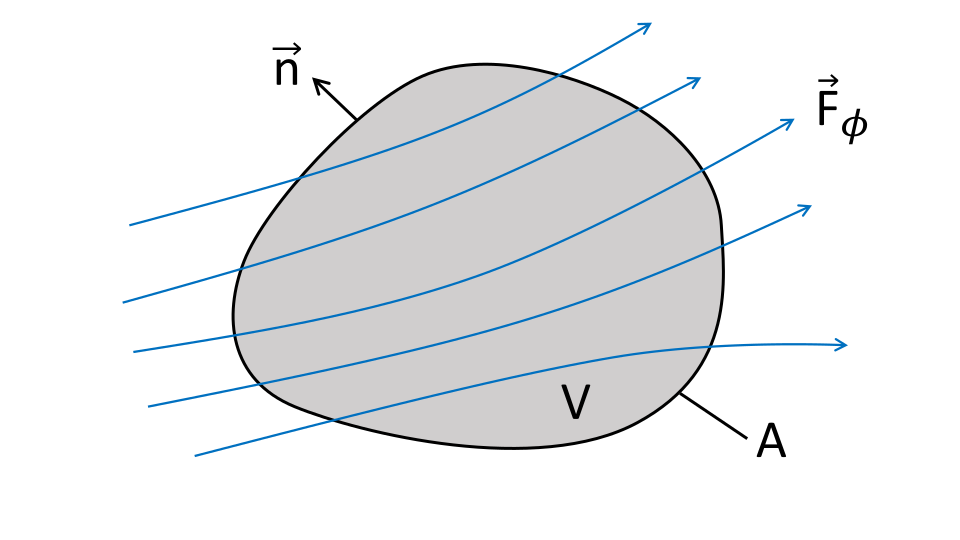
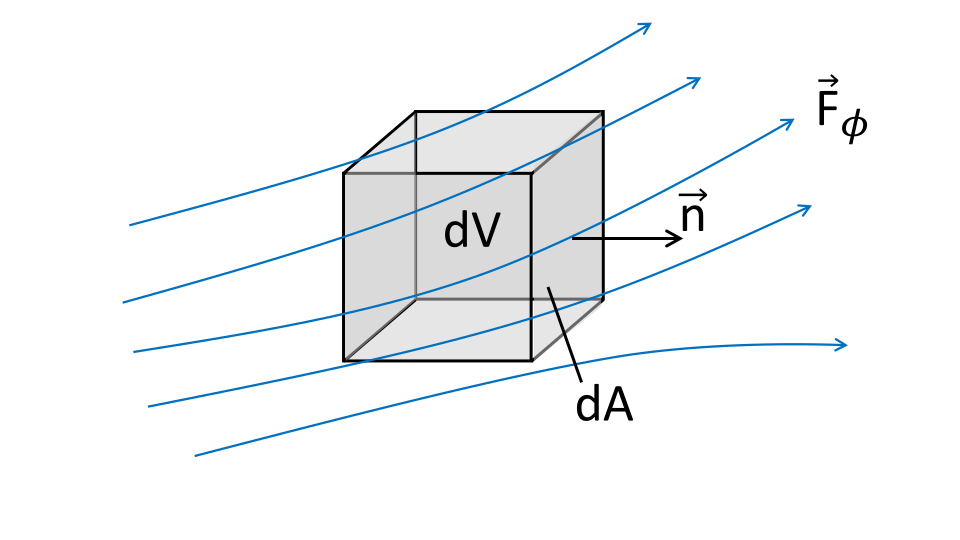
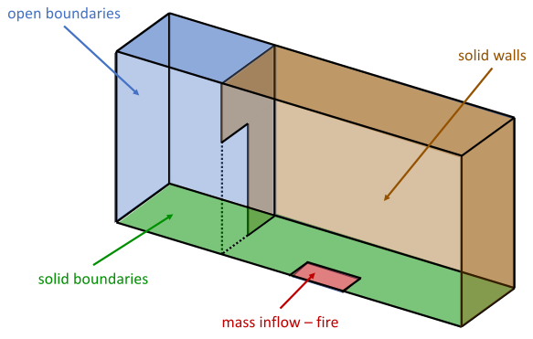

# Fluid Equations

## A word on PDEs

Partial differential equations (PDE) are the fundamental way to mathematically describe a huge range of processes. Many known formulas are special solutions of PDEs.

Examples for other major fields using PDEs:

- Electromagnetism, propagation of light
- Gravity, general relativity
- Quantum mechanics

In general it is not possible to solve PDE analytically and therefore approximation schemes are needed. In case of the Navier-Stokes equations, the schemes are referred to collectively as computational fluid dynamics (CFD).

## Important field operators (I)

The two most common mathematical operators used in fluid dynamics are the partial derivative and the Nabla operator.

The **partial derivative** describes the change of a field in a given space or time direction. The change of a velocity field $\vec{v}(x,y,z,t)$ with respect to the time is:

$$
\frac{\partial \vec{v}(x,y,z,t)}{\partial t} \quad \text{or short}\quad \partial_t \vec{v}(x,y,z,t)
$$

The **Nabla operator** $\nabla$ is used to represent the Laplace, gradient, divergence and rotation operations.

$$
\nabla = \left( \partial_x,  \partial_y,  \partial_z \right)
$$

$$
\operatorname{lap}(\rho) = \nabla^2\rho \qquad \operatorname{grad}(\rho) = \nabla\rho \qquad \operatorname{div}(\vec{v}) = \nabla\cdot\vec{v} \qquad \operatorname{rot}(\vec{v}) = \nabla\times\vec{v}
$$

## Important field operators (II)

The **convective derivative** combines both operators. It represents the total change of a value due to local intrinsic changes and due to advection.

The change in a scalar value $\phi(x,y,z,t)$ may therefore be written as

$$
\frac{d\phi}{dt} = \partial_t \phi + \vec{v}\cdot(\nabla\phi)
$$

The first term ($\partial_t \phi$) represents intrinsic changes and the second one ($\vec{v}\cdot(\nabla\phi)$) describes the changes due to the advection in the velocity field $\vec{v}$.

## Conserved quantities

{width="55%" fig-align="center"}

- change of quantity $\phi$ inside volume only if net surface flux of $\vec{F}_\phi$ not zero
- true for arbitrary volumes

## Conservation equations

:::: {.columns}

::: {.column width="35%"}
{width="100%"}

{width="100%"}
:::

::: {.column width="65%"}
$$
\int_V\partial_t\phi\ dV= -\int_A\vec{F}_\phi\cdot \vec{n}\ dA + \int_V S_\phi\ dV
$$

using Gauss' theorem

$$
\int_V\partial_t\phi\ dV= -\int_V\nabla\cdot \vec{F}_\phi\ dV + \int_V S_\phi\ dV
$$

weak formulation:

$$
\int_V\partial_t\phi + \nabla\cdot \vec{F}_\phi  - S_\phi\ dV = 0
$$

strong formulation:

$$
\partial_t\phi + \nabla\cdot \vec{F}_\phi  - S_\phi = 0
$$
:::

::::

## Conservative fluid equations {.smaller}

The conservation of mass, momentum and energy can be expressed using the following fluxes:

- equation for the density, $\phi=\rho$ and $\vec{F}_\rho = \rho\vec{v}$

$$
\partial_t \rho + \nabla\cdot(\rho\vec{v}) - S_\rho= 0
$$

- equation for the momentum density, $\phi=\rho\vec{v}$ and $\vec{F}_{\rho\vec{v}} = \rho\vec{v}\vec{v} + \vec{I}p$

$$
\partial_t \rho\vec{v} + \nabla\cdot(\rho\vec{v}\vec{v} + \vec{I}p) - \vec{S}_{\rho\vec{v}}= 0
$$

- equation for the energy density, $\phi=\rho e$ and $\vec{F}_{\rho e} = (\rho e + p)\vec{v}$

$$
\partial_t \rho e + \nabla\cdot((\rho e + p)\vec{v}) - S_{\rho e}= 0
$$

**Note:** All fire related phenomena and processes are represented as source terms $S$ in the above equations.

## Boundary conditions (I)

The solution of PDE depends on initial and boundary conditions. In the case of elliptic equations, only boundary conditions are needed.

Two main kinds of fundamental boundary conditions are:

- Dirichlet: The solution at the boundary $\partial\Omega$ is prescribed or fixed in time, e.g.:

$$
\phi(x, t) = \phi_0(x) \quad \text{at} \quad x=\partial\Omega
$$

- Neumann: The derivative in the boundary normal direction is prescribed or constant in time:

$$
\partial_n \phi(x, t) = f(x) \quad \text{at} \quad x=\partial\Omega
$$

- symmetric: derivatives are adapted to preserve a prescribed symmetry
- periodic: values at the facing boundaries are kept equal

## Boundary conditions (II)

Some explicit examples for boundary conditions used commonly in fluid dynamics:

- no-slip at solid wall

$$
u = v = w = 0 \quad \text{at the boundary}
$$

- gas inlet

$$
u = u_0\quad v=w=0 \quad \text{at the inflow boundary}
$$

- gas outflow

$$
\partial_n u = \partial_n v = \partial_n w = 0\quad \text{at the outflow boundary}
$$

## Boundary conditions (III)

- constant wall temperature

$$
T = T_w
$$

- wall with changing temperature, but fixed wall heat flux

$$
q_w = k \partial_n T\quad \text{at the boundary}
$$

- adiabatic

$$
k\partial_n T = 0 \quad \text{at the boundary}
$$

## Boundary conditions -- compartment fire

{height="550" fig-align="center"}
