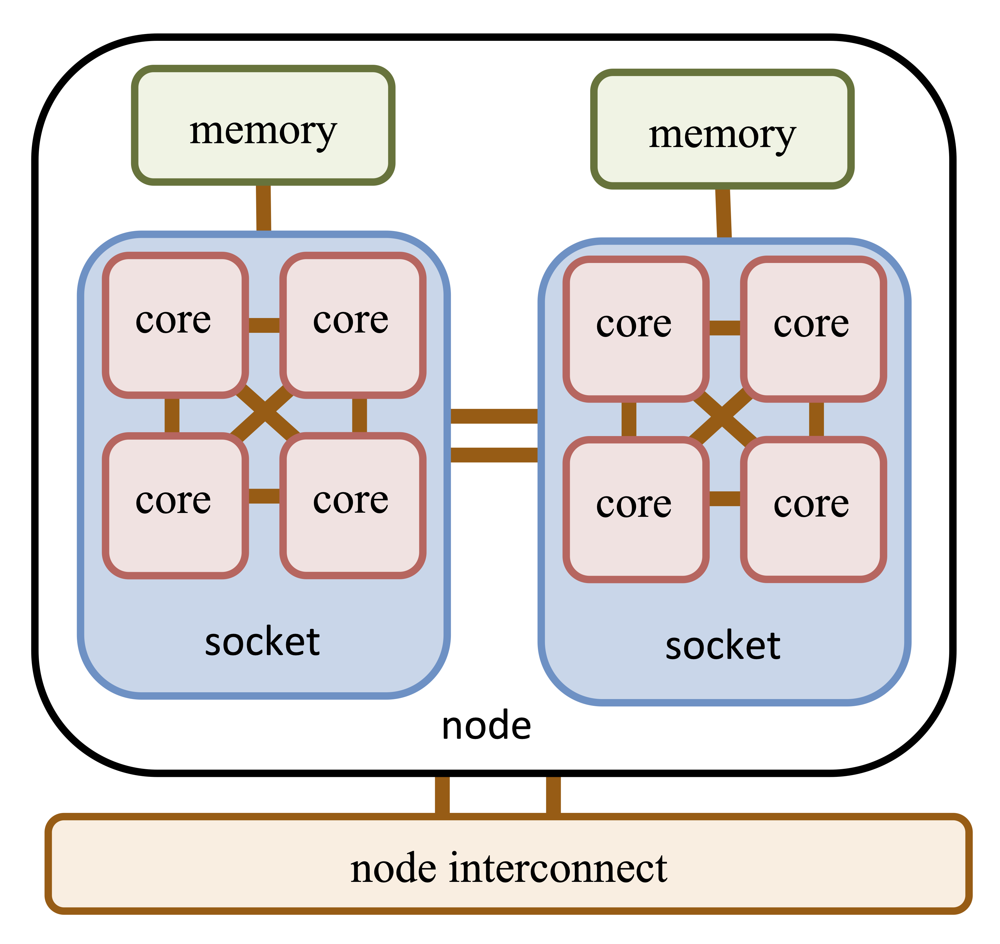
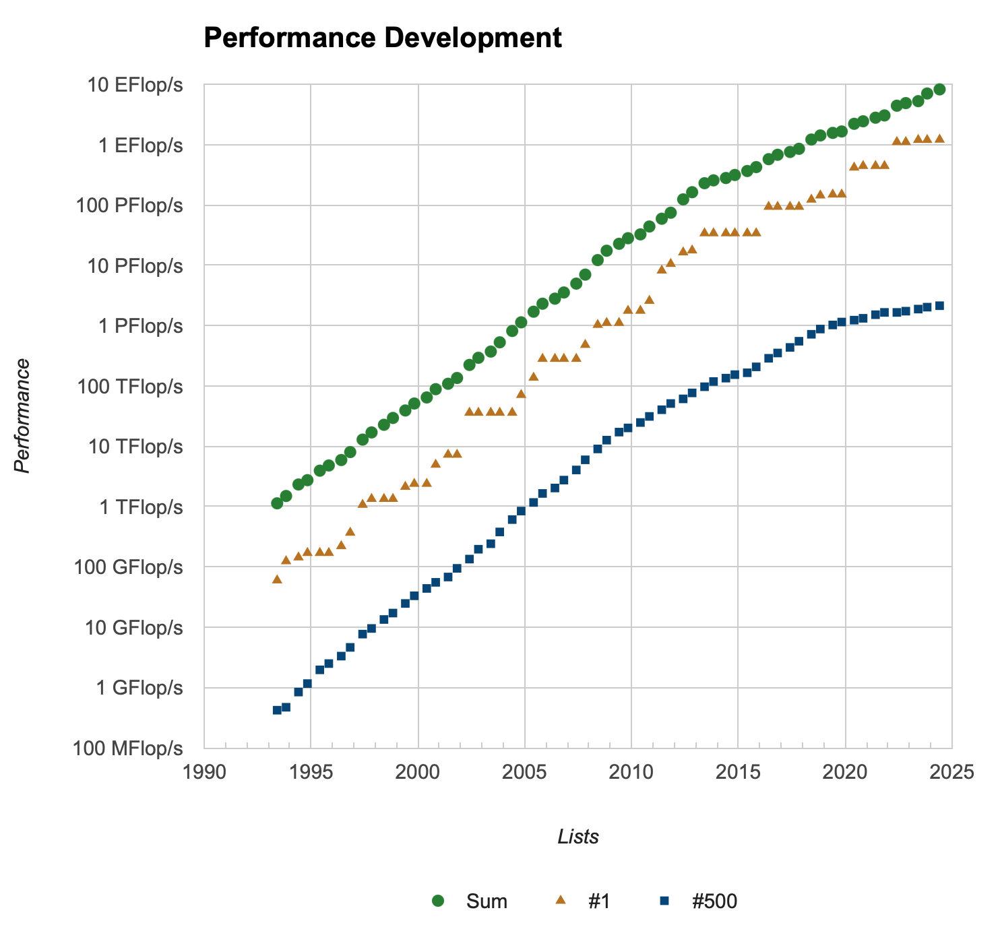
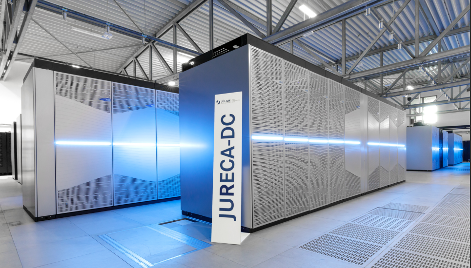

# Hardware

## Motivation

Many scientific and engineering problems require a large amount of computing time and / or memory. This is generally only available on supercomputers / high performance computing (HPC) systems.
Typical applications are:

- science: particle physics, climate research, molecular dynamics 
- engineering: CFD, structural mechanics, computer science

HPC with computing power thousands times larger than personal computer allows to significantly reduce computing time and allows to solve new challenges.

**Example**: An CFD application run for a week on thousand processors would need 20 years on a personal computer (assuming it provides enough memory).

## Terminology

:::: {.columns}

::: {.column width="50%"}
{fig-align="center" height=400}
:::

::: {.column width="50%"}
- **compute node**: nodes that are used only for computation, no direct user access
- **front/login node**: users login here, do compilation and job submission
- **batch/submission system**: system to allocate resources to a scheduled job
- **interconnect**: network between components or computing nodes (e.g. Infiniband, 10GE)
:::

::::

## Transistor Evolution - Moore's Law

{fig-align="center" height=500}

Source: Max Roser, Hannah Ritchie, via Wikimedia Commons

## Performance Evolution - Top 500 List

{fig-align="center" height=500}

Source: <https://top500.org>

## JURECA

{fig-align="center" height=500}

## JURECA Hardware

:::: {.columns}

::: {.column width="50%"}
- **480 standard compute nodes**
  - 2x AMD EPYC 7742, 2x 64 cores
  - 512 (16x 32) GB DDR4, 3200 MHz
- **96 large-memory compute nodes**
  - 2x AMD EPYC 7742, 2x 64 cores
  - 1024 (16x 64) GB DDR4, 3200 MHz
- **192 accelerated compute nodes**
  - 2x AMD EPYC 7742, 2x 64 cores
  - 512 (16x 32) GB DDR4, 3200 MHz
  - 4x NVIDIA A100 GPU, 4x 40 GB HBM2e

:::

::: {.column width="50%"}

- **12 login nodes**
  - 2x AMD EPYC 7742, 2x 64 cores
  - 1024 (16x 64) GB DDR4, 3200 MHz
  - 2× NVIDIA Quadro RTX8000
  - InfiniBand HDR100 (NVIDIA Mellanox Connect-X6)
  - 100 Gigabit Ethernet external connection
- **3.54 (CPU) + 14.98 (GPU) Petaflops**
- **98,304 CPU cores, 768 GPUs**
- **Mellanox InfiniBand HDR (HDR100/HDR) DragonFly+ network**
:::

::::
