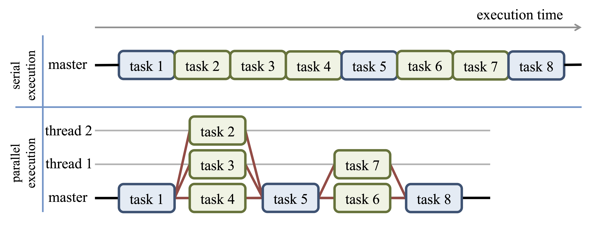
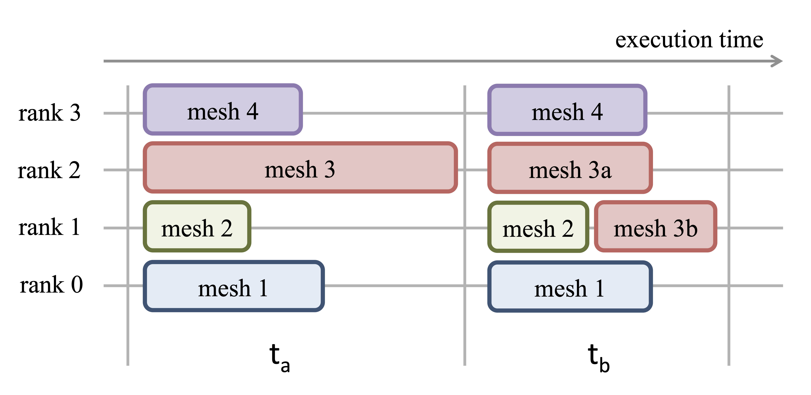
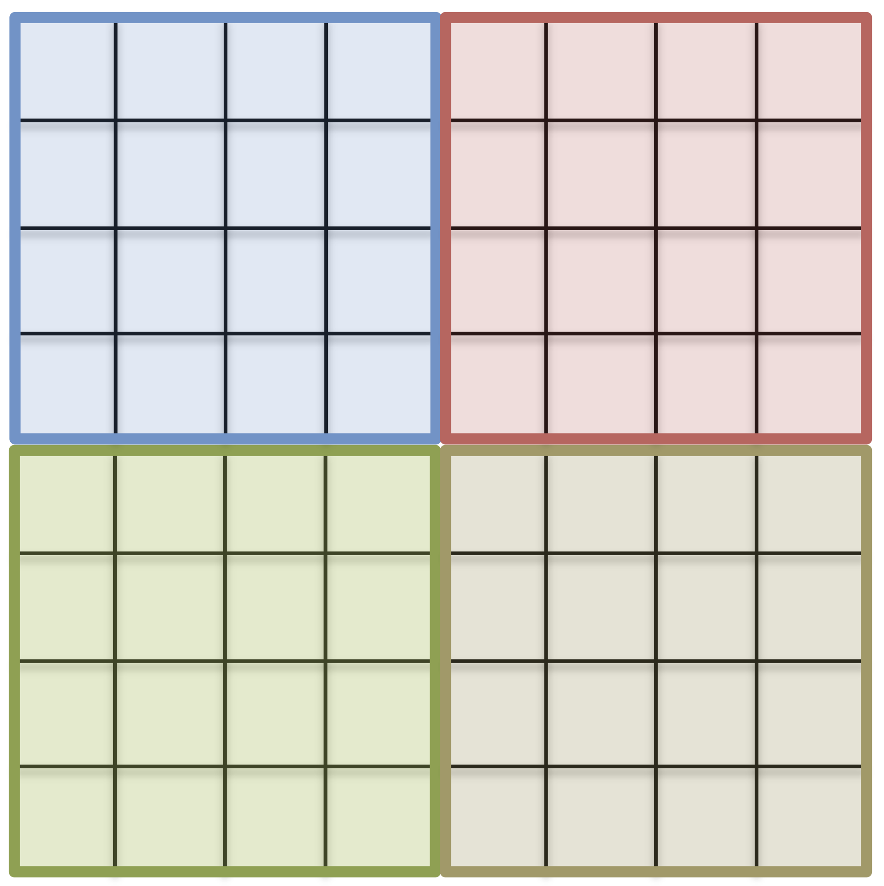
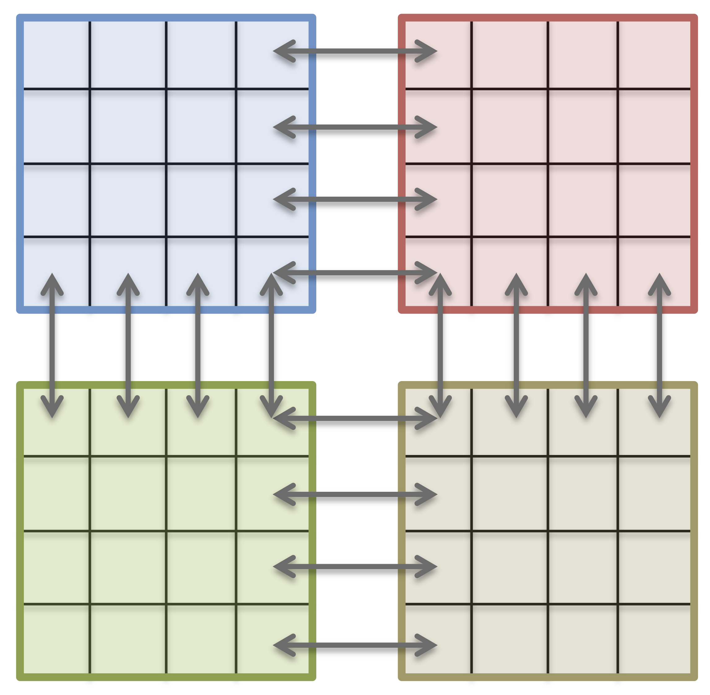
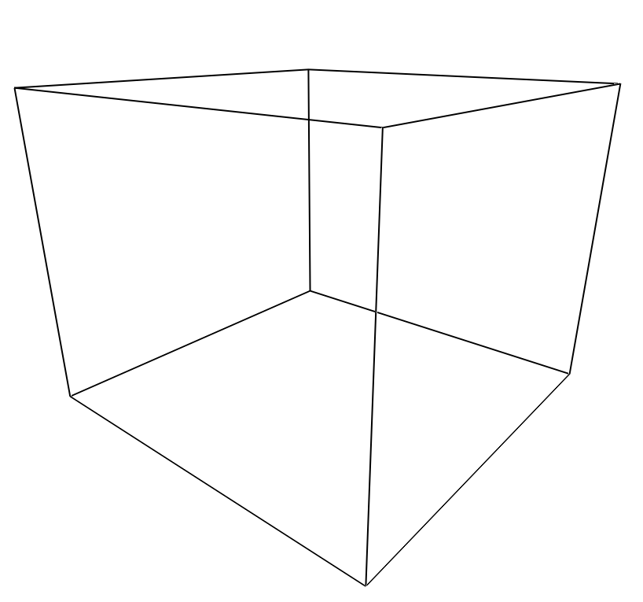
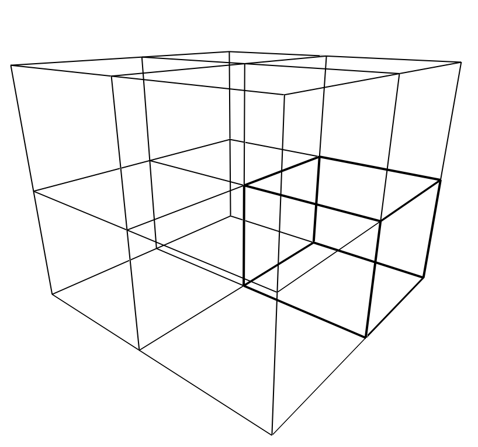

# Parallel Execution of FDS

## General Idea of Parallelisation

{fig-align="center"}

## Load Balancing

{fig-align="center"}

## Shared- vs. Distributed-Memory

:::: {.columns}

::: {.column width="50%"}

{fig-align="center" height=250}

- all cores have full data access
- no node-interconnect is needed / possible
- in FDS: 
  - a mesh is shared among the cores
  - OpenMP

:::

::: {.column width="50%"}

{fig-align="center" height=250}

- each core accesses a subset of data
- node-interconnect is possible
- in FDS: 
  - a mesh is assigned a core / MPI process
  - MPI

:::

::::

## Domain Decomposition

:::: {.columns}

::: {.column width="50%"}
{fig-align="center" height=350}

- single mesh
:::

::: {.column width="50%"}
{fig-align="center" height=350}

- eight meshes
- each mesh has the same size 
:::

::::

## Domain Decomposition in FDS

In FDS, the domain decomposition is in general done by hand. Thus, e.g., a large global mesh is split into multiple smaller meshes.

```
&MESH IJK=50,50,40, XB=0.0,5.0, 0.0,5.0, 0.0,4.0 /
```

- either with an explicit decomposition

```
&MESH IJK=25,25,20, XB=0.0,2.5, 0.0,2.5, 0.0,2.0 /
&MESH IJK=25,25,20, XB=0.0,2.5, 0.0,2.5, 2.0,4.0 /

&MESH IJK=25,25,20, XB=2.5,5.0, 0.0,2.5, 0.0,2.0 /
&MESH IJK=25,25,20, XB=2.5,5.0, 0.0,2.5, 2.0,4.0 /

&MESH IJK=25,25,20, XB=0.0,2.5, 2.5,5.0, 0.0,2.0 /
&MESH IJK=25,25,20, XB=0.0,2.5, 2.5,5.0, 2.0,4.0 /

&MESH IJK=25,25,20, XB=2.5,5.0, 2.5,5.0, 0.0,2.0 /
&MESH IJK=25,25,20, XB=2.5,5.0, 2.5,5.0, 2.0,4.0 /
```

- or with the `MULT` keyword
```
&MESH IJK=25,25,20, XB=0.0,2.5, 0.0,2.5, 0.0,2.0, MULT_ID='mesh' /
&MULT ID='mesh', DX=2.5, DY=2.5, DZ=2.0, I_UPPER=1, J_UPPER=1, K_UPPER=1 /
```

## Example 1 - Multi-Mesh

- Consider the following mesh, see [01_single_mesh.fds](./exercises_hpc/01_multi_mesh/01_single_mesh.fds):
```
&MESH IJK=64,64,32, XB=0.0,8.0, 0.0,8.0, 0.0,4.0 /
```

- Decompose it manually into four meshes.

- Decompose it with the `MULT` keyword into 32 meshes.
  - `DX`, `DY`, `DZ`: spacial shift of the sub-mesh
  - `I_UPPER`, ...: number of sub-mesh repetitions

- Check the result with SmokeView.
