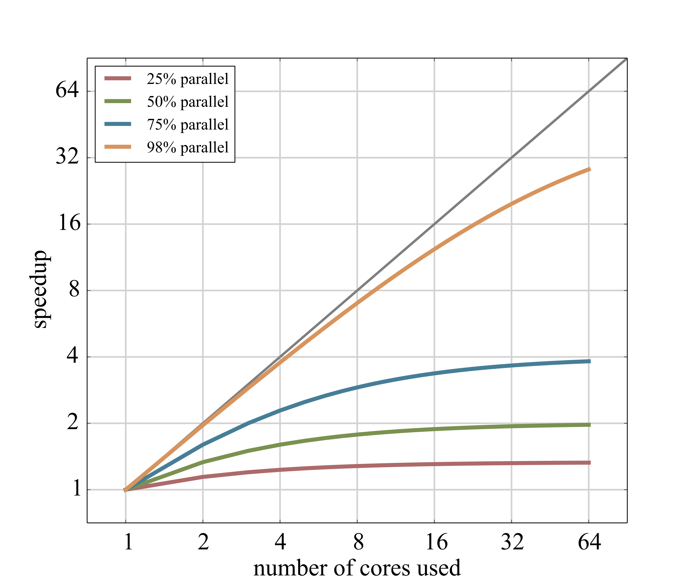
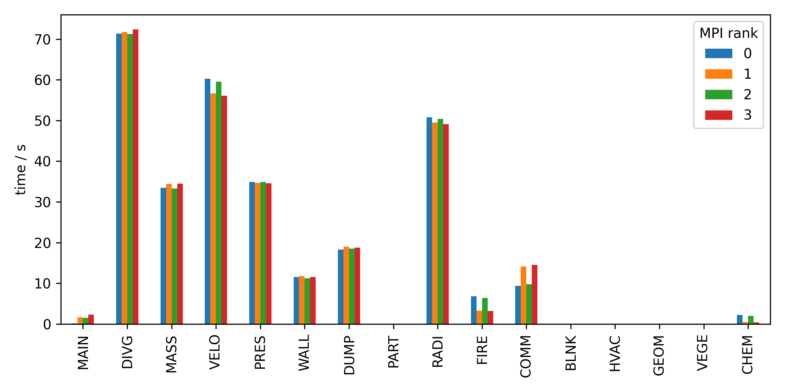
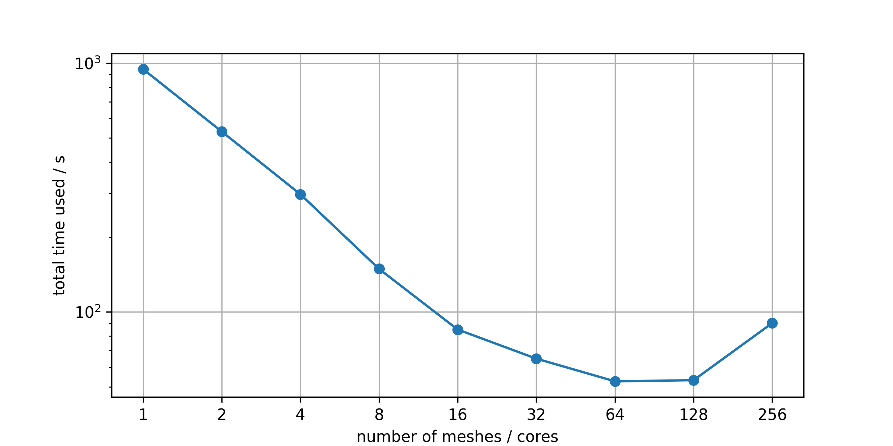
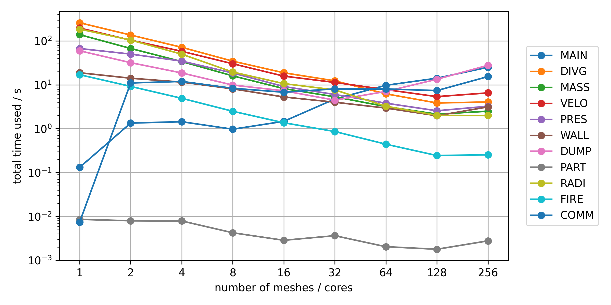
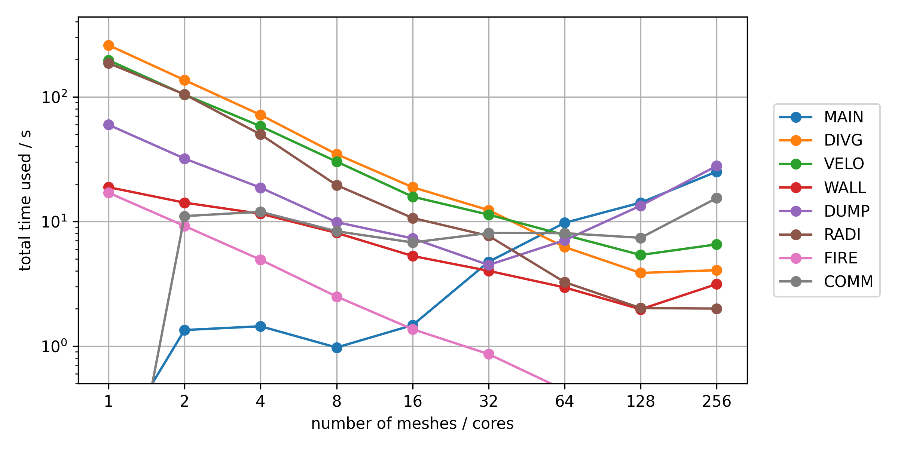
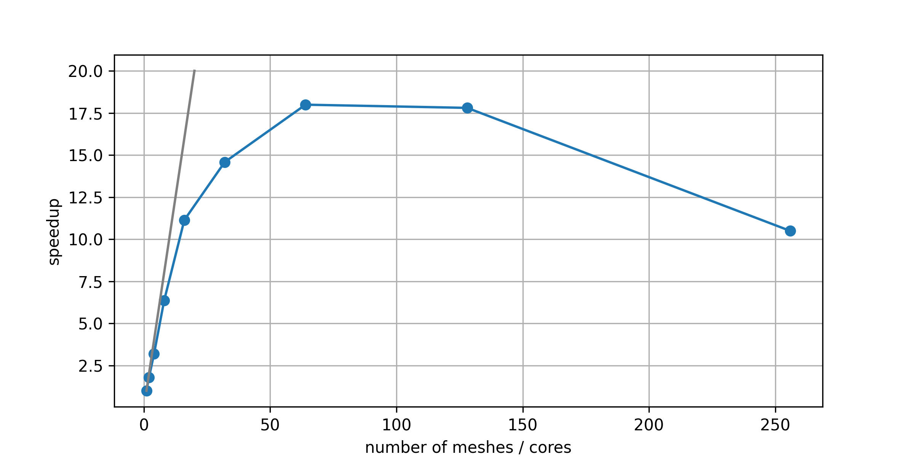

# Scaling

## Strong Scaling - Amdahl's Law

{fig-align="center" height=500}

## Example 4 -- Timing

- Look into the run folder of example 3 for a file `*_cpu.csv`.
- This file contains the execution time for different parts of FDS, as reported by each MPI process.
- Visualise the timing.

## Example 4 -- Result

{fig-align="center" height=500}

## Example 5 -- Benchmark

- Use the FDS input file [05_pool_scaling.fds](./exercises_hpc/05_benchmark/05_pool_scaling.fds).
- Create new input files with different numbers of meshes (e.g. 1, 2, 4).
- Run these cases and plot the runtime.

- *Optional*: Plot the data of the benchmark with 1 up to 256 cores in [05_benchmark.zip](./exercises_hpc/05_benchmark/05_benchmark.zip)
- *Optional*: Have a look at the automated benchmark setup [05_automate](./exercises_hpc/05_benchmark/05_automate).

## Benchmark Results -- Time

## Benchmark Results -- Time

## Benchmark Results -- Time

## Benchmark Results -- Speedup

