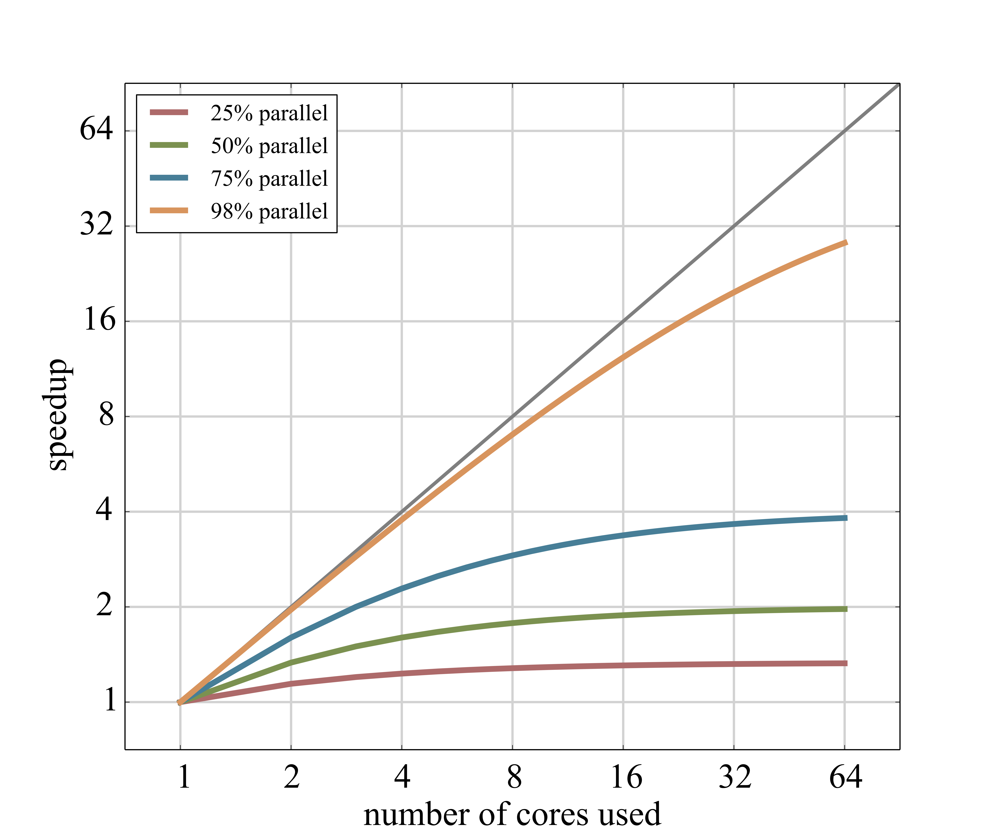
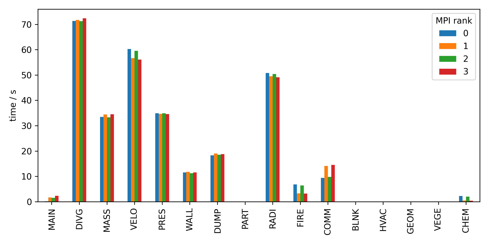
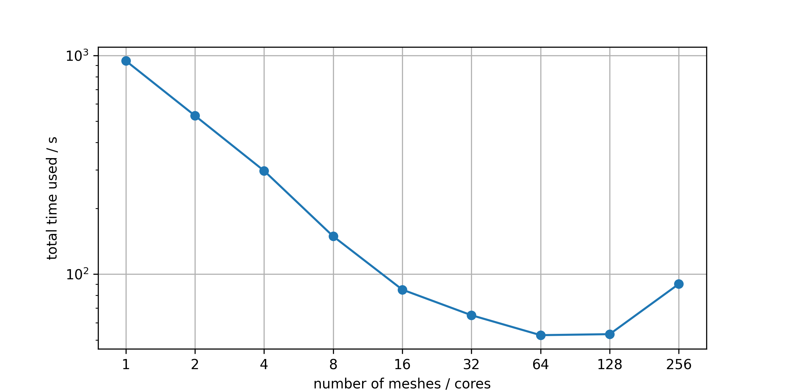
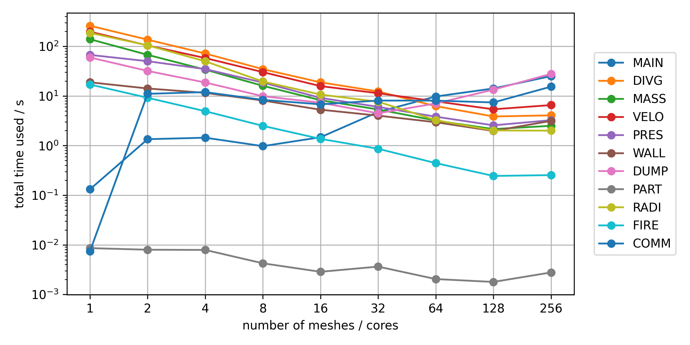
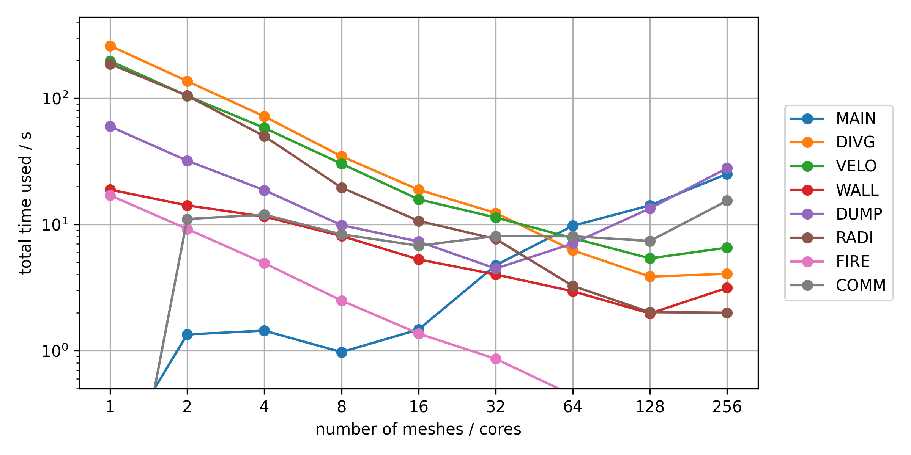
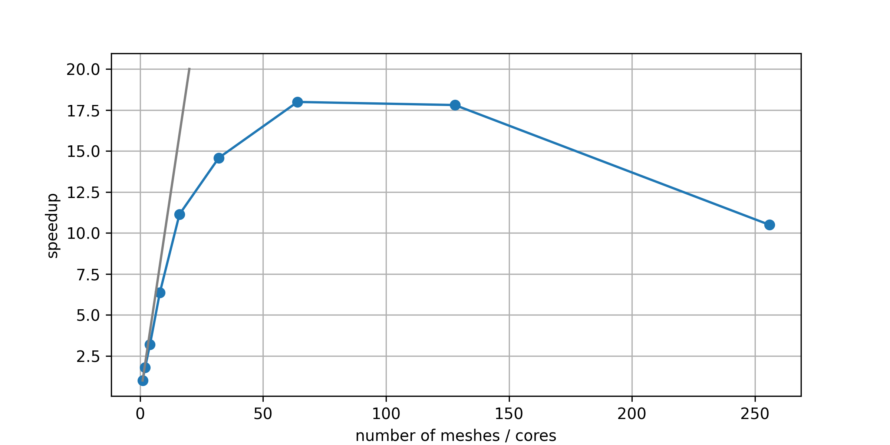
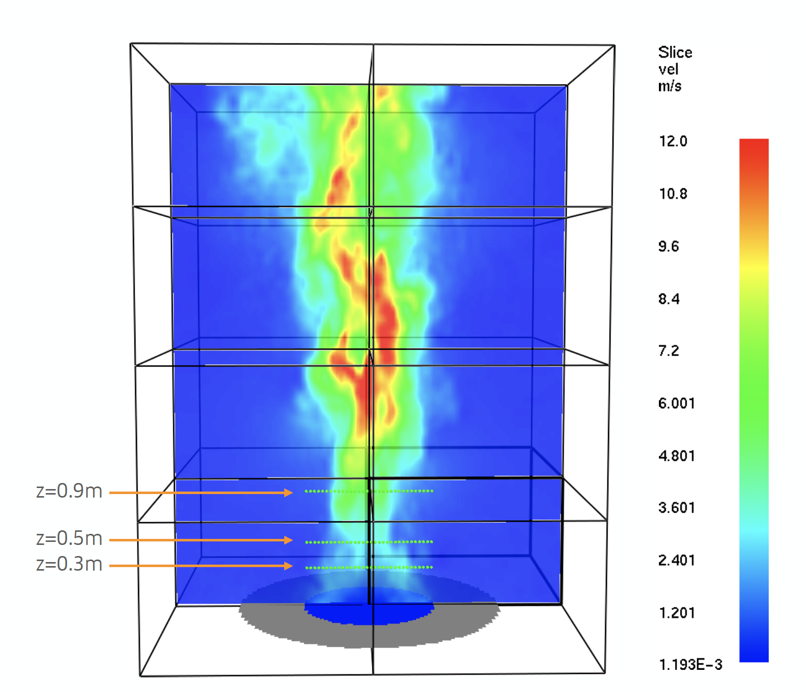

# Scaling

## Strong Scaling - Amdahl's Law

{fig-align="center" height=500}

## Example 4 -- Timing

- Look into the run folder of example 3 for a file `*_cpu.csv`.
- This file contains the execution time for different parts of FDS, as reported by each MPI process.
- Visualise the timing.

## Example 4 -- Result

{fig-align="center" height=500}

## Example 5 -- Benchmark

- Use the FDS input file [05_pool_scaling.fds](./exercises_hpc/05_benchmark/05_pool_scaling.fds).
- Create new input files with different numbers of meshes (e.g. 1, 2, 4).
- Run these cases and plot the runtime.

- *Optional*: Plot the data of the benchmark with 1 up to 256 cores in [05_benchmark.zip](./exercises_hpc/05_benchmark/05_benchmark.zip)
- *Optional*: Have a look at the automated benchmark setup [05_automate](./exercises_hpc/05_benchmark/05_automate.zip).

## Benchmark Results -- Time

## Benchmark Results -- Time

## Benchmark Results -- Time

## Benchmark Results -- Speedup

## Pressure Lecture, Example 4 -- A Cluster Run

:::: {.columns}
::: {.column width="56%"}
- Methane pool fire: 16 meshes of 48×48×32 cells (3 cm), 1.18 million cells, 20 s.
- Input file: [04_Pressure/Cases/example_4/reference/Example_4_FFT.fds](../04_Pressure/Cases/example_4/reference/Example_4_FFT.fds)
- Job file used on the NIST cluster: [04_Pressure/Cases/example_4/reference/Example_4_FFT.sbatch](../04_Pressure/Cases/example_4/reference/Example_4_FFT.sbatch)
- Adapt it to JURECA, as on the *SLURM Job Files* slide:
    - add `--account=training2646`, use `--partition=dc-cpu`
    - `module use`/`module load` instead of `source .../FDS6VARS.sh`
    - `srun fds` instead of `mpirun -n 16 fds`
    - your run directory instead of `YOUR_PATH_TO_EXAMPLE_4`
- Keep `--ntasks=16`, one MPI process per mesh. The reference run took about 2 h.
:::
::: {.column width="44%"}

:::
::::
