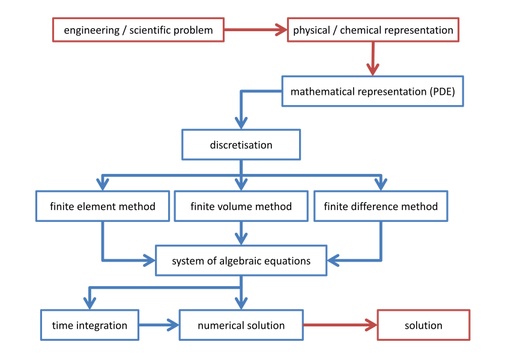
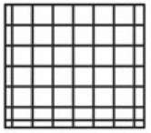
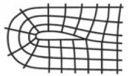
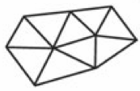
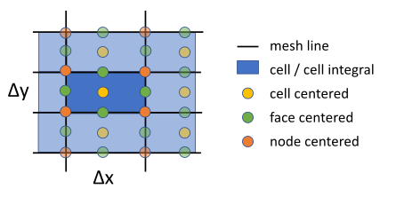
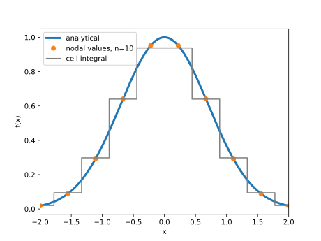
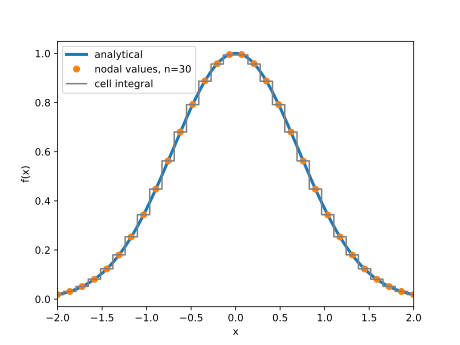
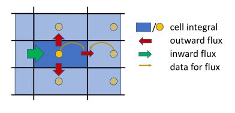
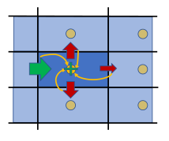

# Computational Fluid Dynamics

## Goals and contents

The goals of this lecture are to teach you the basics of:

- Numerical solution of partial differential equations, especially the Navier-Stokes equations, i.e. computational fluid dynamics (CFD)
- Discretisation techniques in space and time, especially the finite difference method, which is used by FDS
- Numerical schemes to solve the scalar transport equations

During the session, we will run a few Python scripts. The aim of those is to:

- 'Play' with parameters and methods -- no programming skills are required
- Give you a starting point for further activities after the summer school

## Optional tasks

The exercises contain optional tasks:

- If the default tasks are trivial for you, give it a try, or
- Address them during the week or after the school

In any case, just contact me if you need to discuss them.

# Solution Approaches

## Modelling approach

{width="80%" fig-align="center"}

## Discretization methods {.smaller}

| Method | **Pros** | **Cons** |
|:-------|:-----------|:-----------|
| {width="90"} Finite difference | Fast evaluation Easy High order | Simple geometry No local mesh refinement |
| {width="90"} Finite volume | Conservative Easy Complex geometry Local mesh refinement | Low order Slow evaluation |
| {width="90"} Finite element | (Conservative) Complex geometry Local mesh refinement High order | Slow evaluation Complex scheme |

## Nodes and cells {.nostretch}

{width="60%" fig-align="center"}

- Subscripts for positioning: $\phi_i = \phi(i\cdot \Delta x)$
- Mesh spacing $\Delta x$, $\Delta y$ and $\Delta z$ may be inhomogeneous
- If the mesh lines are orthogonal, the mesh is called Cartesian (like in FDS)
- All above degrees of freedom (dof) may be used for discretization, i.e. numerical approximation

## Example 1 -- Discretization

**Input file**: [01_discretize_function.py](./exercises/01_discretize_function.py)

**Goal**: Visualize the discretization of a given analytical 1D function.

**Tasks**:

1. Execute the Python script and observe the discretization of the function
   $$
   f(x) = e^{-x^2} \quad \text{with} \quad x \in [-2, 2]
   $$
1. Change the number of discretization points `n` for finer / coarser discretization.

**Optional**:

3. Can you spot differences in the nodal vs. cell integral discretizations? Where and why do they occur?
4. Change the analytical function.

## Example 1 -- Discretization (results)

{width="90%" fig-align="center"}

## Example 1 -- Discretization (results)

{width="90%" fig-align="center"}

# Finite Volume Method

## Basic idea {.nostretch}

In the finite volume method (FVM) the cell integrals are considered. All value changes are due to cell boundary fluxes, therefore this is a natural way to describe conserved properties. Here, the fluxes for neighboring cells are equal, i.e. nothing gets lost; except at computational domain boundaries and with volumetric sources.

{width="55%" fig-align="center"}

The total domain integral change is given by the flux through the computational domain boundaries (plus sources).

## Weak formulation

The method is based on the weak formulation of hyperbolic PDEs:

$$
\text{strong formulation} \quad \phi_t + \nabla \cdot F(\phi) = 0
$$

$$
\text{weak formulation} \quad \int_V\left( \phi_t + \nabla \cdot F(\phi) \right) \ dV = 0
$$

Note: In general there is a weight function in the weak formulation. If the function is chosen to be the identity, the FVM arises, otherwise the finite element method (FEM) is formulated.

## Example hyperbolic PDE

We will demonstrate the FVM on the following hyperbolic PDE:

$$
\partial_t a + \nabla\cdot\vec{f}(a) = 0 \quad\quad \left(\text{e.g. continuity equation with}\ a = \rho,\ \vec{f} = \rho\vec{v}\right)
$$

The integral form is

$$
\int_V\partial_t a + \nabla\cdot\vec{f}\ dV = \int_V\partial_t a\ dV + \int_V\nabla\cdot\vec{f}\ dV = 0
$$

The discretisation is accomplished by dividing the computational domain $V$ into non-overlapping subvolumes $V_i$. The same equations are true for the subdomains:

$$
\int_{V_i}\partial_t a\ dV_i + \int_{V_i}\nabla\cdot \vec{f}\ dV_i = 0
$$

## Gauss theorem

Gauss's theorem states, that the integral of the divergence of any vector field $\vec{u}$ in the volume $V$ is equal to the boundary integral of the vector field on the volume's surface $S$:

$$
\int_V \nabla \cdot\vec{u} \ dV = \int_S \vec{u}\cdot \vec{n} \ dS
$$

With $\vec{n}$ being the normal on the bounding surface $S$.

## Boundary fluxes

Using Gauss's theorem the model equation for the cell integrals $a_i$ becomes

$$
\partial_t a_i + \int_{S_i} \vec{f}\cdot\vec{n}\ dS_i = 0 \quad \rightarrow \quad \partial_t a_i + \sum_j f_kn_k
$$

:::: {.columns}

::: {.column width="50%"}
This results in the summation of cell face values:

- The flux is a function of the solution variables, which are only integrals, approximation needed
- Determine fluxes for each cell, e.g. by averaging neighbour values
- Compute the sum of fluxes for each cell
:::

::: {.column width="50%"}
{width="90%" fig-align="center"}
:::

::::

## Conservative Navier-Stokes equations

Conservative representation of the compressible Navier-Stokes equations:

$$
\partial_t \vec{s}_i + \int_{S_i} \mathbf{F}\cdot\vec{n}\ dS_i = 0
$$

with

$$
\vec{s} = \left(\begin{array}{c}\rho \\ \rho v_x \\ \rho v_y \\ \rho v_z \\ \rho E \end{array}\right)\quad \text{and} \quad \mathbf{F} = \left(\begin{array}{c}\rho\vec{v} \\ \rho\vec{v}v_x - p\vec{e}_x \\ \rho\vec{v}v_y - p\vec{e}_y \\ \rho\vec{v}v_z - p\vec{e}_z \\ \rho\vec{v}E + \rho\vec{v} p - \mu \vec{v}\nabla\vec{v} - k\nabla T  \end{array}\right)
$$

plus the elliptic pressure equation.

## Conclusions

- Various types of PDEs with different challenges
- To be numerically solved, PDEs must be formulated as approximating algebraic equations, via discretization
- There exist different discretization approaches: e.g. FDM, FVM, FEM
