# Finite Difference Method

## Basic idea {.nostretch}

As derivatives are the major aspect of differential equations, a numerical approximation of those is needed.

The basic idea in the finite difference method (FDM) is to evaluate a function at certain locations and approximate its derivatives with this data.

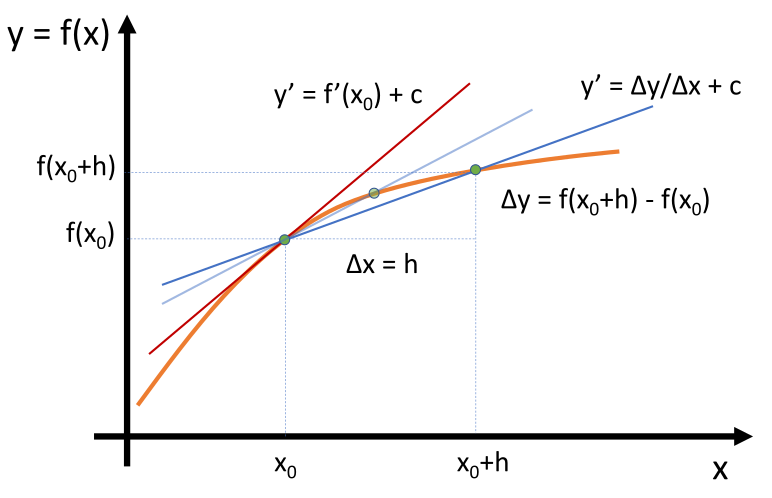{width="55%" fig-align="center"}

## Taylor expansion {.smaller}

The Taylor expansion may approximate any $C^\infty$ function at an expansion point $x_0$. The approximation is given in terms of $h$, being the vicinity around $x_0$.

$$
\begin{aligned}
f(x_0 + h) &= \sum_{i=0}^{\infty}\frac{1}{i!}f^{(i)}(x_0)\cdot h^i \\ &= f(x_0) + f'(x_0)\cdot h + \frac{1}{2} f''(x_0)\cdot h^2 + \frac{1}{6}f'''(x_0)\cdot h^3 + \cdots
\end{aligned}
$$

In practice, the expansion is aborted at a given order. The expansion up to order three $\mathcal{O}(h^3)$ takes following form

$$
f(x_0 + h) = f(x_0) + f'(x_0)\cdot h + \frac{1}{2} f''(x_0)\cdot h^2 + \mathcal{O}(h^3)
$$

Notes:

- This approximation converges to the given function in the limit $h\rightarrow 0$.
- The rate at which the approximation converges in the above limit is called the method's order.

## First derivative

To approximate the first derivative of a function $f(x)$ at $x=x_0$ the Taylor expansion may be used:

$$
f(x_0 + h) = f(x_0) + f'(x_0)h + \mathcal{O}(h^2)
$$

This results in the first order approximation scheme.

$$
f'(x_0) = \frac{f(x_0 + h) - f(x_0)}{h} + \mathcal{O}(h)
$$

Here, the exact value of the derivative is found with $h \rightarrow 0$.

# Numerical Derivatives

## First derivative {.smaller}

In the case of a discrete function, with $h=\Delta x$, the derivative is approximated by

$$
f'(x_i) = \frac{f(x_{i+1}) - f(x_i)}{\Delta x} + \mathcal{O}(\Delta x)
$$

The above formula is called forward difference, while the backward scheme is of equal quality

$$
f'(x_i) = \frac{f(x_{i}) - f(x_{i-1})}{\Delta x} + \mathcal{O}(\Delta x)
$$

Non-symmetric schemes can be used at domain boundaries, where there exist no neighboring data in the boundary's direction.

The combination of the Taylor expansion at more points leads to higher order approximations, like the second order central difference scheme

$$
f'(x_i) = \frac{f(x_{i+1}) - f(x_{i-1})}{2\Delta x} + \mathcal{O}(\Delta x^2)
$$

## First derivative -- schematic

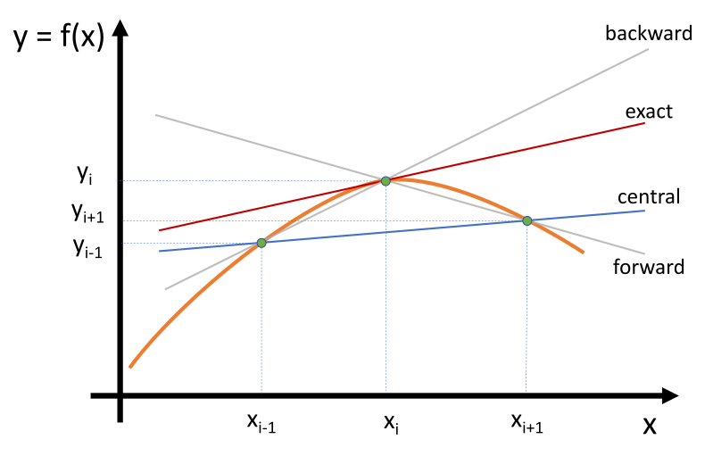{width="90%" fig-align="center"}

## Second derivative

The same way as higher order schemes can be constructed, approximation schemes for higher derivatives can be formulated, like:

- Central scheme for second derivative

$$
f''(x_i) = \frac{f(x_{i-1}) - 2f(x_i) + f(x_{i+1})}{\Delta x^2} + \mathcal{O}(\Delta x^2)
$$

- Forward scheme for second derivative

$$
f''(x_i) = \frac{2f(x_{i}) - 5f(x_{i+1}) + 4f(x_{i+2}) - f(x_{i+3})}{\Delta x^2} + \mathcal{O}(\Delta x)
$$

Note: $\Delta x^2 = \left(\Delta x\right)^2$

## Error metrics {.smaller}

There exists a wide range of metrics to evaluate the difference of data sets or functions. Two major ones are the $L1$ and $L2$ norms. Given two sets $a$ and $b$ with $n$ data points, like in a discrete function, they are defined as

$$
\epsilon_i = a_i - b_i
$$

$$
L1: \quad \|\epsilon\|_1 = \sum_{i=1}^n |\epsilon_i| \quad \text{and} \quad L2: \quad \|\epsilon\|_2 = \sqrt{\sum_{i=1}^n \epsilon_i^2}
$$

Based on those, the error metrics are formulated:

- Mean absolute error (MAE)

$$
\epsilon_{MAE} = \frac{1}{n} \|\epsilon\|_1 = \frac{1}{n}\sum_{i=1}^n |\epsilon_i|
$$

- Root mean square error (RMSE)

$$
\epsilon_{RMSE} = \frac{1}{\sqrt{n}} \|\epsilon\|_2 =  \sqrt{\frac{1}{n}\sum_{i=1}^n \epsilon_i^2}
$$

## Example 2 -- Numerical derivative

**Input file**: [02_numerical_derivative.py](./exercises/02_numerical_derivative.py)

**Goal**: Compute and visualize the numerical approximation of the derivative of a given 1D function.

**Tasks**:

1. Execute the Python script to compute the numerical derivative of
   $$
   f(x) = e^{-x^2} \quad \text{with} \quad x \in [-2, 2]
   $$
1. Change the number of discretization points `n` to refine or coarsen the discretization. Note the change in the RMSE. Can you observe a pattern in the change of the RMSE?

**Optional**:

3. Which numerical scheme is implemented? How are the boundary values computed?
4. Add the computation and analysis of the second derivative.

## Example 2 -- Numerical derivative -- results

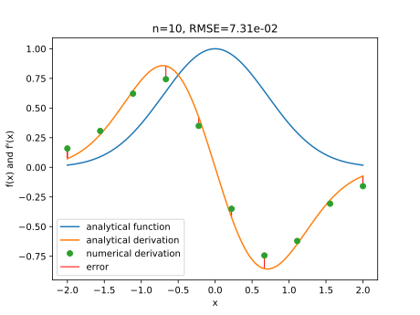{width="90%" fig-align="center"}

## Example 2 -- Numerical derivative -- results

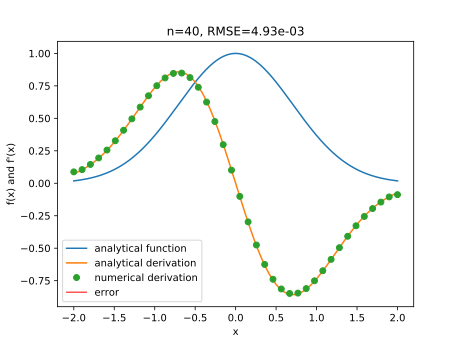{width="90%" fig-align="center"}

## Example 2 -- Numerical derivative -- results

| $n$ | $\epsilon_{RMSE}$ | factor |
|:---:|:-----------------:|:------:|
| 10  | 7.31e-2           |        |
| 20  | 1.84e-2           | 3.9    |
| 40  | 4.93e-3           | 3.73   |
| 80  | 1.41e-3           | 3.50   |

Notes:

- The error goes down as $n$ rises, i.e. $\Delta x$ gets smaller.
- Making $\Delta x$ half size, reduces the error by a factor of about 4.

## Convergence

In general, convergence describes the behavior of an approximation method to asymptotically represent the exact solution.

**Convergence of discretization**

- Numerical derivatives move towards exact derivatives as $h\rightarrow 0$
- Numerical solution of a PDE converges towards one solution; this allows to estimate approximation parameter
- Notes: a) LES does not converge towards DNS; b) simulations do not converge towards experimental data

**Convergence of iterative methods**

- Iterative solvers generally improve their solutions with each iteration
- Iterative solvers, e.g. linear systems, pressure coupling, are often part of an enclosing method or used for steady state solutions

## Order of accuracy

The rate at which a method converges towards a solution is represented by its order.

A method is called $n$-th order, if the error $\epsilon$ is a function of the discretization $h$:

$$
\epsilon = h^n
$$

An often used nomenclature is the 'big O' notation: $\mathcal{O}(h^n)$ to indicate the order of accuracy.

## Example 3 -- Convergence of spatial discretization (I)

**Input file**: [03_derivative_convergence.py](./exercises/03_derivative_convergence.py)

**Goal**: Compute and visualize the convergence of the derivative approximation (see example 02).

**Tasks**:

1. Execute the Python script and compare the error output and error plot.
1. Which order of accuracy do you observe? Does the error plot support your observation?
1. Change the scaling of the plot from linear to double logarithmic, i.e. replace the `plot` call with a `loglog` call. Which order can you now deduce from the plot?

## Example 3 -- Convergence of spatial discretization (II)

**Input file**: [03_derivative_convergence.py](./exercises/03_derivative_convergence.py)

**Optional**:

4. Increase the number of refinements `n_refinement` to 15. Does the order change? If so, why?
5. How are the derivatives computed at the boundaries? Which order is implemented? Use the alternative which is commented out. Does this help?
6. Change the number of refinements `n_refinement` to 25. What do you observe?

## Example 3 -- Convergence -- results

| $\Delta x$ | $\epsilon$ | factor | order |
|:----------:|:----------:|:------:|:-----:|
| 4.44e-01   | 7.31e-02   |        |       |
| 2.11e-01   | 1.84e-02   | 3.96   | 1.99  |
| 1.03e-01   | 4.93e-03   | 3.74   | 1.90  |
| 5.06e-02   | 1.41e-03   | 3.49   | 1.80  |
| 2.52e-02   | 4.33e-04   | 3.26   | 1.70  |

## Example 3 -- Convergence -- results

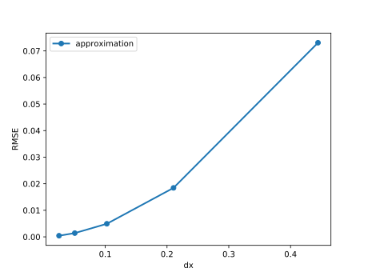{width="90%" fig-align="center"}

## Example 3 -- Convergence -- results

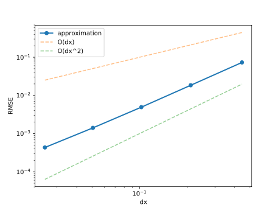{width="90%" fig-align="center"}

## Example 3 -- Convergence -- results

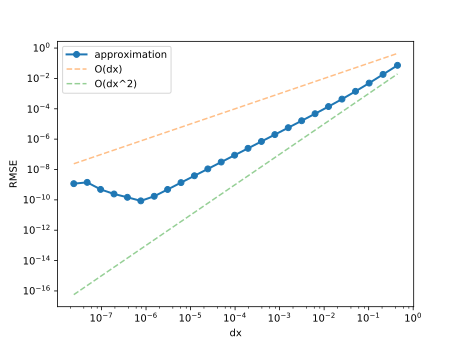{width="90%" fig-align="center"}

## Ghost cells and domain decomposition

When the total computational domain is a set of meshes, like needed for parallel execution, the evaluation of derivatives at the mesh boundaries needs neighbor information.

:::: {.columns}

::: {.column width="50%"}
- A common practice is to add additional layers of points, called ghost cells or halo.
- The exchange of the halo data is the main overhead in parallel processing.
:::

::: {.column width="50%"}
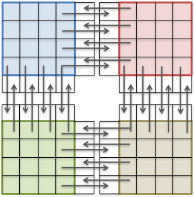{width="90%" fig-align="center"}
:::

::::

# Time Integration

## Overview

For time dependent PDEs, a time integration, or time marching, scheme is needed. There exists a wide range of schemes with individual properties.

:::: {.columns}

::: {.column width="50%"}
In general the temporal derivative is discretized, in the simplest case $(\phi=\phi(x,t))$ as:

$$
\partial_t \phi = f(\phi) \quad \rightarrow \quad \frac{\phi^{n+1}- \phi^n}{\Delta t} = f(\phi)
$$

with $\phi^n = \phi(x, t^n)$ and $t^n = n\cdot \Delta t$.

Notes:

- $\Delta t$ does not have to be constant
- The point in time of the evaluation of $f$ is crucial
:::

::: {.column width="50%"}
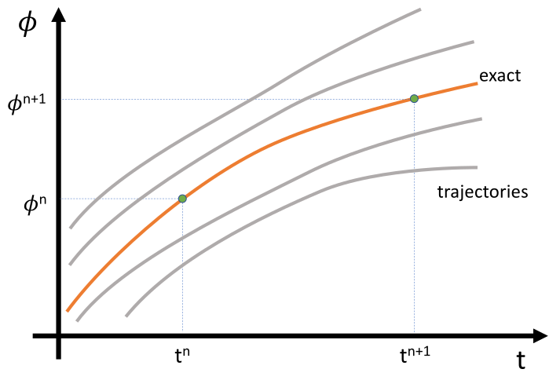{width="100%"}
:::

::::

## Euler method

The most simple schemes are the forward and backward Euler methods:

$$
\partial_t \phi = f(\phi)
$$

- Forward Euler

$$
\frac{\phi^{n+1}- \phi^n}{\Delta t} = f(\phi^n) \quad \rightarrow \quad \phi^{n+1} = \phi^n + \Delta t \cdot f(\phi^n)
$$

- Backward Euler

$$
\frac{\phi^{n+1}- \phi^n}{\Delta t} = f(\phi^{n+1}) \quad \rightarrow \quad \phi^{n+1} = \phi^n + \Delta t \cdot f(\phi^{n+1})
$$

## Euler methods -- schemes

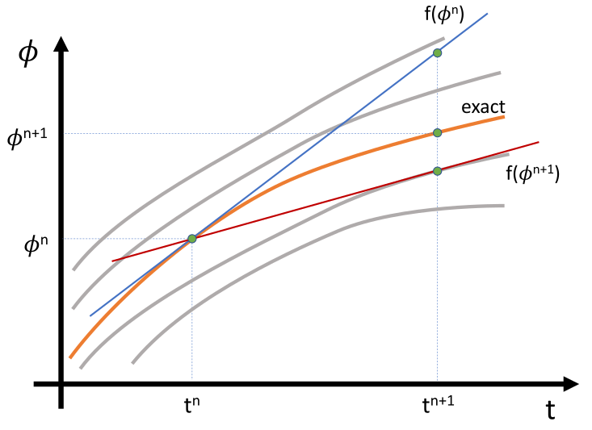{width="90%" fig-align="center"}

## Euler method -- Explicit method -- forward Euler {.smaller .nostretch}

Consider a simple diffusion equation:

$$
\partial_t \phi = \lambda\partial_{xx} \phi
$$

- Forward Euler: This scheme can be directly -- explicitly -- evaluated.

$$
\frac{\phi^{n+1}_i - \phi^n_i}{\Delta t} = \lambda\frac{\phi^n_{i-1} - 2\phi_i^n + \phi_{i+1}^n}{\Delta x^2}
$$

$$
\phi^{n+1}_i = \phi^n_i + \Delta t \lambda \frac{\phi^n_{i-1} - 2\phi_i^n + \phi_{i+1}^n}{\Delta x^2}
$$

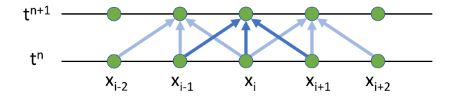{width="70%" fig-align="center"}

## Euler method -- Implicit method -- backward Euler {.smaller .nostretch}

Consider a simple diffusion equation:

$$
\partial_t \phi = \lambda\partial_{xx} \phi
$$

- Backward Euler: Here a linear equation system must be solved for $\phi^{n+1}$.

$$
\frac{\phi^{n+1}_i - \phi^n_i}{\Delta t} = \lambda \frac{\phi^{n+1}_{i-1} - 2\phi_i^{n+1} + \phi_{i+1}^{n+1}}{\Delta x^2}
$$

$$
\phi^{n+1}_i - \frac{\Delta t}{\Delta x^2}\lambda\left( \phi^{n+1}_{i-1} - 2\phi_i^{n+1} + \phi_{i+1}^{n+1} \right) = \phi^n_i
$$

$$
A\phi^{n+1} = \phi^n
$$

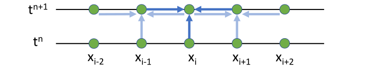{width="70%" fig-align="center"}

## Stability

An important property of a time integrator is its stability.

Given a PDE to be solved and a time integrator, a simple (linear) stability analysis can be conducted, e.g. von Neumann stability analysis.

The outcome is the growth factor, which indicates the growth rate of small disturbances. If this factor is larger than 1, then the scheme is unstable, as fluctuations will infinitely rise.

- Explicit schemes tend to be unstable or conditionally stable, i.e. if a condition for the time step is met
- Implicit schemes tend to be unconditionally stable, however they tend to damp the solution

## Propagation speed (I) {.smaller}

A constant velocity advection problem demonstrates the stability condition.

:::: {.columns}

::: {.column width="55%"}
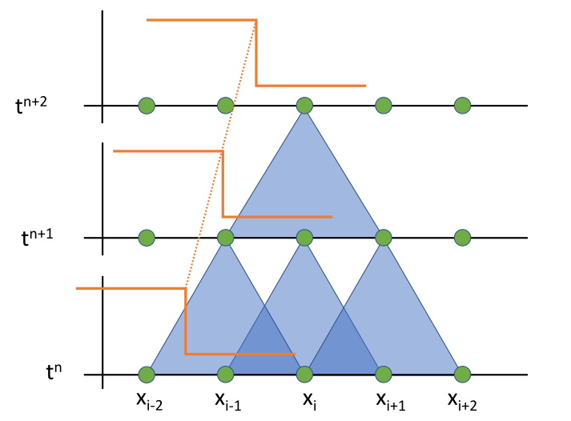{width="100%"}
:::

::: {.column width="45%"}
- Model equation

$$
\partial_t \phi + \partial_x(v_0\phi) = 0
$$

- Small $\Delta t$
- Distance traveled per $\Delta t$:

$$
\delta x = v_0 \Delta t < \Delta x
$$
:::

::::

- The information moves less than $\Delta x$ in a time step $\Delta t$ and is captured by the neighbouring grid point
- No solution information is lost during time integration

## Propagation speed (II)

:::: {.columns}

::: {.column width="55%"}
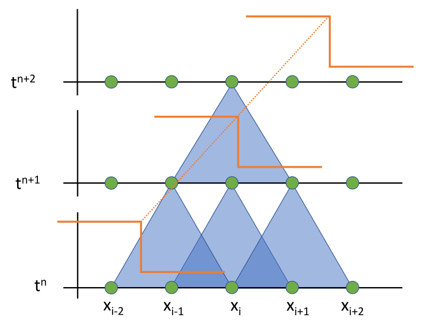{width="100%"}
:::

::: {.column width="45%"}
- Large $\Delta t$
- Distance traveled per $\Delta t$:

$$
\delta x = v_0 \Delta t > \Delta x
$$
:::

::::

- The information moves more than $\Delta x$ in a time step $\Delta t$ and can therefore not be captured anymore
- Information is lost during time integration

## Courant-Friedrichs-Lewy (CFL) condition {.smaller}

In general, there exist stability conditions for explicit schemes, which relates the maximal information travel speed $v_{max}$ and the grid velocity $v_g = \Delta x / \Delta t$:

$$
v_{max} < CFL\cdot v_{g}
$$

Given a mesh resolution $\Delta x$ and maximal velocities, the above condition limits the time step:

$$
\Delta t < CFL\cdot \frac{\Delta x}{v_{max}}
$$

Notes:

- The flow velocity may be computed in various ways ($L_\infty$, $L_1$, $L_2$ norms), diffusion velocity $\propto 1/\Delta x$
- There also exist other constraints on $\Delta t$: mass density constraint and volume constraint.
- The value of the CFL number depends on the time integration scheme.

## Implications of the CFL condition in FDS

The condition for $\Delta t$ used in FDS is

$$
0.8 \leq CFL = \Delta t \left(\frac{\|\vec{v}\|}{\Delta x} + |\nabla \cdot \vec{u}|\right) \leq 1.0
$$

- If the CFL number grows above the upper limit, the time step is set to 90% of the allowed, if it falls below the lower limit, then it is increased by 10%.
- In general, the time step is reduced by a factor of 2 when the mesh spacing is reduced by a factor of 2, i.e. the total computational effort increases by a factor of 16.

## Predictor-corrector scheme {.nostretch}

Predictor-corrector schemes use intermediate solutions (predictions) to correct the time integration.

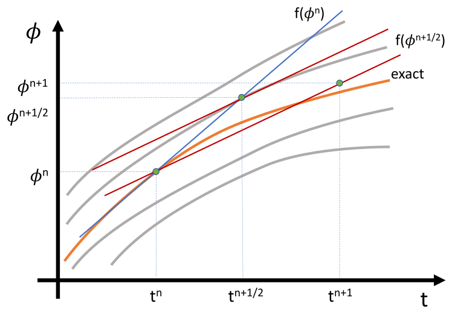{width="50%" fig-align="center"}

In two step schemes, the intermediate solution is marked with a $*$, e.g. $\phi^*$.

## Overview of other methods

There exists a whole zoo of time integration methods. All with different stability properties, orders of accuracy and memory requirements.

- $\Theta$-method: a combination of the forward and backward Euler schemes. The parameter $\Theta$ expresses the weighting, i.e. $\Theta=0$ fully explicit forward Euler, $\Theta=1$ fully implicit backward Euler, $\Theta=0.5$ semi-implicit Crank-Nicolson.
- Runge-Kutta methods: family of explicit and implicit multistep methods
- Backward differentiation formulas (BDF): fully implicit methods based on previous solution steps

## Example 4 -- Wave equation (I)

In the case of isothermal compressible flows, with no convection, diffusion and source terms, the equations reduce to

$$
\begin{aligned}
  \partial_t \rho &= -\nabla\cdot\left(\rho \vec{v}\right)\\
  \partial_t \vec{v} &= -\nabla p
\end{aligned}
$$

A linear ansatz for the solution, compressibility and the ideal gas law,  lead in 1D to the sound wave equation for density $\delta \rho$ and velocity $\delta v$ fluctuations

$$
\begin{aligned}
   \partial_t \delta\rho &= c \partial_x \delta v\\
   \partial_t \delta v      &= c \partial_x \delta\rho
\end{aligned}
$$

with $c=\sqrt{\gamma\frac{RT}{m_M}}$ and the fundamental solutions:

$$
\delta\rho(x,t) = \delta\rho_0 \sin\left(kx -\omega t\right) \quad \text{and} \quad \delta v(x,t) = \delta v_0 \sin\left(kx -\omega t\right)
$$

## Example 4 -- Wave equation (II)

**Input file**: [04_wave.py](./exercises/04_wave.py)

**Goal**: Solve the wave equation with different time integration schemes.

**Tasks**:

1. Execute the Python script and observe solution computed by the forward Euler scheme.
1. Change the time integration scheme to backward Euler and Crank-Nicolson. E.g. `scheme='euler_backward'`
1. Change the initial conditions to a Gauss peak: `initial='gauss'`.

**Optional**:

4. Compare the implementations of the explicit and implicit solvers. Can you identify the steps needed to solve the linear system in the implicit Euler solver?
5. Are the spatial discretizations (e.g. in the explicit Euler) first or second order?
6. What does the 'leap frog' scheme do? `scheme='leap'`

## Example 4 -- results -- forward Euler

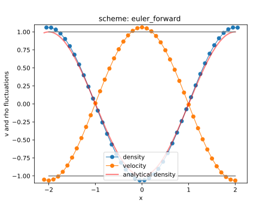{width="90%" fig-align="center"}

## Example 4 -- results -- backward Euler

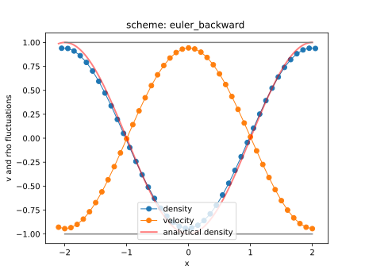{width="90%" fig-align="center"}

## Example 4 -- results -- Crank-Nicolson

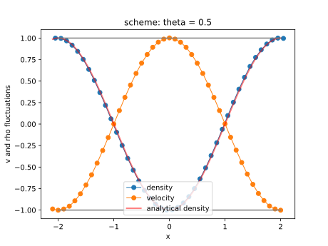{width="90%" fig-align="center"}

## Example 4 -- results -- leap frog

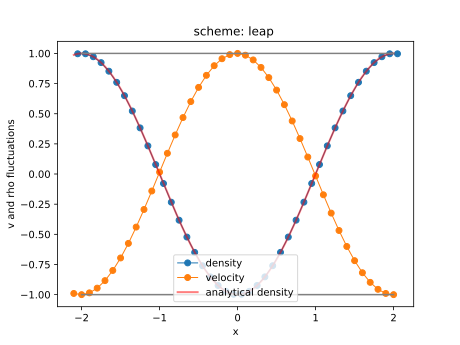{width="90%" fig-align="center"}

## Example 4 -- results -- convergence in space and time

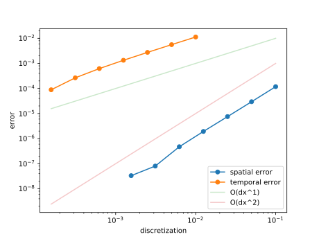{width="90%" fig-align="center"}

## Conclusions

- The finite difference method is a direct discretization method of differential equations.
- The accuracy of approximation depends on the chosen discretization size.
- The time integration may also follow an FDM approach, however, stability conditions apply.
