# Scalar Transport

## Lumped species

FDS uses a lumped species approach, where related primitive species $Y_\alpha$, e.g. nitrogen, oxygen, and carbon dioxide, are transported together. The classification into three lumped species $Z_A$ (air), $Z_F$ (fuel) and $Z_P$ (products) leads in the case of methane combustion

$$
CH_4 + 2 \left(O_2 + 3.76N_2\right) \rightarrow CO_2 + 2H_2O + 7.52N_2
$$

to the following relation

$$
\left(\begin{array}{ccc} 0.77 & 0.00 & 0.73 \\ 0.23 & 0.00 & 0.00 \\ 0.00 & 1.00 & 0.00 \\ 0.00 & 0.00 & 0.15 \\ 0.00 & 0.00 & 0.12 \end{array}\right) \cdot \left(\begin{array}{c} Z_A \\ Z_F \\ Z_P\end{array}\right) = \left(\begin{array}{c} Y_{N_2} \\ Y_{O_2} \\ Y_{CH_4} \\ Y_{CO_2} \\ Y_{H_2O}\end{array}\right)
$$

This approach allows to significantly reduce the cost of the computation of the transport process.

## Transport equation

The transport of scalars is an advection-diffusion equation including source terms. In the case of the lumped species $Z_\alpha$ it takes the following form:

$$
\partial_t (\rho Z_\alpha) + \nabla\cdot\left(\rho Z_\alpha \vec{v}\right) = \nabla\cdot\left(\rho D_\alpha \nabla Z_\alpha\right) + \dot{m}'''_\alpha + \dot{m}_{b, \alpha}'''
$$

with the diffusion coefficient $D_\alpha$ and the mass sources $\dot{m}'''_\alpha$.

The solution of this set of equations must satisfy the realizability condition, which is

$$
Y_\alpha \geq 0 \quad \text{and} \quad \sum Y_\alpha = 1
$$

## Example 5 -- Scalar transport -- model equations

To demonstrate the challenge in solving the transport equation for a scalar field, the following simplified 1D advection equation is used:

$$
\partial_t \phi + \partial_x(v_0\phi) = 0
$$

Here the advection velocity $v_0$ is constant and therefore the exact solution is given by shifting the initial conditions by $-vt$:

$$
\phi(x,t) = \phi(x - vt, 0)
$$

## Example 5 -- Scalar transport -- exercise (I) {.smaller}

**Input file**: [05_advection.py](./exercises/05_advection.py)

**Goal**: Solve a simple 1D advection equation.

**Tasks**:

1. Execute the Python script and observe the transport of the initial field. What do you observe, that does not satisfy you?
1. Does a smaller time step (`dt`) improve the solution?
1. Try out a stepwise initial function: `core='step'`.
1. Execute both cases with the so called upwind scheme: `scheme='upwind'`
1. What happens if your parameters do not satisfy the stability criterion for the upwind scheme?
   $$
   \left|v_0\frac{\Delta t}{\Delta x}\right| \leq 1
   $$
1. What solution do you achieve with the upwind scheme and $\Delta t= \Delta x / v_0$?

## Example 5 -- Scalar transport -- exercise (II)

**Input file**: [05_advection.py](./exercises/05_advection.py)

**Goal**: Solve a simple 1D advection equation.

**Optional**:

7. Read the function `update_upwind`. What is the order of accuracy of the upwind scheme?
8. The current implementation of the upwind scheme supports only positive velocities. Look at the current implementation (`update_upwind`) and add the handling of negative velocities.

## Example 5 -- results -- central, Gauss

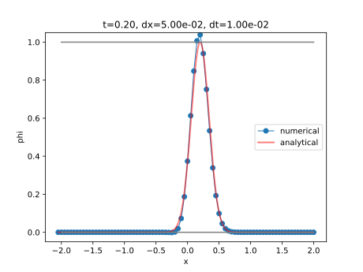{width="90%" fig-align="center"}

## Example 5 -- results -- central, step

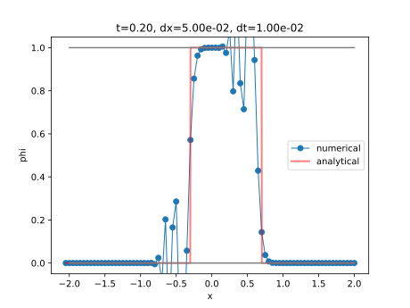{width="90%" fig-align="center"}

## Example 5 -- results -- upwind, Gauss

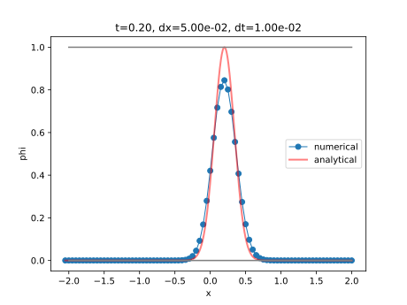{width="90%" fig-align="center"}

## Example 5 -- results -- upwind, step

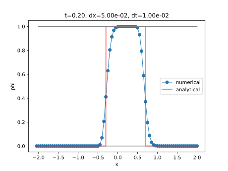{width="90%" fig-align="center"}

## Upwind scheme (I) {.nostretch}

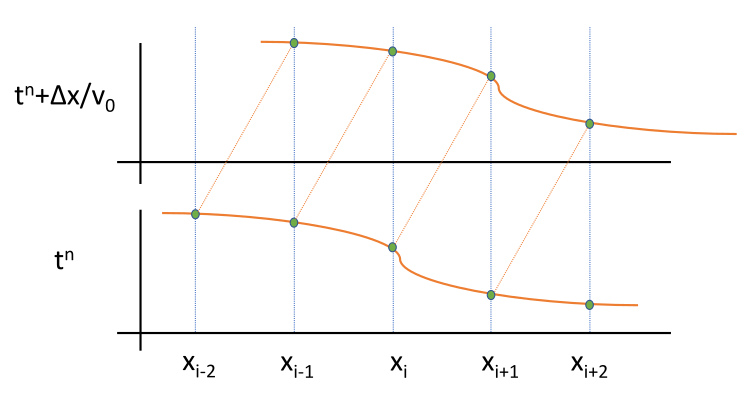{width="50%" fig-align="center"}

For a positive ($v_0>0$) advection velocity the upwind scheme is given by

$$
\phi_i^{n+1} = \phi_i^n - v_0\Delta t\frac{\phi_i^n - \phi_{i-1}^n}{\Delta x}
$$

In the case of $\Delta t = \Delta x / v_0$:

$$
\phi_i^{n+1} = \phi_{i-1}^n
$$

## Upwind scheme (II)

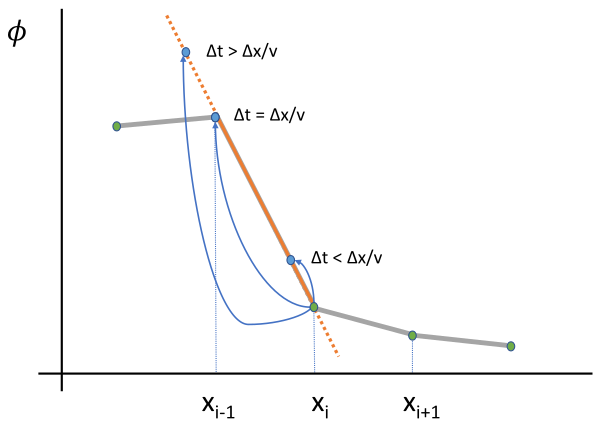{width="90%" fig-align="center"}

# Flux Limiter

## Basic idea

The advection equation can be represented in the conservative form for $\phi=\rho Z$ as

$$
\partial_t (\phi) + \nabla\cdot\vec{F} = DS(\rho, Z) \quad \text{with the flux} \quad \vec{F} = \phi \vec{v}
$$

where for sake of simplicity the index $\alpha$ is omitted and the diffusion and source terms are represented by $DS$.

The basic idea in the flux limiting schemes is to handle the flux in a way to prevent increasing oscillations.

The so called total variation diminishing (TVD) schemes preserve (or reduce) the variation of the scalar field by adjusting the flux.

## Staggered grid

Instead of a cell centered evaluation of the flux in the advection equation, it is evaluated at the cell faces. As FDS uses a staggered grid, where vector quantities are located on the cell faces, the second order divergence evaluation is similar to the FVM approach.

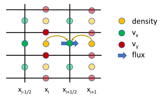{width="70%" fig-align="center"}

## Flux interpolation

The flux handling in FDS is done by limiting the transported scalar values in the flux evaluation. In 1D, it results in:

$$
\partial_t \phi + \frac{F_{i+\frac{1}{2}} - F_{i-\frac{1}{2}}}{\Delta x} = DS\quad \rightarrow \quad \partial_t \phi + \frac{\overline{\phi^{FL}}_{i+\frac{1}{2}} u_{i+\frac{1}{2}} - \overline{\phi^{FL}}_{i-\frac{1}{2}} u_{i-\frac{1}{2}}}{\Delta x}
$$

The interpolation of the transported scalar is based on local variations and in the upstream (sign of $u_{i+\frac{1}{2}}$) direction

$$
\begin{aligned}
\delta \phi_{loc, i+\frac{1}{2}} &= \delta\phi_{loc} = \phi_{i+1} - \phi_i \\
\delta \phi_{up,  i+\frac{1}{2}} &= \delta\phi_{up}  = 
        \left\{ \begin{array}{ccc} 
           \phi_i - \phi_{i-1} & \text{if} & u_{i+\frac{1}{2}} > 0\\  
           \phi_{i+2} - \phi_{i+1} & \text{if} & u_{i+\frac{1}{2}} < 0\\  
        \end{array} \right.
\end{aligned}
$$

## Flux limiter {.flux-limiter-schemes}

The general representation of different limiter schemes can be expressed via the limiter function $B(r)$ with $r$ being the ratio of successive variations

$$
r = \frac{\delta \phi_{up}}{\delta\phi_{loc}} \quad \text{and} \quad \overline{\phi^{FL}}_{i+\frac{1}{2}}  =
        \left\{ \begin{array}{ccc}
           \phi_i + B(r) \frac{1}{2}\delta\phi_\alpha & \text{if} & u_{i+\frac{1}{2}} > 0\\ 
           \phi_{i+1} - B(r) \frac{1}{2}\delta\phi_\alpha & \text{if} & u_{i+\frac{1}{2}} < 0\\  
        \end{array} \right.
$$

| Flux Limiter Scheme | $B(r)$ | $\alpha$ | `FLUX_LIMITER` |
|:--------------------|:------:|:--------:|---------------:|
| central difference | 1 | loc | CENTRAL |
| Godunov | 0 | loc | GUDONOV |
| Superbee (VLES default) | max(0, min(2r,1), min(r,2)) | loc | SUPERBEE |
| MINMOD | max(0, min(1,r)) | loc | MINMOD |
| CHARM (LES and DNS default) | $\left(3\frac{1}{r}+1\right) / \left(r(\frac{1}{r}+1)^2\right)$ | up | CHARM |

## Example 6 -- Scalar transport with FDS

**Input directory**: [06_fds_flux_limiter](https://github.com/rmcdermo/Juelich_Summer_School/tree/main/03_CFD/exercises/06_fds_flux_limiter)

**Input file**: [move_slug.fds](./exercises/06_fds_flux_limiter/move_slug.fds)

Verification input file with a reduced simulation time of 1 s.

**Goal**: Investigate the different flux limiters available in FDS.

**Tasks**:

1. Read the FDS input file. What is the simulation scenario? What should happen?
1. Run FDS with the input file.
1. Change the `FLUX_LIMITER` to central differences and Godunov schemes. Do you observe the expected behaviour?

## Example 6 -- results -- initial values

:::: {.columns}

::: {.column width="85%"}
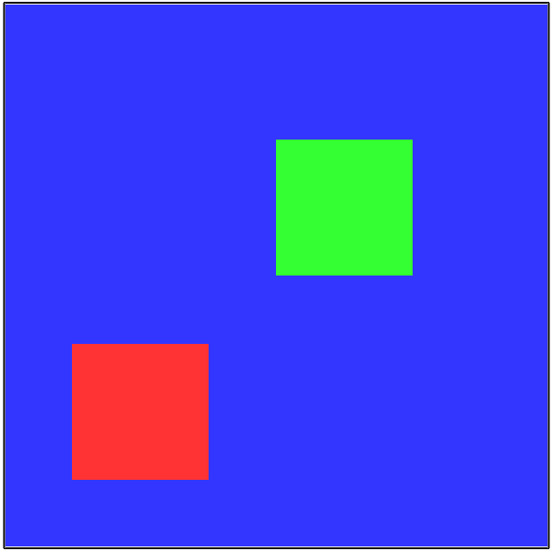{height="470" fig-align="center"}
:::

::: {.column width="15%"}
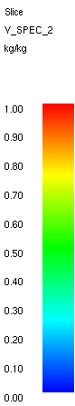{height="470" fig-align="center"}
:::

::::

## Example 6 -- results -- `FLUX_LIMITER='CENTRAL'`

:::: {.columns}

::: {.column width="85%"}
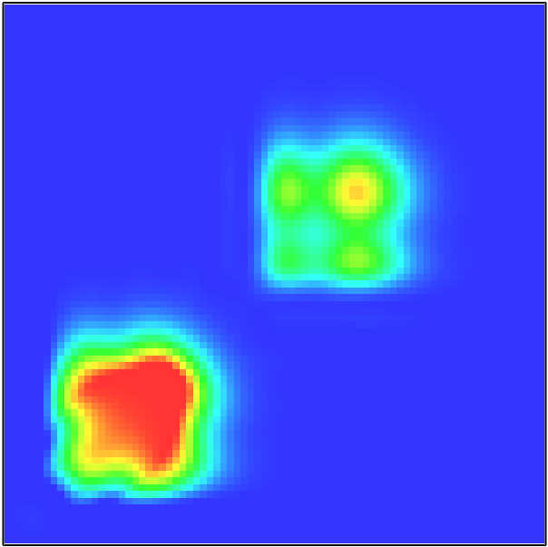{height="470" fig-align="center"}
:::

::: {.column width="15%"}
{height="470" fig-align="center"}
:::

::::

## Example 6 -- results -- `FLUX_LIMITER='GUDONOV'`

:::: {.columns}

::: {.column width="85%"}
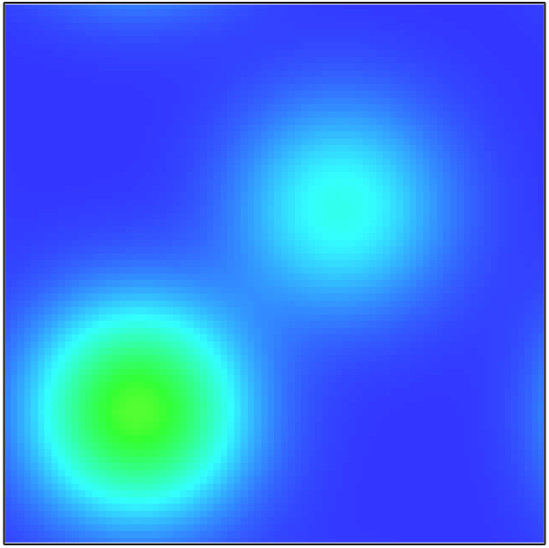{height="470" fig-align="center"}
:::

::: {.column width="15%"}
{height="470" fig-align="center"}
:::

::::

## Example 6 -- results -- `FLUX_LIMITER='SUPERBEE'`

:::: {.columns}

::: {.column width="85%"}
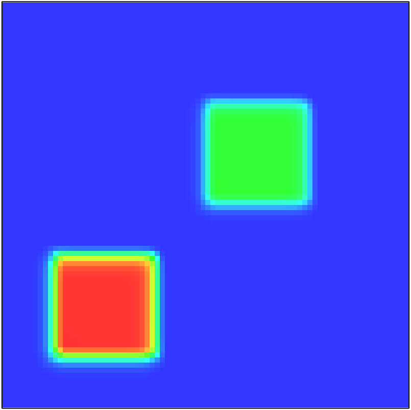{height="470" fig-align="center"}
:::

::: {.column width="15%"}
{height="470" fig-align="center"}
:::

::::

## Example 6 -- results -- `FLUX_LIMITER='MINMOD'`

:::: {.columns}

::: {.column width="85%"}
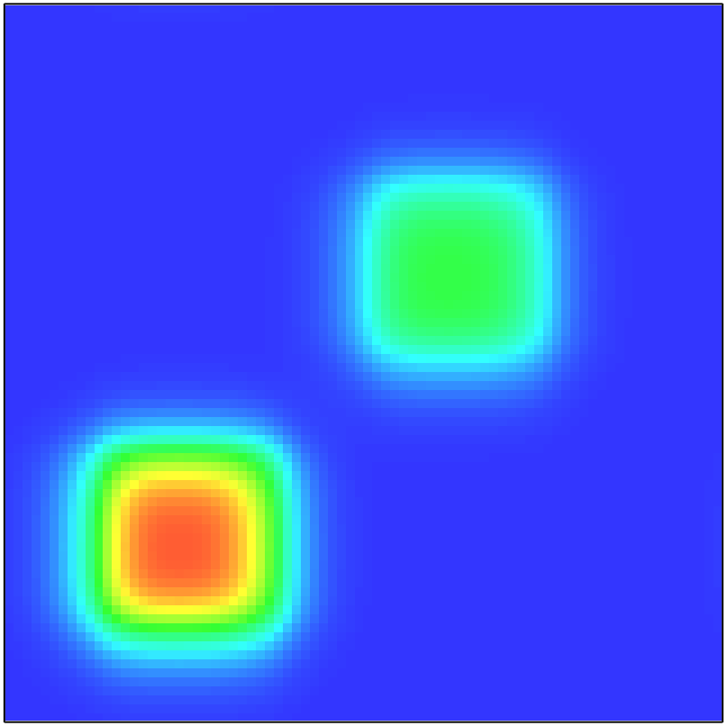{height="470" fig-align="center"}
:::

::: {.column width="15%"}
{height="470" fig-align="center"}
:::

::::

## Example 6 -- results -- `FLUX_LIMITER='CHARM'`

:::: {.columns}

::: {.column width="85%"}
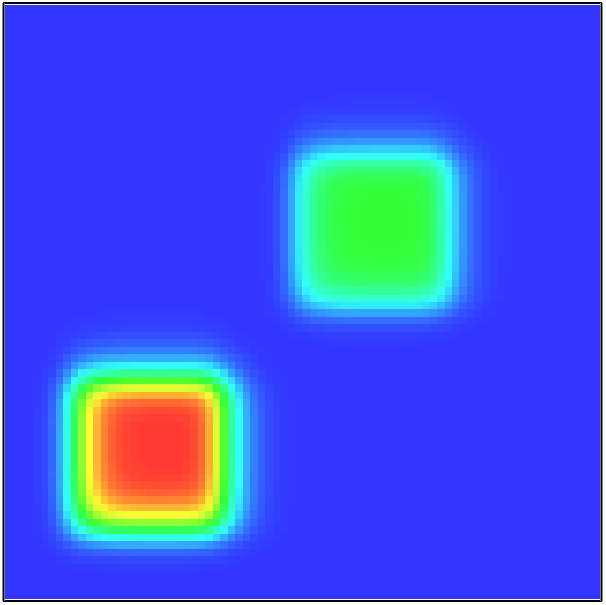{height="470" fig-align="center"}
:::

::: {.column width="15%"}
{height="470" fig-align="center"}
:::

::::

## Enforcing realizability

Although TVD schemes prevent fluctuations, they can do it in general only in 1D, but not in 3D. Therefore spurious fluctuations may lead to e.g. negative densities.

The transport scheme must support the realizability:

$$
Y_\alpha \geq 0 \quad \text{and} \quad \sum Y_\alpha = 1
$$

However, if $(\rho Y)_\alpha$ obeys $(\rho Y)_\alpha \geq 0$, then $Y_\alpha$ is guaranteed to be realizable.

Thus, there exists a minimal density threshold $\rho_{min}$, that should be preserved.

## Scalar boundedness correction

In 1D, the correction $\delta\rho$ for densities with a computed value $\rho_i^*$ below $\rho_{min}$ should satisfy:

- boundedness: $\rho_i = \rho^*_i + \delta\rho_i \geq \rho_{min}$
- conservation: $\sum_i \delta\rho_i V_i = 0$
- minimal variation: $\sum_i |\delta\rho_i|$

It is implemented as a diffusion operation, with

- $\delta\rho_i = \rho_{min} - \rho_i^*$
- $\delta m_{i\pm 1} = -c_i \left( \rho^*_{i\pm 1} - \rho^*_i\right) V_i$

and the artificial diffusion coefficient $c_i$

$$
c_i = \frac{\rho_{min} - \rho_i^*}{\rho_{i-1}^* -2\rho_i^* + \rho_{i+1}^*}
$$

## Conclusions

- The advection of scalar values is a generally challenging topic.
- Limiting the flux, via TVD schemes like upwind or Superbee schemes, allows for stable solutions.
- Still, fluctuations in density require correction methods.
