# Module I: Time integration basics – Discretization

::: {.section-topics}
Review of Low-Mach Equations of Fluid Motion.

Time integration: Pressure projection scheme.

Poisson equation: Spatial discretization.
:::

## Review of Low-Mach Equations of Fluid Motion {.motivation-slide}

::: {.slide-layout}

::: {.m-intro}
- **Motivation: Highly resolved FDS parallel calculations.**
- **Domain size ~ meters, grid resolution ~ mm.**
:::

::: {.m-fig-l}
{controls="true" playsinline="true" preload="metadata" poster="Section_1_assets/compartment-oxygen-deflagration-poster.png" fig-alt="Volume rendering of oxygen concentration showing deflagration in a hot scaled compartment, 3408 meshes."}
:::

::: {.m-fig-r}
{controls="true" playsinline="true" preload="metadata" poster="Section_1_assets/slide-004-media-01.png" fig-alt="Simulation of heat transfer and soot deposition into a ceiling board, 2000 meshes."}
:::

::: {.m-cap-l .caption}
Oxygen concentration depicting deflagration in hot scaled compartment. 3408 meshes.
:::

::: {.m-cap-r .caption}
Heat transfer and soot deposition into a ceiling board. 2000 meshes.
:::

:::

## Review of Low-Mach Equations of Fluid Motion {.lowmach-slide}

::: {.slide-layout}

::: {.sub-head}
Low Mach Flows: Mach number
:::

::: {.lm-mach}
$$M=\frac{v_{ref}}{c}$$
:::

::: {.lm-defs}
$c$ = speed of sound

$v_{ref}$ = some reference velocity
:::

::: {.lm-fig}
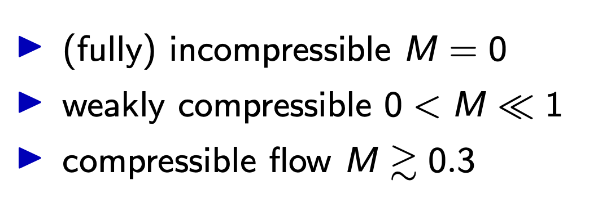{fig-alt="Sketch relating a reference velocity to the speed of sound."}
:::

::: {.lm-cmp}
In fires $v_{ref}\approx 10\ \mathrm{m/s}$, yet in air $c\approx 340\ \mathrm{m/s}$
:::

::: {.lm-body}
Flow driven by slow fluid convection, no need to include sound waves.

**Low Mach Approximation:** Focus on quasi incompressible, variable density flow, where
pressure and density are decoupled (drop compressibility).
:::

::: {.lm-photo}
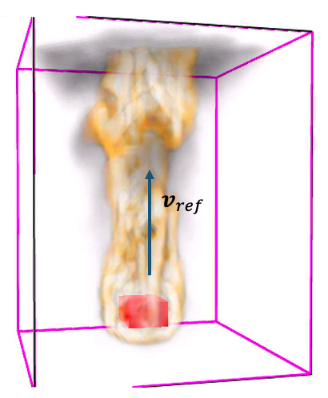{fig-alt="Volume rendering of a fire plume inside a magenta domain outline, with an arrow along the plume axis labelled v-ref marking the reference velocity."}
:::

:::

## Review of Low-Mach Equations of Fluid Motion {.pressure-decomposition-slide}

::: {.slide-layout}

::: {.sub-head}
Pressure decomposition:
:::

::: {.pd-eq}
$$p(\mathbf{x},t)=\underbrace{\bar{p}(z,t)}_{\textcolor{red}{\substack{\text{Background used}\\\text{in EOS}}}}
+\underbrace{\tilde{p}(\mathbf{x},t)}_{\textcolor{red}{\substack{\text{Hydrodynamic}\\\text{fluctuation}}}}$$
:::

::: {.pd-eos-h}
Ideal gas EOS:
:::

::: {.pd-eos}
$$\rho=\frac{\bar{p}\bar{W}}{RT}$$
:::

::: {.pd-mass-h}
Mass Balance for mixture of chemical species:
:::

::: {.pd-lab-st}
Scalar transport
:::

::: {.pd-mass}
$$\frac{\partial \rho Y_{\alpha}}{\partial t}+\nabla\cdot\left(\rho Y_{\alpha}\mathbf{u}\right)
=-\nabla\cdot\left(-\rho D_{\alpha}\nabla Y_{\alpha}\right)
+\underbrace{\dot{m}_{\alpha}'''}_{\textcolor{red}{\substack{\text{Volumetric mass rate}\\\text{(combustion)}}}}$$
:::

:::

## Review of Low-Mach Equations of Fluid Motion {.momentum-slide}

::: {.slide-layout}

::: {.sub-head}
Fluid Momentum equation:
:::

::: {.mo-lab}
Momentum
:::

::: {.mo-eq}
$$\rho\left[\frac{\partial \mathbf{u}}{\partial t}+(\mathbf{u}\cdot\nabla)\mathbf{u}\right]
=-\nabla(\tilde{\boldsymbol{p}})+(\rho-\rho_{0})\mathbf{g}+\nabla\cdot\boldsymbol{\tau}$$
:::

::: {.mo-ident}
Where we used the vector identity
$(\mathbf{u}\cdot\nabla)\mathbf{u}=\nabla|\mathbf{u}|^{2}/2-\mathbf{u}\times\boldsymbol{\omega}$
and $\frac{1}{\rho}\nabla(\tilde{\boldsymbol{p}})=\nabla\left(\frac{\tilde{\boldsymbol{p}}}{\rho}\right)-\tilde{\boldsymbol{p}}\nabla\left(\frac{1}{\rho}\right)$:
:::

::: {.mo-comb}
$$\frac{\partial \mathbf{u}}{\partial t}
\underbrace{-\,\mathbf{u}\times\boldsymbol{\omega}-\frac{1}{\rho}\left[(\rho-\rho_{0})\mathbf{g}+\nabla\cdot\boldsymbol{\tau}\right]}_{\rule{0pt}{2.4ex}\textcolor{red}{\large\mathbf{F}_{A}}}
\underbrace{-\,\tilde{\boldsymbol{p}}\nabla\left(\frac{1}{\rho}\right)}_{\rule{0pt}{2.4ex}\textcolor{red}{\large\mathbf{F}_{B}}}
+\underbrace{\nabla H}_{\rule{0pt}{2.6ex}\textcolor{red}{\large\displaystyle H=\frac{\tilde{\boldsymbol{p}}}{\rho}+\frac{|\mathbf{u}|^{2}}{2}}}=0$$
:::

::: {.mo-headlb}
Head, we call it pressure too.
:::

:::

## Review of Low-Mach Equations of Fluid Motion {.grouping-forces-slide}

::: {.slide-layout}

::: {.sub-head}
Fluid Momentum equation:
:::

::: {.gf-lab .callout-label}
Momentum
:::

::: {.gf-eq}
$$\frac{\partial \mathbf{u}}{\partial t}=-\left[\mathbf{F}_{A}+\mathbf{F}_{B}+\nabla H\right]$$
:::

::: {.gf-where}
Where:
:::

::: {.gf-fa}
$$\mathbf{F}_{A}=-\mathbf{u}\times\boldsymbol{\omega}-\frac{1}{\rho}\left[(\rho-\rho_{0})\mathbf{g}+\nabla\cdot\boldsymbol{\tau}\right]$$
:::

::: {.gf-fa-lb .callout-label}
Lamb vector, viscous, gravity forces
:::

::: {.gf-fb}
$$\mathbf{F}_{B}=-\tilde{\boldsymbol{p}}\nabla\left(\frac{1}{\rho}\right)$$
:::

::: {.gf-fb-lb .callout-label}
Baroclinic torque
:::

::: {.gf-h}
$$H=\frac{\tilde{\boldsymbol{p}}}{\rho}+\frac{|\mathbf{u}|^{2}}{2}$$
:::

::: {.gf-h-lb .callout-label}
Head, we call it pressure too.
:::

:::

## Review of Low-Mach Equations of Fluid Motion {.divergence-slide}

::: {.slide-layout}

::: {.dc-label}
Energy – Divergence Constraint\*
:::

::: {.dc-eq}
$$\nabla\cdot\mathbf{u}=\frac{1}{\rho h_{s}}\left[\frac{D}{Dt}\left(\bar{p}-\rho h_{s}\right)
+\underbrace{\dot{q}'''}_{\rule{0pt}{2.4ex}\textcolor{red}{\large\substack{\text{Volumetric Heat release}\\\text{(combustion)}}}}
-\underbrace{\nabla\cdot\dot{\mathbf{q}}''}_{\rule{0pt}{2.4ex}\textcolor{red}{\large\substack{\text{Heat transport term (conduction,}\\\text{species diffusion, radiation)}}}}\right]$$
:::

::: {.dc-q}
What does $\nabla\cdot\mathbf{u}$ mean?
:::

::: {.dc-rows}
- $\nabla\cdot\mathbf{u}>0$ [Fluid expands]{.dc-expand}
- $\nabla\cdot\mathbf{u}\sim 0$ [Uniform Flow]{.dc-uniform}
- $\nabla\cdot\mathbf{u}<0$ [Fluid compressing]{.dc-compress}
:::

::: {.dc-fig}
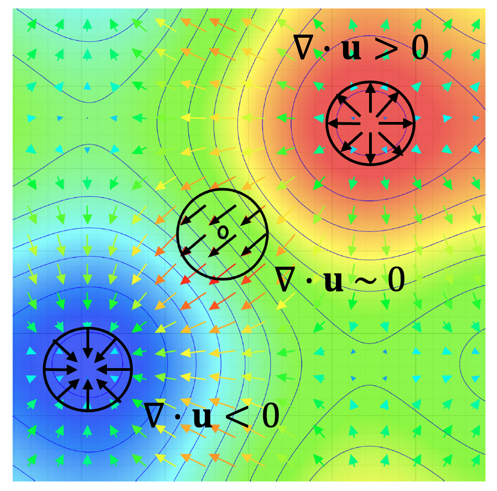{fig-alt="Velocity vector field over a coloured scalar field with contour lines. Three circled regions are marked: one where vectors point outward and the divergence of u is greater than zero, one where flow is uniform and the divergence is about zero, and one where vectors converge and the divergence is less than zero."}
:::

::: {.footnote}
\* R. J. McDermott. *J. Comput. Phys.* **274**, pp. 413–431 (2014).
:::

:::

## Review of Low-Mach Equations of Fluid Motion {.saddle-point-slide}

::: {.slide-layout}

::: {.sub-head}
Fluid Motion:
:::

::: {.sp-name}
Saddle Point Problem\*
:::

::: {.sp-sys}
$$\left\{\begin{aligned}
\frac{\partial \mathbf{u}}{\partial t}&=-\left[\mathbf{F}_{A}+\mathbf{F}_{B}+\nabla H\right]\\[4pt]
\nabla\cdot\mathbf{u}&=(\nabla\cdot\mathbf{u})^{th}
\end{aligned}\right.$$
:::

::: {.sp-bcs}
\+ Velocity BCs
:::

::: {.sp-step}
**Explicit step $t_{n}\to t_{n+1}=t_{n}+\Delta t$: First step of FDS 2-Stage Runge Kutta method.**
:::

::: {.sp-solve}
System to Solve
:::

::: {.sp-disc}
$$\left\{\begin{aligned}
\frac{\mathbf{u}^{n+1}-\mathbf{u}^{n}}{\Delta t}&=-\left[\mathbf{F}_{A}^{n}+\mathbf{F}_{B}^{n}+\nabla H\right]\\[20pt]
(\nabla\cdot\mathbf{u})^{n+1}&=(\nabla\cdot\mathbf{u})^{th}
\end{aligned}\right.$$
:::

::: {.sp-note}
F terms evaluated at time level $n$ with known state. $H$ unknown a priori.
:::

::: {.sp-arrow}
<svg viewBox="0 0 117 14" role="presentation" aria-hidden="true">
<line x1="117" y1="7" x2="15" y2="7" stroke="#1f4e79" stroke-width="2"/>
<polygon points="0,7 16,1.5 16,12.5" fill="#1f4e79"/>
</svg>
:::

::: {.sp-u}
$\mathbf{u}^{n+1}$
:::

::: {.sp-subj}
subject to:
:::

::: {.footnote}
\* Elman H. *Finite Elements and Fast Iterative Solvers: With Applications to Incompressible
Fluid Dynamics*, Oxford Univ. Press.
:::

:::

## Time integration: Pressure projection scheme {.poisson-for-h-slide}

::: {.slide-layout}

::: {.sub-head}
Fractional step Method\*:
:::

::: {.pe-take}
Taking divergence of the previous:
:::

::: {.pe-eq}
$$\nabla^{2}H=-\left[\frac{\nabla\cdot\mathbf{u}^{n+1}-\nabla\cdot\mathbf{u}^{n}}{\Delta t}
+\nabla\cdot(\mathbf{F}_{A}+\mathbf{F}_{B})^{n}\right]$$
:::

::: {.pe-arrow}
<svg viewBox="0 0 70 14" role="presentation" aria-hidden="true">
<line x1="70" y1="7" x2="15" y2="7" stroke="#1f6fb2" stroke-width="2"/>
<polygon points="0,7 16,1.5 16,12.5" fill="#1f6fb2"/>
</svg>
:::

::: {.pe-lab}
Poisson Equation for H
:::

::: {.pe-head}
Poisson Equation:
:::

::: {.pe-list .dash-list}
- Elliptic PDE.
- $\nabla^{2}$ is a separable operator of the type (2D): $\hspace{2.5em}\dfrac{\partial}{\partial x}\left(a(x)\dfrac{\partial H(x,y)}{\partial x}\right)+\dfrac{\partial}{\partial y}\left(b(y)\dfrac{\partial H(x,y)}{\partial y}\right)$
- Solution at one point depends on F and solution everywhere else.
- Most expensive part of the projection scheme.
- Now we have to define boundary conditions for $H^{+}$.
:::

::: {.footnote}
\*Chorin A. J. (*J. Comput. Phys.* **2**, 12–26 1967; *Math. Comput.* **23**, 341–54 1968). Temam, R., *Navier–Stokes equations*, 1977.
\+ Perot J. B., "An analysis of the Fractional step method," *J. Comput. Phys.* **108**(1), 51–58 (1993).
:::

:::

## Time integration: Pressure projection scheme {.fractional-step-slide}

::: {.slide-layout}

::: {.sub-head}
Fractional step Method:
:::

::: {.fs-head}
Procedure:
:::

::: {.fs-s1}
1. Compute $\mathbf{F}^{n}$ from known quantities:
:::

::: {.fs-e1}
$$\mathbf{F}_{A}^{n}=-\mathbf{u}\times\boldsymbol{\omega}-\frac{1}{\rho}\left[(\rho-\rho_{0})\mathbf{g}+\nabla\cdot\boldsymbol{\tau}\right]$$
:::

::: {.fs-s2}
2. Compute $\nabla\cdot\mathbf{u}^{th,n+1}$ from known quantities.
:::

::: {.fs-s3}
3. Compute $\mathbf{F}_{B}^{n}$ from known quantities:
:::

::: {.fs-e3}
$$\mathbf{F}_{B}^{n}=-\tilde{\boldsymbol{p}}\nabla\left(\frac{1}{\rho}\right)$$
:::

::: {.fs-s4}
4. Solve Poisson Equation:
:::

::: {.fs-e4}
$$\nabla^{2}H=-\left[\frac{\nabla\cdot\mathbf{u}^{th,n+1}-\nabla\cdot\mathbf{u}^{n}}{\Delta t}
+\nabla\cdot(\mathbf{F}_{A}+\mathbf{F}_{B})^{n}\right]$$
:::

::: {.fs-s5}
5. Project to final velocities:
:::

::: {.fs-e5}
$$\mathbf{u}^{n+1}=\underbrace{\mathbf{u}^{n}-\Delta t\left[\mathbf{F}_{A}^{n}+\mathbf{F}_{B}^{n}\right.}_{\rule{0pt}{2.6ex}\textcolor{red}{\large\substack{\text{Intermediate velocity}\\\text{at }n+1}}}\left.+\nabla H\right]$$
:::

:::

## Time integration: Pressure projection scheme {.pressure-iteration-slide}

::: {.slide-layout}

::: {.sub-head}
Fractional step Method:
:::

::: {.pi-rel}
$\tilde{\boldsymbol{p}}$ and $H$ are [related:]{.pi-red}
:::

::: {.pi-rel-eq}
$$\textcolor{red}{H}=\frac{\textcolor{red}{\tilde{\boldsymbol{p}}}}{\rho}+\frac{|\mathbf{u}|^{2}}{2}$$
:::

::: {.pi-fp}
Fixed point iteration in $k$:
:::

::: {.pi-loop}
Loop $k$
:::

::: {.pi-brace}
:::

::: {.pi-s3}
3. Compute $\mathbf{F}_{B}^{n}$ from known quantities:
:::

::: {.pi-e3a}
$$\tilde{\boldsymbol{p}}^{k-1}=\rho\left(H^{k-1}-\frac{|\mathbf{u}|^{2}}{2}\right)$$
:::

::: {.pi-e3b}
$$\mathbf{F}_{B}^{n}=-\tilde{\boldsymbol{p}}^{k-1}\nabla\left(\frac{1}{\rho}\right)$$
:::

::: {.pi-s4}
4. Solve Poisson Equation:
:::

::: {.pi-e4}
$$\nabla^{2}H^{k}=-\left[\frac{\nabla\cdot\mathbf{u}^{th,n+1}-\nabla\cdot\mathbf{u}^{n}}{\Delta t}
+\nabla\cdot(\mathbf{F}_{A}+\mathbf{F}_{B})^{n}\right]$$
:::

::: {.pi-arr-l}
<svg viewBox="0 0 20 44" role="presentation" aria-hidden="true">
<line x1="10" y1="0" x2="10" y2="36" stroke="#1f6fb2" stroke-width="2.5"/>
<polygon points="10,44 6,35 14,35" fill="#1f6fb2"/>
</svg>
:::

::: {.pi-arr-r}
<svg viewBox="0 0 20 44" role="presentation" aria-hidden="true">
<line x1="10" y1="0" x2="10" y2="36" stroke="#1f6fb2" stroke-width="2.5"/>
<polygon points="10,44 6,35 14,35" fill="#1f6fb2"/>
</svg>
:::

::: {.pi-conv}
When loop is converged:
:::

::: {.pi-c1}
$$\nabla\cdot\nabla\left(\frac{\textcolor{red}{\tilde{\boldsymbol{p}}}}{\rho}+\frac{|\mathbf{u}|^{2}}{2}\right)$$
:::

::: {.pi-c2}
$$-\,\textcolor{red}{\tilde{\boldsymbol{p}}}\nabla\left(\frac{1}{\rho}\right)$$
:::

::: {.pi-diag-l}
<svg viewBox="0 0 100 100" preserveAspectRatio="none" role="presentation" aria-hidden="true">
<line x1="0" y1="0" x2="95" y2="95" stroke="#1f6fb2" stroke-width="3" vector-effect="non-scaling-stroke"/>
<polygon points="100,100 87,97 97,87" fill="#1f6fb2"/>
</svg>
:::

::: {.pi-diag-r}
<svg viewBox="0 0 100 100" preserveAspectRatio="none" role="presentation" aria-hidden="true">
<line x1="100" y1="0" x2="5" y2="95" stroke="#1f6fb2" stroke-width="3" vector-effect="non-scaling-stroke"/>
<polygon points="0,100 3,87 13,97" fill="#1f6fb2"/>
</svg>
:::

::: {.pi-tail}
We are solving the inseparable system
:::

::: {.pi-final}
$$\nabla\cdot\left[\nabla\left(\frac{\tilde{\boldsymbol{p}}}{\rho}\right)-\tilde{\boldsymbol{p}}\nabla\left(\frac{1}{\rho}\right)\right]
=\textcolor{red}{\nabla\cdot\left[\frac{1}{\rho}\nabla\tilde{\boldsymbol{p}}\right]}$$
:::

:::

## Poisson equation: Spatial discretization {.structured-grids-slide}

::: {.slide-layout}

::: {.sub-head}
Structured Grids:
:::

::: {.sg-body .dash-list}
- Cell individualized by index set: [(I,J)]{.sg-red} in 2D, [(I,J,K)]{.sg-red} in 3D.
- We use MAC/staggered cells:

  ::: {.sg-sub}
  Scalar fields cell centered.\
  Vector field components in faces.\
  Finite differences for spatial derivatives.
  :::
:::

::: {.sg-fig}
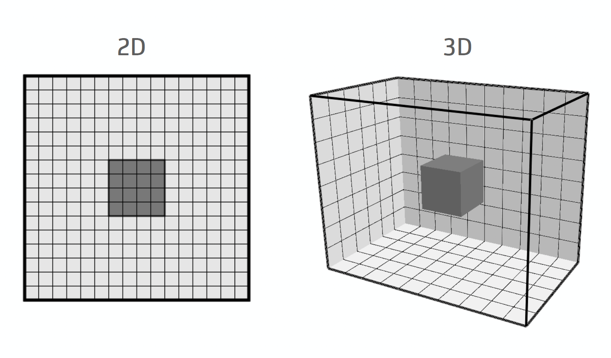{fig-alt="A two-dimensional structured grid and the equivalent three-dimensional grid, each with one cell shaded."}
:::

::: {.sg-lab-i}
I
:::

<!-- The (I,J) marker on the 2D grid: a cell-centre dot with dashed leader lines
     out to the I and J labels. These are shapes drawn over the picture in the
     deck, so they are not in the extracted PNG. -->
::: {.sg-marker}
<svg viewBox="0 0 192 126" role="presentation" aria-hidden="true">
<line x1="34" y1="27" x2="134" y2="27" stroke="#1f4e79" stroke-width="2.5" stroke-dasharray="9 7"/>
<line x1="138.6" y1="31" x2="138.6" y2="97" stroke="#1f4e79" stroke-width="2.5" stroke-dasharray="9 7"/>
<circle cx="138.6" cy="27" r="7" fill="#1f3864"/>
</svg>
:::

::: {.sg-lab-j}
J
:::

<!-- MAC / staggered cell: two cells sharing a face, scalars at centres, the
     u-component on the shared face, v on the top face, and the dx dimension. -->
::: {.sg-cell}
<svg viewBox="0 0 640 315" role="img" aria-label="Two adjacent MAC cells. Scalar values H and rho sit at the cell centres, the u velocity component sits on the shared vertical face with the force term F, the v component sits on the top face, and the cell width is delta x.">
<rect x="32" y="80" width="248" height="171" fill="none" stroke="#111" stroke-width="5"/>
<rect x="280" y="80" width="248" height="171" fill="none" stroke="#111" stroke-width="5"/>
<circle cx="156" cy="165.5" r="9" fill="#1f4e79"/>
<circle cx="404" cy="165.5" r="9" fill="#1f4e79"/>
<line x1="156" y1="80" x2="156" y2="26" stroke="#1f4e79" stroke-width="5"/>
<polygon points="156,10 147,30 165,30" fill="#1f4e79"/>
<line x1="236" y1="165.5" x2="318" y2="165.5" stroke="#1f4e79" stroke-width="5"/>
<polygon points="334,165.5 314,156 314,175" fill="#1f4e79"/>
<line x1="156" y1="251" x2="156" y2="296" stroke="#1f4e79" stroke-width="2" stroke-dasharray="6 5"/>
<line x1="404" y1="251" x2="404" y2="296" stroke="#1f4e79" stroke-width="2" stroke-dasharray="6 5"/>
<line x1="168" y1="296" x2="392" y2="296" stroke="#1f4e79" stroke-width="3"/>
<polygon points="154,296 172,288 172,304" fill="#1f4e79"/>
<polygon points="406,296 388,288 388,304" fill="#1f4e79"/>
<line x1="556" y1="251" x2="614" y2="251" stroke="#1f4e79" stroke-width="3"/>
<polygon points="628,251 610,243 610,259" fill="#1f4e79"/>
</svg>
:::

::: {.sg-v}
$v_{\mathrm{I,J}}$
:::

::: {.sg-f}
$F^{n}_{x,\mathrm{I,J}}$
:::

::: {.sg-u}
$u_{\mathrm{I,J}}$
:::

::: {.sg-h1}
$H_{\mathrm{I,J}}\;\; \rho_{\mathrm{I,J}}$
:::

::: {.sg-h2}
$H_{\mathrm{I+1,J}}$
:::

::: {.sg-dx}
$\Delta x$
:::

::: {.sg-x}
$x$
:::

::: {.sg-having}
Having computed our discrete H:
:::

::: {.sg-eq}
$$u^{n+1}_{\mathrm{I,J}}=u^{n}_{\mathrm{I,J}}-\Delta t\left(F^{n}_{Ax,\mathrm{I,J}}+F^{n}_{Bx,\mathrm{I,J}}
+\frac{H_{\mathrm{I+1,J}}-H_{\mathrm{I,J}}}{\Delta x}\right)$$
:::

:::

## Poisson equation: Spatial discretization {.fd-laplacian-slide}

::: {.slide-layout}

::: {.sub-head}
Structured Grids, Poisson equation (2D):
:::

::: {.fd-cell}
Cell individualized [(I,J)]{.fd-red}:
:::

::: {.fd-op}
Staggered grid Finite difference operator:
:::

<!-- Five-point stencil: the (I,J) cell with its four neighbours, the difference
     quotients on the faces, and the dx / dy dimensions. Drawn with autoshapes in
     the deck, so none of it is in any extracted image. -->
::: {.fd-stencil}
<svg viewBox="0 0 896 720" role="img" aria-label="Five-point stencil: the cell I,J with neighbours above, below, left and right; arrows across each shared face carry the difference quotients, and the cell spacings delta x and delta y are marked.">
<rect x="278.4" y="13.5" width="248" height="225" fill="none" stroke="#111" stroke-width="7"/>
<rect x="30.4" y="238.5" width="248" height="229.5" fill="none" stroke="#111" stroke-width="7"/>
<rect x="278.4" y="238.5" width="248" height="229.5" fill="none" stroke="#111" stroke-width="7"/>
<rect x="526.4" y="238.5" width="252.8" height="229.5" fill="none" stroke="#111" stroke-width="7"/>
<rect x="278.4" y="468" width="248" height="225" fill="none" stroke="#111" stroke-width="7"/>
<circle cx="402.4" cy="353.3" r="9" fill="#e8631a" stroke="#7a3208" stroke-width="2"/>
<circle cx="154.4" cy="353.3" r="9" fill="#e8631a" stroke="#7a3208" stroke-width="2"/>
<circle cx="652.8" cy="353.3" r="9" fill="#e8631a" stroke="#7a3208" stroke-width="2"/>
<circle cx="402.4" cy="126" r="9" fill="#e8631a" stroke="#7a3208" stroke-width="2"/>
<circle cx="402.4" cy="580.5" r="9" fill="#e8631a" stroke="#7a3208" stroke-width="2"/>
<line x1="224" y1="360" x2="326" y2="360" stroke="#1f4e79" stroke-width="7"/>
<polygon points="344,360 320,348 320,372" fill="#1f4e79"/>
<line x1="480" y1="360" x2="580" y2="360" stroke="#1f4e79" stroke-width="7"/>
<polygon points="598,360 574,348 574,372" fill="#1f4e79"/>
<line x1="404.8" y1="522" x2="404.8" y2="450" stroke="#1f4e79" stroke-width="7"/>
<polygon points="404.8,432 393,456 417,456" fill="#1f4e79"/>
<line x1="404.8" y1="279" x2="404.8" y2="229" stroke="#1f4e79" stroke-width="7"/>
<polygon points="404.8,211 393,235 417,235" fill="#1f4e79"/>
<line x1="790" y1="144" x2="878" y2="144" stroke="#1f4e79" stroke-width="2.5" stroke-dasharray="10 8"/>
<line x1="790" y1="360" x2="878" y2="360" stroke="#1f4e79" stroke-width="2.5" stroke-dasharray="10 8"/>
<line x1="846.4" y1="156" x2="846.4" y2="348" stroke="#1f4e79" stroke-width="3"/>
<polygon points="846.4,144 838,162 855,162" fill="#1f4e79"/>
<polygon points="846.4,360 838,342 855,342" fill="#1f4e79"/>
<line x1="644.8" y1="468" x2="644.8" y2="530" stroke="#1f4e79" stroke-width="2.5" stroke-dasharray="10 8"/>
<line x1="430" y1="517.5" x2="633" y2="517.5" stroke="#1f4e79" stroke-width="3"/>
<polygon points="417.6,517.5 436,509 436,526" fill="#1f4e79"/>
<polygon points="644.8,517.5 626,509 626,526" fill="#1f4e79"/>
<line x1="728" y1="612" x2="728" y2="552" stroke="#111" stroke-width="4"/>
<polygon points="728,540 721,558 735,558" fill="#111"/>
<line x1="728" y1="612" x2="772" y2="612" stroke="#111" stroke-width="4"/>
<polygon points="784,612 766,605 766,619" fill="#111"/>
</svg>
:::

::: {.fd-hc}
$H_{\mathrm{I,J}}$
:::

::: {.fd-hl}
$H_{\mathrm{I-1,J}}$
:::

::: {.fd-hr}
$H_{\mathrm{I+1,J}}$
:::

::: {.fd-ht}
$H_{\mathrm{I,J+1}}$
:::

::: {.fd-hb}
$H_{\mathrm{I,J-1}}$
:::

::: {.fd-qy}
$\dfrac{H_{\mathrm{I,J+1}}-H_{\mathrm{I,J}}}{\Delta y}$
:::

::: {.fd-qx}
$\dfrac{H_{\mathrm{I+1,J}}-H_{\mathrm{I,J}}}{\Delta x}$
:::

::: {.fd-dx}
$\Delta x$
:::

::: {.fd-dy}
$\Delta y$
:::

::: {.fd-ax}
$x$
:::

::: {.fd-ay}
$y$
:::

::: {.fd-eq}
$$\nabla^{2}H=\nabla\cdot\nabla H\cong
\frac{1}{\Delta x}\left(\frac{H_{\mathrm{I+1,J}}-H_{\mathrm{I,J}}}{\Delta x}-\frac{H_{\mathrm{I,J}}-H_{\mathrm{I-1,J}}}{\Delta x}\right)
+\frac{1}{\Delta y}\left(\frac{H_{\mathrm{I,J+1}}-H_{\mathrm{I,J}}}{\Delta y}-\frac{H_{\mathrm{I,J}}-H_{\mathrm{I,J-1}}}{\Delta y}\right)$$
:::

:::

## Poisson equation: Spatial discretization {.stencil-slide}

::: {.slide-layout}

::: {.sub-head}
Structured Grids, Poisson equation (2D):
:::

::: {.st-if .dash-item}
If $\Delta x=\Delta y=h$
:::

::: {.st-eq}
$$\nabla^{2}H=\nabla\cdot\nabla H\cong
\frac{1}{h^{2}}\left(H_{\mathrm{I,J-1}}+H_{\mathrm{I-1,J}}-4H_{\mathrm{I,J}}+H_{\mathrm{I+1,J}}+H_{\mathrm{I,J+1}}\right)$$
:::

::: {.st-pts}
- 5 point stencils in 2D.
- 7 point stencils in 3D.
:::

::: {.st-disc .dash-item}
Discretizing over $N=N_x N_y$ cells:
:::

::: {.st-cont}
$$\nabla^{2}H_{(x,y)}=R_{(x,y)}$$
:::

::: {.st-cont-lab}
Continuum\
PDE
:::

<!-- "Discretize" arrow from the continuum PDE down to the algebraic system. -->
::: {.st-arrow}
<svg viewBox="0 0 30 190" role="presentation" aria-hidden="true">
<line x1="15" y1="0" x2="15" y2="168" stroke="#1f4e79" stroke-width="5"/>
<polygon points="15,190 6,166 24,166" fill="#1f4e79"/>
</svg>
:::

::: {.st-discretize}
Discretize
:::

::: {.st-sys}
$$\mathbf{A}_{N\times N}\boldsymbol{H}_{N\times 1}=\boldsymbol{R}_{N\times 1}$$
:::

::: {.st-sys-lab}
Discrete\
Algebraic\
System
:::

::: {.st-fig}
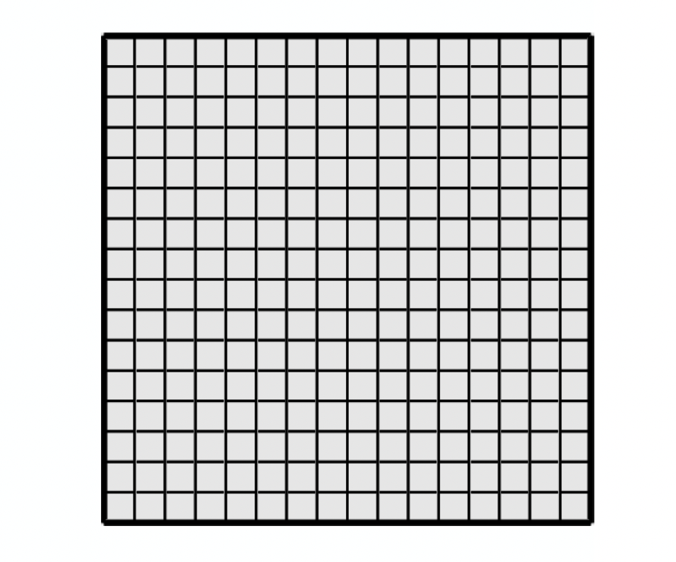{fig-alt="Uniform grid of N_x by N_y square cells, each of side h."}
:::

::: {.st-ny}
N$y$
:::

::: {.st-nx}
N$x$
:::

::: {.st-h1}
$h$
:::

::: {.st-h2}
$h$
:::

:::

## Poisson equation: Spatial discretization {.discrete-system-slide}

::: {.slide-layout}

::: {.ds-dims}
- $N=N_x\times N_y$
- $h=\Delta x=\Delta y$
:::

::: {.ds-coef}
$$\frac{1}{h^{2}}$$
:::

<!-- A H = R written out: purple brackets round each matrix/vector, with the five
     dotted diagonal bands of the 5-point stencil inside A. Autoshapes in the deck. -->
::: {.ds-matrix}
<svg viewBox="0 0 832 594" role="img" aria-label="The matrix equation A times H equals R. A is an N by N matrix with five dotted diagonal bands carrying the values one, one, minus four, one, one; H and R are N by one column vectors.">
<g stroke="#7030a0" stroke-width="6.7" fill="none" stroke-linecap="square">
<path d="M 80.2 117.0 L 65.0 117.0 L 65.0 510.4 L 80.2 510.4"/>
<path d="M 509.8 117.0 L 525.1 117.0 L 525.1 510.4 L 509.8 510.4"/>
<path d="M 558.7 117.0 L 543.5 117.0 L 543.5 510.4 L 558.7 510.4"/>
<path d="M 628.3 117.0 L 643.7 117.0 L 643.7 510.4 L 628.3 510.4"/>
<path d="M 736.2 117.0 L 720.8 117.0 L 720.8 510.4 L 736.2 510.4"/>
<path d="M 805.8 117.0 L 821.1 117.0 L 821.1 510.4 L 805.8 510.4"/>
</g>
<g stroke="#9a9a9a" stroke-width="3" stroke-dasharray="2 7" stroke-linecap="round">
<line x1="94.2" y1="143.2" x2="508.8" y2="490.9"/>
<line x1="123.7" y1="138.2" x2="506.2" y2="457.4"/>
<line x1="94.9" y1="176.7" x2="477.4" y2="496.0"/>
<line x1="95.2" y1="281.2" x2="341.1" y2="490.9"/>
<line x1="249.0" y1="132.6" x2="494.9" y2="342.2"/>
<line x1="597.3" y1="141.2" x2="597.3" y2="269.7"/>
<line x1="597.3" y1="340.9" x2="597.3" y2="469.4"/>
<line x1="774.4" y1="141.2" x2="774.4" y2="269.7"/>
<line x1="776.5" y1="340.9" x2="776.5" y2="469.4"/>
</g>
</svg>
:::

::: {.ds-e1}
$1$
:::

::: {.ds-e2}
$1$
:::

::: {.ds-e3}
$-4$
:::

::: {.ds-e4}
$1$
:::

::: {.ds-e5}
$1$
:::

::: {.ds-alab}
$\mathbf{A}_{N\times N}$
:::

::: {.ds-h}
$\boldsymbol{H}_{N\times 1}$
:::

::: {.ds-eq}
$=$
:::

::: {.ds-r}
$\boldsymbol{R}_{N\times 1}$
:::

::: {.ds-fig}
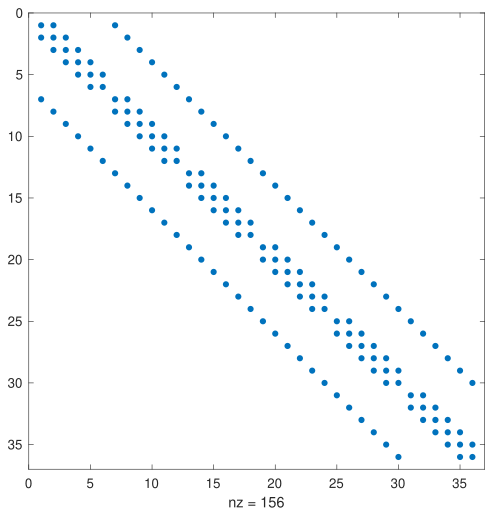{fig-alt="Sparsity pattern of the Poisson matrix for a 6 by 6 grid: five banded diagonals of non-zero entries, 156 in total."}
:::

::: {.ds-cap}
Sparsity pattern for 6x6 grid.
:::

::: {.ds-props}
- $\mathbf{A}$ matrix is symmetric.
- Very sparse. (5 or 7 non-zeros maximum per row, where rows are of size N).
- Depending on Boundary conditions it will be positive definite or semi-positive definite.
:::

:::

## Poisson equation: Spatial discretization {.bc-dirichlet-slide}

::: {.slide-layout}

::: {.sub-head}
Boundary conditions:
:::

::: {.bc-head .dash-item}
Ghost cells are commonly used to apply BCs at mesh boundaries.
:::

::: {.bc-title}
DIRICHLET BC
:::

::: {.bc-hpres}
$H$ prescribed
:::

::: {.bc-fig-l}
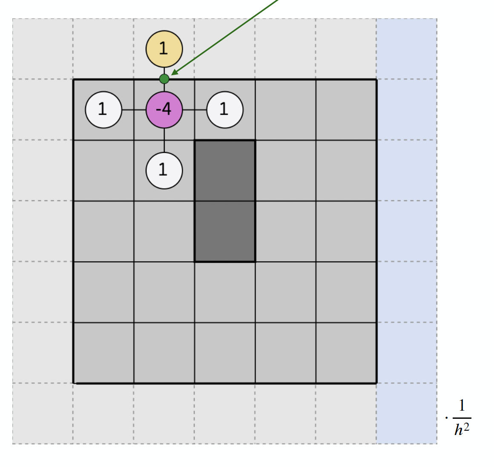{fig-alt="Ghost cell and internal cell either side of a Dirichlet boundary."}
:::

::: {.bc-fig-m}
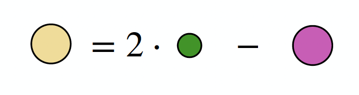{fig-alt="Relation between the ghost value, the boundary condition and the internal value."}
:::

::: {.bc-fig-r}
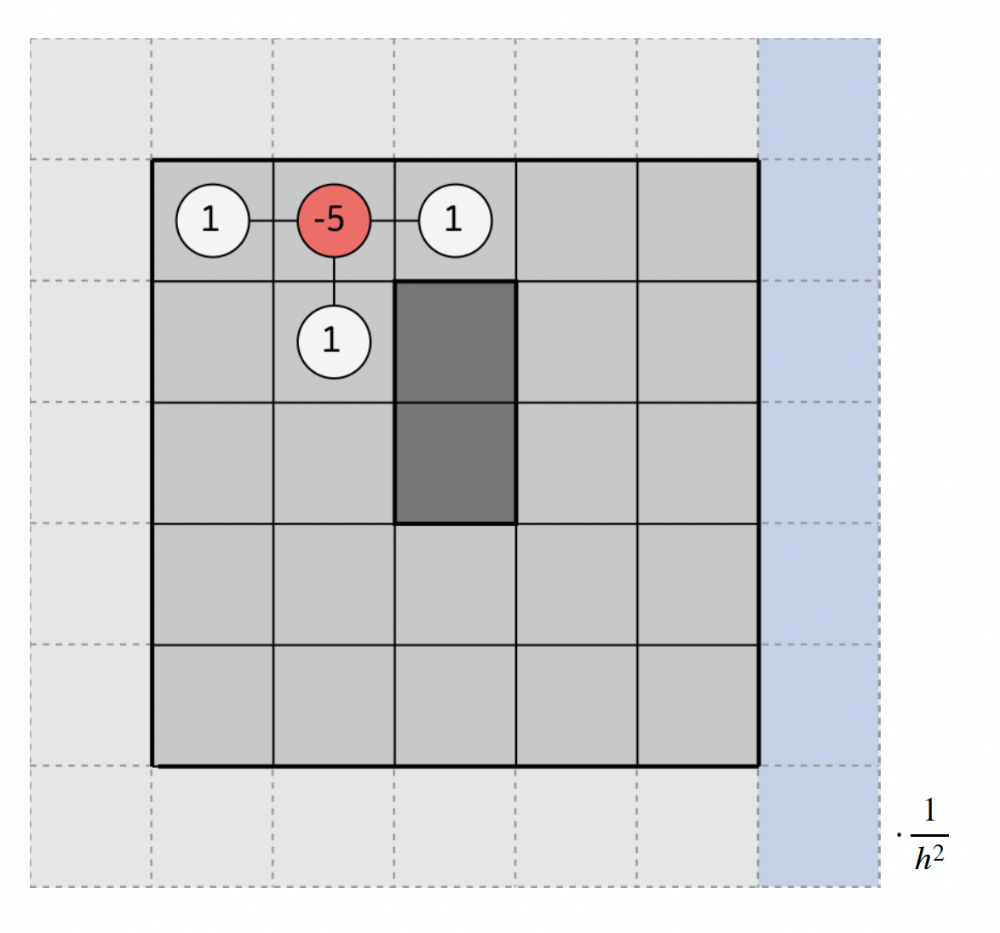{fig-alt="Effect of the Dirichlet condition on the matrix diagonal entry."}
:::

::: {.bc-lab-ghost}
Ghost Value
:::

::: {.bc-lab-bc}
BC
:::

::: {.bc-lab-int}
Internal value
:::

::: {.bc-arrow}
<svg viewBox="0 0 173 20" role="img" aria-label="Arrow pointing right.">
<line x1="0" y1="10" x2="159" y2="10" stroke="#156082" stroke-width="2.5"/>
<polygon points="159,4 173,10 159,16" fill="#156082"/>
</svg>
:::

::: {.bc-note .callout-label}
Change in A diagonal entry.
:::

:::

## Poisson equation: Spatial discretization {.bc-neumann-slide}

::: {.slide-layout}

::: {.sub-head}
Boundary conditions:
:::

::: {.bc-head .dash-item}
Ghost cells are commonly used to apply BCs at mesh boundaries.
:::

::: {.bc-title}
NEUMANN BC
:::

::: {.bc-hpres}
$\frac{\partial H}{\partial x}$ prescribed
:::

::: {.bc-fig-l}
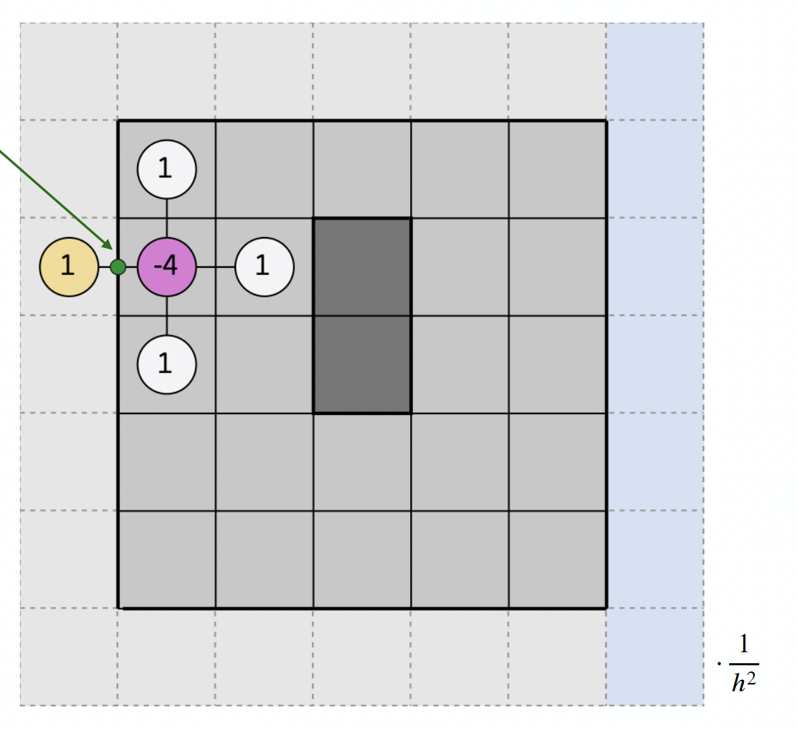{fig-alt="Ghost cell and internal cell either side of a Neumann boundary."}
:::

::: {.bc-fig-m}
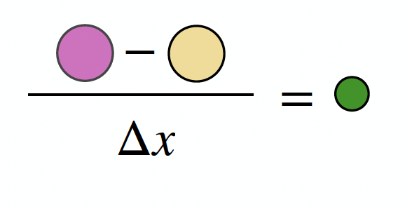{fig-alt="Gradient condition relating the ghost value to the internal value."}
:::

::: {.bc-fig-r}
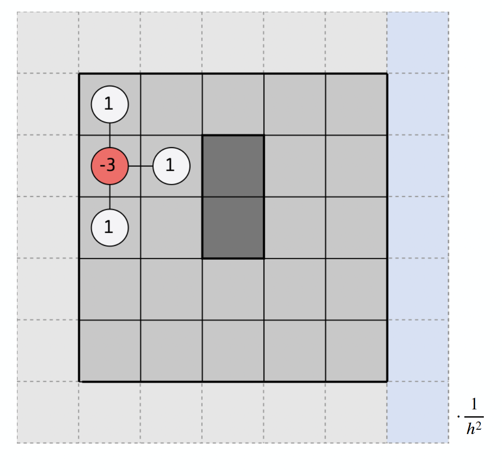{fig-alt="Effect of the Neumann condition on the matrix diagonal entry."}
:::

::: {.bc-lab-ghost}
Ghost Value
:::

::: {.bc-lab-bc}
BC
:::

::: {.bc-lab-int}
Internal value
:::

::: {.bc-arrow}
<svg viewBox="0 0 173 20" role="img" aria-label="Arrow pointing right.">
<line x1="0" y1="10" x2="159" y2="10" stroke="#156082" stroke-width="2.5"/>
<polygon points="159,4 173,10 159,16" fill="#156082"/>
</svg>
:::

::: {.bc-note .callout-label}
Change in A diagonal entry.
:::

:::
