# Module II: Dealing with internal boundaries

::: {.section-topics}
Structured meshes – Immersed Boundary Method – OBSTs in FDS.

Unstructured meshes.

FFT and ULMAT (PARDISO, HYPRE) Poisson Solvers – local single mesh. Velocity error in internal boundaries.

Example 1: Single mesh case.

Unstructured discretization via cut-cell method - GEOMs in FDS.

Unstructured Poisson solve on cut cells.

Example 2: Mass balance for sphere source.
:::

## Structured meshes – Immersed Boundary Method {.ibm-intro-slide}

::: {.slide-layout}

::: {.sub-head}
Boundary representation in structured meshes: Immersed boundary methods\*
:::

::: {.body}
- The presence of the body in Cartesian grid is accounted for using a forcing function.
- Equations for grid points next to or at the boundary are given a special RHS, such that the velocity BC is approximated.
:::

::: {.force}
Immersed Boundary Force defined in:

- Continuous governing equations^+^: IBM.
- Discrete governing equations^o,x,^^: Discrete Forcing IBM.
:::

::: {.force2}
Force is:

- Computed on surface and spread on surrounding points^+,x^: Diffuse Interface IBM.
- Computed for each neighboring Cartesian point in the gas phase^o,#^: Sharp interface IBM.
:::

::: {.fig .fit}
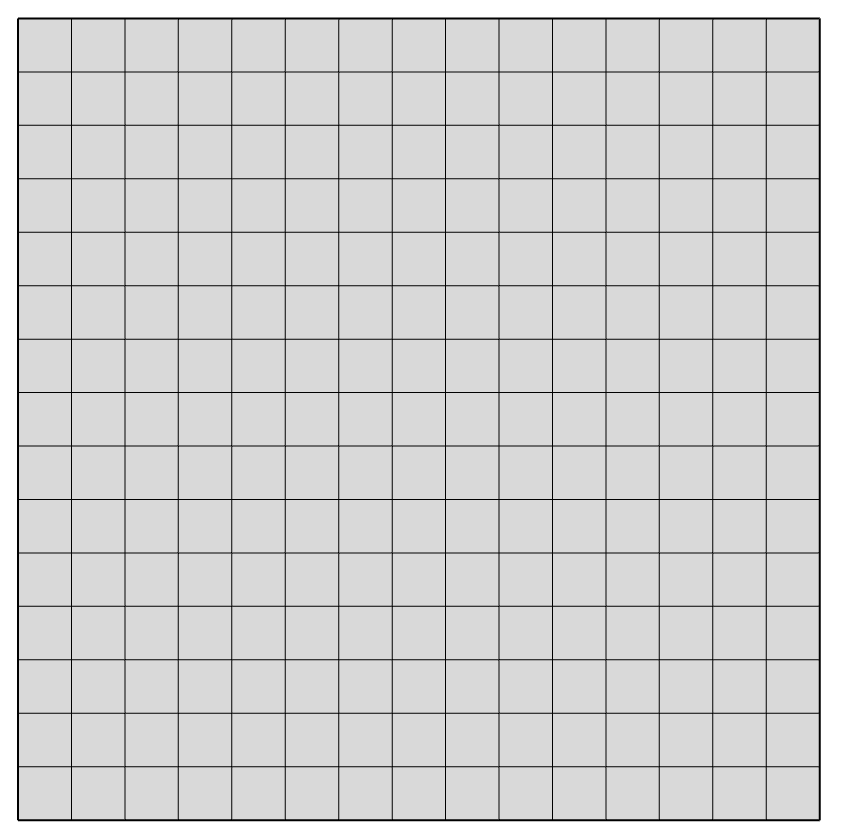{fig-alt="Sketch contrasting diffuse Lagrangian forcing on a body surface with sharp Eulerian forcing at Cartesian points."}
:::

::: {.art .fit}
<svg viewBox="0 0 499.2 464.4" role="img" aria-label="Circular body immersed in a Cartesian grid. Arrows on both sides mark forcing points; a boundary point on the left carries a diffuse Lagrangian force, one on the right a sharp Eulerian force.">
<ellipse cx="250.1" cy="230.9" rx="118.2" ry="109.9" fill="none" stroke="#0b3041" stroke-width="1"/>
<g stroke="#156082" stroke-width="2.1" fill="#156082">
<path d="M 117.8 225.3 L 117.8 200.8"/><path d="M 113.3 202.2 L 117.8 193.6 L 122.3 202.2 Z"/>
<path d="M 117.8 261.2 L 117.8 236.7"/><path d="M 113.3 238.1 L 117.8 229.5 L 122.3 238.1 Z"/>
<path d="M 85.0 225.3 L 85.0 200.8"/><path d="M 80.5 202.2 L 85.0 193.6 L 89.5 202.2 Z"/>
<path d="M 118.9 196.7 L 118.9 172.2"/><path d="M 114.4 173.6 L 118.9 165.0 L 123.4 173.6 Z"/>
<path d="M 151.5 227.3 L 151.5 202.8"/><path d="M 147.0 204.2 L 151.5 195.6 L 156.0 204.2 Z"/>
<path d="M 378.7 227.3 L 378.7 202.8"/><path d="M 374.2 204.2 L 378.7 195.6 L 383.2 204.2 Z"/>
<path d="M 406.4 227.3 L 406.4 202.8"/><path d="M 401.9 204.2 L 406.4 195.6 L 410.9 204.2 Z"/>
<path d="M 406.4 195.6 L 406.4 171.1"/><path d="M 401.9 172.5 L 406.4 163.9 L 410.9 172.5 Z"/>
</g>
<polygon points="368.2 221.5, 405.6 186.4, 406.4 221.5" fill="#156082" fill-opacity="0.35" stroke="#0b3041" stroke-width="1"/>
<ellipse cx="135.0" cy="215.0" rx="7.8" ry="6.4" fill="#156082" stroke="#ff0000" stroke-width="2.5"/>
<ellipse cx="364.4" cy="219.9" rx="7.8" ry="6.4" fill="#156082" stroke="#ff0000" stroke-width="2.5"/>
</svg>
:::

::: {.lab-sharp}
Sharp, discrete Eulerian forcing.
:::

::: {.lab-diffuse}
Diffuse, discrete Lagrangian forcing.
:::

::: {.sym-omega}
$\Omega$
:::

::: {.sym-f}
$f$
:::

::: {.sym-b}
$B$
:::

::: {.sym-fb}
$F_{B}$
:::

::: {.refs}
\* R. Mittal and G. Iaccarino, "Immersed Boundary Methods," *Annu. Rev. Fluid Mech.* **37** (2005). 
+ C. Peskin, "The immersed boundary method," *Acta Numerica* **11**, 479-517 (2002). 
o E.A. Fadlun et al., "Combined Immersed Boundary-Finite Difference Methods for 3D Complex flow," *J. Comput. Phys.* **161**:1, 35-60 (2000). 
x M. Uhlmann, "An immersed boundary method with direct forcing for particulate flows," *J. Comput. Phys.* **209**:2, 448-476 (2005). 
\# J. Yiang, E. Balaras, "Embedded-boundary formulation for LES of turbulent flows and moving boundaries," *J. Comput. Phys.* **215**:1, 12-40 (2005).
:::

:::

## Structured meshes – Immersed Boundary Method {.ibm-obst-slide}

::: {.slide-layout}

::: {.body}
In FDS OBSTs surfaces are snapped to fluid grid:

- Solve for H everywhere, IBM on [normal velocity components]{style='color:#ff0000'}.
- Assume in forcing point [$p$]{style='color:#ff0000'} we have an approximation to normal velocity $u^{n+1}=u^{d}$
:::

::: {.obst}
`&OBST XB=1.5,1.7,-0.8,0.8,-0.8,0.4 SURF_ID=… /`{style='color:#ff0000'}
:::

::: {.eq1}
$$(F_{A}+F_{B})^{n} =- \frac{u^{d}- u^{n}}{\Delta t}- \frac{\Delta H}{\Delta x}$$
:::

::: {.lab-body}
[Body Force at p.]{style='color:#ff0000'}
:::

::: {.iter}
But we don't know $H$, we still can iterate in k the projection:
:::

::: {.eq2}
$$(F_{A}+F_{B})^{n,k} =- \frac{u^{d}- u^{n}}{\Delta t}- \left.\frac{\Delta H}{\Delta x}\right.^{k-1}$$
:::

::: {.art .fit .behind}
<svg viewBox="0 0 641.6 596.0" role="img" aria-label="Cartesian grid around an OBST. Cell-centred H points sit in every cell; the shaded block is solid, and at the boundary face a wall-model stress point and tangential velocity arrow mark where the IBM forcing is applied.">
<rect x="262.9" y="154.9" width="188.3" height="168.3" fill="#e97132" fill-opacity="0.506" stroke="none" stroke-width="0.00"/>
<line x1="241.5" y1="31.6" x2="637.4" y2="31.6" stroke="#000000" stroke-width="1.25" stroke-dasharray="6 5"/>
<line x1="241.5" y1="93.4" x2="451.2" y2="93.4" stroke="#000000" stroke-width="1.25"/>
<line x1="241.5" y1="155.3" x2="522.5" y2="155.3" stroke="#000000" stroke-width="1.25"/>
<line x1="241.5" y1="217.1" x2="522.5" y2="217.1" stroke="#000000" stroke-width="1.25"/>
<line x1="241.5" y1="278.9" x2="522.5" y2="278.9" stroke="#000000" stroke-width="1.25"/>
<line x1="308.5" y1="334.3" x2="308.5" y2="95.6" stroke="#000000" stroke-width="1.25"/>
<line x1="379.8" y1="334.3" x2="379.8" y2="93.4" stroke="#000000" stroke-width="1.25"/>
<line x1="451.2" y1="337.7" x2="451.2" y2="95.6" stroke="#000000" stroke-width="1.25"/>
<line x1="522.5" y1="337.7" x2="522.5" y2="155.3" stroke="#000000" stroke-width="1.25"/>
<line x1="593.9" y1="337.7" x2="593.9" y2="4.3" stroke="#000000" stroke-width="1.25" stroke-dasharray="6 5"/>
<rect x="0.1" y="321.5" width="641.6" height="274.4" fill="#ffffff" stroke="none" stroke-width="0.00"/>
<rect x="5.5" y="4.3" width="257.4" height="374.3" fill="#ffffff" stroke="none" stroke-width="0.00"/>
<line x1="522.5" y1="279.0" x2="637.4" y2="279.0" stroke="#000000" stroke-width="1.25" stroke-dasharray="6 5"/>
<line x1="522.5" y1="217.1" x2="637.4" y2="217.1" stroke="#000000" stroke-width="1.25" stroke-dasharray="6 5"/>
<line x1="522.5" y1="155.3" x2="637.4" y2="155.3" stroke="#000000" stroke-width="1.25" stroke-dasharray="6 5"/>
<line x1="522.5" y1="155.3" x2="522.5" y2="4.3" stroke="#000000" stroke-width="1.25" stroke-dasharray="6 5"/>
<line x1="451.2" y1="93.4" x2="451.2" y2="4.3" stroke="#000000" stroke-width="1.25" stroke-dasharray="6 5"/>
<line x1="379.8" y1="95.6" x2="379.8" y2="6.5" stroke="#000000" stroke-width="1.25" stroke-dasharray="6 5"/>
<line x1="308.5" y1="95.6" x2="308.5" y2="6.5" stroke="#000000" stroke-width="1.25" stroke-dasharray="6 5"/>
<line x1="451.2" y1="93.4" x2="637.4" y2="95.6" stroke="#000000" stroke-width="1.25" stroke-dasharray="6 5"/>
<ellipse cx="418.8" cy="125.2" rx="4.9" ry="5.4" fill="#e97132" stroke="#e97132" stroke-width="1.25"/>
<ellipse cx="344.7" cy="125.8" rx="4.9" ry="5.4" fill="#e97132" stroke="#e97132" stroke-width="1.25"/>
<ellipse cx="419.0" cy="187.9" rx="4.9" ry="5.4" fill="#e97132" stroke="#e97132" stroke-width="1.25"/>
<ellipse cx="487.4" cy="188.8" rx="4.9" ry="5.4" fill="#e97132" stroke="#e97132" stroke-width="1.25"/>
<ellipse cx="487.4" cy="249.7" rx="4.9" ry="5.4" fill="#e97132" stroke="#e97132" stroke-width="1.25"/>
<ellipse cx="486.9" cy="307.4" rx="4.9" ry="5.4" fill="#e97132" stroke="#e97132" stroke-width="1.25"/>
<ellipse cx="272.1" cy="125.8" rx="4.9" ry="5.4" fill="#e97132" stroke="#e97132" stroke-width="1.25"/>
<ellipse cx="272.3" cy="62.5" rx="4.9" ry="5.4" fill="#e97132" stroke="#e97132" stroke-width="1.25"/>
<ellipse cx="344.7" cy="63.0" rx="4.9" ry="5.4" fill="#e97132" stroke="#e97132" stroke-width="1.25"/>
<ellipse cx="418.6" cy="63.7" rx="4.9" ry="5.4" fill="#e97132" stroke="#e97132" stroke-width="1.25"/>
<ellipse cx="487.4" cy="126.0" rx="4.9" ry="5.4" fill="#e97132" stroke="#e97132" stroke-width="1.25"/>
<ellipse cx="558.2" cy="188.9" rx="4.9" ry="5.4" fill="#e97132" stroke="#e97132" stroke-width="1.25"/>
<ellipse cx="558.2" cy="248.5" rx="4.9" ry="5.4" fill="#e97132" stroke="#e97132" stroke-width="1.25"/>
<ellipse cx="558.2" cy="308.4" rx="4.9" ry="5.4" fill="#e97132" stroke="#e97132" stroke-width="1.25"/>
<ellipse cx="487.4" cy="65.0" rx="4.9" ry="5.4" fill="#000000" stroke="#000000" stroke-width="1.25"/>
<ellipse cx="557.7" cy="128.0" rx="4.9" ry="5.4" fill="#000000" stroke="#000000" stroke-width="1.25"/>
<ellipse cx="558.7" cy="66.8" rx="4.9" ry="5.4" fill="#000000" stroke="#000000" stroke-width="1.25"/>
<ellipse cx="632.6" cy="66.0" rx="4.9" ry="5.4" fill="#000000" stroke="#000000" stroke-width="1.25"/>
<ellipse cx="632.6" cy="128.8" rx="4.9" ry="5.4" fill="#000000" stroke="#000000" stroke-width="1.25"/>
<ellipse cx="632.6" cy="188.5" rx="4.9" ry="5.4" fill="#000000" stroke="#000000" stroke-width="1.25"/>
<ellipse cx="632.1" cy="248.5" rx="4.9" ry="5.4" fill="#000000" stroke="#000000" stroke-width="1.25"/>
<ellipse cx="633.6" cy="308.4" rx="4.9" ry="5.4" fill="#000000" stroke="#000000" stroke-width="1.25"/>
<ellipse cx="557.2" cy="5.4" rx="4.9" ry="5.4" fill="#000000" stroke="#000000" stroke-width="1.25"/>
<line x1="548.2" y1="65.5" x2="497.6" y2="65.5" stroke="#000000" stroke-width="1.25"/>
<line x1="620.3" y1="66.8" x2="569.6" y2="66.8" stroke="#000000" stroke-width="1.25"/>
<line x1="558.6" y1="57.1" x2="558.6" y2="17.5" stroke="#000000" stroke-width="1.25"/>
<line x1="558.9" y1="117.8" x2="558.9" y2="78.2" stroke="#000000" stroke-width="1.25"/>
<ellipse cx="418.5" cy="249.1" rx="4.9" ry="5.4" fill="#e97132" stroke="#e97132" stroke-width="1.25"/>
<ellipse cx="344.7" cy="186.9" rx="4.9" ry="5.4" fill="#e97132" stroke="#e97132" stroke-width="1.25"/>
<ellipse cx="272.1" cy="186.9" rx="4.9" ry="5.4" fill="#e97132" stroke="#e97132" stroke-width="1.25"/>
<ellipse cx="344.3" cy="249.5" rx="4.9" ry="5.4" fill="#e97132" stroke="#e97132" stroke-width="1.25"/>
<ellipse cx="271.6" cy="249.5" rx="4.9" ry="5.4" fill="#e97132" stroke="#e97132" stroke-width="1.25"/>
<ellipse cx="344.7" cy="307.7" rx="4.9" ry="5.4" fill="#e97132" stroke="#e97132" stroke-width="1.25"/>
<ellipse cx="272.1" cy="307.7" rx="4.9" ry="5.4" fill="#e97132" stroke="#e97132" stroke-width="1.25"/>
<ellipse cx="417.9" cy="306.5" rx="4.9" ry="5.4" fill="#e97132" stroke="#e97132" stroke-width="1.25"/>
<rect x="445.0" y="211.5" width="12.4" height="13.2" fill="#156082" stroke="#030e13" stroke-width="2.50"/>
<line x1="486.9" y1="228.4" x2="486.9" y2="202.3" stroke="#156082" stroke-width="3.33"/>
<polygon points="486.9 202.3, 492.4 212.3, 481.4 212.3" fill="#156082"/>
<line x1="439.6" y1="249.6" x2="467.7" y2="248.7" stroke="#000000" stroke-width="3.33"/>
<polygon points="467.7 248.7, 457.9 254.5, 457.5 243.5" fill="#000000"/>
</svg>
:::

::: {.lg-marks .fit .behind}
<svg viewBox="0 0 28.2 155.8" role="img" aria-label="Legend markers: filled dot, arrow, square, upward arrow.">
<rect x="5.6" y="91.9" width="12.4" height="13.2" fill="#156082" stroke="#030e13" stroke-width="2.50"/>
<line x1="0.0" y1="54.5" x2="28.2" y2="53.7" stroke="#000000" stroke-width="3.33"/>
<polygon points="28.2 53.7, 18.3 59.5, 18.0 48.5" fill="#000000"/>
<line x1="10.7" y1="155.8" x2="10.7" y2="129.8" stroke="#156082" stroke-width="3.33"/>
<polygon points="10.7 129.8, 16.2 139.8, 5.2 139.8" fill="#156082"/>
<ellipse cx="14.0" cy="5.4" rx="4.9" ry="5.4" fill="#e97132" stroke="#e97132" stroke-width="1.25"/>
</svg>
:::

::: {.lg-h}
$H$
:::

::: {.lg-ibm}
IBM
:::

::: {.lg-wm}
WM Stress
:::

::: {.lg-tv}
Tangential Velocity
:::

::: {.sym-u}
$u$
:::

::: {.sym-p}
$p$
:::

::: {.eqpoisson}
$$\nabla^{2}H^{k} =- \left[ \frac{\nabla \cdot \mathbf{u}^{th,n+1}- \nabla \cdot \mathbf{u}^{n}}{\Delta t}+\nabla \cdot (\mathbf{F}_{A}+\mathbf{F}_{B})^{n,k} \right]$$
:::

::: {.eq3}
$$u^{n+1,k} =u^{n}- \Delta t\left[ (F_{A}+F_{B})^{n,k}+\left.\frac{\Delta H}{\Delta x}\right.^{k} \right]$$
:::

::: {.conv}
Up to convergence [$\left| u^{n+1,k}- u^{d} \right|<\varepsilon$]{style='color:#ff0000'} (velocity error tolerance).

Use of one iteration is common in IBM codes.
:::

:::

## Unstructured meshes {.ib-unstructured-bc-slide}

::: {.slide-layout}

::: {.body}
- Solve for **H only on gas** phase cells. Apply [boundary condition for H]{style='color:#ff0000'} in internal boundaries.
- We know the end of step normal velocity $u^{n+1}=u^{d}$
:::

::: {.li1 .dash-item}
Set Homogeneous Neumann BC at boundary points:
:::

::: {.eqn1}
$$\frac{\Delta H}{\Delta x}=0$$
:::

::: {.li2 .dash-item}
Also, at boundary point set:
:::

::: {.eqn2}
$$(F_{A}+F_{B})^{n} =- \frac{u^{d}- u^{n}}{\Delta t}$$
:::

::: {.li3 .dash-item}
Final velocity in Boundary:
:::

::: {.eqn3}
$$u^{n+1} =u^{n}- \Delta t\left[ (F_{A}+F_{B})^{n}+\frac{\Delta H}{\Delta x} \right]$$
:::

::: {.strike .fit}
<svg viewBox="0 0 76.2 118.8" role="img" aria-label="Red arrow striking out the pressure gradient term.">
<line x1="0.0" y1="118.8" x2="76.2" y2="0.0" stroke="#ff0000" stroke-width="4.17"/>
<polygon points="76.2 0.0, 75.2 14.2, 63.6 6.8" fill="#ff0000"/>
</svg>
:::

::: {.zero}
$0$
:::

::: {.eqn4}
$$u^{n+1} =u^{n}- \Delta t\left[ - \frac{u^{d}- u^{n}}{\Delta t} \right]=u^{d}$$
:::

::: {.art .fit .behind}
<svg viewBox="0 0 726.2 644.9" role="img" aria-label="Unstructured grid at an internal boundary. Cell-centred H points, a shaded solid block, and at the boundary face a wall-model stress point with normal and tangential velocity arrows.">
<rect x="326.2" y="150.5" width="188.3" height="162.4" fill="#e97132" fill-opacity="0.506" stroke="none" stroke-width="0.00"/>
<line x1="304.7" y1="89.1" x2="514.5" y2="89.1" stroke="#000000" stroke-width="1.25"/>
<line x1="304.7" y1="150.9" x2="585.8" y2="150.9" stroke="#000000" stroke-width="1.25"/>
<line x1="304.7" y1="212.7" x2="585.8" y2="212.7" stroke="#000000" stroke-width="1.25"/>
<line x1="304.7" y1="274.5" x2="585.8" y2="274.5" stroke="#000000" stroke-width="1.25"/>
<line x1="371.8" y1="330.0" x2="371.8" y2="91.2" stroke="#000000" stroke-width="1.25"/>
<line x1="443.1" y1="330.0" x2="443.1" y2="89.1" stroke="#000000" stroke-width="1.25"/>
<line x1="514.5" y1="333.4" x2="514.5" y2="91.2" stroke="#000000" stroke-width="1.25"/>
<line x1="585.8" y1="333.4" x2="585.8" y2="150.9" stroke="#000000" stroke-width="1.25"/>
<rect x="-0.0" y="317.2" width="726.2" height="327.8" fill="#ffffff" stroke="none" stroke-width="0.00"/>
<rect x="45.6" y="-0.0" width="280.6" height="374.3" fill="#ffffff" stroke="none" stroke-width="0.00"/>
<line x1="585.8" y1="274.6" x2="633.3" y2="275.7" stroke="#000000" stroke-width="1.25" stroke-dasharray="6 5"/>
<line x1="585.8" y1="212.7" x2="641.8" y2="213.7" stroke="#000000" stroke-width="1.25" stroke-dasharray="6 5"/>
<line x1="585.8" y1="150.9" x2="646.5" y2="150.9" stroke="#000000" stroke-width="1.25" stroke-dasharray="6 5"/>
<line x1="585.8" y1="150.9" x2="585.8" y2="45.3" stroke="#000000" stroke-width="1.25" stroke-dasharray="6 5"/>
<line x1="514.5" y1="89.1" x2="514.5" y2="42.7" stroke="#000000" stroke-width="1.25" stroke-dasharray="6 5"/>
<line x1="443.1" y1="91.2" x2="443.1" y2="42.7" stroke="#000000" stroke-width="1.25" stroke-dasharray="6 5"/>
<line x1="371.8" y1="91.2" x2="371.8" y2="41.6" stroke="#000000" stroke-width="1.25" stroke-dasharray="6 5"/>
<line x1="514.5" y1="89.1" x2="641.8" y2="89.8" stroke="#000000" stroke-width="1.25" stroke-dasharray="6 5"/>
<ellipse cx="482.1" cy="120.8" rx="4.9" ry="5.4" fill="#e97132" stroke="#e97132" stroke-width="1.25"/>
<ellipse cx="408.0" cy="121.4" rx="4.9" ry="5.4" fill="#e97132" stroke="#e97132" stroke-width="1.25"/>
<ellipse cx="550.7" cy="184.4" rx="4.9" ry="5.4" fill="#e97132" stroke="#e97132" stroke-width="1.25"/>
<ellipse cx="550.7" cy="245.3" rx="4.9" ry="5.4" fill="#e97132" stroke="#e97132" stroke-width="1.25"/>
<ellipse cx="550.1" cy="303.0" rx="4.9" ry="5.4" fill="#e97132" stroke="#e97132" stroke-width="1.25"/>
<ellipse cx="335.4" cy="121.4" rx="4.9" ry="5.4" fill="#e97132" stroke="#e97132" stroke-width="1.25"/>
<ellipse cx="335.6" cy="58.1" rx="4.9" ry="5.4" fill="#e97132" stroke="#e97132" stroke-width="1.25"/>
<ellipse cx="408.0" cy="58.7" rx="4.9" ry="5.4" fill="#e97132" stroke="#e97132" stroke-width="1.25"/>
<ellipse cx="481.8" cy="59.3" rx="4.9" ry="5.4" fill="#e97132" stroke="#e97132" stroke-width="1.25"/>
<ellipse cx="550.7" cy="121.6" rx="4.9" ry="5.4" fill="#e97132" stroke="#e97132" stroke-width="1.25"/>
<ellipse cx="621.5" cy="184.6" rx="4.9" ry="5.4" fill="#e97132" stroke="#e97132" stroke-width="1.25"/>
<ellipse cx="621.5" cy="244.1" rx="4.9" ry="5.4" fill="#e97132" stroke="#e97132" stroke-width="1.25"/>
<ellipse cx="621.5" cy="304.0" rx="4.9" ry="5.4" fill="#e97132" stroke="#e97132" stroke-width="1.25"/>
<ellipse cx="550.7" cy="60.7" rx="4.9" ry="5.4" fill="#000000" stroke="#000000" stroke-width="1.25"/>
<ellipse cx="621.0" cy="123.6" rx="4.9" ry="5.4" fill="#000000" stroke="#000000" stroke-width="1.25"/>
<ellipse cx="622.0" cy="62.4" rx="4.9" ry="5.4" fill="#000000" stroke="#000000" stroke-width="1.25"/>
<rect x="508.3" y="207.1" width="12.4" height="13.2" fill="#156082" stroke="#030e13" stroke-width="2.50"/>
<line x1="550.1" y1="224.0" x2="550.1" y2="198.0" stroke="#156082" stroke-width="3.33"/>
<polygon points="550.1 198.0, 555.6 208.0, 544.6 208.0" fill="#156082"/>
<line x1="501.9" y1="246.2" x2="530.0" y2="245.3" stroke="#000000" stroke-width="3.33"/>
<polygon points="530.0 245.3, 520.2 251.1, 519.9 240.1" fill="#000000"/>
</svg>
:::

::: {.lg-marks .fit .behind}
<svg viewBox="0 0 28.2 155.8" role="img" aria-label="Legend markers: dot, arrow, square, upward arrow.">
<rect x="5.6" y="91.9" width="12.4" height="13.2" fill="#156082" stroke="#030e13" stroke-width="2.50"/>
<line x1="0.0" y1="54.5" x2="28.2" y2="53.7" stroke="#000000" stroke-width="3.33"/>
<polygon points="28.2 53.7, 18.3 59.5, 18.0 48.5" fill="#000000"/>
<line x1="10.7" y1="155.8" x2="10.7" y2="129.8" stroke="#156082" stroke-width="3.33"/>
<polygon points="10.7 129.8, 16.2 139.8, 5.2 139.8" fill="#156082"/>
<ellipse cx="14.0" cy="5.4" rx="4.9" ry="5.4" fill="#e97132" stroke="#e97132" stroke-width="1.25"/>
</svg>
:::

::: {.lg-h}
$H$
:::

::: {.lg-nv}
Normal Velocity
:::

::: {.lg-wm}
WM Stress
:::

::: {.lg-tv}
Tangential Velocity
:::

::: {.eqn5}
$$\frac{\Delta H}{\Delta x}=0$$
:::

::: {.note}
Final velocity is equal to prescribed velocity.

Allows for flow acceleration.
:::

:::

## Local Single Mesh Poisson Solvers {.fft-intro-slide}

::: {.slide-layout}

::: {.sub-head}
Fast trigonometric transform Solver FFT:
:::

::: {.body}
- Structured mesh in a Box. Same Boundary conditions for H on each side of the Box.
- Discrete Poisson operator is separable.
:::

::: {.fig}
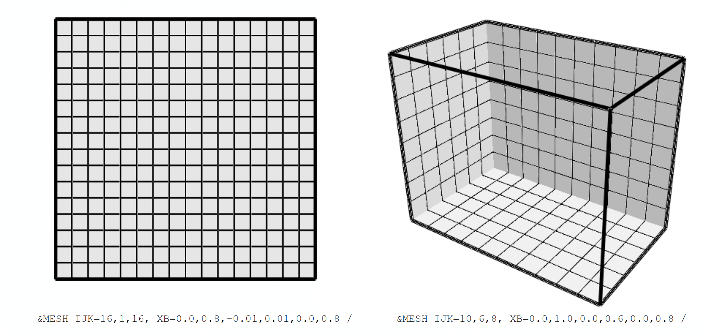{fig-alt="Structured box mesh with the same boundary condition on every side."}
:::

:::

## Local Single Mesh Poisson Solvers {.fft-eigen-slide}

::: {.slide-layout}

::: {.sub-head}
Fast trigonometric transform Solver FFT:
:::

::: {.body}
Assume discretized system symmetric positive definite (SPD):
:::

::: {.eq1}
$$\mathbf{A}_{N\times N}\boldsymbol{H}_{N\times 1} =\boldsymbol{R}_{N\times 1}$$
:::

::: {.body2}
Method of solution using Eigenvalues/Eigenvectors, [imagine I have them]{style='color:#ff0000'}:
:::

::: {.eq2}
$$\mathbf{A}\boldsymbol{q}_{\boldsymbol{i},N\times 1} =\lambda_{i}\boldsymbol{q}_{\boldsymbol{i},N\times 1}$$
:::

::: {.lab1}
Eigenvalue problem.
:::

::: {.eq3}
$$\lambda_{i},\ i=1,\dots ,N$$
:::

::: {.lab2}
Eigenvalues, all real, same sign (SPD).
:::

::: {.eq4}
$$\boldsymbol{q}_{\boldsymbol{i},N\times 1},\ i=1,\dots ,N$$
:::

::: {.lab3}
Corresponding eigenvectors, real (SPD).
:::

::: {.ask}
How would I use them to solve my Poisson equation linear system?
:::

:::

## Local Single Mesh Poisson Solvers {.fft-eigendecomp-slide}

::: {.slide-layout}

::: {.sub-head}
Fast trigonometric transform Solver FFT:
:::

::: {.body}
Stack the eigenvectors in columns of a matrix:
:::

::: {.eqQ}
$$\mathbf{Q}_{N\times N}=\left[ \begin{matrix} \boldsymbol{q}_{1} & \dots & \boldsymbol{q}_{N} \end{matrix} \right]$$
:::

::: {.withprop}
with property
:::

::: {.eqOrth}
$$\mathbf{Q}^{-1}=\mathbf{Q}^{T}$$
:::

::: {.recast}
Recast for all $\lambda_{i}$'s:
:::

::: {.eqBig}
$$\left[ \begin{matrix} a_{11} & \cdots & a_{1N} \\ \vdots & \ddots & \vdots \\ a_{N1} & \cdots & a_{NN} \end{matrix} \right]\left[ \begin{matrix} \boldsymbol{q}_{1} & \boldsymbol{q}_{2} & \cdots & \boldsymbol{q}_{N} \end{matrix} \right]=\left[ \begin{matrix} \boldsymbol{q}_{1} & \boldsymbol{q}_{2} & \cdots & \boldsymbol{q}_{N} \end{matrix} \right]\left[ \begin{matrix} \lambda_{1} & \cdots & 0 \\ \vdots & \ddots & \vdots \\ 0 & \cdots & \lambda_{N} \end{matrix} \right]$$
:::

::: {.aq-a}
$\mathbf{A}$
:::

::: {.aq-q1}
$\mathbf{Q}$
:::

::: {.aq-eq}
$=$
:::

::: {.aq-q2}
$\mathbf{Q}$
:::

::: {.aq-l}
$\boldsymbol{\Lambda}$
:::

::: {.orlab}
or
:::

::: {.eqFact}
$$\mathbf{A} =\mathbf{Q}\boldsymbol{\Lambda}\mathbf{Q}^{T}$$
:::

::: {.wherelab}
where
:::

::: {.eqLam}
$$\boldsymbol{\Lambda}_{N\times N}=\left[ \begin{matrix} \lambda_{1} & \cdots & 0 \\ \vdots & \ddots & \vdots \\ 0 & \cdots & \lambda_{N} \end{matrix} \right]$$
:::

::: {.lamlab}
Eigenvalue diagonal matrix.
:::

:::

## Local Single Mesh Poisson Solvers {.fft-transform-slide}

::: {.slide-layout}

::: {.sub-head}
Fast trigonometric transform Solver FFT:
:::

::: {.back .dash-item}
Back to our linear system:
:::

::: {.eqAH}
$$\mathbf{A}\boldsymbol{H}=\boldsymbol{R}$$
:::

::: {.recast .dash-item}
Recast for all $\lambda_{i}$'s:
:::

::: {.eqAQ}
$$\mathbf{A}\mathbf{Q} =\mathbf{Q}\boldsymbol{\Lambda}$$
:::

::: {.eqQLQ}
$$\textcolor{red}{\mathbf{Q}\boldsymbol{\Lambda}\mathbf{Q}^{T}}\boldsymbol{H}=\boldsymbol{R}$$
:::

::: {.wherelab}
where
:::

::: {.eqLam}
$$\boldsymbol{\Lambda}_{N\times N}=\left[ \begin{matrix} \lambda_{1} & \cdots & 0 \\ \vdots & \ddots & \vdots \\ 0 & \cdots & \lambda_{N} \end{matrix} \right]$$
:::

::: {.orlab}
or
:::

::: {.eqLQ}
$$\textcolor{red}{\boldsymbol{\Lambda}\mathbf{Q}^{T}}\boldsymbol{H}=\textcolor{red}{\mathbf{Q}^{T}}\boldsymbol{R}$$
:::

::: {.acts}
$\mathbf{Q}^{T}$ acts as a linear transformation:
:::

::: {.eqHhat}
$$\hat{\boldsymbol{H}}=\textcolor{red}{\mathbf{Q}^{T}}\boldsymbol{H}$$
:::

::: {.comma}
,
:::

::: {.eqRhat}
$$\hat{\boldsymbol{R}}=\textcolor{red}{\mathbf{Q}^{T}}\boldsymbol{R}$$
:::

::: {.modal}
Solution and RHS in transformed space (modal, wave space).
:::

::: {.inlab}
In transformed space:
:::

::: {.eqDiag}
$$\textcolor{red}{\boldsymbol{\Lambda}}\hat{\boldsymbol{H}}=\hat{\boldsymbol{R}}$$
:::

::: {.cheap}
System is diagonal! Very cheap to solve!
:::

:::

## Local Single Mesh Poisson Solvers {.fft-procedure-slide}

::: {.slide-layout}

::: {.sub-head}
Fast trigonometric transform Solver FFT:
:::

::: {.body .dash-item}
Procedure using Eigendecomposition:
:::

::: {.step1}
1. Compute
:::

::: {.eq1}
$$\hat{\boldsymbol{R}}=\textcolor{red}{\mathbf{Q}^{T}}\boldsymbol{R}$$
:::

::: {.cost1}
, cost $N^{2}$ FP multiplications
:::

::: {.step2}
2. Compute
:::

::: {.eq2}
$$\textcolor{red}{\boldsymbol{\Lambda}}\hat{\boldsymbol{H}}=\hat{\boldsymbol{R}}$$
:::

::: {.cost2}
, cost $N$ FP divisions
:::

::: {.step3}
3. Compute
:::

::: {.eq3}
$$\boldsymbol{H}=\textcolor{red}{\mathbf{Q}}\hat{\boldsymbol{H}}$$
:::

::: {.cost3}
, cost $N^{2}$ FP multiplications
:::

::: {.need}
Need to get eigen values/vectors and eigenvector matrix is full.
:::

::: {.note}
- For our matrix Eigenvectors and eigenvalues can be defined analytically.
- We never build $\mathbf{A}$.
:::

:::

## Local Single Mesh Poisson Solvers {.fft-cost-slide}

::: {.slide-layout}

::: {.sub-head}
Fast trigonometric Solver FFT\*:
:::

::: {.body}
- The [$\mathbf{Q}^{T}$]{style='color:#ff0000'} transformation entries are the same as the basis of a [forward 2D or 3D trigonometric transform]{style='color:#ff0000'} (discrete sine, cosine, real Fourier transform).
- The [$\mathbf{Q}$]{style='color:#ff0000'} product is equivalent to an [inverse 2D or 3D trigonometric transform]{style='color:#ff0000'}.
:::

::: {.body3}
- [Fast Trigonometric transforms can be used]{style='color:#ff0000'} reducing the cost to:
:::

::: {.c2d}
2D: $N=N_{x}\times N_{y}$, cost from $\textcolor{red}{2}\textcolor{#0070c0}{N^{2}}\textcolor{red}{+N}$ FPs down to $\textcolor{red}{2}\textcolor{#0070c0}{N\left( \log \left( N_{x} \right)+\log \left( N_{y} \right) \right)}\textcolor{red}{+N}$
:::

::: {.c3d}
3D: $N=N_{x}\times N_{y}\times N_{z}$, cost from $\textcolor{red}{2}\textcolor{#0070c0}{N^{2}}\textcolor{red}{+N}$ FPs down to $\textcolor{red}{2}\textcolor{#0070c0}{N\left( \log \left( N_{x} \right)+\log \left( N_{y} \right)+\log \left( N_{z} \right) \right)}\textcolor{red}{+N}$
:::

::: {.punch}
Fast trigonometric Solvers are the most efficient Poisson solvers for block-structured grids!
:::

::: {.refs}
\*<https://github.com/NCAR/NCAR-Classic-Libraries-for-Geophysics/tree/main/FishPack>
:::

:::

## Running the class examples {.run-examples-slide}

::: {.slide-layout}

::: {.sub-head}
Every example is run the same way:
:::

::: {.steps}
1. **Go to the case:** `cd 04_Pressure/Cases/example_1`
2. **Pick the solver:** leave one `&PRES` line active in `Example_1.fds`.\
   [Examples 4–5 have one input file per solver instead.]{.aside}
3. **Copy the input into `results/`, named for the solver:**\
   `cp Example_1.fds results/Example_1_FFT.fds`\
   `cd results`, set [`CHID`]{.red}`='Example_1_FFT'` — **[don't forget!]{.red}**
4. **Run it, one MPI process per mesh:**\
   `mpirun -n 1 fds Example_1_FFT.fds`
5. **Look at it:** `Example_1_FFT.out`; `smokeview Example_1_FFT` from `results/`; `python eval.py` from the case directory for the plots.
:::

::: {.shortcut}
*macOS / Linux: `./run.sh FFT` does steps 3 and 4, and stops if the active `&PRES` line is not the one you named.*

*Windows: the same steps in the CMDfds prompt, `copy` for `cp` and `mpiexec` for `mpirun`.*
:::

::: {.sub-head2}
Each case directory:
:::

::: {.tree}
<pre>example_1/
  Example_1.fds   the input
  README.md       exact steps, what to look for
  run.sh          steps 3–4 for you
  eval.py         plots, into plots/
  results/        your runs
  reference/      our runs, made before class</pre>
:::

::: {.tbl .cases}
| Case | MPI `-n` | Runs in class? |
|---|---|---|
| `example_1` | 1 | yes, seconds |
| `example_2` | 1 | yes, seconds |
| `example_3` | 8 | yes, minutes |
| `example_4` | 16 | no, cluster |
| `example_5` | 8 | no, hours |
:::

::: {.fallback}
No run of your own? `eval.py` falls back to `reference/`, so every figure can be made on a laptop.
:::

:::

## Example 1: Single Mesh Example using FFT, part (a). {.ex1-input-slide}

::: {.slide-layout}

::: {.file}
**FDS Input file:** `Example_1.fds`{style='color:#222'}
:::

::: {.step}
**1. Open and review input file.**
:::

::: {.sub-head}
Key FDS input file lines:
:::

::: {.body}
`&PRES`{style='color:#ff0000'} line: Manages all parameters pertaining to pressure solver.

- `SOLVER`{style='color:#ff0000'}`='FFT'`{style='color:#222'} (default).
- `VELOCITY_TOLERANCE`{style='color:#ff0000'} (i.e. 0.001 m/s maximum error)
- `MAX_PRESSURE_ITERATIONS`{style='color:#ff0000'} (i.e. stop at 100 if `VELOCITY_TOLERANCE`{style='color:#222'} not reached)
:::

::: {.fig}
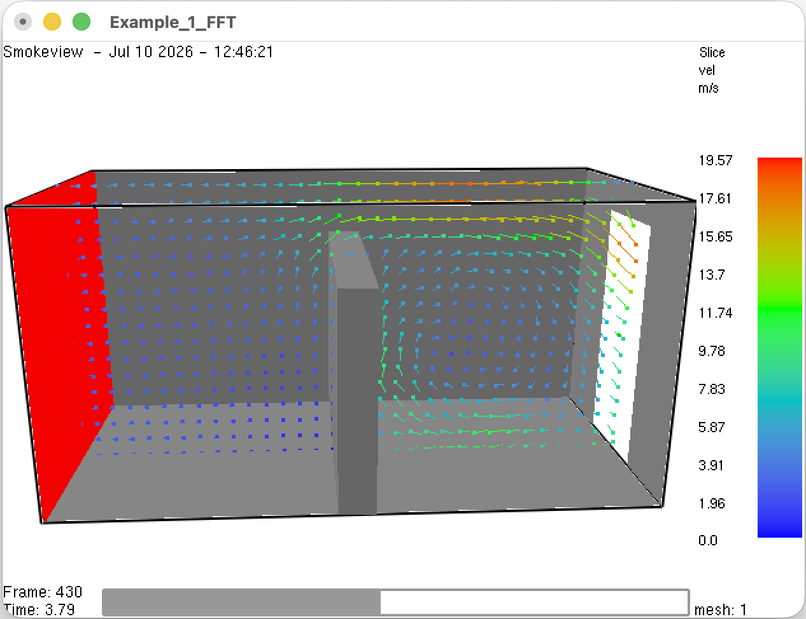{fig-alt="Smokeview view of the Example_1 case: a velocity slice through the box with a central obstruction."}
:::

:::

## Example 1: Single Mesh Example using FFT, part (a). {.ex1-default-slide}

::: {.slide-layout}

::: {.file}
**FDS Input file:** `Example_1.fds`{style='color:#222'}
:::

::: {.step}
**2. Run case with [default]{style='color:#ff0000'} parameters (as is).**
:::

::: {.body}
- `SOLVER`{style='color:#ff0000'}`='FFT'`{style='color:#222'} (default).
- `VELOCITY_TOLERANCE`{style='color:#ff0000'} ($\Delta x/2$ m/s)
- `MAX_PRESSURE_ITERATIONS`{style='color:#ff0000'} (10)
:::

::: {.look}
Run it with steps **[3–4]{style='color:#ff0000'}** of [*Running the class examples*](#running-the-class-examples), with `CHID`{style='color:#ff0000'}`='Example_1_FFT'`{style='color:#222'} — **[don't forget!]{style='color:#ff0000'}**

The output file will be `Example_1_FFT.out`{style='color:#222'}.
:::

::: {.fig}
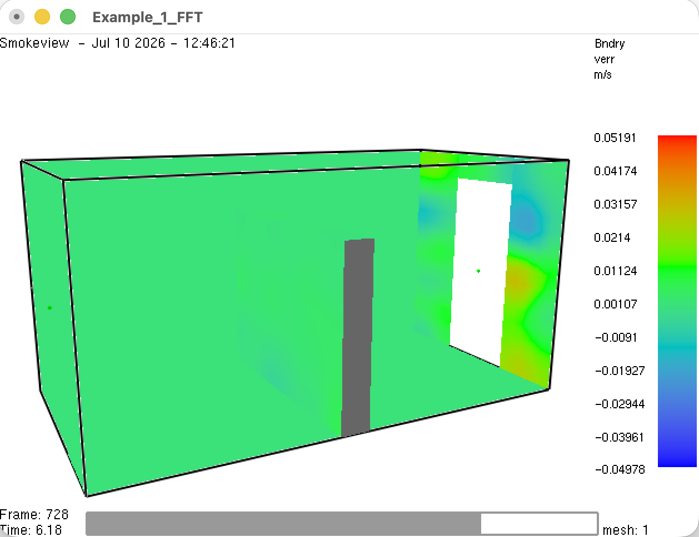{fig-alt="Smokeview view of the case showing penetration error at the obstacle and the back wall."}
:::

::: {.lab-back}
**Penetration error in back wall**
:::

::: {.arrow-back}
<svg viewBox="0 0 51.84 47.70" width="100%" style="overflow:visible;display:block" xmlns="http://www.w3.org/2000/svg" aria-hidden="true"><defs><marker id="ar30a" viewBox="0 0 10 10" refX="10" refY="5" markerWidth="4" markerHeight="4" orient="auto"><path d="M0,0 L10,5 L0,10 z" fill="#156082"/></marker></defs><line x1="0.00" y1="0.00" x2="51.84" y2="47.70" stroke="#156082" stroke-width="4.17" marker-end="url(#ar30a)"/></svg>
:::

::: {.lab-obst}
**Penetration error in OBSTacle**
:::

::: {.arrow-obst}
<svg viewBox="0 0 32.32 70.20" width="100%" style="overflow:visible;display:block" xmlns="http://www.w3.org/2000/svg" aria-hidden="true"><defs><marker id="ar30b" viewBox="0 0 10 10" refX="10" refY="5" markerWidth="4" markerHeight="4" orient="auto"><path d="M0,0 L10,5 L0,10 z" fill="#156082"/></marker></defs><line x1="32.32" y1="70.20" x2="0.00" y2="0.00" stroke="#156082" stroke-width="4.17" marker-end="url(#ar30b)"/></svg>
:::

:::

## Example 1: Single Mesh Example using FFT, part (a). {.ex1-stats-slide}

::: {.slide-layout}

::: {.sub-head}
Run Time statistics (`Example_1_FFT.out` file):
:::

::: {.fig}
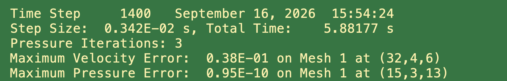{fig-alt="Table of run-time statistics from the run's .out file."}
:::

::: {.ring-iter}
<svg viewBox="0 0 67.84 53.82" width="100%" style="overflow:visible;display:block" xmlns="http://www.w3.org/2000/svg" aria-hidden="true"><ellipse cx="33.92" cy="26.91" rx="33.92" ry="26.91" fill="none" stroke="#042433" stroke-width="7.92"/></svg>
:::

::: {.ring-err}
<svg viewBox="0 0 202.40 54.45" width="100%" style="overflow:visible;display:block" xmlns="http://www.w3.org/2000/svg" aria-hidden="true"><ellipse cx="101.20" cy="27.22" rx="101.20" ry="27.22" fill="none" stroke="#042433" stroke-width="7.92"/></svg>
:::

::: {.ring-idx}
<svg viewBox="0 0 203.20 54.45" width="100%" style="overflow:visible;display:block" xmlns="http://www.w3.org/2000/svg" aria-hidden="true"><ellipse cx="101.60" cy="27.22" rx="101.60" ry="27.22" fill="none" stroke="#042433" stroke-width="7.92"/></svg>
:::

::: {.arr-iter}
<svg viewBox="0 0 192.96 85.14" width="100%" style="overflow:visible;display:block" xmlns="http://www.w3.org/2000/svg" aria-hidden="true"><defs><marker id="ar31a" viewBox="0 0 10 10" refX="10" refY="5" markerWidth="4" markerHeight="4" orient="auto"><path d="M0,0 L10,5 L0,10 z" fill="#FFC000"/></marker></defs><line x1="0.00" y1="85.14" x2="192.96" y2="0.00" stroke="#FFC000" stroke-width="7.08" marker-end="url(#ar31a)"/></svg>
:::

::: {.arr-err}
<svg viewBox="0 0 15.36 46.35" width="100%" style="overflow:visible;display:block" xmlns="http://www.w3.org/2000/svg" aria-hidden="true"><defs><marker id="ar31b" viewBox="0 0 10 10" refX="10" refY="5" markerWidth="4" markerHeight="4" orient="auto"><path d="M0,0 L10,5 L0,10 z" fill="#FFC000"/></marker></defs><line x1="0.00" y1="46.35" x2="15.36" y2="0.00" stroke="#FFC000" stroke-width="7.08" marker-end="url(#ar31b)"/></svg>
:::

::: {.arr-idx}
<svg viewBox="0 0 11.20 49.50" width="100%" style="overflow:visible;display:block" xmlns="http://www.w3.org/2000/svg" aria-hidden="true"><defs><marker id="ar31c" viewBox="0 0 10 10" refX="10" refY="5" markerWidth="4" markerHeight="4" orient="auto"><path d="M0,0 L10,5 L0,10 z" fill="#FFC000"/></marker></defs><line x1="11.20" y1="49.50" x2="0.00" y2="0.00" stroke="#FFC000" stroke-width="7.08" marker-end="url(#ar31c)"/></svg>
:::

::: {.lab-iter}
**Pressure iterations taken.**
:::

::: {.lab-err}
**Maximum velocity error achieved.**
:::

::: {.lab-idx}
**Mesh and cell indices where maximum velocity error is.**
:::

::: {.body}
**Open Smokeview:**

- Load up Temperature Slice, what do we get? Divergence? Density?
- Load up Velocity Error Boundary slice. What do we have?

**Open `Example_1_FFT_devc.csv`{style='color:#222'} file:**

- How do `VDOT_IN`{style='color:#222'} and `VDOT_OUT`{style='color:#222'} compare at every time step?
:::

:::

## Example 1: Single Mesh Example using FFT, part (a). {.ex1-tol-slide}

::: {.slide-layout}

::: {.file}
**FDS Input file:** `Example_1.fds`{style='color:#222'}
:::

::: {.step}
**3. Run case tightening velocity tolerance:**
:::

::: {.code}
**`&PRES VELOCITY_TOLERANCE=0.001, MAX_PRESSURE_ITERATIONS=50/`{style='color:#ff0000'}**
:::

::: {.redo}
Repeat steps **[3–4]{style='color:#ff0000'}** of [*Running the class examples*](#running-the-class-examples) with `CHID='Example_1_FFT_tight'`{style='color:#222'}.
:::

::: {.ask}
**Is the velocity error reduced in Smokeview? what about volume flows in and out?**
:::

::: {.fig-l}
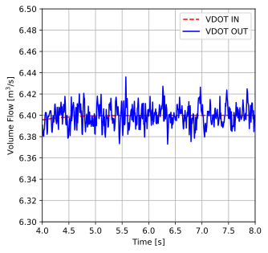{fig-alt="Volume flow in and out versus time with default settings; the traces oscillate."}
:::

::: {.fig-r}
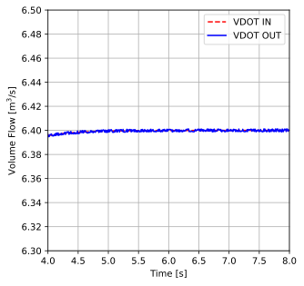{fig-alt="Volume flow in and out versus time with a tightened velocity tolerance; the traces overlap."}
:::

::: {.cap-l}
**`Default`{style='color:#222'}**
:::

::: {.cap-r}
**`VELOCITY_TOLERANCE=0.001`{style='color:#222'}**
:::

:::

## Some important &PRES parameters: {.pres-params-slide}

::: {.slide-layout}

::: {.body}
- `&PRES SOLVER defines which Poisson solver to use (FFT,ULMAT,UGLMAT).`{style='color:#ff0000'}
:::

::: {.tbl}
| Namelist | Parameter | Default | Unit | Usage |
|---|---|---|---|---|
| `&PRES` | `VELOCITY_TOLERANCE` | dx/2 | m/s | Requested tolerance for velocity error. |
| | `MAX_PRESSURE_ITERATIONS` | 10 | | Max number allowed for pressure iterations. |
| | `SUSPEND_PRESSURE_ITERATIONS` | F | | Suspend iterations if progress too slow? |
| | `ITERATION_SUSPEND_FACTOR` | 0.95 | | Suspend is new velocity is not smaller than this value of the old. |
| | `PRESSURE_TOLERANCE` | 20/dx² | s⁻² | Tolerance for inseparable pressure equation residual. |
| | `TUNNEL_PRECONDITIONER` | F | | Use tunnel preconditioner? |
:::

:::

## Local Single Mesh Poisson Solvers {.ulmat-intro-slide}

::: {.slide-layout}

::: {.sub-head}
ULMAT PARDISO (Unstructured Local Matrix Solver)
:::

::: {.body}
- Unstructured mesh. Only solve in gas cells, per mesh.
- We use PARDISO from Intel Math Kernel Library (MKL). Cholesky decomposition\* of sparse A.
- One matrix A per pressure zone in the mesh.
:::

::: {.fig}
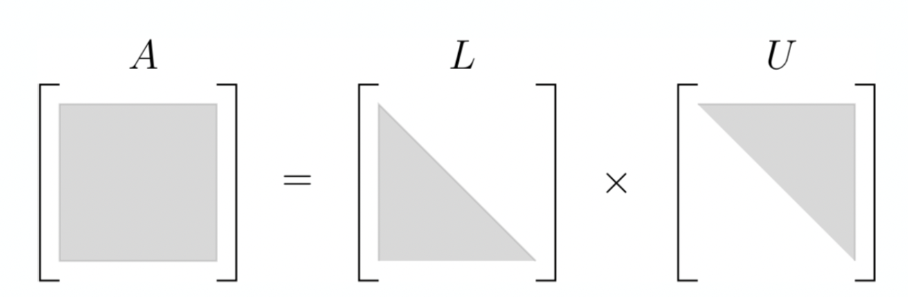{fig-alt="Sparsity of A alongside its Cholesky factor L, which has many more non-zero entries."}
:::

::: {.arr-a}
<svg viewBox="0 0 12.80 28.80" width="100%" style="overflow:visible;display:block" xmlns="http://www.w3.org/2000/svg" aria-hidden="true"><defs><marker id="ar34a" viewBox="0 0 10 10" refX="10" refY="5" markerWidth="4" markerHeight="4" orient="auto"><path d="M0,0 L10,5 L0,10 z" fill="#156082"/></marker></defs><line x1="6.40" y1="28.80" x2="6.40" y2="0.00" stroke="#156082" stroke-width="2.50" marker-end="url(#ar34a)"/></svg>
:::

::: {.arr-l}
<svg viewBox="0 0 12.80 28.80" width="100%" style="overflow:visible;display:block" xmlns="http://www.w3.org/2000/svg" aria-hidden="true"><defs><marker id="ar34b" viewBox="0 0 10 10" refX="10" refY="5" markerWidth="4" markerHeight="4" orient="auto"><path d="M0,0 L10,5 L0,10 z" fill="#156082"/></marker></defs><line x1="6.40" y1="28.80" x2="6.40" y2="0.00" stroke="#156082" stroke-width="2.50" marker-end="url(#ar34b)"/></svg>
:::

::: {.arr-sym}
<svg viewBox="0 0 12.80 28.80" width="100%" style="overflow:visible;display:block" xmlns="http://www.w3.org/2000/svg" aria-hidden="true"><defs><marker id="ar34c" viewBox="0 0 10 10" refX="10" refY="5" markerWidth="4" markerHeight="4" orient="auto"><path d="M0,0 L10,5 L0,10 z" fill="#156082"/></marker></defs><line x1="6.40" y1="28.80" x2="6.40" y2="0.00" stroke="#156082" stroke-width="2.50" marker-end="url(#ar34c)"/></svg>
:::

::: {.lab-a}
Very Sparse, has constant coefficients.
:::

::: {.lab-l}
Lower triangular, much more non-zero entries than A.
:::

::: {.lab-sym}
A symmetric, $U=L^{T}$
:::

::: {.refs}
\* T. Davis, "Direct Methods for Sparse Linear Systems," SIAM (2006). J. Saad, "Iterative Methods for Sparse Linear Systems," 2nd Ed, SIAM (2003).
:::

:::

## Local Single Mesh Poisson Solvers {.ulmat-solve-slide}

::: {.slide-layout}

::: {.sub-head}
ULMAT PARDISO (Unstructured Local Matrix Solver)
:::

::: {.body}
- Factorization only needs to be done at setup time. Most expensive part.
- Only solve phase needs to be called when time stepping.
:::

::: {.back .dash-item}
Back to our linear system:
:::

::: {.eqAH}
$$\mathbf{A}\boldsymbol{H}=\boldsymbol{R}$$
:::

::: {.fromfac}
From factorization:
:::

::: {.eqLL}
$$\mathbf{L}\mathbf{L}^{T}\boldsymbol{H}=\boldsymbol{R}$$
:::

::: {.solve}
Solve Phase:
:::

::: {.n1}
1.
:::

::: {.eq1}
$$\mathbf{L}\boldsymbol{Y}=\boldsymbol{R}$$
:::

::: {.lab1}
Forward Substitution cost of the order of non-zeros in L
:::

::: {.n2}
2.
:::

::: {.eq2}
$$\mathbf{L}^{T}\boldsymbol{H}=\boldsymbol{Y}$$
:::

::: {.lab2}
Backward Substitution of the order of non-zeros in L
:::

:::

## Local Single Mesh Poisson Solvers {.ulmat-reorder-slide}

::: {.slide-layout}

::: {.sub-head}
Matrix reordering makes all the difference:
:::

::: {.caption}
Sparsity pattern of **L** for different matrix ordering methods
:::

::: {.fig1}
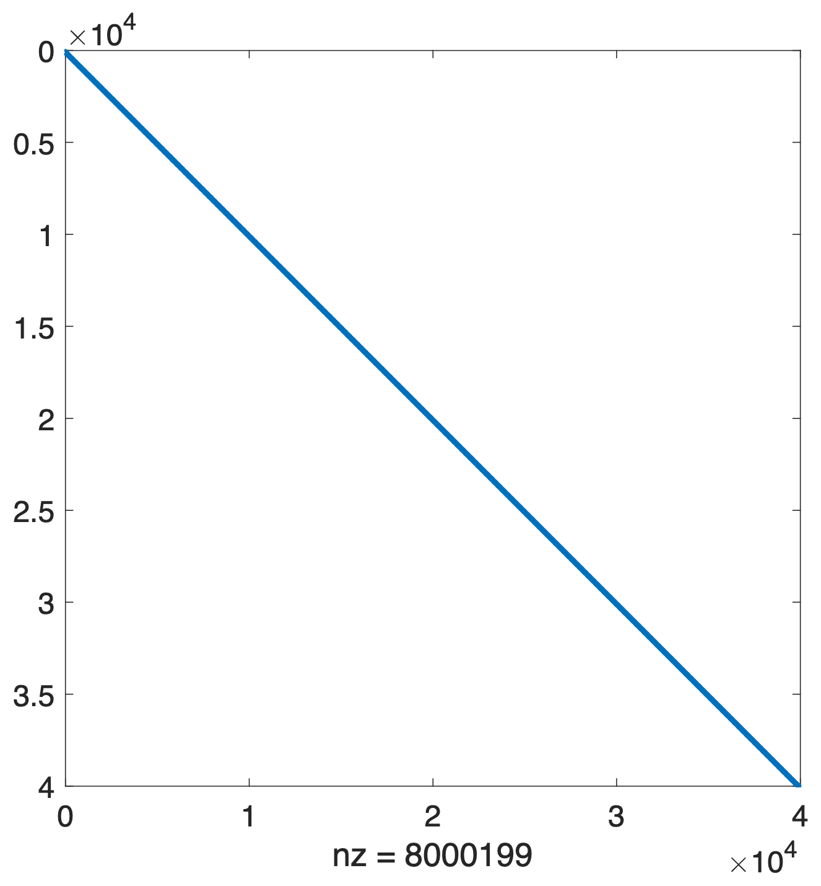{fig-alt="Sparsity of L under natural ordering."}
:::

::: {.fig2}
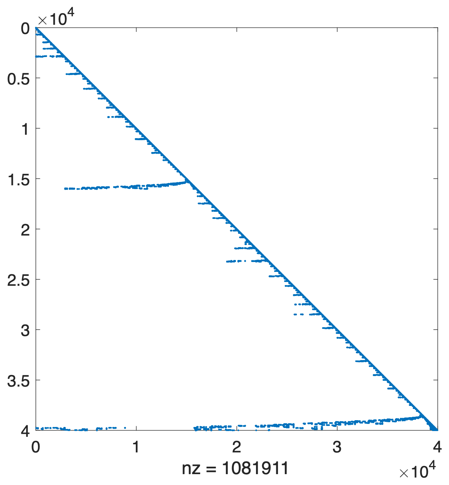{fig-alt="Sparsity of L under approximate minimum degree permutation."}
:::

::: {.fig3}
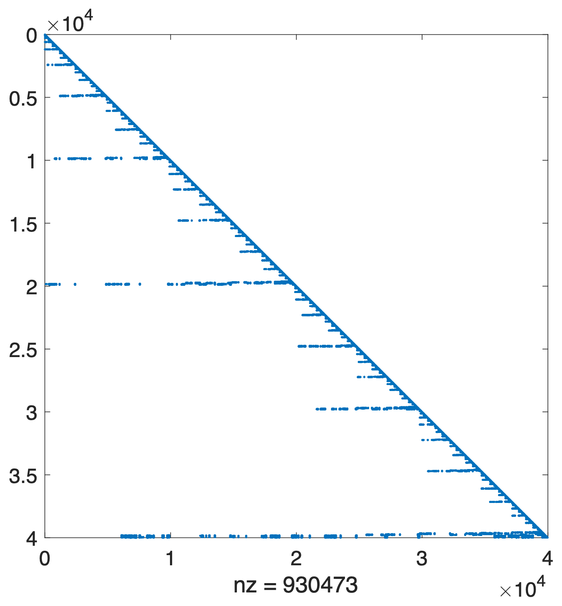{fig-alt="Sparsity of L under nested dissection permutation."}
:::

::: {.lab1}
Natural Ordering
:::

::: {.lab2}
Approximate minimum degree permutation
:::

::: {.lab3}
Nested Dissection permutation
:::

::: {.nz1}
<svg viewBox="0 0 132.96 27.36" width="100%" style="overflow:visible;display:block" xmlns="http://www.w3.org/2000/svg" aria-hidden="true"><rect x="1.25" y="1.25" width="130.46" height="24.86" fill="none" stroke="#FF0000" stroke-width="2.50"/></svg>
:::

::: {.nz2}
<svg viewBox="0 0 131.68 27.09" width="100%" style="overflow:visible;display:block" xmlns="http://www.w3.org/2000/svg" aria-hidden="true"><rect x="1.25" y="1.25" width="129.18" height="24.59" fill="none" stroke="#FF0000" stroke-width="2.50"/></svg>
:::

::: {.nz3}
<svg viewBox="0 0 120.80 27.36" width="100%" style="overflow:visible;display:block" xmlns="http://www.w3.org/2000/svg" aria-hidden="true"><rect x="1.25" y="1.25" width="118.30" height="24.86" fill="none" stroke="#FF0000" stroke-width="2.50"/></svg>
:::

::: {.n1}
1.
:::

::: {.eq1}
$$\mathbf{L}\boldsymbol{Y}=\boldsymbol{R}$$
:::

::: {.cost1}
Forward Substitution cost $\alpha N^{4/3}$ in 3D\*
:::

::: {.n2}
2.
:::

::: {.eq2}
$$\mathbf{L}^{T}\boldsymbol{H}=\boldsymbol{Y}$$
:::

::: {.cost2}
Backward Substitution cost $\alpha N^{4/3}$ in 3D\*
:::

::: {.refs-note}
\*Cubic mesh. Using nested dissection reordering at symbolic factorization stage, level of fill-in (how many non-zeros) in $\mathbf{L}$.
:::

::: {.refs-url}
<https://www.cs.cornell.edu/~bindel/class/cs4220-s16/lec/2016-02-17-notes.pdf>
:::

:::

## Example 1: Single Mesh Example using ULMAT PARDISO, part (b) {.ex1-ulmat-slide}

::: {.slide-layout}

::: {.file}
**FDS Input file:** `Example_1.fds`{style='color:#222'}
:::

::: {.step}
**1. Run case with ULMAT PARDISO:**
:::

::: {.code}
**`&PRES SOLVER='ULMAT PARDISO', CHECK_POISSON=T/`{style='color:#ff0000'}**
:::

::: {.body .dash-item}
**`CHECK_POISSON`{style='color:#ff0000'}** (default False, write verbose info on pressure solution).
:::

::: {.redo}
Repeat steps **[3–4]{style='color:#ff0000'}** of [*Running the class examples*](#running-the-class-examples) with `CHID='Example_1_ULMAT_PARDISO'`{style='color:#222'}.
:::

::: {.ask}
**Is the velocity error reduced in Smokeview? what about volume flows in and out?**
:::

::: {.tbl}
| Solver | Maximum In-Out Volume flow Difference (%) |
|---|---|
| FFT Default | 0.566% |
| FFT `VELOCITY_TOLERANCE=0.001` | -0.0198% |
| ULMAT PARDISO | -6.25E-13% |
:::

::: {.fig}
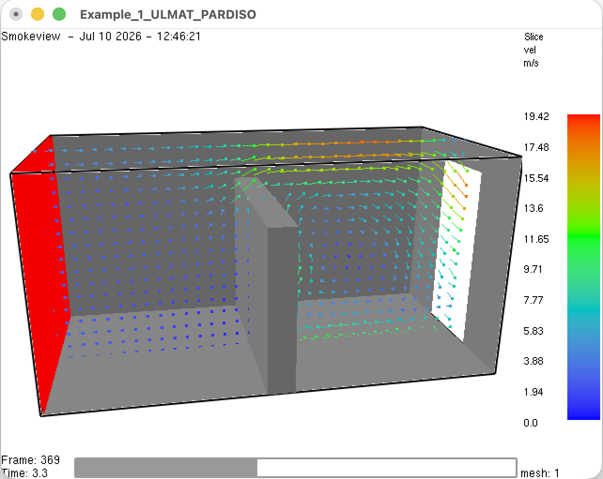{fig-alt="Excerpt of the input file with the ULMAT PARDISO solver selected."}
:::

:::

## Example 1: Single Mesh Example using ULMAT PARDISO, part (b) {.ex1-fillin-slide}

::: {.slide-layout}

::: {.file}
**FDS Input file:** `Example_1.fds`{style='color:#222'}
:::

::: {.step}
**3. Note we have `CHECK_POISSON=T`{style='color:#222'} in `&PRES`{style='color:#222'}.**
:::

::: {.body}
**This makes MKL Pardiso write verbose Factorization Step.**
:::

::: {.tbl}
| Mesh Size | Unknowns (N) | Non-zeros in $\mathbf{A}_{N\times N}$ | Non-zeros in $\mathbf{L}_{N\times N}$ | Ratio L/A |
|---|---|---|---|---|
| 32x16x16 | 7.8k | 29.8k | 535k | 18 |
| 64x32x32 | 62.5k | 244k | 11.2m | 46 |
| 128x64x64 | 499.7k | 1.98m | 225.5m | 114 |
:::

::: {.arr-fill}
<svg viewBox="0 0 14.40 169.83" width="100%" style="overflow:visible;display:block" xmlns="http://www.w3.org/2000/svg" aria-hidden="true"><defs><marker id="ar38" viewBox="0 0 10 10" refX="10" refY="5" markerWidth="4" markerHeight="4" orient="auto"><path d="M0,0 L10,5 L0,10 z" fill="#FF0000"/></marker></defs><line x1="7.20" y1="0.00" x2="7.20" y2="169.83" stroke="#FF0000" stroke-width="4.58" marker-end="url(#ar38)"/></svg>
:::

::: {.scaling}
$\sim N^{4.4/3}$
:::

::: {.note}
- Solve cost and memory usage increase proportionally to non-zeros in L.
- Rule of thumb is to keep meshes below ~ 50³ cells.
:::

:::

## Local Single Mesh Poisson Solvers {.hypre-slide}

::: {.slide-layout}

::: {.sub-head}
ULMAT HYPRE (Unstructured Local Matrix Solver)
:::

::: {.body}
- Unstructured mesh. Only solve in gas cells, per mesh.
- We use Conjugate Gradient iterative algorithm from HYPRE library.
- Algebraic Multigrid Preconditioner.
- One matrix A per pressure zone in each mesh.
- Memory usage ~5-8 Number of non-zeros in matrix A.
:::

::: {.body2}
- Solution is essentially the same as with LU.
- Solver can be slower than ULMAT PARDISO.
- Memory: much more scalable for large problems.
:::

::: {.fig}
{fig-alt="HYPRE library documentation page."}
:::

::: {.refs}
<https://hypre.readthedocs.io/en/latest/index.html>
:::

:::

## Example 1: Single Mesh Example using ULMAT HYPRE, part (c) {.ex1-hypre-slide}

::: {.slide-layout}

::: {.file}
**FDS Input file:** `Example_1.fds`{style='color:#222'}
:::

::: {.step}
**1. Run case with ULMAT HYPRE:**
:::

::: {.code}
**`&PRES SOLVER='ULMAT HYPRE', CHECK_POISSON=T/`{style='color:#ff0000'}**
:::

::: {.redo}
Repeat steps **[3–4]{style='color:#ff0000'}** of [*Running the class examples*](#running-the-class-examples) with `CHID='Example_1_ULMAT_HYPRE'`{style='color:#222'}.
:::

::: {.tbl}
| Solver | Maximum In-Out Volume flow Difference (%) |
|---|---|
| FFT Default | 0.566% |
| FFT `VELOCITY_TOLERANCE=0.001` | -0.0198% |
| ULMAT PARDISO | -6.25E-13% |
| ULMAT HYPRE | -2.19E-11% |
:::

::: {.fig}
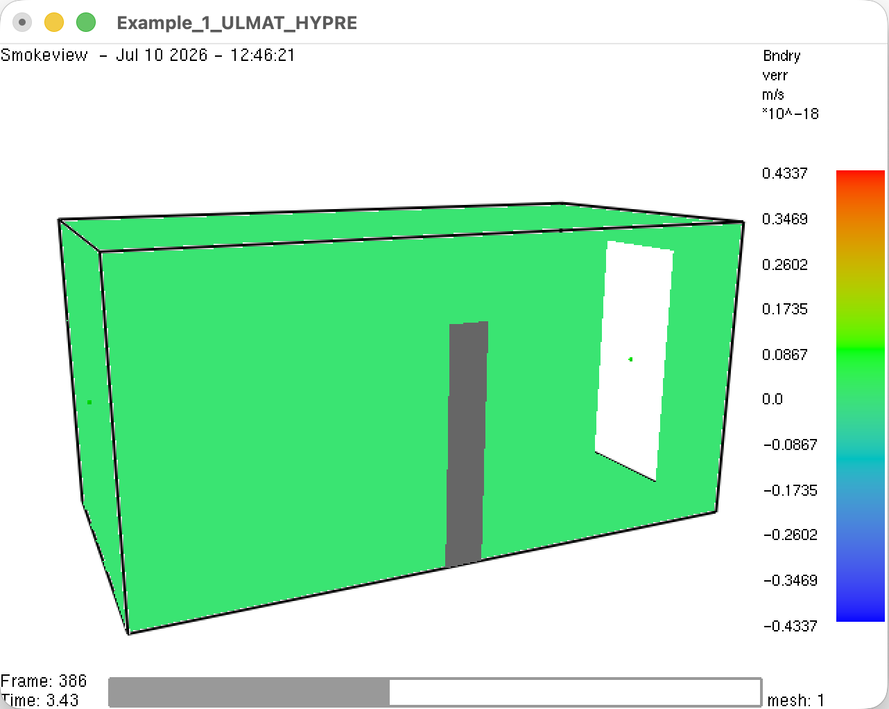{fig-alt="Run output for the ULMAT HYPRE solver."}
:::

:::

## Local Single Mesh Poisson Solvers Recap: {.solver-recap-slide}

::: {.slide-layout}

::: {.body}
**FFT:**

- Exploits the space of solutions of the Poisson Equation.
- Makes use of Fast trigonometric transforms.
- Works with simple logically cartesian grids.
- Fastest algorithm.
- For internal boundaries (OBSTS) requires iteration to reduce velocity error.

**ULMAT PARDISO:**

- Solves only on gas cells.
- Factors the Poisson Matrix using Cholesky decomposition.
- Fast for small number of cells.
- Factorization matrix can require a lot of memory to store and use.

**ULMAT HYPRE:**

- Solves only on gas cells.
- Iterative Method from HYPRE library.
- Slower than the previous for small number of cells.
- Memory efficient, only option when PARDISO not available to compile FDS (ARM Mac builds).
:::

:::

## Unstructured meshes – Cut-cell method for geometries {.cutcell-intro-slide}

::: {.slide-layout}

::: {.sub-head}
Boundary conforming: Cut-cell (embedded boundary) methods\*
:::

::: {.body}
- Structured Cartesian mesh acts as background regular mesh, cut-cell polyhedra defined where geometry intersects grid.
- We cut-off the mesh outside of the solution domain (for us the gas phase).
- We are left with discretizing governing equations in cut-cell region.
:::

::: {.fig-l}
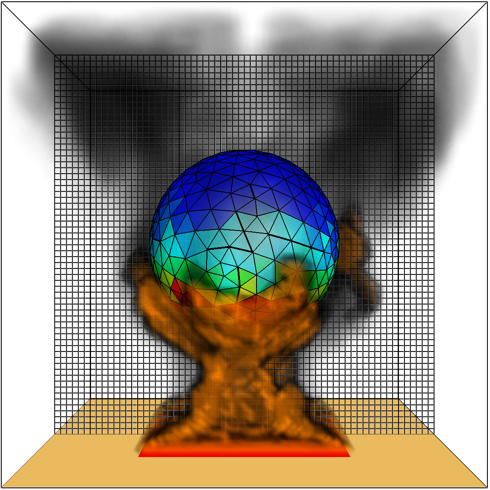{fig-alt="Sphere geometry embedded in a background Cartesian mesh."}
:::

::: {.box-detail}
<svg viewBox="0 0 46.56 41.49" width="100%" style="overflow:visible;display:block" xmlns="http://www.w3.org/2000/svg" aria-hidden="true"><rect x="1.88" y="1.88" width="42.81" height="37.74" fill="none" stroke="#FF0000" stroke-width="3.75"/></svg>
:::

::: {.fig-m}
<svg viewBox="0 0 408.00 77.40" width="100%" style="overflow:visible;display:block" xmlns="http://www.w3.org/2000/svg" aria-hidden="true"><path d="M0,0 H204.00 V77.40 H408.00" fill="none" stroke="#FF0000" stroke-width="5.83" stroke-linecap="square"/></svg>
:::

::: {.fig-r}
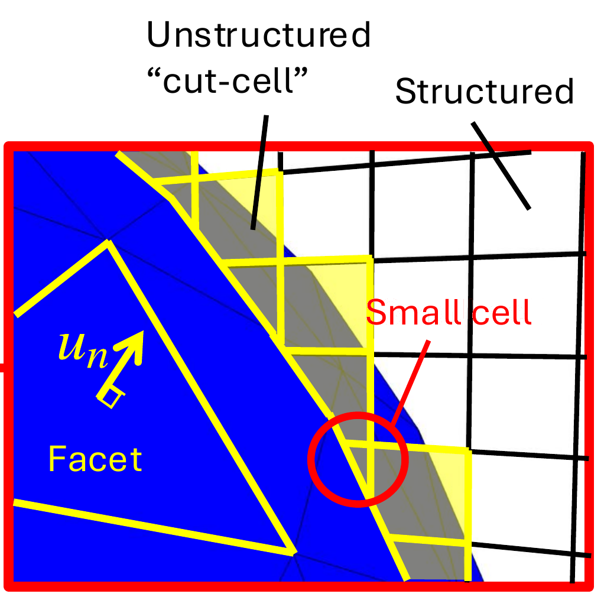{fig-alt="Close-up where the geometry crosses the grid: yellow cut-cell polyhedra against the structured cells, with a small cell circled."}
:::

::: {.refs}
\* M. Berger, "Cut Cells: Meshes and Solvers," *Handbook of Numerical Analysis* **18** (2017).
:::

:::

## Unstructured meshes – Cut-cell method for geometries {.cutcell-prosecons-slide}

::: {.slide-layout}

::: {.sub-head}
Advantages:
:::

::: {.adv}
- Well suited for conservative discretization (volumes and boundaries well defined).
- Complexity remains local to geometry surface.
- Cost of grid generation is buried in work to define cut-cells. Burden on surface meshing.
- Body surface mesh can be of different size than Cartesian grid.
- We have efficient cut-cell computation schemes.
- Resulting meshes are computationally efficient, most cells are regular.
:::

::: {.sub-head2}
Disadvantages:
:::

::: {.dis}
- Cut-cells are very irregular polyhedra.
- Stability/conditioning issues due to small cut-cells (explicit time integration, linear system solution).
- Can't define boundary layer meshes close to body (like chimera/overset meshes).
- Wall modeled IBM is an open problem, we have to stick to unstructured projection and expensive Poisson solvers.
:::

::: {.fig-t}
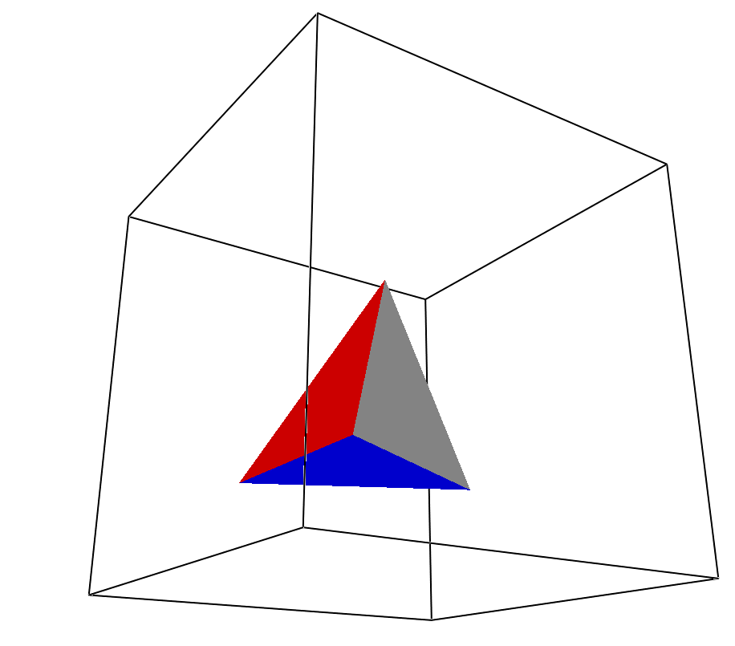{fig-alt="Smokeview view of a tetrahedron GEOM inside the mesh, its faces coloured by SURF: red, blue and grey."}
:::

::: {.fig-b .fit}
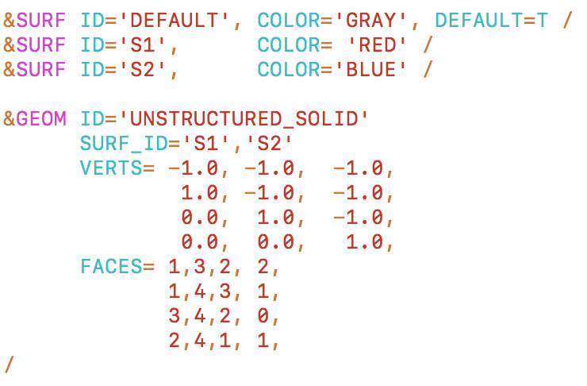{fig-alt="FDS input for the tetrahedron: three &SURF lines and a &GEOM with VERTS and FACES."}
:::

:::

::: {.notes}
The three slides that follow -- the finite volume discretization and the small-cell treatment -- are for a longer sitting. If time is short, go straight from here to the unstructured Poisson solve.
:::

## Unstructured meshes – Cut-cell method for geometries {.fv-species-slide}

::: {.slide-layout}

::: {.sub-head}
Species transport based on mass fractions:
:::

::: {.eq-lhs}
{fig-alt="Species transport equation, left-hand side."}
:::

::: {.lab-conv}
Convective mass flux.
:::

::: {.lab-fick}
Ficks Law, binary diffusion into background species.
:::

::: {.eq-full}
{fig-alt="Full species transport equation."}
:::

::: {.domain}
Defined on domain $\Omega$, with initial and BCs in $\partial\Omega$. Also, $\mathbf{v}(\mathbf{x},t)$, $\dot{m}_{\alpha}'''(\mathbf{x},t)$ are known.
:::

::: {.fv}
**Finite Volume method\*:** Divide the domain on $ii \rightarrow (i,j) \in \Im$ cells.
:::

::: {.eq-fv}
{fig-alt="Finite volume form of the transport equation."}
:::

::: {.lab-time}
Time derivative
:::

::: {.lab-reac}
Reaction
:::

::: {.eq-terms}
{fig-alt="Discretized time derivative and reaction terms."}
:::

::: {.domain-fig}
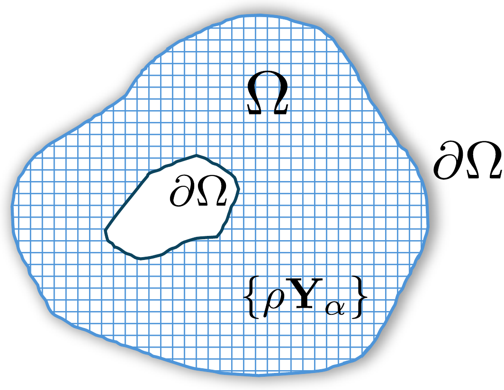{fig-alt="Hatched blob standing for the domain Omega with its boundary dOmega, a hole inside it with its own boundary, and the species mass density field carried on it."}
:::

::: {.fig}
{fig-alt="Cartesian cells cut by a solid boundary: gas-phase regular cells, cut cells either side of the boundary, and the numbered faces of cut cell ii."}
:::

::: {.arr-v}
<svg viewBox="0 0 19.20 63.09" width="100%" style="overflow:visible;display:block" xmlns="http://www.w3.org/2000/svg" aria-hidden="true"><defs><marker id="s44v" viewBox="0 0 10 10" refX="10" refY="5" markerWidth="4" markerHeight="4" orient="auto"><path d="M0,0 L10,5 L0,10 z" fill="#156082"/></marker></defs><line x1="9.60" y1="63.09" x2="9.60" y2="0.00" stroke="#156082" stroke-width="2.50" marker-end="url(#s44v)"/></svg>
:::

::: {.sym-v3}
{fig-alt="Velocity at face 3."}
:::

::: {.arr-n}
<svg viewBox="0 0 19.20 52.83" width="100%" style="overflow:visible;display:block" xmlns="http://www.w3.org/2000/svg" aria-hidden="true"><defs><marker id="s44n" viewBox="0 0 10 10" refX="10" refY="5" markerWidth="4" markerHeight="4" orient="auto"><path d="M0,0 L10,5 L0,10 z" fill="#000000"/></marker></defs><line x1="9.60" y1="0.00" x2="9.60" y2="52.83" stroke="#000000" stroke-width="2.92" marker-end="url(#s44n)"/></svg>
:::

::: {.sym-n3}
{fig-alt="Unit normal of face 3 of cell ii."}
:::

::: {.refs}
\* J. Ferziger, M. Peric, "Computational Methods for Fluid Dynamics," 3rd Edition, Springer (2001). R. Leveque, "Finite Volume Methods for Hyperbolic Problems," 1st Edition, Cambridge (2002). R. Eymard et al., "Finite Volume Methods," *Handbook of Numerical Analysis* **7** (2002).
:::

:::

::: {.notes}
Optional, with the two slides after it: the finite volume machinery is developed here on species transport, and only then applied to the Poisson equation. The Poisson slide stands on its own if these are skipped.
:::

## Unstructured meshes – Cut-cell method for geometries {.fv-terms-slide}

::: {.slide-layout}

::: {.sub-head}
Advective Term:
:::

::: {.eq-adv}
{fig-alt="Advective term of the discretized equation."}
:::

::: {.andlab}
and
:::

::: {.eq-adv2}
{fig-alt="Second advective expression."}
:::

::: {.lab-lim}
${\overline{[\rho Y_{\alpha}]}}^{fl}$: Flux limited interpolation.
:::

::: {.cutface1}
A given cut face k=3 adds to the ii equation:
:::

::: {.eq-cf1}
{fig-alt="Contribution of cut face k=3."}
:::

::: {.sub-head2}
Diffusive Term:
:::

::: {.eq-diff}
{fig-alt="Diffusive term of the discretized equation."}
:::

::: {.eq-diff2}
{fig-alt="Second diffusive expression."}
:::

::: {.cutface2}
A given cut face k=3 adds to the ii equation:
:::

::: {.eq-cf2}
{fig-alt="Contribution of cut face k=3 to the diffusive term."}
:::

::: {.arr-interp}
<svg viewBox="0 0 18.40 28.44" width="100%" style="overflow:visible;display:block" xmlns="http://www.w3.org/2000/svg" aria-hidden="true"><defs><marker id="s45i" viewBox="0 0 10 10" refX="10" refY="5" markerWidth="4" markerHeight="4" orient="auto"><path d="M0,0 L10,5 L0,10 z" fill="#000000"/></marker></defs><line x1="0.00" y1="28.44" x2="18.40" y2="0.00" stroke="#000000" stroke-width="2.92" marker-end="url(#s45i)"/></svg>
:::

::: {.arr-numdiff}
<svg viewBox="0 0 23.36 22.68" width="100%" style="overflow:visible;display:block" xmlns="http://www.w3.org/2000/svg" aria-hidden="true"><defs><marker id="s45d" viewBox="0 0 10 10" refX="10" refY="5" markerWidth="4" markerHeight="4" orient="auto"><path d="M0,0 L10,5 L0,10 z" fill="#000000"/></marker></defs><line x1="23.36" y1="22.68" x2="0.00" y2="0.00" stroke="#000000" stroke-width="2.92" marker-end="url(#s45d)"/></svg>
:::

::: {.lab-interp}
[Interpolation]{style='color:#ff0000'}
:::

::: {.lab-numdiff}
[Numerical differentiation]{style='color:#ff0000'}
:::

::: {.fig}
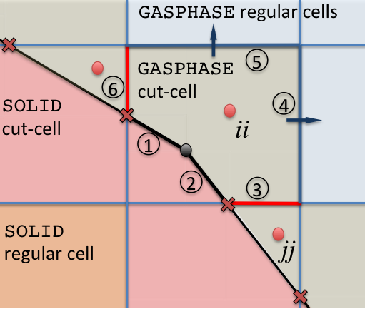{fig-alt="Cartesian cells cut by a solid boundary: gas-phase regular cells, cut cells either side of the boundary, and the numbered faces of cut cell ii."}
:::

::: {.arr-v}
<svg viewBox="0 0 19.20 63.09" width="100%" style="overflow:visible;display:block" xmlns="http://www.w3.org/2000/svg" aria-hidden="true"><defs><marker id="s45v" viewBox="0 0 10 10" refX="10" refY="5" markerWidth="4" markerHeight="4" orient="auto"><path d="M0,0 L10,5 L0,10 z" fill="#156082"/></marker></defs><line x1="9.60" y1="63.09" x2="9.60" y2="0.00" stroke="#156082" stroke-width="2.50" marker-end="url(#s45v)"/></svg>
:::

::: {.sym-v3}
{fig-alt="Velocity at face 3."}
:::

::: {.arr-n}
<svg viewBox="0 0 19.20 52.83" width="100%" style="overflow:visible;display:block" xmlns="http://www.w3.org/2000/svg" aria-hidden="true"><defs><marker id="s45n" viewBox="0 0 10 10" refX="10" refY="5" markerWidth="4" markerHeight="4" orient="auto"><path d="M0,0 L10,5 L0,10 z" fill="#000000"/></marker></defs><line x1="9.60" y1="0.00" x2="9.60" y2="52.83" stroke="#000000" stroke-width="2.92" marker-end="url(#s45n)"/></svg>
:::

::: {.sym-n3}
{fig-alt="Unit normal of face 3 of cell ii."}
:::

::: {.inpractice}
**In practice:**
:::

::: {.practice}
- **Number** cell centered **unknowns** for $\{\rho \mathbf{Y}_{\alpha}\}$.
- Build **face lists** on cut-cell region (cut-face and regular, GASPHASE or INBOUNDARY).
- Assemble source vectors running by face looping different face types.
:::

:::

## Unstructured meshes – Cut-cell method for geometries {.smallcell-slide}

::: {.slide-layout}

::: {.sub-head}
Treatment of small cells (explicit time integration):
:::

::: {.body}
Cut cell methods lead to **small** irregular cells, which penalize the time step size on explicit time integration.
:::

::: {.lit}
Literature: (a) **Cell merging**\*, **cell linking**^+^ or **cell mixing**^#^ schemes.
:::

::: {.fig}
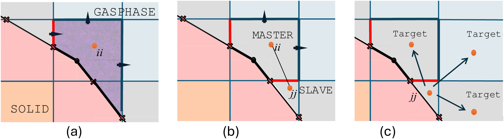{fig-alt="Three panels of the same cut cell region. (a) a small gas-phase cut cell ii shaded against the solid; (b) the same cell marked SLAVE linked to the larger MASTER cell above it; (c) three candidate target cells a small cell could be linked to, each with an arrow from the small cell."}
:::

::: {.note}
- **We link small cells to large surrounding cells at the discrete equation level.**
- **Size threshold for cells to be merged is given by `&MISC CCVOL_LINK` (0.5 default)**
- Simply assign same unknown number to small and large cell.
- Volume and flux terms will add for said unknown, cancelling out in shared faces.
:::

::: {.refs}
\*T. Ye, R. Mittal, H.S. Udaykumar, W. Shyy. *J. Comput. Phys.* **156** pp 209-240 (1999). 
+ M. P. Kirkpatrick, S. W. Armfield, J. H. Kent. *J. Comput. Phys.* **184** pp 1-36 (2003). 
\# M. Meyer, A. Devesa, S. Hickel, X. Y. Hu, N. A. Adams. *J. Comput. Phys.* **229** pp 6300-6317 (2010).
:::

:::

::: {.notes}
Last of the optional three. CCVOL_LINK comes back in Example 2 as the bonus exercise, so it is worth a word even when this slide is skipped.
:::

## Unstructured meshes – Cut-cell method for geometries {.cc-poisson-slide}

::: {.slide-layout}

::: {.sub-head}
Consider LHS of Poisson Eq. for H integrated on a cell:
:::

::: {.eq1}
{fig-alt="Left-hand side of the Poisson equation integrated over a cut cell."}
:::

::: {.approx}
Approximate:
:::

::: {.eq2}
{fig-alt="Approximated face gradient."}
:::

::: {.withlab}
With $\Delta x_{i}$ cell centroid to centroid distance in direction *i*.
:::

::: {.fig}
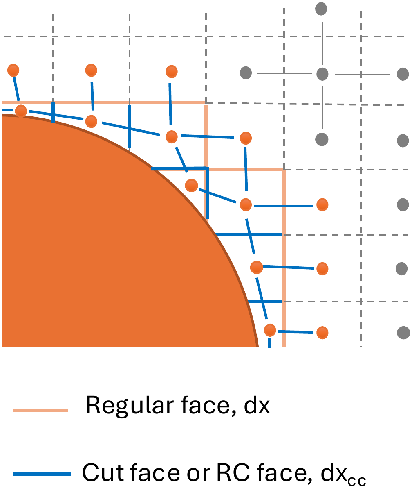{fig-alt="A curved solid cutting a Cartesian grid. Orange segments join the centroids of regular face pairs, blue segments join the centroids either side of a cut face or a regular-to-cut face."}
:::

::: {.steps}
Steps:

1. Build unstructured finite volume discretization matrix for H (face by face).
2. Invoke [unstructured linear system solver]{style='color:#ff0000'} setup (default [UGLMAT&nbsp;HYPRE]{style='color:#ff0000'} for a single pressure zone, [ULMAT&nbsp;PARDISO]{style='color:#ff0000'} when there is more than one). Note we can't use FFT, why?
3. In time marching build unstructured Poisson RHS and call [unstructured solver]{style='color:#ff0000'} when needed.
:::

:::

## Example 2: Mass balance for sphere source. {.ex2-input-slide}

::: {.slide-layout}

::: {.sub-head}
Sphere blowing Propane (isothermal flow):
:::

::: {.file}
**FDS Input file:** `Example_2.fds`
:::

::: {.body}
**Study the input file, then run it** with steps **[3–4]{style='color:#ff0000'}** of [*Running the class examples*](#running-the-class-examples), keeping `CHID='Example_2'`:

- The solver is set to `&PRES SOLVER='ULMAT PARDISO'`: why not FFT? The `ULMAT`/`UGLMAT` variants are commented out below it — try them.
- How is our tracer defined? What species is it composed of?
- How is the specified mass flux on sphere GEOM defined?
- Devices, mass balance:
    - How do we account for tracer mass into the domain?
    - How do we add the tracer mass that leaves the domain?
    - How do we get the remaining tracer mass in the domain?
:::

::: {.pid}
**PID (Proportional Integral Derivative) Control:**
:::

::: {.fig-pid}
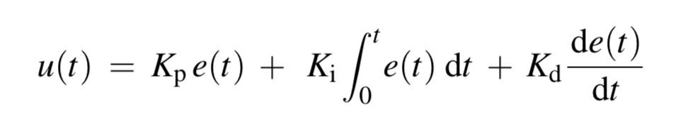{fig-alt="The PID control expression: output as a proportional gain times the error, plus an integral gain times the error integrated over time, plus a derivative gain times the rate of change of the error."}
:::

::: {.arr-p}
<svg viewBox="0 0 28.32 14.76" width="100%" style="overflow:visible;display:block" xmlns="http://www.w3.org/2000/svg" aria-hidden="true"><defs><marker id="s48p" viewBox="0 0 10 10" refX="10" refY="5" markerWidth="4" markerHeight="4" orient="auto"><path d="M0,0 L10,5 L0,10 z" fill="#156082"/></marker></defs><line x1="0.00" y1="14.76" x2="28.32" y2="0.00" stroke="#156082" stroke-width="2.50" marker-end="url(#s48p)"/></svg>
:::

::: {.arr-i}
<svg viewBox="0 0 19.20 56.97" width="100%" style="overflow:visible;display:block" xmlns="http://www.w3.org/2000/svg" aria-hidden="true"><defs><marker id="s48i" viewBox="0 0 10 10" refX="10" refY="5" markerWidth="4" markerHeight="4" orient="auto"><path d="M0,0 L10,5 L0,10 z" fill="#156082"/></marker></defs><line x1="9.60" y1="56.97" x2="9.60" y2="0.00" stroke="#156082" stroke-width="2.50" marker-end="url(#s48i)"/></svg>
:::

::: {.arr-ig}
<svg viewBox="0 0 19.20 46.98" width="100%" style="overflow:visible;display:block" xmlns="http://www.w3.org/2000/svg" aria-hidden="true"><defs><marker id="s48g" viewBox="0 0 10 10" refX="10" refY="5" markerWidth="4" markerHeight="4" orient="auto"><path d="M0,0 L10,5 L0,10 z" fill="#156082"/></marker></defs><line x1="9.60" y1="46.98" x2="9.60" y2="0.00" stroke="#156082" stroke-width="2.50" marker-end="url(#s48g)"/></svg>
:::

::: {.arr-d}
<svg viewBox="0 0 62.88 39.78" width="100%" style="overflow:visible;display:block" xmlns="http://www.w3.org/2000/svg" aria-hidden="true"><defs><marker id="s48d" viewBox="0 0 10 10" refX="10" refY="5" markerWidth="4" markerHeight="4" orient="auto"><path d="M0,0 L10,5 L0,10 z" fill="#156082"/></marker></defs><line x1="62.88" y1="39.78" x2="0.00" y2="0.00" stroke="#156082" stroke-width="2.50" marker-end="url(#s48d)"/></svg>
:::

::: {.lab-p}
PROPORTIONAL_GAIN
:::

::: {.lab-i}
INPUT_ID
:::

::: {.lab-ig}
INTEGRAL_GAIN
:::

::: {.lab-d}
DIFFERENTIAL_GAIN
:::

::: {.fig}
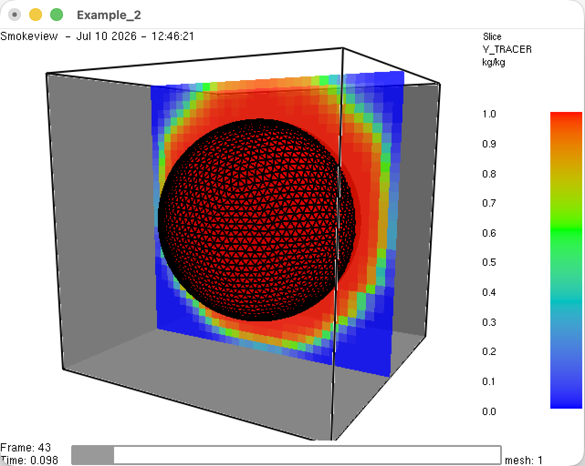{fig-alt="Smokeview view of the case: a triangulated sphere inside the domain with a slice of tracer mass fraction through it, red at the sphere surface falling to blue at the edges of the slice."}
:::

:::

## Example 2: Mass balance for sphere source. {.ex2-devc-slide}

::: {.slide-layout}

::: {.code}
<pre style="font-size:0.95em;line-height:1.3;margin:0;padding:0;background:none;box-shadow:none;white-space:pre;overflow:visible">&amp;DEVC ID='MF IN TRACER', XB=-1.4,1.4,-1.4,1.4,-1.4,1.4, QUANTITY='MASS FLUX WALL',
      SPEC_ID='TRACER', SURF_ID='SPHERE', SPATIAL_STATISTIC='SURFACE INTEGRAL'/
&amp;CTRL ID='PID IN TRACER', FUNCTION_TYPE='PID', INPUT_ID='MF IN TRACER',
      PROPORTIONAL_GAIN=0, DIFFERENTIAL_GAIN=0, INTEGRAL_GAIN=1/
&amp;DEVC XYZ=0.5,0.5,0.5, ID='MASS IN TRACER', QUANTITY='CONTROL VALUE', CTRL_ID='PID IN TRACER'/</pre>
:::

::: {.lab-mf}
'MF IN TRACER'
:::

::: {.arr-mf}
<svg viewBox="0 0 56.64 14.40" width="100%" style="overflow:visible;display:block" xmlns="http://www.w3.org/2000/svg" aria-hidden="true"><defs><marker id="s49a" viewBox="0 0 10 10" refX="10" refY="5" markerWidth="4" markerHeight="4" orient="auto"><path d="M0,0 L10,5 L0,10 z" fill="#156082"/></marker></defs><line x1="0.00" y1="7.20" x2="56.64" y2="7.20" stroke="#156082" stroke-width="2.92" marker-end="url(#s49a)"/></svg>
:::

::: {.eq-mf}
{fig-alt="Mass flux integral over the sphere surface."}
:::

::: {.lab-mass}
'MASS IN TRACER'
:::

::: {.arr-mass}
<svg viewBox="0 0 56.64 14.40" width="100%" style="overflow:visible;display:block" xmlns="http://www.w3.org/2000/svg" aria-hidden="true"><defs><marker id="s49b" viewBox="0 0 10 10" refX="10" refY="5" markerWidth="4" markerHeight="4" orient="auto"><path d="M0,0 L10,5 L0,10 z" fill="#156082"/></marker></defs><line x1="0.00" y1="7.20" x2="56.64" y2="7.20" stroke="#156082" stroke-width="2.92" marker-end="url(#s49b)"/></svg>
:::

::: {.eq-mass}
{fig-alt="Time integral of the mass flux."}
:::

::: {.csv}
**FDS file:** `Example_2_devc.csv`
:::

::: {.bal-l}
'MASS IN TRACER'
:::

::: {.bal-eq}
$\cong$
:::

::: {.bal-r1}
'MASS OUT TRACER' +
:::

::: {.bal-r2}
'MASS VOL TRACER'
:::

::: {.fig}
{fig-alt="The sphere seen from outside, its surface triangles picked out in red, inside the domain box."}
:::

::: {.sym-a}
{fig-alt="Tracer mass flux per unit area."}
:::

::: {.arr-s1}
<svg viewBox="0 0 24.00 32.31" width="100%" style="overflow:visible;display:block" xmlns="http://www.w3.org/2000/svg" aria-hidden="true"><defs><marker id="s49c" viewBox="0 0 10 10" refX="10" refY="5" markerWidth="4" markerHeight="4" orient="auto"><path d="M0,0 L10,5 L0,10 z" fill="#FF0000"/></marker></defs><line x1="0.00" y1="32.31" x2="24.00" y2="0.00" stroke="#FF0000" stroke-width="2.92" marker-end="url(#s49c)"/></svg>
:::

::: {.arr-s2}
<svg viewBox="0 0 39.52 27.90" width="100%" style="overflow:visible;display:block" xmlns="http://www.w3.org/2000/svg" aria-hidden="true"><defs><marker id="s49d" viewBox="0 0 10 10" refX="10" refY="5" markerWidth="4" markerHeight="4" orient="auto"><path d="M0,0 L10,5 L0,10 z" fill="#FF0000"/></marker></defs><line x1="0.00" y1="27.90" x2="39.52" y2="0.00" stroke="#FF0000" stroke-width="2.92" marker-end="url(#s49d)"/></svg>
:::

::: {.arr-s3}
<svg viewBox="0 0 44.16 19.44" width="100%" style="overflow:visible;display:block" xmlns="http://www.w3.org/2000/svg" aria-hidden="true"><defs><marker id="s49e" viewBox="0 0 10 10" refX="10" refY="5" markerWidth="4" markerHeight="4" orient="auto"><path d="M0,0 L10,5 L0,10 z" fill="#FF0000"/></marker></defs><line x1="0.00" y1="19.44" x2="44.16" y2="0.00" stroke="#FF0000" stroke-width="2.92" marker-end="url(#s49e)"/></svg>
:::

::: {.lab-a}
A
:::

:::

## Example 2: Mass balance for sphere source. {.ex2-balance-slide}

::: {.slide-layout}

::: {.question .dash-item}
What are the final number for mass in, mass out and mass left in domain?
:::

::: {.fig}
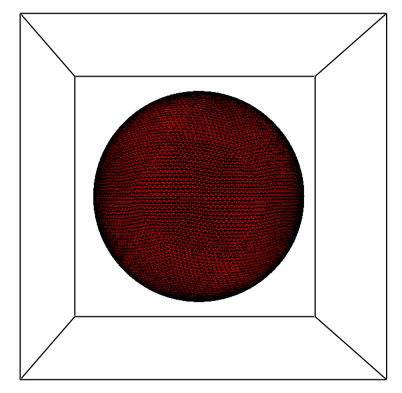{fig-alt="The sphere seen from outside, its surface triangles picked out in red, inside the domain box."}
:::

::: {.arr-out}
<svg viewBox="0 0 19.20 55.17" width="100%" style="overflow:visible;display:block" xmlns="http://www.w3.org/2000/svg" aria-hidden="true"><defs><marker id="s50o" viewBox="0 0 10 10" refX="10" refY="5" markerWidth="4" markerHeight="4" orient="auto"><path d="M0,0 L10,5 L0,10 z" fill="#156082"/></marker></defs><line x1="9.60" y1="55.17" x2="9.60" y2="0.00" stroke="#156082" stroke-width="2.92" marker-end="url(#s50o)"/></svg>
:::

::: {.arr-in1}
<svg viewBox="0 0 31.52 20.25" width="100%" style="overflow:visible;display:block" xmlns="http://www.w3.org/2000/svg" aria-hidden="true"><defs><marker id="s50a" viewBox="0 0 10 10" refX="10" refY="5" markerWidth="4" markerHeight="4" orient="auto"><path d="M0,0 L10,5 L0,10 z" fill="#FF0000"/></marker></defs><line x1="0.00" y1="20.25" x2="31.52" y2="0.00" stroke="#FF0000" stroke-width="2.92" marker-end="url(#s50a)"/></svg>
:::

::: {.arr-in2}
<svg viewBox="0 0 35.52 13.50" width="100%" style="overflow:visible;display:block" xmlns="http://www.w3.org/2000/svg" aria-hidden="true"><defs><marker id="s50b" viewBox="0 0 10 10" refX="10" refY="5" markerWidth="4" markerHeight="4" orient="auto"><path d="M0,0 L10,5 L0,10 z" fill="#FF0000"/></marker></defs><line x1="0.00" y1="13.50" x2="35.52" y2="0.00" stroke="#FF0000" stroke-width="2.92" marker-end="url(#s50b)"/></svg>
:::

::: {.arr-in3}
<svg viewBox="0 0 35.52 10.80" width="100%" style="overflow:visible;display:block" xmlns="http://www.w3.org/2000/svg" aria-hidden="true"><defs><marker id="s50c" viewBox="0 0 10 10" refX="10" refY="5" markerWidth="4" markerHeight="4" orient="auto"><path d="M0,0 L10,5 L0,10 z" fill="#FF0000"/></marker></defs><line x1="0.00" y1="5.40" x2="35.52" y2="5.40" stroke="#FF0000" stroke-width="2.92" marker-end="url(#s50c)"/></svg>
:::

::: {.lab-out}
'MASS OUT TRACER' +
:::

::: {.lab-in}
'MASS IN TRACER'
:::

::: {.lab-vol}
'MASS VOL TRACER'
:::

::: {.bal-l}
'MASS IN TRACER'
:::

::: {.bal-eq}
$\cong$
:::

::: {.bal-r1}
'MASS OUT TRACER' +
:::

::: {.bal-r2}
'MASS VOL TRACER'
:::

::: {.num-l}
1.2551E+002
:::

::: {.num-eq}
$\cong$
:::

::: {.num-r1}
9.2833E+001   +
:::

::: {.num-r2}
3.2555E+001
:::

::: {.diff}
0.1% Difference
:::

::: {.bonus .dash-item}
Bonus: Try other values of `&MISC CCVOL_LINK`. Time steps? Mass difference?
:::

::: {.tbl}
| CCVOL_LINK | TIME STEPS | DIFF MASS |
|---|---|---|
| 0.2 | 704 | 0.06 % |
| 0.5 (default) | 417 | 0.1 % |
| 0.9 | 282 | 0.16 % |
:::

:::
