# Module III: Splitting the domain in several mesh blocks – parallel computing

::: {.section-topics}
Spatial Domain decomposition and Parallelization.

Poisson Solvers – Global solution. UGLMAT. Intermesh, Poisson Error Measures.

Examples 3–4: Duct flow, fire plume.
:::

## Spatial Domain decomposition and Parallelization {.decomp-why-slide}

::: {.slide-layout}

::: {.body}
- Problems with very large grids, up to billions of cells.
- Long simulation times, very dissimilar time scales.
- Speed restrictions in single processors.
:::

::: {.aim}
**With domain decomposition and parallelization we aim to:**
:::

::: {.body2}
- Throw more resources at the problem to reduce computational time (wall clock time).
- Simulate larger problems.
- Use finer grids to improve numerical accuracy.
:::

::: {.fig}
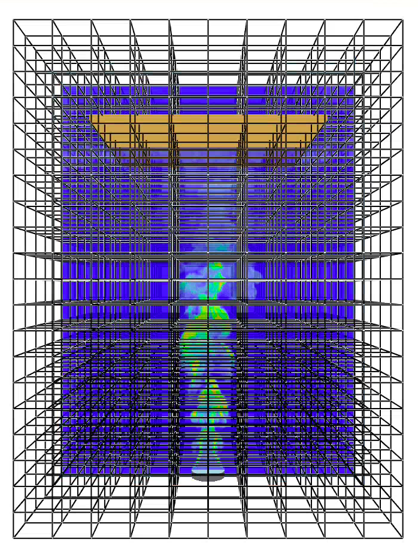{fig-alt="A large fire simulation shown as a stack of mesh blocks, each outlined, with the plume coloured through them."}
:::

::: {.caption}
High resolution simulation of Heat transfer and soot deposition into a ceiling board. 2000 meshes.
:::

:::

::: {.notes}
- Real problems can reach billions of cells and long, multi-scale simulations; one processor is too slow.
- Domain decomposition: split the domain into meshes and solve them in parallel.
- Goals: shorter wall clock time, larger problems, finer grids.
- Figure: the ceiling-board case from slide 5, 2000 meshes of 45×45×30 = 121.5 million cells.
:::

## Spatial Domain decomposition and Parallelization {.mpi-openmp-slide}

::: {.slide-layout}

::: {.mpi}
**Message Passing Interface MPI\***: Decompose domain in Cartesian meshes.

- Each mesh is owned and worked on by an MPI process (CPU core).
- One MPI process can own several meshes, but no mesh can be shared by two processes.
- Distributed Memory: Each instance of FDS for each MPI process has its own dedicated space in memory.
:::

::: {.omp}
**Open Multi-Processing OpenMP\*\***: Concurrency within each mesh.

- Different threads associated to CPU cores split the work per mesh (i.e. 3D loops).
- Shared Memory: All threads have access to the same memory (i.e. mesh information).
:::

::: {.fig}
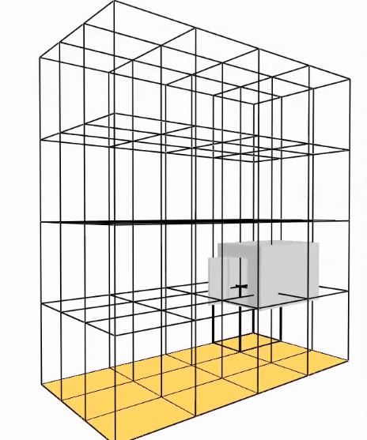{fig-alt="A two-storey compartment drawn as a Cartesian mesh, split into mesh blocks."}
:::

::: {.refs}
\*W. Gropp, E. Lusk, A. Skjellum, "Using MPI: Portable parallel programming with message-passing interface," 3rd Ed, The MIT Press (2014). 
\*\*<https://www.openmp.org/home-news/openmp-arb-releases-openmp-6-0-for-easier-programming/>
:::

:::

::: {.notes}
- MPI: each mesh belongs to one process, which owns its memory; a process can hold several meshes, never the reverse.
- Processes exchange mesh boundary data by messages: distributed memory, scales across the nodes of a cluster.
- OpenMP: threads share one mesh's loops and memory, running in CPU cores associated to one MPI process (FDS instance).
- Most of FDS's parallel speedup comes from MPI; OpenMP adds a modest factor per mesh (next slides).
:::

## Spatial Domain decomposition and Parallelization {.parallel-req-slide}

::: {.slide-layout}

::: {.req}
**Requirements for parallel execution:**
:::

::: {.req2 .dash-item}
- A task has to be divisible into separate subtasks.
- After subtasks are done synchronization (data exchanges are needed)
:::

::: {.serial}
**Parts of the algorithm are serial operations *S*:**
:::

::: {.serial2 .dash-item}
- S by definition cannot be done in parallel.
- Only parallel portion P=(1-S) can be done simultaneously.
- Amdahl's law: speedup $\le 1/(S+P/n) \to 1/S$ as the number of processes $n$ grows.
:::

::: {.fig}
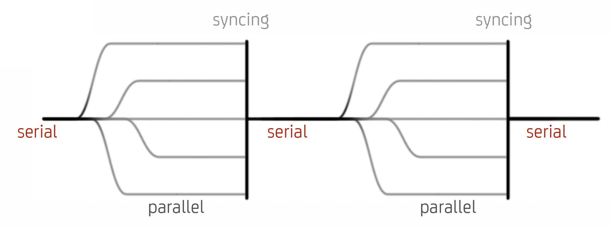{fig-alt="Timeline of a parallel step: work splits into concurrent threads, then syncs, with the serial parts marked between."}
:::

::: {.limit}
Speedup with number of MPI processes or OpenMP threads always has a limit.
:::

:::

::: {.notes}
- Parallel work needs a task that splits into subtasks, plus synchronization (data exchange) between them.
- Serial parts S can't be split; only the parallel fraction P = 1 − S speeds up.
- Amdahl's law in numbers: with S = 5% serial, no number of processes gives more than 1/S = 20× speedup.
:::

## Spatial Domain decomposition and Parallelization {.speedup-slide}

::: {.slide-layout}

::: {.limit}
Speedup with number of MPI processes or OpenMP threads always has a limit.
:::

::: {.fig-l .fit}
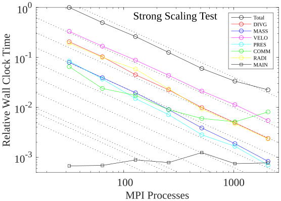{fig-alt="Strong scaling test: relative wall clock time against MPI processes, log-log, one curve per FDS routine."}
:::

::: {.lab-np}
(32 to 2048)
:::

::: {.fig-r}
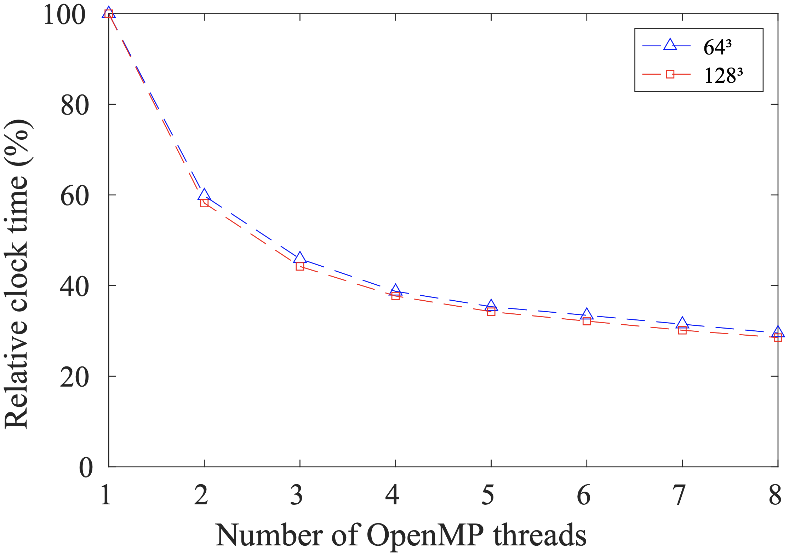{fig-alt="Relative clock time against number of OpenMP threads, for 64-cubed and 128-cubed meshes."}
:::

:::

::: {.notes}
- Strong scaling, same problem on 32 → 2048 processes: total time falls to ~0.022 of its start, against an ideal 0.016, about 45× for 64× the processes.
- The compute routines follow the ideal dotted lines; communication (COMM) flattens and grows past ~1000 processes: that is the limit.
- OpenMP (right): 8 threads bring the time to ~29% (about 3.4×), with diminishing returns, similar for 64³ and 128³ meshes.
:::

## Spatial Domain decomposition (MPI): {.split-mesh-slide}

::: {.slide-layout}

::: {.lead}
- Split a discretized domain in 2 meshes.
:::

::: {.mesh}
&MESH IJK=16,16,16, XB=0.0,1.6,-0.8,0.8,-0.8,0.8 /

&MESH IJK=16,16,16, XB=1.6,3.2,-0.8,0.8,-0.8,0.8 /
:::

::: {.fig .fit .behind}
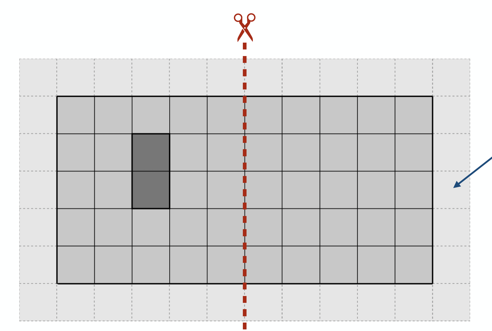{fig-alt="A discretized domain with a dashed cut line down the middle, ghost cells drawn as a lighter band around the outside."}
:::

::: {.lab-cut}
Divide domain in 2 meshes.
:::

::: {.lab-ghost}
Ghost cells on domain external boundaries.
:::

:::

::: {.notes}
- Two &MESH lines split Example 1's box into two 16³ meshes.
- Each mesh is surrounded by ghost cells; on the outer boundary they carry the external BCs, as in Module I.
- The cut creates a new, internal boundary between the meshes: next slide.
:::

## Spatial Domain decomposition {.mesh-boundaries-slide}

::: {.slide-layout}

::: {.lead}
- Split a discretized domain in 2 meshes.
:::

::: {.fig-l}
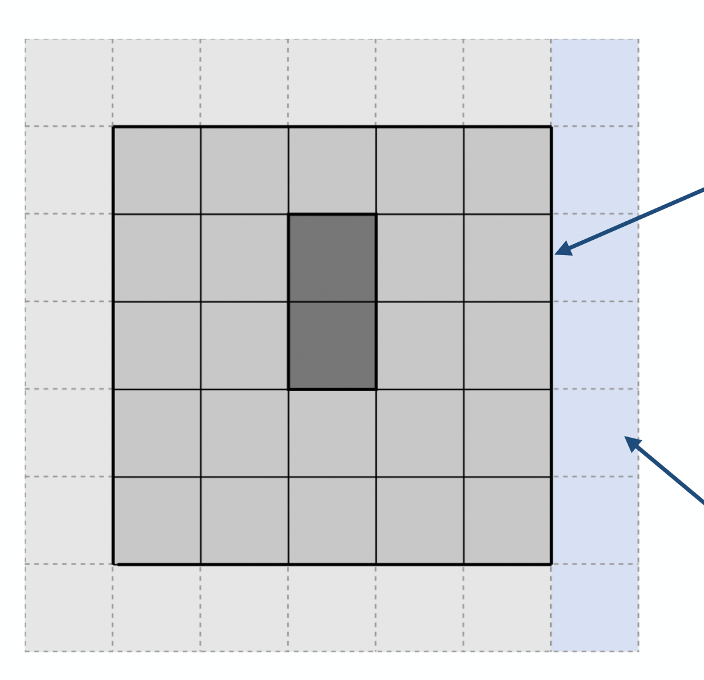{fig-alt="The left mesh after the split, with its ghost cell band shaded along the cut."}
:::

::: {.fig-r}
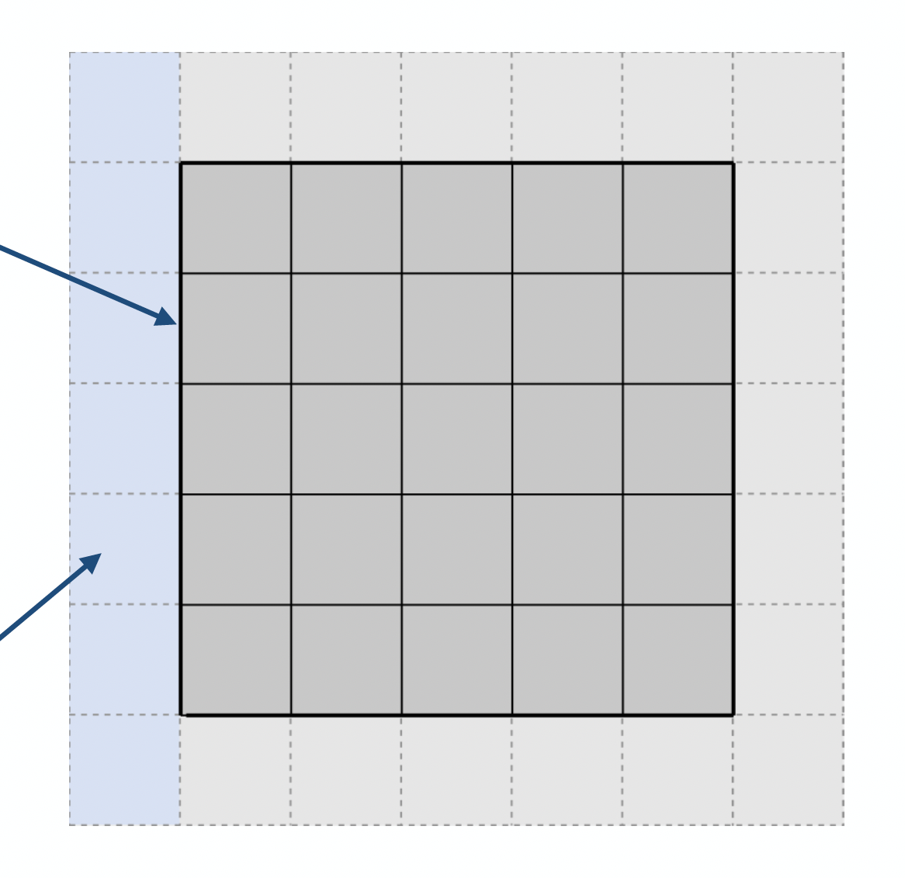{fig-alt="The right mesh after the split, with its own ghost cell band along the cut."}
:::

::: {.lab-imb}
Internal Mesh Boundaries
:::

::: {.lab-exch}
Ghost cells values need to be exchanged to compute stencils
:::

:::

::: {.notes}
- After the split each mesh has ghost cells along the cut: internal mesh boundaries.
- Their values belong to the neighbor mesh and must be exchanged (MPI messages) before any stencil can be computed.
- That exchange is the COMM cost in the scaling plot.
:::

## Spatial Domain decomposition {.stencil-slide}

::: {.slide-layout}

::: {.lead}
- What happens to the discrete Poisson equation operator stencil?
:::

::: {.fig}
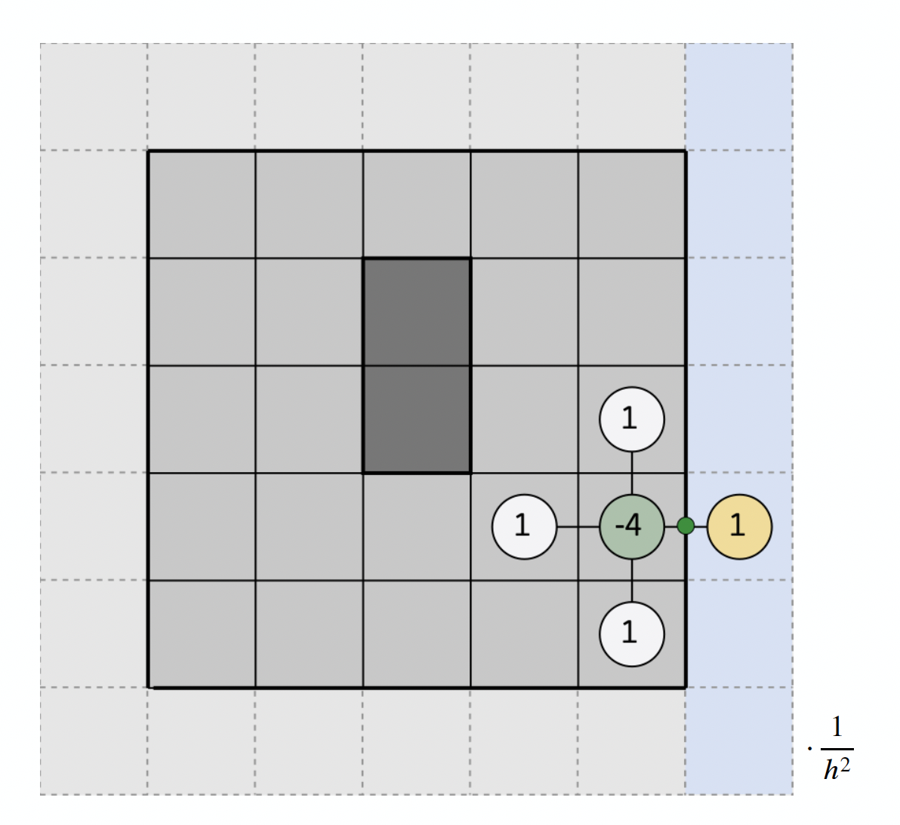{fig-alt="The five-point Poisson stencil at a cell next to the internal mesh boundary: its east neighbour is a ghost cell, drawn in the band beyond the mesh edge."}
:::

::: {.arr-bc}
<svg viewBox="0 0 164.64 155.25" width="100%" style="overflow:visible;display:block" xmlns="http://www.w3.org/2000/svg" aria-hidden="true"><defs><marker id="s58c" viewBox="0 0 10 10" refX="10" refY="5" markerWidth="4" markerHeight="4" orient="auto"><path d="M0,0 L10,5 L0,10 z" fill="#13501B"/></marker></defs><line x1="164.64" y1="0.00" x2="0.00" y2="155.25" stroke="#13501B" stroke-width="2.92" marker-end="url(#s58c)"/></svg>
:::

::: {.note}
- Interpolated Boundary condition.
- Dirichlet BC for H with average of latest solution among internal and ghost cell.
- We need this for local mesh solvers.
:::

:::

::: {.notes}
- The Poisson stencil at a cell next to the cut reaches into a ghost cell owned by the other mesh.
- Local solvers treat the cut as an interpolated boundary: Dirichlet, with H at the face the average of the latest internal and ghost values, the same average as Module I's Dirichlet BC.
- Each mesh solves with its neighbor's last values, so the normal derivative of H doesn't match from the two sides: each side projects a different normal velocity on the interface, the velocity error at mesh interfaces.
:::

## Poisson Solvers – Global solution {.local-solvers-slide}

::: {.slide-layout}

::: {.sub-head}
Using local mesh solvers FFT, ULMAT
:::

::: {.iterate}
[Iterate:]{style='color:#215F9A'}

1. Solve by mesh.
2. Update H in boundaries to correct velocity error\*.
:::

::: {.tol .dash-list}
[**FFT:**]{style='color:#215F9A'}

- Error in Solid or Interpolated boundaries < `VELOCITY_TOLERANCE`

[**ULMAT:**]{style='color:#215F9A'}

- Error in Interpolated boundaries < `VELOCITY_TOLERANCE`

[**Both:**]{style='color:#215F9A'}

- Iterations > `MAX_PRESSURE_ITERATIONS`
:::

::: {.fig .fit .behind}
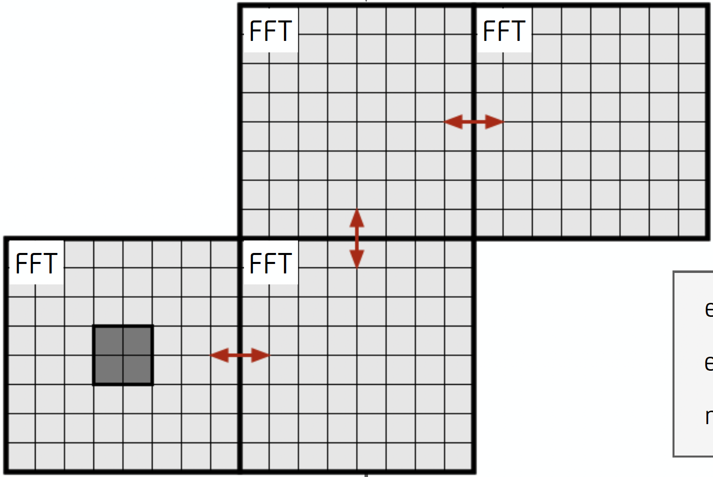{fig-alt="Four meshes side by side, arrows across each internal boundary between them and a solid obstruction in the lower left one."}
:::

::: {.mask .fit}
<svg viewBox="0 0 100 100" preserveAspectRatio="none" width="100%" height="100%" style="display:block" xmlns="http://www.w3.org/2000/svg" aria-hidden="true"><rect width="100" height="100" fill="#ffffff"/></svg>
:::

::: {.ls1}

LOCAL SOLVE

:::

::: {.ls2}

LOCAL SOLVE

:::

::: {.ls3}

LOCAL SOLVE

:::

::: {.ls4}

LOCAL SOLVE

:::

::: {.br-top}
<svg viewBox="0 0 501.12 8.10" width="100%" style="overflow:visible;display:block" xmlns="http://www.w3.org/2000/svg" aria-hidden="true"><line x1="0" y1="4.05" x2="501.12" y2="4.05" stroke="#156082" stroke-width="3.75"/></svg>
:::

::: {.br-right}
<svg viewBox="0 0 19.20 679.41" width="100%" style="overflow:visible;display:block" xmlns="http://www.w3.org/2000/svg" aria-hidden="true"><line x1="9.60" y1="0" x2="9.60" y2="679.41" stroke="#156082" stroke-width="3.75"/></svg>
:::

::: {.br-bot}
<svg viewBox="0 0 501.12 8.10" width="100%" style="overflow:visible;display:block" xmlns="http://www.w3.org/2000/svg" aria-hidden="true"><line x1="0" y1="4.05" x2="501.12" y2="4.05" stroke="#156082" stroke-width="3.75"/></svg>
:::

::: {.br-in}
<svg viewBox="0 0 19.20 39.33" width="100%" style="overflow:visible;display:block" xmlns="http://www.w3.org/2000/svg" aria-hidden="true"><defs><marker id="s59in" viewBox="0 0 10 10" refX="10" refY="5" markerWidth="4" markerHeight="4" orient="auto"><path d="M0,0 L10,5 L0,10 z" fill="#156082"/></marker></defs><line x1="9.60" y1="0.00" x2="9.60" y2="39.33" stroke="#156082" stroke-width="6.25" marker-end="url(#s59in)"/></svg>
:::

::: {.br-out}
<svg viewBox="0 0 19.20 39.33" width="100%" style="overflow:visible;display:block" xmlns="http://www.w3.org/2000/svg" aria-hidden="true"><line x1="9.60" y1="0" x2="9.60" y2="39.33" stroke="#156082" stroke-width="3.75"/></svg>
:::

::: {.lab-iter}
Iterative Procedure
:::

::: {.arr-ib}
<svg viewBox="0 0 146.40 100.62" width="100%" style="overflow:visible;display:block" xmlns="http://www.w3.org/2000/svg" aria-hidden="true"><defs><marker id="s59ib" viewBox="0 0 10 10" refX="10" refY="5" markerWidth="4" markerHeight="4" orient="auto"><path d="M0,0 L10,5 L0,10 z" fill="#156082"/></marker></defs><line x1="146.40" y1="100.62" x2="0.00" y2="0.00" stroke="#156082" stroke-width="5.42" marker-end="url(#s59ib)"/></svg>
:::

::: {.lab-ib}
Interpolated Boundary
:::

::: {.arr-sb}
<svg viewBox="0 0 155.04 54.54" width="100%" style="overflow:visible;display:block" xmlns="http://www.w3.org/2000/svg" aria-hidden="true"><defs><marker id="s59sb" viewBox="0 0 10 10" refX="10" refY="5" markerWidth="4" markerHeight="4" orient="auto"><path d="M0,0 L10,5 L0,10 z" fill="#156082"/></marker></defs><line x1="0.00" y1="54.54" x2="155.04" y2="0.00" stroke="#156082" stroke-width="5.42" marker-end="url(#s59sb)"/></svg>
:::

::: {.lab-sb}
Solid Boundary
:::

::: {.refs}
\*FDS Technical Reference Guide.
:::

:::

::: {.notes}
- Local solvers (FFT, ULMAT) solve each mesh on its own, then update H at the mesh boundaries and iterate.
- Stop when the velocity error is below VELOCITY_TOLERANCE, at solid and interpolated boundaries for FFT, interpolated only for ULMAT (solids are exact), or at MAX_PRESSURE_ITERATIONS.
- Cheap per iteration and perfectly parallel, but information crosses one mesh per iteration, so many meshes in a row converge slowly.
:::

## Poisson Solvers – Global solution {.global-direct-slide}

::: {.slide-layout}

::: {.sub-head}
Solving the Global Problem directly:
:::

::: {.steps .dash-list}
- Number unknowns globally (i.e. range across all meshes).
- Build Global Matrix in parallel (each process builds the rows of A that correspond to its meshes).
:::

::: {.call .dash-list}
- **Call Global LU Solver,**\
  **Intel MKL CLUSTER_SPARSE_SOLVER:**
:::

::: {.pres-g}
`&PRES SOLVER='GLMAT PARDISO'/`
:::

::: {.note-g .dash-list}
- Global, structured, solves in all cells, IBM on internal Obstacles.
:::

::: {.pres-u}
`&PRES SOLVER='UGLMAT PARDISO'/`
:::

::: {.note-u .dash-list}
- Global, unstructured, solves in gas cells only.
:::

::: {.fig .behind}
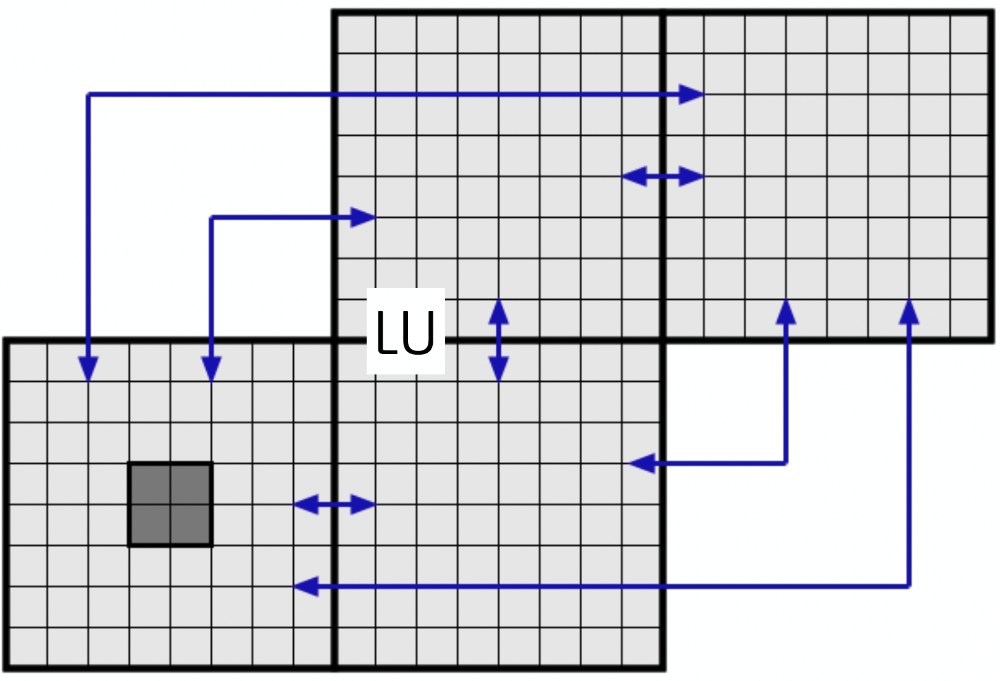{fig-alt="The same four meshes, now solved as one system: arrows run from every mesh into a single LU factorization."}
:::

:::

::: {.notes}
- Global alternative: one matrix for all meshes, unknowns numbered across meshes; each process builds the rows of its own meshes.
- Solved with MKL's parallel direct solver (CLUSTER_SPARSE_SOLVER): no interpolated boundaries, no interface error.
- GLMAT: structured, all cells, IBM on OBSTs, so it still iterates for the solid error. UGLMAT: unstructured, gas cells only, exact at solids and interfaces.
:::

## Poisson Solvers – Global solution {.global-hypre-slide}

::: {.slide-layout}

::: {.sub-head}
Solving the Global Problem directly:
:::

::: {.call .dash-list}
- **Call Parallel Conjugate Gradient Solver in HYPRE:**
:::

::: {.pres-g}
`&PRES SOLVER='GLMAT HYPRE'/`
:::

::: {.note-g .dash-list}
- Global for all meshes, structured, solves in all cells, IBM on internal Obstacles.
- GLMAT will default to GLMAT HYPRE.
:::

::: {.pres-u}
`&PRES SOLVER='UGLMAT HYPRE'/`
:::

::: {.note-u .dash-list}
- Global for all meshes, unstructured, solves in gas cells only.
- UGLMAT will default to UGLMAT HYPRE.
:::

:::

::: {.notes}
- The same global matrices, solved iteratively: parallel conjugate gradient with AMG preconditioning from HYPRE.
- GLMAT HYPRE: structured, IBM on obstacles. UGLMAT HYPRE: unstructured, gas cells only.
- Bare GLMAT and UGLMAT default to HYPRE in FDS 6.11 (UGLMAT was PARDISO in 6.10); name the backend explicitly, since the default has changed between versions.
:::

## Poisson Solvers – Global solution {.pressit-slide}

::: {.slide-layout}

::: {.sub-head}
Output velocity error information:
:::

::: {.fig-dump}
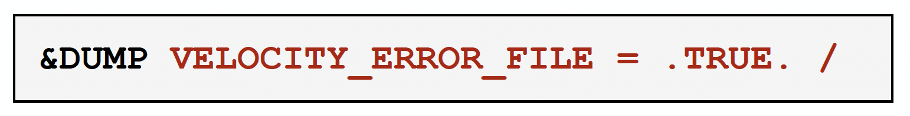{fig-alt="The &DUMP line that switches the velocity error file on."}
:::

::: {.lead}
You get a ***CHID_pressit.csv*** file with:
:::

::: {.fig}
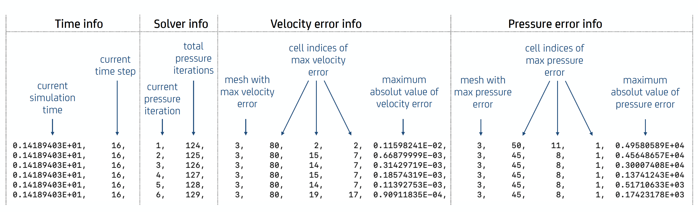{fig-alt="The first rows of the pressure iteration file, annotated: time and time step, pressure iteration counts, then the mesh, cell indices and value of the largest velocity error, and the same three for the pressure error."}
:::

:::

::: {.notes}
- &DUMP VELOCITY_ERROR_FILE=T writes CHID_pressit.csv (called _vel_err.csv in FDS 6.10 and earlier).
- Columns: time and step, iteration counts, then the mesh, cell and value of the largest velocity error, and the same for the pressure residual.
- One row per pressure iteration, not per time step, so it grows fast: 754 MB for Example 5's FFT run.
:::

## Example 3: Duct Flow {.ex3-input-slide}

::: {.slide-layout}

::: {.file}
**FDS Input file:** `Example_3.fds`
:::

::: {.body .dash-list}
- Case with 8 16^3^ meshes. Grid resolution 0.2 m.
- Internal obstructions changing direction of Flow across meshes.
- Flow should follow duct path.
:::

::: {.ask}
Velocity Penetration/mass errors?
:::

::: {.runs .dash-list}
- Run case with different `&PRES` lines:
:::

::: {.fig}
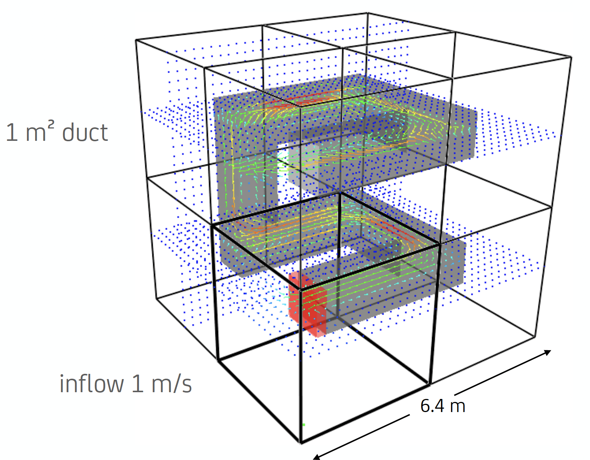{fig-alt="The duct case in Smokeview: eight meshes outlined, with obstructions turning the flow from one mesh into the next."}
:::

::: {.cases}
a\) Default settings for Pressure: **`&PRES SOLVER='FFT'/`{style='color:#ff0000'}**\
b\) Use ULMAT the rest for settings default: **`&PRES SOLVER='ULMAT'/`{style='color:#ff0000'}**\
c\) Default setting but tighten velocity tolerance: **`&PRES SOLVER='FFT', VELOCITY_TOLERANCE=0.001, MAX_PRESSURE_ITERATIONS=1000 /`{style='color:#ff0000'}**\
d\) Use structured global solver GLMAT: **`&PRES SOLVER='GLMAT'/`{style='color:#ff0000'}**\
e\) Use unstructured global solver UGLMAT: **`&PRES SOLVER='UGLMAT'/`{style='color:#ff0000'}**
:::

:::

::: {.notes}
- A 6.4 m cube, eight 16³ meshes of 0.2 m cells; a 1 m duct runs a circuit that crosses every mesh boundary.
- An HVAC fan drives 1 m³/s through it; the duct walls are thin OBSTs (zero thickness, sheets on cell faces), and the room around it is open.
- What leaks through the walls leaves through the open boundaries, so in_net vs out_net measures the leak.
- Five &PRES variants a–e; each run takes about a minute on 8 processes.
:::

## Example 3: Duct Flow {.ex3-meshes-slide}

::: {.slide-layout}

::: {.lab-l}
Structured + IBM, FFT (local), GLMAT (global)
:::

::: {.lab-r}
Unstructured ULMAT (local), UGLMAT (global)
:::

::: {.fig-l}
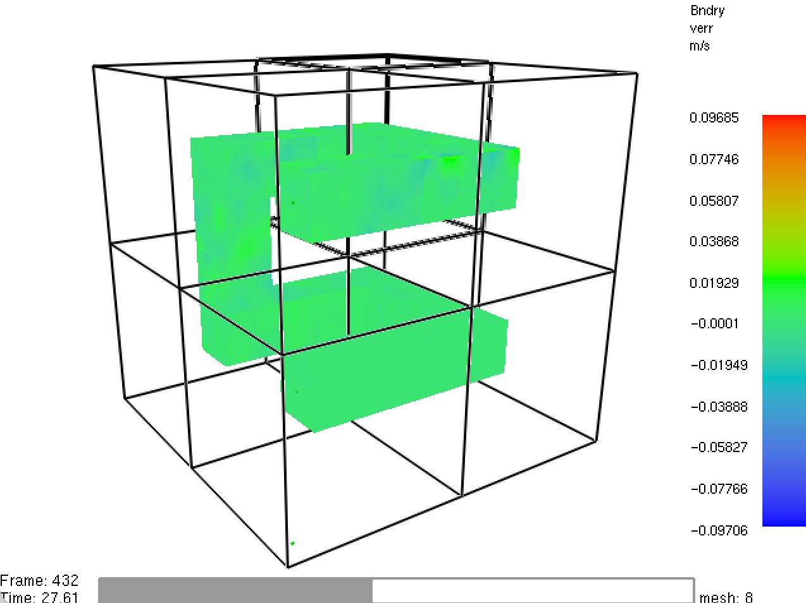{fig-alt="The duct meshed as a structured grid, the obstruction represented by the immersed boundary."}
:::

::: {.fig-r}
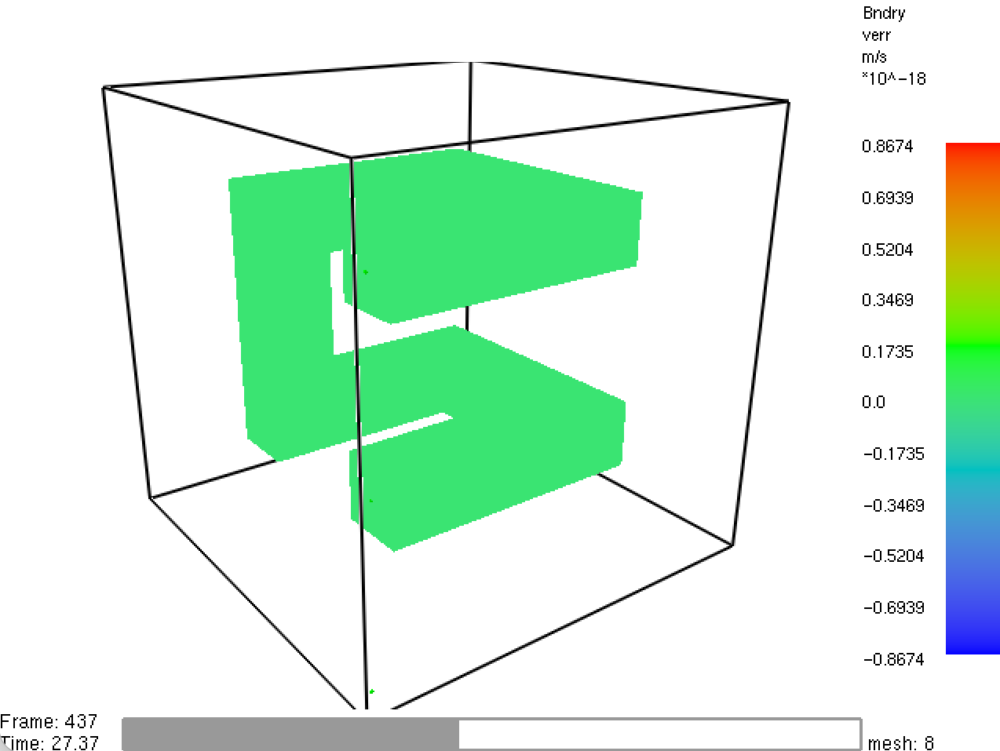{fig-alt="The same duct with the unstructured cut-cell treatment at the obstruction."}
:::

::: {.circ}
<svg viewBox="0 0 96.00 46.80" width="100%" style="overflow:visible;display:block" xmlns="http://www.w3.org/2000/svg" aria-hidden="true"><ellipse cx="48.00" cy="23.40" rx="48.00" ry="23.40" fill="none" stroke="#0070C0" stroke-width="6.67"/></svg>
:::

:::

::: {.notes}
- Left: the structured view used by FFT and GLMAT; the thin walls are IBM faces inside the grid. Note the velocity penetration error.
- Right: the unstructured view used by ULMAT and UGLMAT; gas cells only, the walls are domain boundaries.
- Thin walls are the hardest case for IBM: a single cell face separates duct and room, so any penetration error leaks straight through.
:::

## Example 3: Duct Flow {.ex3-solvers-slide}

::: {.slide-layout}

::: {.lab-l}
Local Solvers
:::

::: {.lab-r}
Global Solvers
:::

::: {.fig-l .behind}
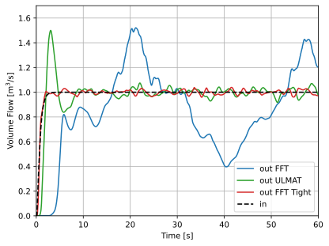{fig-alt="Volume flow in and out against time for the local solvers."}
:::

::: {.fig-r .behind}
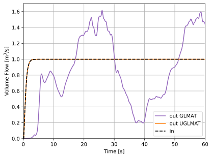{fig-alt="The same volume flows for the global solvers."}
:::

::: {.note}
Thin obstacle boundary errors have the largest effect on volume flow
:::

:::

::: {.notes}
- Worst in–out gap over the second half: FFT −60%, GLMAT −79%, ULMAT −8%, FFT tight −4%, UGLMAT 2e-11%.
- FFT and GLMAT: the default tolerance Δx/2 = 0.1 m/s is 10% of the 1 m/s duct flow, so they stop iterating while the walls still leak.
- ULMAT fixes the walls but not the mesh interfaces; only UGLMAT fixes both.
:::

## Example 3: Duct Flow {.ex3-iterations-slide}

::: {.slide-layout}

::: {.fig .behind}
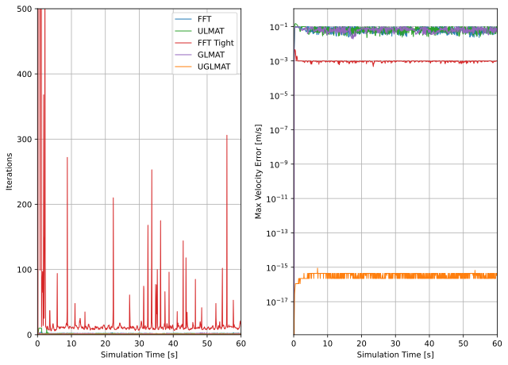{fig-alt="Pressure iterations against time for each solver, with the FFT tight run far above the others, and beside it the velocity error each one settles for."}
:::

::: {.lab-f1}
FFT Tight
:::

::: {.lab-u}
UGLMAT
:::

:::

::: {.notes}
- FFT tight needs hundreds of iterations early on (up to its 1000 cap), about 24 per step on average.
- The others take 1–2 per step; UGLMAT exactly 1, with velocity error ~1e-16.
- Right panel: the velocity error each solver settles for.
:::

## Example 3: Duct Flow {.ex3-cost-slide}

::: {.slide-layout}

::: {.fig .behind}
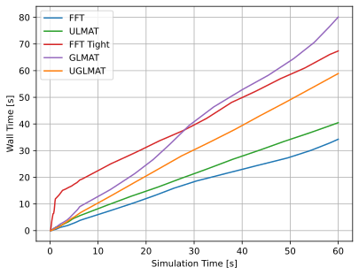{fig-alt="Cumulative wall clock time against simulation time for each solver."}
:::

::: {.lab-f}
FFT Tight requires many iterations at the beginning
:::

::: {.arr-f}
<svg viewBox="0 0 48.00 180.00" width="100%" style="overflow:visible;display:block" xmlns="http://www.w3.org/2000/svg" aria-hidden="true"><defs><marker id="s67f" viewBox="0 0 10 10" refX="10" refY="5" markerWidth="4" markerHeight="4" orient="auto"><path d="M0,0 L10,5 L0,10 z" fill="#156082"/></marker></defs><line x1="48.00" y1="0.00" x2="0.00" y2="180.00" stroke="#156082" stroke-width="3.75" marker-end="url(#s67f)"/></svg>
:::

::: {.lab-g}
GLMAT, UGLMAT more costly in steady region
:::

::: {.arr-g1}
<svg viewBox="0 0 142.40 29.70" width="100%" style="overflow:visible;display:block" xmlns="http://www.w3.org/2000/svg" aria-hidden="true"><defs><marker id="s67g1" viewBox="0 0 10 10" refX="10" refY="5" markerWidth="4" markerHeight="4" orient="auto"><path d="M0,0 L10,5 L0,10 z" fill="#156082"/></marker></defs><line x1="0.00" y1="0.00" x2="142.40" y2="29.70" stroke="#156082" stroke-width="3.75" marker-end="url(#s67g1)"/></svg>
:::

::: {.arr-g2}
<svg viewBox="0 0 142.40 135.00" width="100%" style="overflow:visible;display:block" xmlns="http://www.w3.org/2000/svg" aria-hidden="true"><defs><marker id="s67g2" viewBox="0 0 10 10" refX="10" refY="5" markerWidth="4" markerHeight="4" orient="auto"><path d="M0,0 L10,5 L0,10 z" fill="#156082"/></marker></defs><line x1="0.00" y1="0.00" x2="142.40" y2="135.00" stroke="#156082" stroke-width="3.75" marker-end="url(#s67g2)"/></svg>
:::

:::

::: {.notes}
- Wall clock: FFT 35 s, ULMAT 41 s, UGLMAT 59 s, FFT tight 68 s, GLMAT 81 s.
- FFT tight pays up front, in the early iterations; GLMAT and UGLMAT pay every step, since a global solve costs more than a local one.
- UGLMAT buys exact conservation for less than FFT tight; GLMAT costs the most and still leaks the most, since a global solve doesn't help IBM walls.
- We only use GLMAT for FDS testing; users should choose UGLMAT: fewer unknowns (no solution inside obstacles) and no velocity errors.
:::

## Example 4: Fire Plume {.ex4-input-slide}

::: {.slide-layout}

::: {.files}
**FDS Input files:**

`Example_4_FFT.fds`

`Example_4_FFT_tight.fds`

`Example_4_ULMAT.fds`

`Example_4_UGLMAT_PARDISO.fds`

`Example_4_UGLMAT_HYPRE.fds`
:::

::: {.body .dash-list}
- Methane Pool fire, 16 meshes, 3 cm grid resolution. Grids 48x48x32 cells.
- [1.18 million]{style='color:#ff0000'} cells total.
- Experimental data for vertical and radial velocity at three height levels.
:::

::: {.ask}
How do the solvers compare predicting velocity profiles?
:::

::: {.fig .behind}
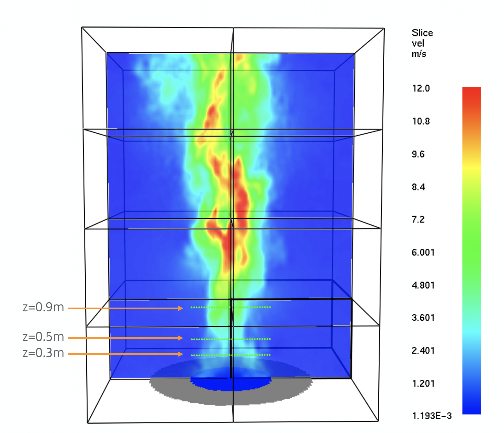{fig-alt="The methane pool fire in Smokeview, its plume rising through the 16 meshes, with the three measurement heights marked."}
:::

:::

::: {.notes}
- Sandia 1 m methane pool fire, Test 14: 16 meshes of 48×48×32, 3 cm cells, 1.18 M cells, 20 s simulated.
- Measured vertical and radial velocities at 0.3, 0.5 and 0.9 m above the pool.
- Cluster runs, one input per solver; the reference runs let everyone plot the results. reference/ also has Example_4_FFT.sbatch, the Slurm script used to submit the FFT case on our cluster.
- Unlike Examples 1–3, no solver is plainly wrong here: the question is cost.
:::

## Example 4: Fire Plume {.ex4-iterations-slide}

::: {.slide-layout}

::: {.fig}
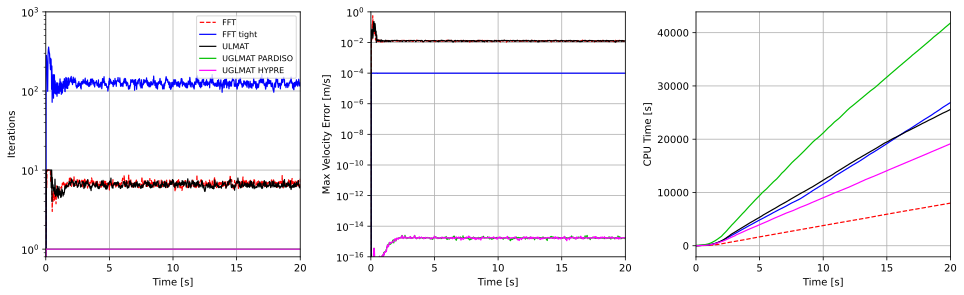{fig-alt="Pressure iterations, the velocity error each solver settles for, and the CPU time each costs, against simulated time."}
:::

::: {.lab-l}
FFT Tight – Vel Tol = 1e-4
:::

::: {.lab-r}
Run in **spark.el.nist.gov** Intel Cluster.
:::

:::

::: {.notes}
- Wall clock on 16 cores: FFT 2.2 h, UGLMAT HYPRE 5.4 h, ULMAT 7.2 h, FFT tight 7.5 h, UGLMAT PARDISO 11.7 h.
- FFT tight (tolerance 1e-4) averages ~127 iterations per step; the UGLMAT runs one, at velocity error ~1e-15.
- The UGLMAT runs use MAX_PRESSURE_ITERATIONS=1.
:::

## Example 4: Fire Plume {.ex4-profiles-slide}

::: {.slide-layout}

::: {.lead}
Vertical and radial velocities at z=0.5m.
:::

::: {.fig}
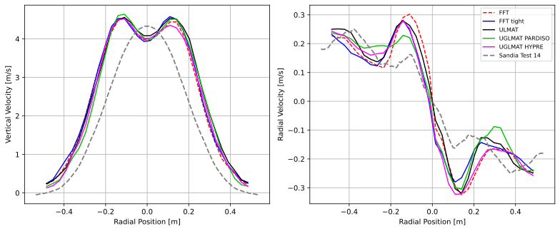{fig-alt="Vertical and radial velocity profiles at z = 0.5 m: the five solver runs against the experimental data."}
:::

::: {.note}
Similar velocity profiles regardless of pressure solver employed.
:::

:::

::: {.notes}
- Profiles time-averaged from 10 s on, at z = 0.5 m, against Sandia's data.
- All five solvers give practically the same profiles: in an open fire plume the pressure-solver errors don't matter.
- So here the cheapest, default FFT is the right choice.
:::
