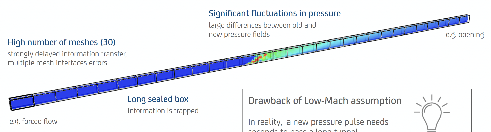
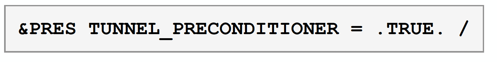
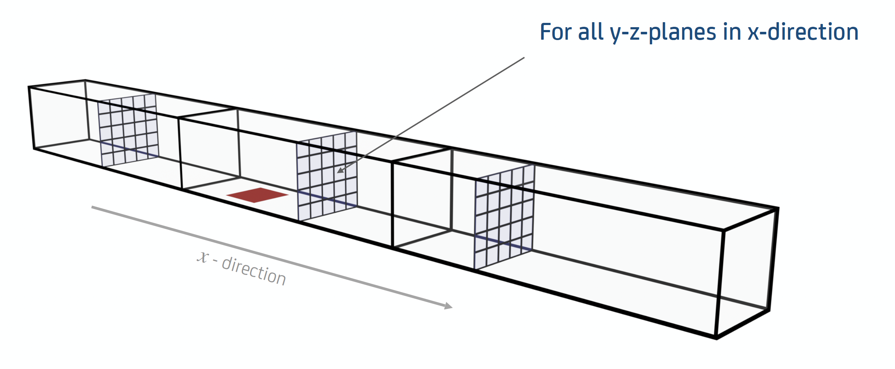
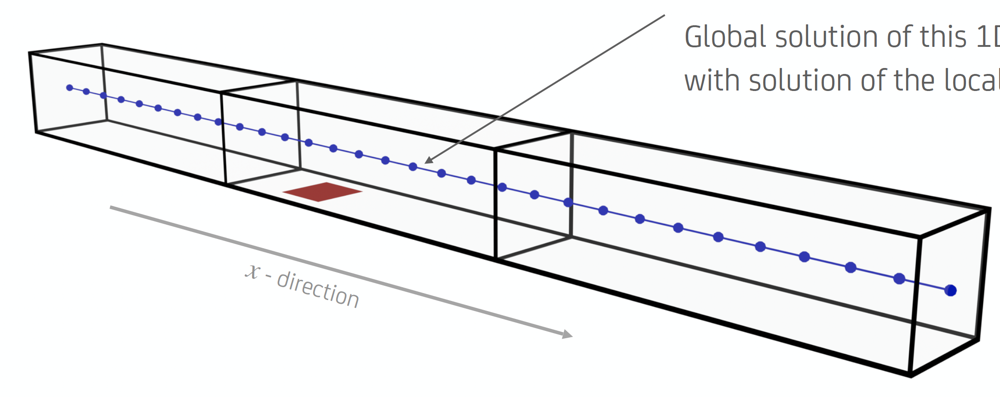
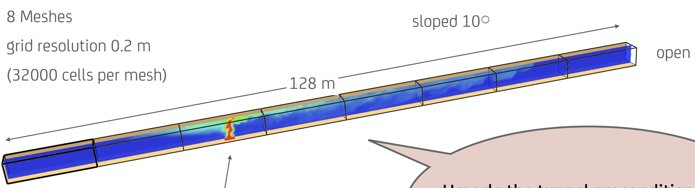
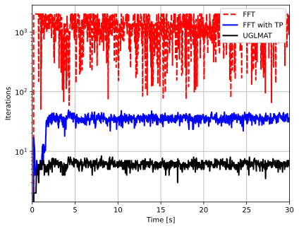
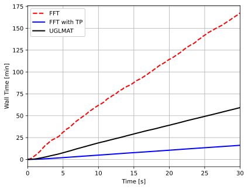
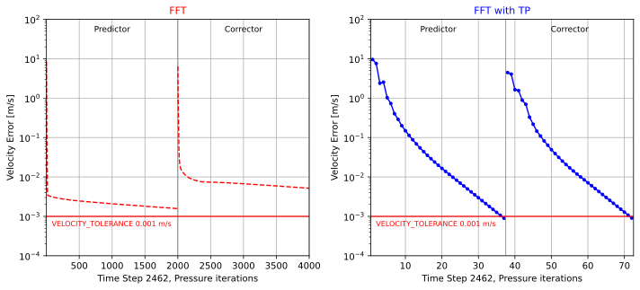

# Module IV: Tunnels

::: {.section-topics}
Tunnel preconditioner.

Example 5: Tunnel fire case.
:::

## Tunnel Preconditioner {.tp-why-slide}

::: {.slide-layout}

::: {.body .dash-list}
- Wall bounded flows in long slender domains pose a challenge to Low-Mach approximation.
- In Low-Mach information travels instantaneously (through Pressure equation). Reality is more accommodating!
- [**Large fluctuations** in the flow (i.e. due to a fire) can lead to **instabilities**.]{style='color:#ff0000'}
- For local solvers mesh to mesh information transfer depends on how well solutions match in interpolated boundaries.
:::

::: {.fig .behind}
{fig-alt="A long tunnel split into many meshes end to end, the pressure field having to carry information from one end to the other."}
:::

::: {.mask .fit .behind}
<svg viewBox="0 0 100 100" preserveAspectRatio="none" width="100%" height="100%" style="display:block" xmlns="http://www.w3.org/2000/svg" aria-hidden="true"><rect width="100" height="100" fill="#ffffff"/></svg>
:::

:::

## Tunnel Preconditioner {.tp-decompose-slide}

::: {.slide-layout}

::: {.eq-poisson}
{fig-alt="&PRES TUNNEL_PRECONDITIONER = .TRUE. / -- the switch this section is about, set as a picture in the deck."}
:::

::: {.body .dash-list}
- Provide an inexpensive way to transmit mean pressure information along the length of the tunnel.
- Objective is to reduce the number of pressure iterations, and numerical instabilities.
:::

::: {.fig}
{fig-alt="The tunnel's pressure field split into a mean along its length and the fluctuation about it."}
:::

::: {.eq1}
$\nabla^{2}H_{(x,y,z)} = R_{(x,y,z)}$
:::

::: {.lab-dec .dash-list}
- Decompose:
:::

::: {.eq2}
$H_{(x,y,z)} = \tilde{H}_{(x,y,z)} + \bar{H}_{(x)}$
:::

::: {.eq3}
$R_{(x,y,z)} = \tilde{R}_{(x,y,z)} + \bar{R}_{(x)}$
:::

::: {.arr}
<svg viewBox="0 0 19.20 38.25" width="100%" style="overflow:visible;display:block" xmlns="http://www.w3.org/2000/svg" aria-hidden="true"><defs><marker id="s72up" viewBox="0 0 10 10" refX="10" refY="5" markerWidth="4" markerHeight="4" orient="auto"><path d="M0,0 L10,5 L0,10 z" fill="#ff0000"/></marker></defs><line x1="9.60" y1="38.25" x2="9.60" y2="0.00" stroke="#ff0000" stroke-width="4.17" marker-end="url(#s72up)"/></svg>
:::

::: {.lab-avg}
Average values in x-y planes
:::

:::

## Tunnel Preconditioner {.tp-algorithm-slide}

::: {.slide-layout}

::: {.head}
For each pressure iteration:
:::

::: {.steps}
1. Compute x-y mean of $R$, $\bar{R}_{(x)}$. Filter out $\bar{R}_{(x)}$ from $R$ to get $\tilde{R}_{(x,y,z)} = R - \bar{R}_{(x)}$ in each mesh.
2. Solve 2 problems:
:::

::: {.eq1}
$\nabla^{2}\tilde{H}_{(x,y,z)} = \tilde{R}_{(x,y,z)}$
:::

::: {.eq2}
$\frac{\partial}{\partial x}\bar{H}_{(x)} = \bar{R}_{(x)}$
:::

::: {.lab-3d}
3D Local solves per mesh.
:::

::: {.lab-1d}
1D Global solve.
:::

::: {.fig .behind}
{fig-alt="The 1D mean pressure solved along the tunnel, one value per x station across all the meshes."}
:::

::: {.mask .fit .behind}
<svg viewBox="0 0 100 100" preserveAspectRatio="none" width="100%" height="100%" style="display:block" xmlns="http://www.w3.org/2000/svg" aria-hidden="true"><rect width="100" height="100" fill="#ffffff"/></svg>
:::

::: {.lab-1dp}
1D pressure solution for $\bar{H}_{(x)}$
:::

::: {.comb}
3. Combine solutions:
:::

::: {.eq3}
$H_{(x,y,z)} = \tilde{H}_{(x,y,z)} + \bar{H}_{(x)}$
:::

::: {.ref}
- FDS User Guide, Sec. 21.3 Pressure Considerations in Long Tunnels:
:::

::: {.ref-note}
Meshes abut end to end in one direction, no open boundaries along the tunnel.
:::

:::

## Example 5: Tunnel fire case {.ex5-input-slide}

::: {.slide-layout}

::: {.file}
**FDS Input file:** `Example_5.fds`
:::

::: {.body .dash-list}
- 8 MW Fire.
- 8 meshes, 32k cells per mesh.
- 20 cm grid resolution.
- Gravity rotated 10° (sloped tunnel).
:::

::: {.fig .behind}
{fig-alt="The tunnel: eight meshes end to end, inlet at one end, open at the other, the fire source on the floor part way along."}
:::

::: {.mask-a .fit .behind}
<svg viewBox="0 0 100 100" preserveAspectRatio="none" width="100%" height="100%" style="display:block" xmlns="http://www.w3.org/2000/svg" aria-hidden="true"><rect width="100" height="100" fill="#ffffff"/></svg>
:::

::: {.mask-b .fit .behind}
<svg viewBox="0 0 100 100" preserveAspectRatio="none" width="100%" height="100%" style="display:block" xmlns="http://www.w3.org/2000/svg" aria-hidden="true"><rect width="100" height="100" fill="#ffffff"/></svg>
:::

::: {.mask-c .fit .behind}
<svg viewBox="0 0 100 100" preserveAspectRatio="none" width="100%" height="100%" style="display:block" xmlns="http://www.w3.org/2000/svg" aria-hidden="true"><rect width="100" height="100" fill="#ffffff"/></svg>
:::

::: {.lab-inlet}
Inlet, specified velocity 5 m/s
:::

::: {.lab-fire}
Fire Source 2x2 m²
:::

::: {.test}
Test of tunnel preconditioner.
:::

::: {.pres}
`&PRES VELOCITY_TOLERANCE=0.001, MAX_PRESSURE_ITERATIONS=2000, TUNNEL_PRECONDITIONER=T /`
:::

:::

## Example 5: Tunnel fire case {.ex5-cost-slide}

::: {.slide-layout}

::: {.fig-l}
{fig-alt="Pressure iterations against time: FFT pinned at its 2000 cap, FFT with the preconditioner near 40, UGLMAT near 7."}
:::

::: {.fig-r}
{fig-alt="Wall clock time against simulated time for the same three runs."}
:::

::: {.note}
Hit MAX_PRESSURE_ITERATIONS=2000, velocity tolerance not reached.
:::

::: {.arr}
<svg viewBox="0 0 109.60 94.77" width="100%" style="overflow:visible;display:block" xmlns="http://www.w3.org/2000/svg" aria-hidden="true"><defs><marker id="s75n" viewBox="0 0 10 10" refX="10" refY="5" markerWidth="4" markerHeight="4" orient="auto"><path d="M0,0 L10,5 L0,10 z" fill="#156082"/></marker></defs><line x1="109.60" y1="0.00" x2="0.00" y2="94.77" stroke="#156082" stroke-width="3.75" marker-end="url(#s75n)"/></svg>
:::

::: {.unstable}
UGLMAT still iterates --- the inseparable pressure residual, not velocity error, is what it is working on.
:::

::: {.concl}
Tunnel preconditioner is a must to achieve tolerance in reasonable time.
:::

:::

## Example 5: Tunnel fire case {.ex5-iteration-slide}

::: {.slide-layout}

::: {.fig .behind}
{fig-alt="Velocity error against pressure iteration within one time step, FFT on the left taking around 2400 iterations without clearing the tolerance and FFT with the preconditioner on the right clearing it in about 70."}
:::

::: {.note}
Similar behavior with pressure error.
:::

:::
