# Thermochemistry

## Stoichiometry {.stoichiometry-slide}

::: {.stoichiometry-layout}

::: {.stoichiometry-generic}

$$\mathit{Fuel} + \mathit{Air} \longrightarrow \mathit{Products}$$

:::

::: {.stoichiometry-complete}

COMPLETE COMBUSTION

:::

::: {.stoichiometry-reactants}

$$\mathrm{C_3H_8} + 5\left[\mathrm{O_2} + (0.79/0.21)\mathrm{N_2}\right] \longrightarrow$$

:::

::: {.stoichiometry-products}

$$3\mathrm{CO_2} + 4\mathrm{H_2O} + 5(0.79/0.21)\mathrm{N_2}$$

:::

::: {.stoichiometry-molecule}

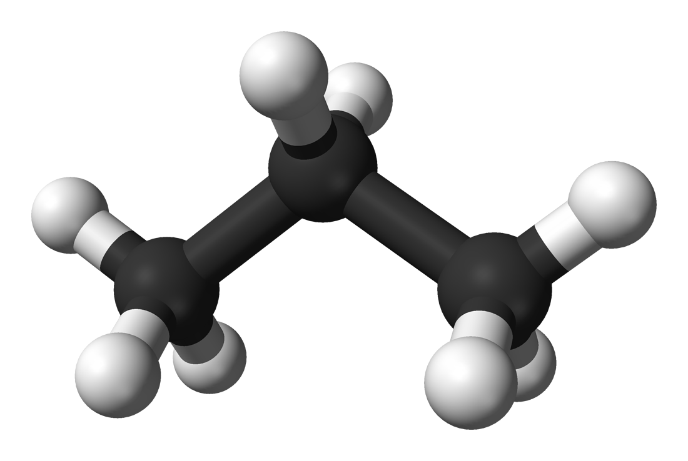{.stoichiometry-molecule-image fig-alt="Ball-and-stick model of a propane molecule."}

:::

::: {.stoichiometry-structural}

{.stoichiometry-structural-diagram fig-alt="Structural formula of propane: three carbon atoms in a chain with eight attached hydrogen atoms."}

:::

::: {.stoichiometry-structural-label}

Propane, C₃H₈

:::

::: {.stoichiometry-source}

Propane model: [Ben Mills / Wikimedia Commons (public domain)](https://commons.wikimedia.org/wiki/File:Propane-3D-balls-B.png)

:::

:::

## Complex Fuels {.complex-fuels-slide}

::: {.complex-fuels-layout}

::: {.complex-fuels-fire}

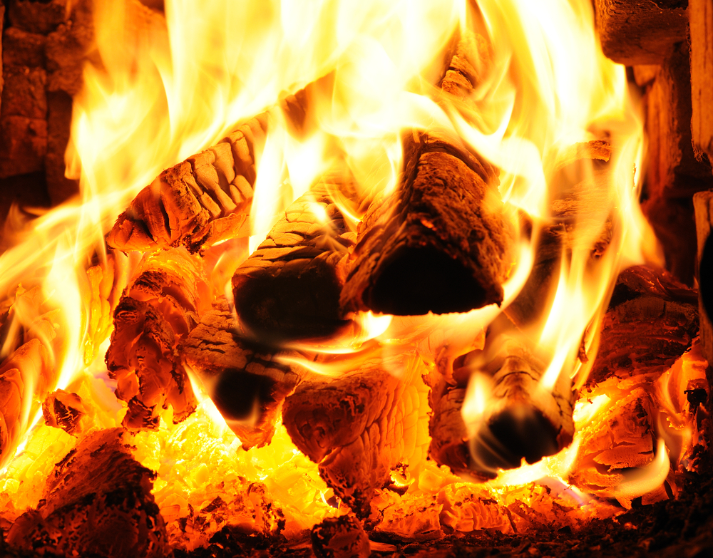{.complex-fuels-fire-image fig-alt="Logs burning in a wood fire."}

:::

::: {.complex-fuels-fire-source}

Source: [“Why Doesn’t Wood Melt?”, *Today I Found Out* (2013)](https://www.todayifoundout.com/index.php/2013/08/why-doesnt-wood-melt/)

:::

::: {.complex-fuels-cellulose}

{.complex-fuels-cellulose-image fig-alt="Cellulose chains showing glucose repeat units and hydrogen bonds between strands."}

:::

::: {.complex-fuels-formula}

$$\mathrm{CH_2O}$$

:::

::: {.complex-fuels-reference}

[D. Drysdale (1998), Table 5.14](https://books.google.com/books?id=djtRAAAAMAAJ)

:::

::: {.complex-fuels-arrow aria-hidden="true"}

{fig-alt=""}

:::

::: {.complex-fuels-label}

Cellulose

:::

::: {.complex-fuels-cellulose-source}

[Laghi.l, “Cellulose strand”](https://commons.wikimedia.org/wiki/File:Cellulose_strand.svg), [CC BY-SA 3.0](https://creativecommons.org/licenses/by-sa/3.0/), via Wikimedia Commons

:::

:::

## Complex Chemistry {.complex-chemistry-slide}

::: {.complex-chemistry-layout}

::: {.complex-chemistry-gri-summary}

[GRI-Mech 3.0](https://combustion.berkeley.edu/gri-mech/version30/text30.html)

53 species

400+ reactions

:::

::: {.complex-chemistry-mechanism}

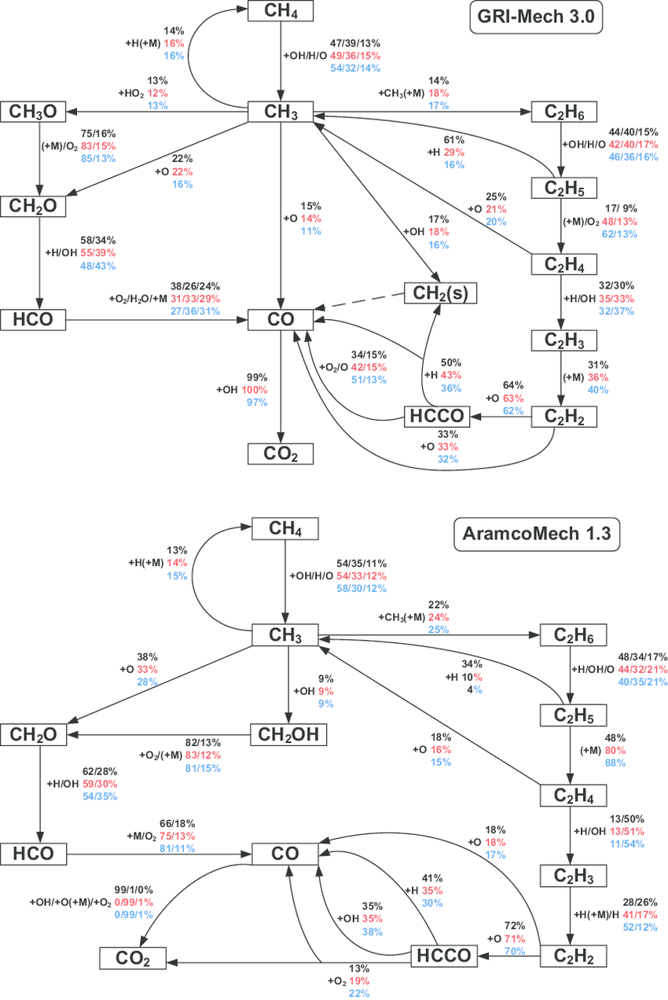{fig-alt="Comparison of dominant methane oxidation pathways in GRI-Mech 3.0 and AramcoMech 1.3; the slide shows the GRI-Mech portion."}

:::

::: {.complex-chemistry-mechanism-source}

[A. M. Dmitriev et al., *Combustion and Flame* 162 (2015), 3946–3959](https://doi.org/10.1016/j.combustflame.2015.07.032)

:::

::: {.complex-chemistry-soot-pathway}

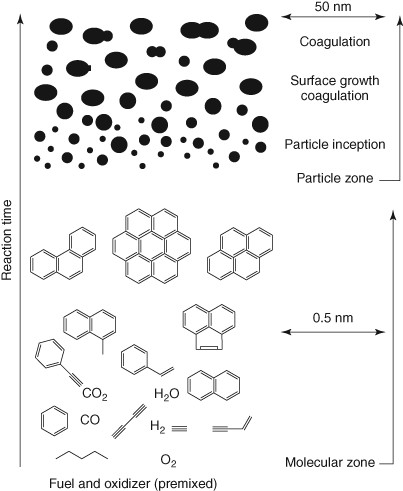{fig-alt="Schematic of soot evolution from molecular precursors through particle inception, surface growth, and coagulation."}

:::

::: {.complex-chemistry-soot-source}

[S. Shuai, Z. Wang, and H. Xu, “Internal Combustion Engine Simulation” (2015)](https://doi.org/10.1002/9781118991978.hces152)

:::

::: {.complex-chemistry-fire}

{fig-alt="Large industrial fire producing a dense plume of black smoke."}

:::

::: {.complex-chemistry-fire-source}

Legacy lecture photograph; original attribution unresolved

:::

::: {.complex-chemistry-tem}

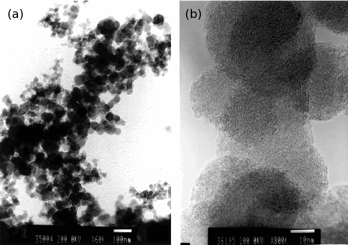{fig-alt="Transmission electron micrographs of an aircraft-combustor soot aggregate and the layered surface structure of its primary particles."}

:::

::: {.complex-chemistry-tem-caption}

TEM image of a typical aircraft-combustor soot aggregate: (a) aggregate and (b) surface detail. Adapted from [Popovitcheva et al. (2000)](https://doi.org/10.1039/B004345L).

:::

:::

## Heat Release Rate (HRR) {.heat-release-rate-slide}

::: {.heat-release-rate-layout}

::: {.heat-release-rate-plot}

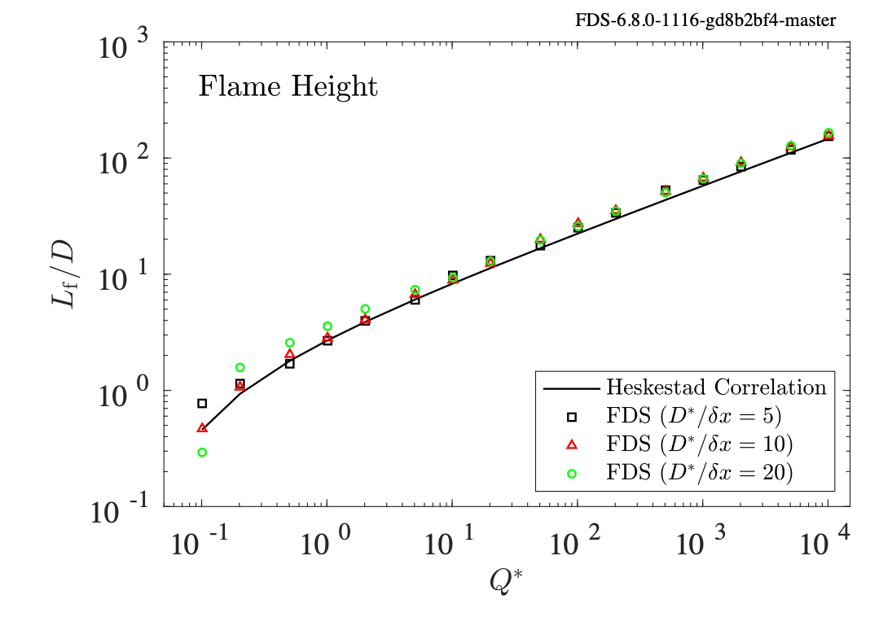{fig-alt="Heskestad flame-height correlation compared with FDS calculations at three grid resolutions."}

:::

::: {.heat-release-rate-heading}

Heskestad Flame Height

:::

::: {.heat-release-rate-correlation}

$$\frac{L_f}{D}=3.7\left(\dot Q^*\right)^{2/5}-1.02$$

:::

::: {.heat-release-rate-unit}

heat release rate [W]

:::

::: {.heat-release-rate-arrow aria-hidden="true"}

{fig-alt=""}

:::

::: {.heat-release-rate-qstar}

$$\dot Q^* = \frac{\dot Q}{\rho_\infty c_p T_\infty\sqrt{gD}\,D^2}$$

:::

::: {.heat-release-rate-mccaffrey}

{fig-alt="McCaffrey flame-height data."}

:::

:::

## Local heat release rate per unit volume (HRRPUV) {.hrrpuv-slide}

::: {.hrrpuv-layout}

::: {.hrrpuv-integral}

$$\dot Q=\int_V \dot q'''\,\mathrm{d}V$$

:::

::: {.hrrpuv-equation}

$$\dot q'''=-\dot m_F'''\,\Delta h_{c,F}$$

:::

::: {.hrrpuv-output-unit}

$$[\mathrm{W/m^3}]$$

:::

::: {.hrrpuv-output-arrow aria-hidden="true"}

{fig-alt=""}

:::

::: {.hrrpuv-fuel-unit}

$$[\mathrm{kg\text{-}F/(m^3\,s)}]$$

:::

::: {.hrrpuv-fuel-arrow aria-hidden="true"}

{fig-alt=""}

:::

::: {.hrrpuv-enthalpy-unit}

$$[\mathrm{J/kg\text{-}F}]$$

:::

::: {.hrrpuv-enthalpy-arrow aria-hidden="true"}

{fig-alt=""}

:::

:::

## Chemical + sensible enthalpy {.enthalpy-slide}

::: {.enthalpy-layout}

::: {.enthalpy-species}

$$h_\alpha(T)=\Delta h_{f,\alpha}^{\circ}+\int_{T_0}^{T}c_{p,\alpha}(T')\,\mathrm{d}T'$$

:::

::: {.enthalpy-formation-label}

heat of formation

:::

::: {.enthalpy-formation-arrow aria-hidden="true"}

{fig-alt=""}

:::

::: {.enthalpy-formation-unit}

$$[\mathrm{J/kg\text{-}\alpha}]$$

:::

::: {.enthalpy-sensible-label}

sensible enthalpy $\quad h_{s,\alpha}(T)$

:::

::: {.enthalpy-sensible-arrow aria-hidden="true"}

{fig-alt=""}

:::

::: {.enthalpy-mixture-label}

enthalpy of a mixture:

:::

::: {.enthalpy-mixture}

$$h(Y,T)=\sum_\alpha Y_\alpha h_\alpha(T)$$

:::

::: {.enthalpy-sources}

NASA  
NIST-JANAF Tables  
NIST Webbook

:::

::: {.enthalpy-source-arrows aria-hidden="true"}

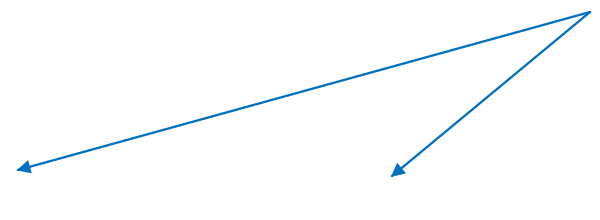{fig-alt=""}

:::

:::

## Heat of combustion {.heat-of-combustion-slide}

::: {.heat-of-combustion-layout}

::: {.heat-of-combustion-reaction}

$$\nu_{\mathrm{F}}\mathrm{C}_m\mathrm{H}_n+\nu_{\mathrm{O_2}}\mathrm{O}_2\longrightarrow\nu_{\mathrm{CO_2}}\mathrm{CO}_2+\nu_{\mathrm{H_2O}}\mathrm{H}_2\mathrm{O}$$

:::

::: {.heat-of-combustion-equation}

$$\Delta h_{c,i}=-\sum_{\alpha\in i}\nu_{\mathrm{\alpha},\mathrm{i}}\left(\frac{W_\alpha}{W_{\mathrm{F}}}\right)\Delta h_{f,\alpha}^{\circ}$$

:::

::: {.heat-of-combustion-fuel-coefficient}

$$\nu_{\mathrm{F}}=-1$$

:::

::: {.heat-of-combustion-unit}

$$\left[\frac{\mathrm{J}}{\mathrm{kg\ fuel\ reacted}}\right]$$

:::

::: {.heat-of-combustion-formation}

heat of formation $[\mathrm{J/kg\text{-}\alpha}]$

:::

::: {.heat-of-combustion-coefficient}

stoichiometric coefficient for  
species $\alpha$ in reaction $i$  
[reactants negative  
products positive]{.heat-of-combustion-signs}

:::

::: {.heat-of-combustion-note}

stoichiometric coefficients represent moles of $\alpha$  
produced per mole of fuel reacted

:::

::: {.heat-of-combustion-reaction-label}

for reaction $i$

:::

::: {.heat-of-combustion-arrows aria-hidden="true"}

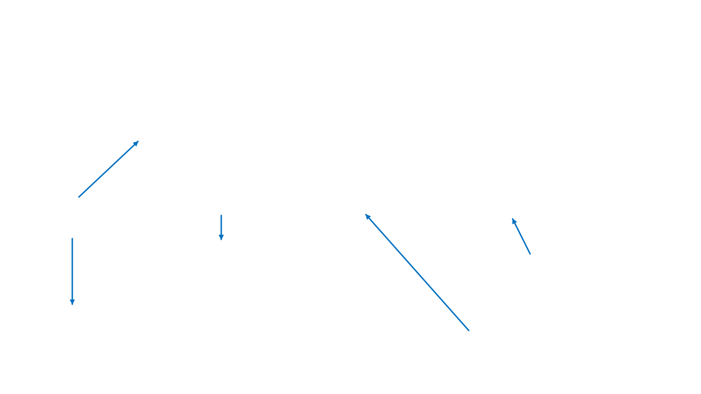{fig-alt=""}

:::

:::

## Heat of combustion -- oxygen basis {.heat-of-combustion-oxygen-slide}

::: {.heat-of-combustion-oxygen-layout}

::: {.heat-of-combustion-oxygen-equation}

$$\Delta h_{c,\mathrm{O_2}}=\Delta h_{c,\mathrm{F}}\frac{\nu_{\mathrm{F}}}{\nu_{\mathrm{O_2}}}\frac{W_{\mathrm{F}}}{W_{\mathrm{O_2}}}$$

:::

::: {.heat-of-combustion-oxygen-epumo2}

EPUMO2

:::

::: {.heat-of-combustion-oxygen-hoc}

HEAT_OF_COMBUSTION

:::

::: {.heat-of-combustion-oxygen-unit}

$$\frac{\mathrm{J}}{\mathrm{kg}_{\mathrm{O_2}}}$$

:::

::: {.heat-of-combustion-fuel-unit}

$$\frac{\mathrm{J}}{\mathrm{kg}_{\mathrm{F}}}$$

:::

::: {.heat-of-combustion-stoich-units}

$$\left(\frac{\dfrac{\mathrm{kmol}_{\mathrm{F}}}{\mathrm{kmol}_{\mathrm{F}}}}{\dfrac{\mathrm{kmol}_{\mathrm{O_2}}}{\mathrm{kmol}_{\mathrm{F}}}}\right)$$

:::

::: {.heat-of-combustion-molecular-weight-units}

$$\left(\frac{\dfrac{\mathrm{kg}_{\mathrm{F}}}{\mathrm{kmol}_{\mathrm{F}}}}{\dfrac{\mathrm{kg}_{\mathrm{O_2}}}{\mathrm{kmol}_{\mathrm{O_2}}}}\right)$$

:::

::: {.heat-of-combustion-oxygen-arrows aria-hidden="true"}

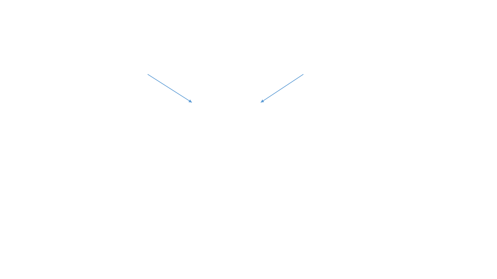{fig-alt=""}

:::

:::

## Example: heat of combustion for propane {.heat-of-combustion-example-slide}

::: {.heat-of-combustion-example-layout}

::: {.heat-of-combustion-example-table}

| Species | Molecular Weight ($\mathrm{kg/kmol}$) | Enthalpy of Formation ($\mathrm{J/kg}$) |
|---|---:|---:|
| Propane, $\mathrm{C_3H_8}$ | 44.09562 | $-2.37\times10^6$ |
| Oxygen, $\mathrm{O_2}$ | 31.99880 | $0$ |
| Carbon Dioxide, $\mathrm{CO_2}$ | 44.00950 | $-8.94\times10^6$ |
| Water Vapor, $\mathrm{H_2O}$ | 18.01528 | $-1.34\times10^7$ |

:::

::: {.heat-of-combustion-example-run}

Run HOC.py

:::

::: {.heat-of-combustion-example-output}

```{.hoc-console-output code-line-numbers="false"}
In [42]: run HOC.py
HOC Fuel Basis: 4.630e+07
HOC O2 Basis:   1.276e+07
```

:::

::: {.heat-of-combustion-example-result}

approx 13,000 $\mathrm{kJ/kg\ O_2}$

:::

:::

## Ideal gas equation of state {.ideal-gas-slide}

::: {.ideal-gas-layout}

::: {.ideal-gas-density}

$$\rho=\frac{p_0\overline W}{RT}$$

:::

::: {.ideal-gas-temperature}

$$T=\frac{p_0\overline W}{\rho R}$$

:::

::: {.ideal-gas-molecular-weight}

$$\overline W=\left(\sum_\alpha\frac{Y_\alpha}{W_\alpha}\right)^{-1}$$

:::

::: {.ideal-gas-density-label}

[$\rho$]{.ideal-gas-symbol} mass density $[\mathrm{kg/m^3}]$

:::

::: {.ideal-gas-pressure-label}

[$p_0$]{.ideal-gas-symbol} background pressure $[\mathrm{Pa}]$

:::

::: {.ideal-gas-molecular-weight-label}

[$\overline W$]{.ideal-gas-symbol} mixture molecular weight $[\mathrm{kg\text{-}mixture/kmol\text{-}mixture}]$

:::

::: {.ideal-gas-gas-constant-label}

[$R$]{.ideal-gas-symbol} universal gas constant $[8314.5\ \mathrm{Pa\cdot m^3/(kmol\cdot K)}]$

:::

::: {.ideal-gas-temperature-label}

[$T$]{.ideal-gas-symbol} temperature $[\mathrm{K}]$

:::

::: {.ideal-gas-arrow aria-hidden="true"}

{fig-alt=""}

:::

:::

## Mixture molecular weight {.mixture-molecular-weight-slide}

::: {.mixture-molecular-weight-layout}

::: {.mixture-molecular-weight-equation}

$$
\overline W = \sum_\alpha X_\alpha W_\alpha
$$

:::

::: {.mixture-molecular-weight-units}

$$
\frac{\mathrm{kg\text{-}mix}}{\mathrm{kmol\text{-}mix}}
\mathrel{\left[=\right]}
\frac{\mathrm{kmol\text{-}\alpha}}{\mathrm{kmol\text{-}mix}}
\frac{\mathrm{kg\text{-}\alpha}}{\mathrm{kmol\text{-}\alpha}}
$$

:::

:::

## Mixture molecular weight from mass fractions {.mixture-mass-fractions-slide}

::: {.mixture-mass-fractions-layout}

::: {.mixture-mass-fractions-definition}

$$Y_\alpha = X_\alpha \frac{W_\alpha}{\overline W}$$

:::

::: {.mixture-mass-fractions-arrow aria-hidden="true"}

{fig-alt=""}

:::

::: {.mixture-mass-fractions-rearranged}

$$\frac{\overline W}{W_\alpha}=\frac{X_\alpha}{Y_\alpha}$$

:::

::: {.mixture-mass-fractions-units}

$$
\frac{\mathrm{kg\text{-}\alpha}}{\mathrm{kg\text{-}mix}}
\quad \mathrel{\left[=\right]} \quad
\frac{\mathrm{kmol\text{-}\alpha}}{\mathrm{kmol\text{-}mix}}
\quad
\frac{
  \dfrac{\mathrm{kg\text{-}\alpha}}{\mathrm{kmol\text{-}\alpha}}
}{
  \dfrac{\mathrm{kg\text{-}mix}}{\mathrm{kmol\text{-}mix}}
}
$$

:::

:::


## Mixture molecular weight derivation {.mixture-derivation-slide}

::: {.mixture-derivation-layout}

::: {.mixture-derivation-expanded}

$$
\sum_\alpha
\left(
Y_\alpha\frac{\overline W}{W_\alpha}
=
\frac{X_\alpha}{Y_\alpha}Y_\alpha
\right)
$$

:::

::: {.mixture-derivation-arrow aria-hidden="true"}

{fig-alt=""}

:::

::: {.mixture-derivation-summed}

$$
\overline W\sum_\alpha\frac{Y_\alpha}{W_\alpha}
=
\sum_\alpha X_\alpha
=1
$$

:::

::: {.mixture-derivation-note}

Multiply both sides by $Y_\alpha$  
and sum.

:::

::: {.mixture-derivation-left-pointer aria-hidden="true"}

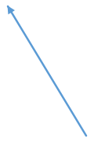{fig-alt=""}

:::

::: {.mixture-derivation-right-pointer aria-hidden="true"}

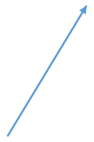{fig-alt=""}

:::

::: {.mixture-derivation-result}

$$
\overline W =
\left[
\sum_\alpha\frac{Y_\alpha}{W_\alpha}
\right]^{-1}
$$

:::

:::

## Oxygen-consumption calorimetry {.oxygen-calorimetry-slide}

::: {.oxygen-calorimetry-layout}

::: {.oxygen-calorimetry-facility}

{fig-alt="Schematic of the Large Fire Research Facility exhaust hoods and duct system."}

:::

::: {.oxygen-calorimetry-report}

{fig-alt="Cover of NIST Special Publication 1007, Heat Release Rate Measurement Using Oxygen Consumption Calorimetry."}

:::

:::

## Fire tests with real materials {.fire-tests-slide}

::: {.fire-tests-layout}

::: {.fire-tests-photo}

{controls="true" poster="figs/thermochemistry/source/slide-020-media-01.png" preload="metadata" fig-alt="Upholstered-chair fire test with synchronized heat-release-rate and mass-loss measurements."}

:::

::: {.fire-tests-credit}

Courtesy Mauro Zammarano, Matt Bundy, Matt Hoehler, NIST

:::

::: {.fire-tests-hrr-equation}

$$
\require{enclose}
\begin{aligned}
\dot Q
&= \Delta h_{c,\mathrm{O_2}}
   \left(\dot m_{\mathrm{O_2}}^0-\dot m_{\mathrm{O_2}}\right) \\
&= \Delta h_{c,\mathrm{O_2}}\,\dot m_e
   \left(Y_{\mathrm{O_2}}^0-Y_{\mathrm{O_2}}\right) \\
&= \Delta h_{c,\mathrm{O_2}}
   \left(\frac{{\color{red}\enclose{circle}[padding="3px",thickness="2px"]{{\color{black}V}}}\,A}{\rho}\right)
   \left(Y_{\mathrm{O_2}}^0-{\color{red}\enclose{circle}[padding="3px",thickness="2px"]{{\color{black}Y_{\mathrm{O_2}}}}}\right)
\end{aligned}
$$

:::

::: {.fire-tests-density-equation}

$$
\rho=\frac{p_0\overline W}{R\,{\color{red}\enclose{circle}[padding="3px",thickness="2px"]{{\color{black}T}}}}
$$

:::

::: {.fire-tests-mixture-equation}

$$
\overline W=
\left[\sum_\alpha\frac{{\color{red}\enclose{circle}[padding="3px",thickness="2px"]{{\color{black}Y_\alpha}}}}{W_\alpha}\right]^{-1}
$$

:::

::: {.fire-tests-measured}

[]{.fire-tests-measured-symbol} Measured

:::

:::

## Heat release rate in FDS {.heat-release-rate-fds-slide}

::: {.heat-release-rate-fds-layout}

::: {.heat-release-rate-fds-units}

$$
\left[\frac{\mathrm{J}}{\mathrm{m^3\,s}}\right]
$$

:::

::: {.heat-release-rate-fds-equations}

$$
\begin{aligned}
\dot q''' &= -\sum_\alpha \dot m_\alpha'''\,\Delta h_{f,\alpha}^{\circ} \\
           &= -\dot m_{\mathrm{F}}'''\,\Delta h_{c,\mathrm{F}}
\end{aligned}
$$

:::

::: {.heat-release-rate-fds-note}

FDS computes HRR both ways, but first method is what gets used in energy equation.

:::

::: {.heat-release-rate-fds-example}

Example: `hrrpuv_reac_simple.fds`

a) plot `hrr`

b) plot `hrrpuv` and `hrrpuv_reac`

:::

::: {.heat-release-rate-fds-visual}

{fig-alt="FDS visualization of the local heat release rate in a reacting flow."}

:::

::: {.heat-release-rate-fds-plot}

{fig-alt="Time history comparing the two FDS local heat-release-rate calculations."}

:::

::: {.heat-release-rate-fds-arrow}

{fig-alt="Arrow connecting the green virtual measurement point to its HRRPUV time history."}

:::

:::

## Adiabatic flame temperature {.adiabatic-flame-slide}

::: {.adiabatic-flame-layout}

::: {.adiabatic-first-law}

First Law of  
Thermodynamics

:::

::: {.adiabatic-main-equation}

$$
\Delta U = Q + W
$$

:::

::: {.adiabatic-zero}

$$0$$

:::

::: {.adiabatic-zero-arrow}

{fig-alt="Arrow crossing through Q and pointing to zero for an adiabatic system."}

:::

::: {.adiabatic-internal-arrow}

{fig-alt="Arrow connecting change in internal energy to delta U."}

:::

::: {.adiabatic-heat-arrow}

{fig-alt="Arrow connecting heat transferred to Q."}

:::

::: {.adiabatic-work-arrow}

{fig-alt="Arrow connecting work done on the system to W."}

:::

::: {.adiabatic-internal-label}

change in  
[internal energy]{.adiabatic-internal-energy}

:::

::: {.adiabatic-heat-label}

heat transferred  
*to the system*

:::

::: {.adiabatic-work-label}

work done  
*on the system*

:::

::: {.adiabatic-enthalpy-recall}

Recall the definition of  
*enthalpy:*

:::

::: {.adiabatic-enthalpy-definition}

$$
H = U + PV
$$

:::

::: {.adiabatic-enthalpy-balance}

$$
\Delta H = \Delta U + \underbrace{P\Delta V}_{-W} = 0
$$

:::

:::


## Adiabatic flame temperature: propane in dry air {.aft-propane-slide}

::: {.aft-propane-layout}

::: {.aft-propane-reaction}

$$
\mathrm{C_3H_8}
+5\left[\mathrm{O_2}+\left(\frac{0.79}{0.21}\right)\mathrm{N_2}\right]
\rightarrow
3\mathrm{CO_2}+4\mathrm{H_2O}
+5\left(\frac{0.79}{0.21}\right)\mathrm{N_2}
$$

:::

::: {.aft-propane-inputs}

::: {.aft-propane-input-row}

$$
T_0 = 20\ ^\circ\mathrm{C}
$$

:::

::: {.aft-propane-input-row}

$$
\Delta H_c = 2.04\times10^6\ \frac{\mathrm{kJ}}{\mathrm{kmol}\ \mathrm{C_3H_8}\ \mathrm{reacted}}
$$

:::

::: {.aft-propane-input-row}

$$
c_p = 37\ \frac{\mathrm{kJ}}{\mathrm{kmol}\,\mathrm{K}}
$$

:::

:::

::: {.aft-propane-enthalpy}

$$
\Delta H = H_{\mathrm{prod}}-H_{\mathrm{react}}=0
$$

:::

::: {.aft-propane-heat}

$$
Q=n c_p\left(T_f-T_0\right)
$$

:::

::: {.aft-propane-arrow}

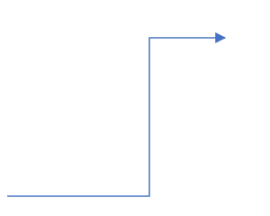{fig-alt="Arrow connecting the heat balance to the flame-temperature calculation."}

:::

::: {.aft-propane-calculation}

$$
\begin{aligned}
T_f
&=T_0+\frac{Q}{n c_p} \\
&=293+
\frac{(1)(2.04\times10^6)}
{\left[3+4+5(0.79/0.21)\right](37)} \\[0.55em]
&={\color{red}\underline{{\color{black}2429\ \mathrm{K}}}}
\end{aligned}
$$

:::

:::


## Equivalence Ratio {.equivalence-ratio-slide}

::: {.equivalence-ratio-layout}

::: {.equivalence-ratio-equation}

$$
\Phi \equiv
\frac{Y_F/Y_A}
{(Y_F/Y_A)_\mathrm{stoich}}
$$

:::

::: {.equivalence-ratio-rich}

$$
\Phi > 1 \qquad \text{“fuel rich”}
$$

:::

::: {.equivalence-ratio-lean}

$$
\Phi < 1 \qquad \text{“fuel lean”}
$$

:::

::: {.equivalence-ratio-photo}

{fig-alt="A burning candle, illustrating a luminous diffusion flame with fuel-rich regions that can form soot."}

:::

::: {.equivalence-ratio-source}

[Wikimedia Commons](https://commons.wikimedia.org/)

:::

::: {.equivalence-ratio-note}

Generally, fuel rich conditions are responsible for producing CO and soot.

:::

:::

## Types of Combustion {.types-combustion-slide}

::: {.types-combustion-layout}

::: {.types-combustion-modes}

- Premixed
- Partially premixed
- Diffusion flame

:::

::: {.types-chemistry-heading}

Types of Chemistry

:::

::: {.types-chemistry-modes}

- Infinitely fast
- Equilibrium
- Finite rate (Arrhenius)

:::

::: {.types-combustion-fuel}

Methane

:::

::: {.types-combustion-photo}

{fig-alt="Four methane flames progressing from a yellow diffusion flame to increasingly blue premixed flames."}

:::

::: {.types-combustion-source}

[Wikimedia Commons](https://commons.wikimedia.org/)

:::

::: {.types-combustion-diffusion}

Diffusion

:::

::: {.types-combustion-continuum-left aria-hidden="true"}

{fig-alt=""}

:::

::: {.types-combustion-continuum-right aria-hidden="true"}

{fig-alt=""}

:::

::: {.types-combustion-premixed}

Premixed

:::

:::

## Mixture Fraction (Non-premixed Flames) {.mixture-fraction-slide}

::: {.mixture-fraction-layout}

::: {.mixture-fraction-air-upper-arrow aria-hidden="true"}

{fig-alt=""}

:::

::: {.mixture-fraction-fuel-arrow aria-hidden="true"}

{fig-alt=""}

:::

::: {.mixture-fraction-air-lower-arrow aria-hidden="true"}

{fig-alt=""}

:::

::: {.mixture-fraction-air-upper}

Air, f=0

:::

::: {.mixture-fraction-fuel}

Fuel, f=1

:::

::: {.mixture-fraction-air-lower}

Air, f=0

:::

::: {.mixture-fraction-photo}

{fig-alt="A turbulent non-premixed flame issuing horizontally from a fuel nozzle into surrounding air."}

:::

::: {.mixture-fraction-source}

[Wikimedia Commons](https://commons.wikimedia.org/)

:::

::: {.mixture-fraction-definition}

$$
f =
\frac{\text{mass originating from fuel stream}}
{\text{total mass of mixture}}
$$

:::

:::

## Mixture fraction and product formation {.product-formation-slide}

::: {.product-formation-layout}

::: {.product-formation-air-upper-arrow aria-hidden="true"}
{fig-alt=""}
:::

::: {.product-formation-fuel-arrow aria-hidden="true"}
{fig-alt=""}
:::

::: {.product-formation-air-lower-arrow aria-hidden="true"}
{fig-alt=""}
:::

::: {.product-formation-air-upper}
Air, f=0
:::

::: {.product-formation-fuel}
Fuel, f=1
:::

::: {.product-formation-air-lower}
Air, f=0
:::

::: {.product-formation-photo}
{fig-alt="A turbulent non-premixed flame issuing horizontally from a fuel nozzle into surrounding air."}
:::

::: {.product-formation-source}
[Wikimedia Commons](https://commons.wikimedia.org/)
:::

::: {.product-formation-reaction}
$$
1\ \mathrm{kg\ Fuel}
+
s\ \mathrm{kg\ Air}
\rightarrow
(1+s)\ \mathrm{kg\ Products}
$$
:::

::: {.product-formation-definition}
$$
f =
Y_F+\frac{1}{1+s}Y_P
$$
:::

::: {.product-formation-coefficient}
$$
s = \text{“mass stoichiometric coefficient”}
$$
:::

:::


## Mixture Fraction is a [Conserved Scalar]{.conserved-scalar-emphasis} {.conserved-scalar-slide}

::: {.conserved-scalar-layout}

::: {.conserved-scalar-points}

- The mixture fraction is neither created nor destroyed locally, only transported.
- Assuming all species have equal diffusivities, $D$ $[\mathrm{m^2/s}]$, the mixture fraction evolves by

:::

::: {.conserved-scalar-equation}
$$
\frac{\partial(\rho f)}{\partial t}
+
\nabla\cdot(\rho f\mathbf u)
=
\nabla\cdot(\rho D\nabla f)
$$
:::

::: {.conserved-scalar-no-source}
No source term!
:::

::: {.conserved-scalar-question}
Question: Is mixture fraction a [passive]{.conserved-scalar-passive} scalar?
:::

:::

## Infinitely Fast Chemistry {.infinitely-fast-slide}

::: {.infinitely-fast-layout}

::: {.infinitely-fast-points}

- Imagine that the rate of chemical kinetics is much much faster than the rate of mixing. In such a scenario, (for now ignoring the possibility of extinction) [fuel and air cannot coexist]{.infinitely-fast-emphasis} because all of the limiting reactant is immediately converted to products.
- The local value of mixture fraction directly determines the local composition (mass fractions of Fuel, Air, and Products).

:::

:::

## Burke--Schumann Solution -- Stoichiometric {.burke-stoich-slide}

::: {.burke-stoich-layout}

::: {.burke-stoich-equation}
$$
@\quad
f=f_\mathrm{st},
\qquad
Y_P=1,
\qquad
f_\mathrm{st}=\frac{1}{1+s}
$$
:::

::: {.burke-stoich-question}
Question: How do you determine $s$?
:::

:::

## Burke--Schumann Solution -- Fuel Rich {.burke-fuel-rich-slide}

::: {.burke-fuel-rich-layout}

::: {.burke-fuel-rich-condition}
$$
@\quad
f>f_\mathrm{st},
\qquad
Y_A=0,
\qquad
Y_F+Y_P=1
$$
:::

::: {.burke-fuel-rich-derivation}
$$
\begin{aligned}
f &= Y_F+\frac{1}{1+s}Y_P \\[1.15em]
  &= (1-Y_P)+\frac{1}{1+s}Y_P
\end{aligned}
$$
:::

::: {.burke-fuel-rich-results}
$$
\begin{aligned}
Y_P &= \left(\frac{1+s}{s}\right)(1-f) \\[1.35em]
Y_F &= \frac{(1+s)f-1}{s}
\end{aligned}
$$
:::

:::

## Burke--Schumann Solution -- Fuel Lean {.burke-fuel-lean-slide}

::: {.burke-fuel-lean-layout}

::: {.burke-fuel-lean-condition}
$$
@\quad
f<f_\mathrm{st},
\qquad
Y_F=0,
\qquad
Y_A+Y_P=1
$$
:::

::: {.burke-fuel-lean-derivation}
$$
f=\frac{1}{1+s}Y_P
$$
:::

::: {.burke-fuel-lean-results}
$$
\begin{aligned}
Y_P &= (1+s)f \\[1.35em]
Y_A &= 1-(1+s)f
\end{aligned}
$$
:::

:::

## Burke--Schumann Solution -- Temperature {.burke-temperature-slide}

::: {.burke-temperature-layout}

::: {.burke-temperature-balance}
$$
mC_p(T_f-T_0)=\Delta m_F\Delta h_c
$$
:::

::: {.burke-temperature-cases}
$$
\begin{aligned}
f<f_\mathrm{st},\ \text{fuel lean},\quad &\Delta m_F=f \\[1.25em]
f>f_\mathrm{st},\ \text{fuel rich},\quad &\Delta m_F=f-Y_F
\end{aligned}
$$
:::

::: {.burke-temperature-result}
$$
T_f =
T_0+
\frac{\Delta m_F\Delta h_c}{mC_p}
$$
:::

:::

## Burke--Schumann solution: generated plots

(See burke-schumann.py)

:::: {.columns}

::: {.column width="50%"}

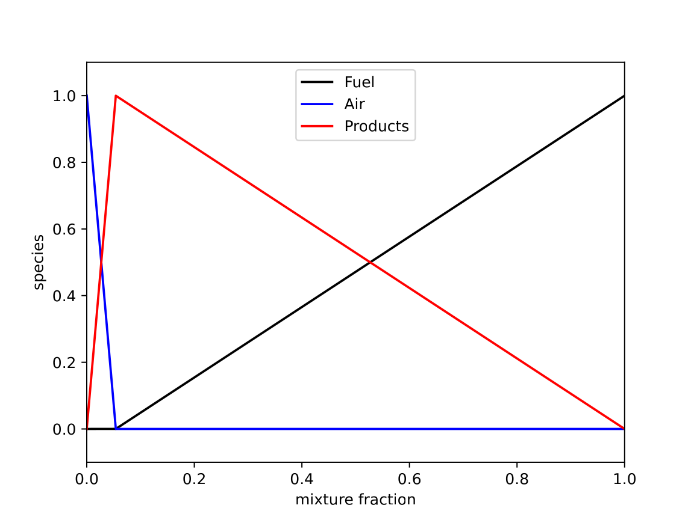{fig-alt="Fuel, air, and product mass fractions versus mixture fraction."}

:::

::: {.column width="50%"}

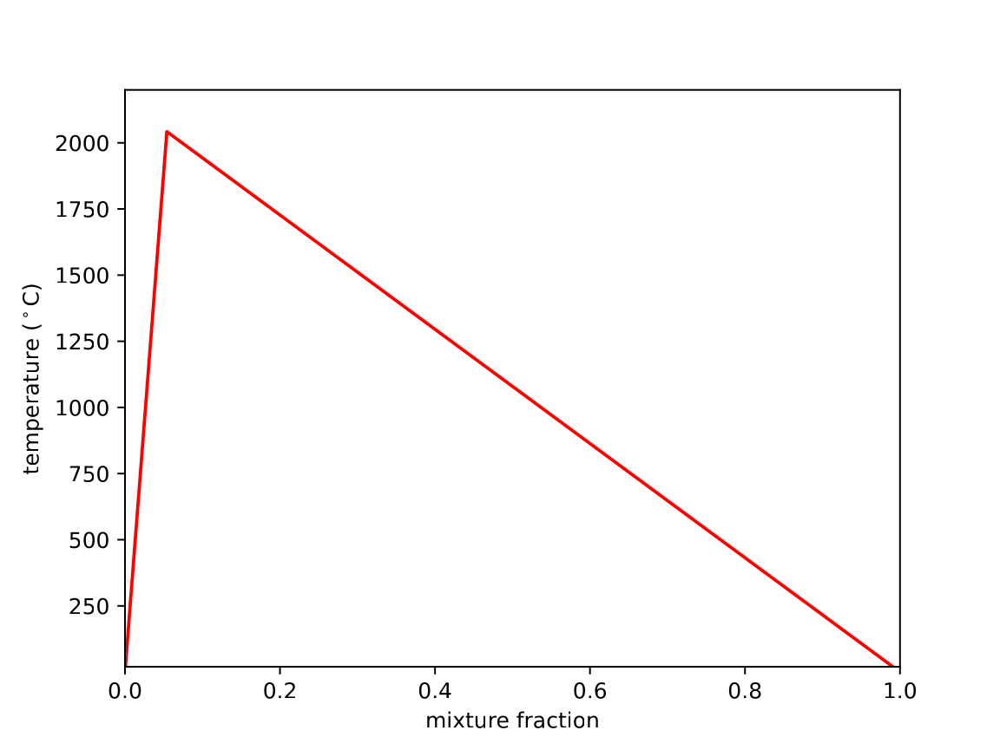{fig-alt="Temperature rise versus mixture fraction for the Burke-Schumann solution."}

:::

::::

## Equilibrium chemistry {.thermo-two-column}

:::: {.columns}

::: {.column width="53%"}

NASA CEA code

https://chem.libretexts.org

:::

::: {.column width="47%"}

{.thermo-source-figure fig-alt="Mass-fraction history converging to an equilibrium composition."}

:::

::::

## Finite-rate chemistry

$$
aA+bB\rightarrow cC+dD
$$

$$
\frac{\mathrm{d}C_A}{\mathrm{d}t}
=
-k C_A^a C_B^b
$$

$$
k=A\,T^n\exp\left(-\frac{E_a}{RT}\right)
$$

Arrhenius rate constant $[\text{appropriate units}]$  
pre-exponential factor $[\text{appropriate units}]$  
activation energy $[\mathrm{J/(mol\ K)}]$

## Finite-rate chemistry: mass fractions

primitive species

$$
C_\alpha =
\frac{\rho Y_\alpha}{W_\alpha}
$$

$$
\frac{\mathrm{d}Y_\alpha}{\mathrm{d}t}
=
\frac{1}{\rho}
\sum_i r_{\alpha,i}
$$


## Example: Westbrook and Dryer {.thermo-two-column}

:::: {.columns}

::: {.column width="52%"}

~~~~text
Run reactionrate_arrhenius_2order_1step.fds
~~~~

1. Plot the time history of species mass fractions.
2. Modify the `fds/Flowfields/realizable_mass_fractions.fds` case to use the Westbrook and Dryer propane reaction parameters (see FDS User Guide example).
3. Plot the global combustion efficiency as a function of time.

:::

::: {.column width="48%"}

{.thermo-source-figure fig-alt="Species mass-fraction histories from a finite-rate propane reaction example."}

:::

::::

## Rate laws

Stoichiometry:

$$
F+sA\rightarrow(1+s)P
$$

$$
Y_F+Y_A+Y_P=1
$$

Mixture fraction (still):

$$
f=Y_F+\frac{1}{1+s}Y_P
$$

reaction model

But now need 2 transport equations, because Fuel and Air can coexist.

## Reaction progress variables

In general, the system can be defined in terms of the mixture fraction and a reaction progress variable.

In FDS, we choose to use lumped species mass fractions as progress variables.

This avoids complications related to defining boundary conditions for the generalized progress variable approach.

## Lumped species

Let’s go back to our propane reaction and write it two equivalent ways:

$$
\mathrm{C_3H_8+
5\left[O_2+\left(\frac{0.79}{0.21}\right)N_2\right]
\rightarrow
3CO_2+4H_2O+
5\left(\frac{0.79}{0.21}\right)N_2}
$$

$$
\mathrm{
C_3H_8+
N_A\left[X_{O_2,A}O_2+X_{N_2,A}N_2\right]
\rightarrow
N_P\left[X_{CO_2,P}CO_2+X_{H_2O,P}H_2O+X_{N_2,P}N_2\right]
}
$$

Air  
Products  
Fuel

Question: How do you determine $N_A$, $N_P$?

## Lumped-species definition

Lumped species are groups of primitive species that transport and react together, implying equal diffusivities for the primitive species within the group.

## Lumped-species molecular weights

Question: What is $N_A W_A/W_{\mathrm{F}}$?

## Lumped-species mass fractions {.thermo-tight}

$$
Y_\alpha=X_\alpha\frac{W_\alpha}{\overline W}
$$

Recall:  
Fuel  
Air  
Products  
elements of $A$:

## Example: lumped species to primitive species {.thermo-two-column .thermo-compact}

:::: {.columns}

::: {.column width="100%"}

(See Z2Y.py)

:::

::::

## Specified CO and soot yields

$$
y_\mathrm{CO}
=
N_P X_{\mathrm{CO},P}
\frac{W_\mathrm{CO}}{W_{\mathrm{F}}}
$$

$$
y_S
=
N_P X_{S,P}
\frac{W_S}{W_{\mathrm{F}}}
$$

$\mathrm{C_{0.9}H_{0.1}}$  
$W_S=10.9\ \mathrm{kg/kmol}$  
SOOT_YIELD

## Complete simple hydrocarbon chemistry

{.thermo-source-figure fig-alt="Original simple hydrocarbon chemistry reaction diagram."}

{.thermo-source-figure fig-alt="Original FDS output for simple hydrocarbon chemistry."}

## Example: simple chemistry with FORMULA

1. Run simple_chemistry_methane.fds.
2. Modify input file for $\mathrm{CH_2O}$ using FORMULA.
3. Add HEAT_OF_COMBUSTION.
4. Add a CO_YIELD and a SOOT_YIELD.
5. Examine the `.out` file for each case.

## Example: custom fuel mixture

Create a test case with the following natural gas fuel composition.

{.thermo-source-figure fig-alt="Natural-gas fuel mixture input from the original lecture."}

Replace NITROGEN with CHLORINE. What happens?

## Example: complex stoichiometry

1. Define primitive species in the FDS input file.
2. Define AIR and PRODUCT lumped species.
3. Determine PRODUCT volume fractions and reaction coefficients.
4. Add slice output for HCl.

(See fds_complex_stoichiometry.py)

## Two-step chemistry for CO and soot {.thermo-tight}

$$
\mathrm{C_3H_8+3O_2
\rightarrow
2CO+C+4H_2O}
$$

$$
\mathrm{2CO+C+2O_2
\rightarrow
3CO_2}
$$

$$
\mathrm{C_3H_8+5O_2
\rightarrow
3CO_2+4H_2O}
$$

FAST R1  
FAST R2

In this example, soot is treated as carbon (in general, “soot” can be more complex).  
Both reactions are treated as “fast”, but R1 is given priority for $\mathrm{O_2}$.  
CO:C ratio is a parameter in the model, 2:1 is arbitrary.  
In this example, post-flame soot yield is zero, but that need not be the case.  
If sufficient $\mathrm{O_2}$ is present, the model recovers the 1-step reaction by construction.

## FDS propane visualization {.fds-propane-slide .source-slide-title}

::: {.fds-propane-layout}

::: {.fds-propane-video-poster}

{fig-alt="Still image from the FDS propane-flame visualization."}

:::

::: {.fds-propane-scalar-fields}

{fig-alt="FDS propane-flame scalar-field visualization."}

:::

::: {.fds-propane-legend}

FDS Propane: Orange = Soot $>600\ ^\circ\mathrm{C}$, Blue = $\mathrm{CO_2}>600\ ^\circ\mathrm{C}$

:::

::: {.fds-propane-reference}

James White, PhD Thesis, UMD, 2016.

:::

:::

## UMD line burner: radiative fraction {.thermo-two-column .thermo-compact}

:::: {.columns}

::: {.column width="30%"}

Exp data from MaCFP database, J. White, PhD Thesis, UMD, 2016.

:::

::: {.column width="70%"}

:::: {.columns}

::: {.column width="50%"}

{.thermo-source-figure fig-alt="Methane line-burner radiative-fraction measurements and FDS predictions."}

:::

::: {.column width="50%"}

{.thermo-source-figure fig-alt="Propane line-burner radiative-fraction measurements and FDS predictions."}

:::

::::

:::

::::
