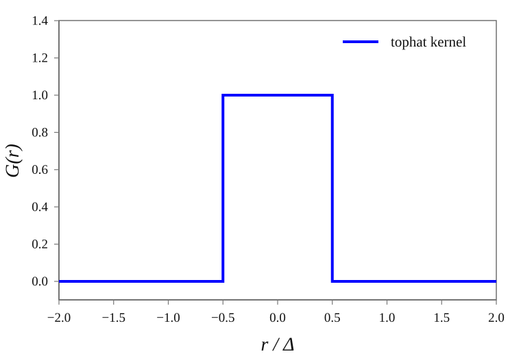
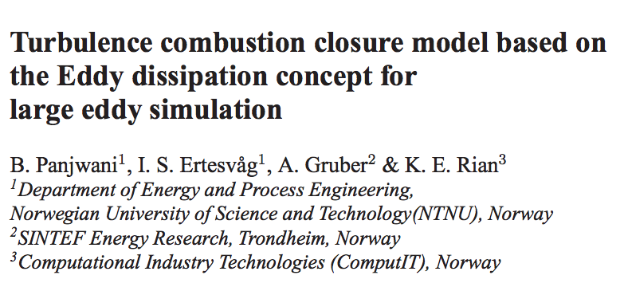
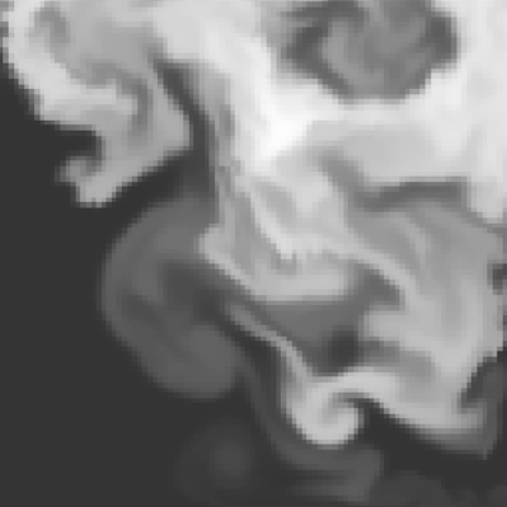
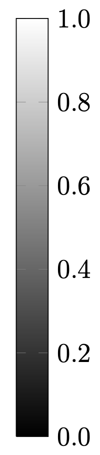
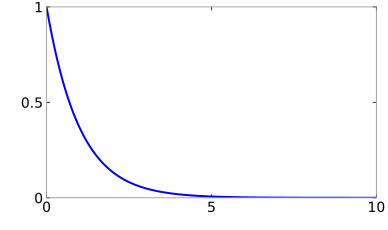
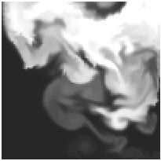
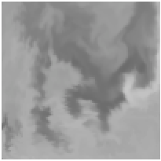

# Module II: Eddy Dissipation Concept

## Filtered Species Transport Equation {.filtered-species-slide}

::: {.filtered-species-layout}

::: {.filtered-species-equation}
$$
\frac{\partial\bar{\rho}\widetilde{Y}_{\alpha}}{\partial t}
+
\frac{\partial\!\left(\bar{\rho}\widetilde{Y}_{\alpha}\widetilde{u}_{i}\right)}{\partial x_i}
=
\frac{\partial}{\partial x_i}
\left(
\left[\rho D_{\alpha}+\frac{\mu_t}{\mathrm{Sc}_t}\right]
\frac{\partial\widetilde{Y}_{\alpha}}{\partial x_i}
\right)
+
{\color{red}\overline{\dot{m}_{\alpha}^{\prime\prime\prime}}}
$$
:::

::: {.filtered-species-field-label}
Filtered field:
:::

::: {.filtered-species-definition}
$$
\overline{\phi(\mathbf{x},t)}
\equiv
\int G(\mathbf{r};\Delta)\,\phi(\mathbf{x}+\mathbf{r},t)\,\mathrm{d}\mathbf{r}
$$
:::

::: {.filtered-species-closure}
In LES, the filtered chemical source term\
is *unclosed*.
:::

::: {.filtered-species-kernel}
{fig-alt="Top-hat spatial filter kernel, equal to one for distances within half the filter width and zero elsewhere."}
:::

:::

## The Eddy Dissipation Concept {.edc-concept-slide}

::: {.edc-concept-layout}

::: {.edc-concept-magnussen-photo}
{fig-alt="Portrait of Professor Bjørn F. Magnussen."}
:::

::: {.edc-concept-magnussen-caption}
Prof. Bjørn F. Magnussen,\
founder and Chairman of\
the Board at ComputIT
:::

::: {.edc-concept-citation}
B.F. Magnussen, B.H. Hjertager: On Mathematical Modeling of Turbulent\
Combustion with Special Emphasis on Soot Formation and Combustion. *16^th^ Symp.\
(Int.) on Combustion* (1976). Comb. Inst., Pittsburg, Pennsylvania, pp.719-729, 1976.
:::

::: {.edc-concept-ertesvag-photo}
{fig-alt="Portrait of Professor Ivar S. Ertesvåg."}
:::

::: {.edc-concept-ertesvag-caption}
Prof. Ivar S. Ertesvåg\
Norwegian University of\
Science and Technology,\
Trondheim
:::

::: {.edc-concept-paper}
{fig-alt="Excerpt from the 2010 paper Turbulence combustion closure model based on the Eddy dissipation concept for large eddy simulation."}

::: {.edc-concept-paper-highlight aria-hidden="true"}
:::
:::

::: {.edc-concept-paper-caption}
Advances in Fluid Mechanics VIII, 2010
:::

:::

## Turbulent Batch Reactor Model {.tbr-slide}

::: {.tbr-layout}

::: {.tbr-subtitle}
FDS flavor of EDC
:::

::: {.tbr-true-field}
{fig-alt="True mass-fraction field with continuous turbulent mixing."}
:::

::: {.tbr-idealized-field}
{fig-alt="Idealized mass-fraction field with three discrete composition levels."}
:::

::: {.tbr-true-label}
True
:::

::: {.tbr-idealized-label}
Idealized
:::

::: {.tbr-scale-label}
Mass Fraction
:::

::: {.tbr-scale}
{fig-alt="Grayscale mass-fraction scale from zero, black, to one, white."}
:::

::: {.tbr-unmixed-label}
$\zeta$: Unmixed fraction
:::

::: {.tbr-equation}
$$
\overline{\dot{m}_{\alpha}^{\prime\prime\prime}}
= \rho \Biggl[
{\color{#70ad47}\underbrace{
  {\color{black}\frac{{\color{#5b9bd5}\zeta}}{\tau_{\mathrm{mix}}}
  \left(\widehat{Y}_{\alpha}-\widetilde{Y}_{\alpha}^{0}\right)}
}_{\text{Mixing}}}
+
{\color{red}\underbrace{
  {\color{black}\left(1-{\color{#5b9bd5}\zeta}\right)
  \frac{\mathrm{d}\widehat{Y}_{\alpha}}{\mathrm{d}t}}
}_{\text{Reaction}}}
\Biggr]
$$
:::

:::

## The Unmixed Fraction {.unmixed-fraction-slide}

::: {.tbr-layout}

::: {.tbr-true-field}
{fig-alt="True mass-fraction field with continuous turbulent mixing."}
:::

::: {.tbr-idealized-field}
{fig-alt="Idealized mass-fraction field with three discrete composition levels."}
:::

::: {.tbr-true-label}
True
:::

::: {.tbr-idealized-label}
Idealized
:::

::: {.tbr-scale-label}
Mass Fraction
:::

::: {.tbr-scale}
{fig-alt="Grayscale mass-fraction scale from zero, black, to one, white."}
:::

::: {.unmixed-fraction-equation}
$$
\begin{array}{c@{\;}c@{\;}c@{\;}c@{\;}c@{\;}c@{\;}c}
\widetilde{Y}_{\alpha}(t)
& =
& {\color{blue}\zeta(t)}
& \widetilde{Y}_{\alpha}^{0}
& +
& {\color{red}\left(1-\zeta(t)\right)}
& \widehat{Y}_{\alpha}(t)
\\[0.45em]
\displaystyle\frac{\mathrm{kg}\text{-}\alpha}{\mathrm{kg}\text{-}\mathrm{tot}}
&
& {\color{blue}\underbrace{
  \displaystyle\frac{\mathrm{kg}\text{-}U}{\mathrm{kg}\text{-}\mathrm{tot}}
}_{\substack{\text{Unmixed}\\\text{fraction}}}}
& \displaystyle\frac{\mathrm{kg}\text{-}\alpha}{\mathrm{kg}\text{-}U}
&
& {\color{red}\displaystyle\frac{\mathrm{kg}\text{-}M}{\mathrm{kg}\text{-}\mathrm{tot}}}
& \displaystyle\frac{\mathrm{kg}\text{-}\alpha}{\mathrm{kg}\text{-}M}
\end{array}
$$
:::

:::

## Evolution of the Unmixed Fraction {.unmixed-evolution-slide}

::: {.unmixed-evolution-layout}

::: {.unmixed-evolution-rate}
$$
\frac{\mathrm{d}\zeta}{\mathrm{d}t} = -\frac{\zeta}{\tau_{\mathrm{mix}}}
$$
:::

::: {.unmixed-evolution-solution}
$$
\zeta(t) = \zeta_0\,\mathrm{e}^{-t/\tau_{\mathrm{mix}}}
$$
:::

::: {.unmixed-evolution-plot}
{fig-alt="Exponential decay of the unmixed fraction from one toward zero over ten mixing times."}
:::

::: {.unmixed-evolution-y-label}
$\zeta(t)$
:::

::: {.unmixed-evolution-x-label}
$t/\tau_{\mathrm{mix}}$
:::

::: {.unmixed-evolution-initial}
{fig-alt="Initially segregated turbulent mass-fraction field with strong light and dark variations."}
:::

::: {.unmixed-evolution-arrow-first aria-hidden="true"}
:::

::: {.unmixed-evolution-intermediate}
{fig-alt="Partially mixed field with reduced mass-fraction variations."}
:::

::: {.unmixed-evolution-arrow-second aria-hidden="true"}
:::

::: {.unmixed-evolution-mixed}
{fig-alt="Fully mixed field with uniform mass fraction."}
:::

:::

## Unmixed Fraction FAQ {.unmixed-faq-slide}

- Is the unmixed fraction the same as the mixture fraction?
- Is the unmixed fraction related to the mixture fraction?
- Why not work in terms of the “mixed fraction”?
- Is the unmixed fraction related to the subgrid variance?

## Mixing Time Scale {.source-slide-title}

{.reference-slide fig-align="center"}

## Exercise: Kolmogorov Scaling {.source-slide-title}

{.reference-slide fig-align="center"}

## Limiting Case: Initially Mixed {.source-slide-title}

{.reference-slide fig-align="center"}

## Limiting Case: Initially Unmixed {.source-slide-title}

{.reference-slide fig-align="center"}

## Basic Eddy Dissipation Model {.source-slide-title}

{.reference-slide fig-align="center"}

## Example: Heskestad Flame Height {.source-slide-title}

{.reference-slide fig-align="center"}

## Optional module: PDF methods {.source-slide-title}

{.reference-slide fig-align="center"}

## Turbulence-Chemistry Closure Problem {.source-slide-title}

{.reference-slide fig-align="center"}

## Probability Density Functions {.source-slide-title}

{.reference-slide fig-align="center"}

## Beta PDF {.source-slide-title}

{.reference-slide fig-align="center"}

## Example: Dirac Delta Function {.source-slide-title}

{.reference-slide fig-align="center"}

## Multiple Delta Functions {.source-slide-title}

{.reference-slide fig-align="center"}

## Lots of Deltas {.source-slide-title}

{.reference-slide fig-align="center"}

## Lots of Deltas: Random Distribution {.source-slide-title}

{.reference-slide fig-align="center"}

## The First Moment {.source-slide-title}

{.reference-slide fig-align="center"}

## The Second Central Moment {.source-slide-title}

{.reference-slide fig-align="center"}

## Example: Computing the Variance {.source-slide-title}

{.reference-slide fig-align="center"}

## Example: Computing the Variance, Continued {.source-slide-title}

{.reference-slide fig-align="center"}

## Interaction by Exchange with the Mean {.source-slide-title}

{.reference-slide fig-align="center"}

## Example: Evolution of the Variance with IEM {.source-slide-title}

{.reference-slide fig-align="center"}

## Three Environment Subgrid PDF {.source-slide-title}

{.reference-slide fig-align="center"}

## Three Environment Subgrid PDF: Definition {.source-slide-title}

{.reference-slide fig-align="center"}

## Cell Integral Constraints {.source-slide-title}

{.reference-slide fig-align="center"}

## Exercise: Check Cell Integral Constraints {.source-slide-title}

{.reference-slide fig-align="center"}

## Exercise: Derive Formula for Subgrid Variance {.source-slide-title}

{.reference-slide fig-align="center"}

## Relating Unmixed Fraction and SGS Variance {.source-slide-title}

{.reference-slide fig-align="center"}

## Relating Unmixed Fraction and SGS Variance: Case 2 {.source-slide-title}

{.reference-slide fig-align="center"}

## Relating Unmixed Fraction and SGS Variance: Case 3 {.source-slide-title}

{.reference-slide fig-align="center"}

## Relating Unmixed Fraction and SGS Variance: Case 4 {.source-slide-title}

{.reference-slide fig-align="center"}

## Relating Unmixed Fraction and SGS Variance: Summary {.source-slide-title}

{.reference-slide fig-align="center"}

## Fokker--Planck Equation {.source-slide-title}

{.reference-slide fig-align="center"}
