## Optional Module: PDF Methods {#optional-module-pdf-methods .pdf-methods-title-slide}

## Turbulence-Chemistry Closure Problem {.pdf-closure-slide}

::: {.pdf-closure-layout}

::: {.pdf-closure-intro}
In general, for finite-rate chemistry the Arrhenius rate laws cannot be evaluated using Favre-filtered fields.
:::

::: {.pdf-closure-inequality}
$$
\overline{\dot{m}_{\alpha}^{\prime\prime\prime}(\mathbf{Y},T)}
\neq
\dot{m}_{\alpha}^{\prime\prime\prime}(\widetilde{\mathbf{Y}},\widetilde{T})
$$
:::

::: {.pdf-closure-explanation}
However, the mean may be computed from convolution over the subgrid PDF:
:::

::: {.pdf-closure-integral}
$$
\left\langle\dot{m}_{\alpha}^{\prime\prime\prime}(\mathbf{x},t)\right\rangle
=\int f\!\left({\color{#4472c4}\underline{\psi}};\mathbf{x},t\right)
\dot{m}_{\alpha}^{\prime\prime\prime}(\underline{\psi})\,\mathrm{d}\underline{\psi}
$$
:::

::: {.pdf-closure-composition-label}
$\underline{\psi}$: thermochemical composition vector
:::

::: {.pdf-closure-field}
{fig-alt="Turbulent composition field showing unresolved variations within a grid cell."}
:::

:::

## Probability Density Functions {.normal-pdf-slide .has-example-files}

::: {.normal-pdf-layout}

::: {.normal-pdf-label}
Normal distribution:
:::

::: {.normal-pdf-equation}
$$
f(V)=\frac{1}{\sigma\sqrt{2\pi}}
\exp\!\left[-\frac{1}{2}\frac{(V-\mu)^2}{\sigma^2}\right]
$$
:::

::: {.normal-pdf-normalization}
$$
\int_{-\infty}^{\infty} f(V)\,\mathrm{d}V=1
$$
:::

::: {.normal-pdf-script}
See [`normal_pdf.py`](examples/pdf_example/normal_pdf.py).
:::

::: {.normal-pdf-plot}
{fig-alt="Normal probability densities with mean zero and standard deviations 0.1, 0.2, and 0.5, shown in blue, red, and green."}

::: {.normal-pdf-xlabel}
$V$
:::

::: {.normal-pdf-ylabel}
$f(V)$
:::

::: {.normal-pdf-legend}
[— $\mu=0,\;\sigma=0.1$]{.normal-pdf-blue}\
[— $\mu=0,\;\sigma=0.2$]{.normal-pdf-red}\
[— $\mu=0,\;\sigma=0.5$]{.normal-pdf-green}
:::

:::

:::

::: {.example-files}
Files: `08_Combustion/examples/pdf_example/`
:::

## Beta PDF {.beta-pdf-slide .has-example-files}

::: {.beta-pdf-layout}

::: {.beta-pdf-density}
$$
f(Z;a,b)=\frac{1}{B(a,b)}Z^{a-1}(1-Z)^{b-1}
$$
:::

::: {.beta-pdf-function}
$$
B(a,b)=\frac{\Gamma(a)\Gamma(b)}{\Gamma(a+b)}
\qquad {\color{#4472c4}\text{“beta function”}}
$$
:::

::: {.beta-pdf-parameters}
$$
a=\widetilde{Z}\gamma
\qquad b=(1-\widetilde{Z})\gamma
$$
:::

::: {.beta-pdf-gamma}
$$
\gamma=\frac{\widetilde{Z}(1-\widetilde{Z})}{\widetilde{Z^{\prime\prime 2}}}-1\geq 0
$$
:::

::: {.beta-pdf-script}
See [`beta_pdf.py`](examples/pdf_example/beta_pdf.py).
:::

::: {.beta-pdf-plot}
{fig-alt="Four beta probability densities showing peaked, broad, and endpoint-singular distributions for different mean and gamma values."}

::: {.beta-pdf-xlabel}
$Z$
:::

::: {.beta-pdf-ylabel}
$f(Z)$
:::

::: {.beta-pdf-legend}
[$\widetilde{Z}=0.6,\;\gamma=4$]{.beta-pdf-blue}\
[$\widetilde{Z}=0.6,\;\gamma=10$]{.beta-pdf-red}\
[$\widetilde{Z}=0.6,\;\gamma=0.5$]{.beta-pdf-green}\
[$\widetilde{Z}=0.8,\;\gamma=2$]{.beta-pdf-black}
:::

:::

:::

::: {.example-files}
Files: `08_Combustion/examples/pdf_example/`
:::

## Example: Dirac Delta Function {.dirac-delta-slide .has-example-files}

::: {.dirac-delta-layout}

::: {.dirac-delta-task-a}
a\) Using [`normal_pdf.py`](examples/pdf_example/normal_pdf.py), decrease the variance and plot the results. What do you observe?
:::

::: {.dirac-delta-task-b}
b\) The Dirac delta function is informally represented as
:::

::: {.dirac-delta-definition}
$$
\delta(x)=\begin{cases}
\infty & \text{if }x=0 \\
0 & \text{otherwise}
\end{cases}
$$
:::

::: {.dirac-delta-question}
Given your observations from part (a), what is
:::

::: {.dirac-delta-integral}
$$
\int_{-\infty}^{\infty}\delta(x)\,\mathrm{d}x\;?
$$
:::

::: {.dirac-delta-portrait}
{fig-alt="Portrait of Paul Dirac."}
:::

::: {.dirac-delta-caption}
Paul Dirac (1902–1984)
:::

:::

::: {.example-files}
Files: `08_Combustion/examples/pdf_example/`
:::

## Multiple Delta Functions {.multiple-deltas-slide .has-example-files}

::: {.multiple-deltas-layout}

::: {.multiple-deltas-equation}
$$
f(V)=w_1\,\delta(0-V)+w_2\,\delta(1-V)
$$
:::

::: {.multiple-deltas-question}
What is the constraint on the weights?
:::

::: {.multiple-deltas-constraint}
$$
w_1+w_2=1,\qquad w_1,w_2\geq 0
$$
:::

::: {.multiple-deltas-script}
See [`dirac_delta_function.py`](examples/pdf_example/dirac_delta_function.py).
:::

::: {.multiple-deltas-plot}
{fig-alt="Schematic delta locations at V equals zero in blue and V equals one in red; the vertical lines do not represent finite heights."}

::: {.multiple-deltas-xlabel}
$V$
:::

::: {.multiple-deltas-ylabel}
$f(V)$
:::

::: {.multiple-deltas-legend}
[$V=0$]{.multiple-deltas-blue}\
[$V=1$]{.multiple-deltas-red}
:::

:::

::: {.multiple-deltas-panels}

::: {.multiple-deltas-panel .multiple-deltas-pure-blue}
$w_1=1,\;w_2=0$
:::

::: {.multiple-deltas-panel .multiple-deltas-half}
$w_1=0.5,\;w_2=0.5$
:::

::: {.multiple-deltas-panel .multiple-deltas-fifth}
$w_1=0.2,\;w_2=0.8$
:::

::: {.multiple-deltas-panel .multiple-deltas-pure-red}
$w_1=0,\;w_2=1$
:::

:::

:::

::: {.example-files}
Files: `08_Combustion/examples/pdf_example/`
:::

## Lots of Deltas (Particles) {#lots-of-deltas .particle-deltas-slide .has-example-files}

::: {.particle-deltas-layout}

::: {.particle-deltas-cell-script}
See [`particles.py`](examples/particle_example/particles.py).
:::

::: {.particle-deltas-cell}
{fig-alt="Square CFD cell containing 100 evenly spaced particles: 50 blue particles on the left and 50 red particles on the right."}
:::

::: {.particle-deltas-plot-script}
See [`dirac_delta_function.py`](examples/pdf_example/dirac_delta_function.py).
:::

::: {.particle-deltas-plot}
{fig-alt="Schematic delta locations at V equals zero in blue and V equals one in red."}

::: {.particle-deltas-xlabel}
$V$
:::

::: {.particle-deltas-ylabel}
$f(V)$
:::

::: {.particle-deltas-legend}
[$V=0$]{.multiple-deltas-blue}\
[$V=1$]{.multiple-deltas-red}
:::

:::

::: {.particle-deltas-equation}
$$
f(V)=\sum_{i=1}^{N_p} w_i\,\delta(U_i-V)
\qquad ; \qquad w_i=\frac{1}{N_p}
$$
:::

:::

::: {.example-files}
Cell: `08_Combustion/examples/particle_example/`\
Plot: `08_Combustion/examples/pdf_example/`
:::

## Lots of Deltas: Random Distribution {#lots-of-deltas-random-distribution .particle-deltas-slide .has-example-files}

::: {.particle-deltas-layout}

::: {.particle-deltas-cell-script}
See [`particles.py`](examples/particle_example/particles.py).
:::

::: {.particle-deltas-cell}
{fig-alt="Square CFD cell containing 50 blue and 50 red particles at random positions."}
:::

::: {.particle-deltas-plot-script}
See [`dirac_delta_function.py`](examples/pdf_example/dirac_delta_function.py).
:::

::: {.particle-deltas-plot}
{fig-alt="Schematic delta locations at V equals zero in blue and V equals one in red."}

::: {.particle-deltas-xlabel}
$V$
:::

::: {.particle-deltas-ylabel}
$f(V)$
:::

::: {.particle-deltas-legend}
[$V=0$]{.multiple-deltas-blue}\
[$V=1$]{.multiple-deltas-red}
:::

:::

::: {.particle-deltas-equation}
$$
f(V)=\sum_{i=1}^{N_p} w_i\,\delta(U_i-V)
\qquad ; \qquad w_i=\frac{1}{N_p}
$$
:::

:::

::: {.example-files}
Cell: `08_Combustion/examples/particle_example/`\
Plot: `08_Combustion/examples/pdf_example/`
:::

## The First Moment (Mean) {#the-first-moment .first-moment-slide .has-example-files}

::: {.first-moment-layout}

::: {.first-moment-pdf}
$$
f(V)=\sum_{i=1}^{N_p}w_i\,\delta(U_i-V)
\quad ; \quad w_i=\frac{1}{N_p}
$$
:::

::: {.first-moment-cell}
{fig-alt="Square CFD cell containing 50 blue and 50 red particles at random positions."}
:::

::: {.first-moment-derivation}
$$
\begin{aligned}
\overline{U}
&=\int f(V)V\,\mathrm{d}V \\[0.45em]
&=\int\sum_i w_i\,\delta(U_i-V)V\,\mathrm{d}V \\[0.45em]
&=\sum_i w_i\,{\color{#4472c4}\int\delta(U_i-V)V\,\mathrm{d}V} \\[0.45em]
&=\sum_i w_i U_i \\[0.45em]
&=\frac{1}{N_p}\sum_i U_i
\end{aligned}
$$
:::

::: {.first-moment-sifting}
The blue integral equals $U_i$ by the sifting property of the Dirac delta function.
:::

::: {.first-moment-script}
See [`particles.py`](examples/particle_example/particles.py).
:::

:::

::: {.example-files}
Cell: `08_Combustion/examples/particle_example/`
:::

## The Second Central Moment (Variance) {#the-second-central-moment .second-moment-slide .has-example-files}

::: {.second-moment-layout}

::: {.second-moment-pdf}
$$
f(V)=\sum_{i=1}^{N_p}w_i\,\delta(U_i-V)
\quad ; \quad w_i=\frac{1}{N_p}
$$
:::

::: {.second-moment-cell}
{fig-alt="Square CFD cell containing 50 blue and 50 red particles at random positions."}
:::

::: {.second-moment-derivation}
$$
\begin{aligned}
\operatorname{var}(U)
&=\int f(V)(V-\overline{U})^2\,\mathrm{d}V \\[0.55em]
&=\int\sum_i w_i\,\delta(U_i-V)(V-\overline{U})^2\,\mathrm{d}V \\[0.55em]
&=\sum_i w_i\int\delta(U_i-V)(V-\overline{U})^2\,\mathrm{d}V \\[0.55em]
&=\sum_i w_i(U_i-\overline{U})^2 \\[0.55em]
&=\frac{1}{N_p}\sum_i(U_i-\overline{U})^2
\end{aligned}
$$
:::

::: {.second-moment-script}
See [`particles.py`](examples/particle_example/particles.py).
:::

:::

::: {.example-files}
Cell: `08_Combustion/examples/particle_example/`
:::

## Example: Computing the Variance {.variance-example-slide .has-example-files}

::: {.variance-example-layout}

::: {.variance-example-unmixed}
{fig-alt="Square cell split equally between mixture fractions zero and one, with a histogram showing 50 samples at each value."}

::: {.variance-example-xlabel}
$Z$
:::
:::

::: {.variance-example-partially-mixed}
{fig-alt="Square cell split equally between mixture fractions 0.2 and 0.8, with a histogram showing 50 samples at each value."}

::: {.variance-example-xlabel}
$Z$
:::
:::

::: {.variance-example-calculation}
$$
\begin{aligned}
\operatorname{var}(Z)
&=\frac{1}{2}(0-0.5)^2+\frac{1}{2}(1-0.5)^2 \\[0.7em]
&=0.125+0.125=0.25
\end{aligned}
$$
:::

::: {.variance-example-script}
See [`subgrid_variance.py`](examples/variance_example/subgrid_variance.py).
:::

:::

::: {.example-files}
Files: `08_Combustion/examples/variance_example/`
:::

## Example: Computing the Variance, Continued {.variance-example-slide .has-example-files}

::: {.variance-example-layout}

::: {.variance-example-unmixed}
{fig-alt="Square cell split equally between mixture fractions 0.4 and 0.6, with a histogram showing 50 samples at each value."}

::: {.variance-example-xlabel}
$Z$
:::
:::

::: {.variance-example-partially-mixed}
{fig-alt="Uniform square cell with mixture fraction 0.5 throughout, and a histogram showing all 100 samples at 0.5."}

::: {.variance-example-xlabel}
$Z$
:::
:::

::: {.variance-example-script}
See [`subgrid_variance.py`](examples/variance_example/subgrid_variance.py).
:::

:::

::: {.example-files}
Files: `08_Combustion/examples/variance_example/`
:::

## Interaction by Exchange with the Mean (IEM) {#interaction-by-exchange-with-the-mean .iem-slide .has-example-files}

::: {.iem-layout}

::: {.iem-cell}
{fig-alt="Square CFD cell containing 50 blue and 50 red particles at random positions."}
:::

::: {.iem-cell-script}
Cell figure: [`particles.py`](examples/particle_example/particles.py).
:::

::: {.iem-rate}
$$
\frac{\mathrm{d}\phi}{\mathrm{d}t}
=\frac{1}{\tau_{\mathrm{mix}}}(\overline{\phi}-\phi)
$$
:::

::: {.iem-decay}
$$
\overline{\phi}-\phi
=(\overline{\phi}-\phi_0)\,e^{-t/\tau_{\mathrm{mix}}}
$$
:::

::: {.iem-solution}
$$
\phi(t)=\phi_0+(\overline{\phi}-\phi_0)
\left[1-e^{-t/\tau_{\mathrm{mix}}}\right]
$$
:::

:::

::: {.example-files}
Cell: `08_Combustion/examples/particle_example/`
:::

## Example: Evolution of the Variance with IEM {.iem-variance-exercise-slide}

::: {.iem-variance-exercise-prompt}
Using the result from the [previous slide](#interaction-by-exchange-with-the-mean), derive the evolution equation for the variance according to the IEM mixing model.
:::

::: {.iem-variance-exercise-equation}
$$
\overline{\phi}-\phi
=(\overline{\phi}-\phi_0)\,e^{-t/\tau_{\mathrm{mix}}}
$$
:::

## Three Environment Subgrid PDF {.three-environment-slide .has-example-files}

::: {.three-environment-layout}

::: {.three-environment-continuous}
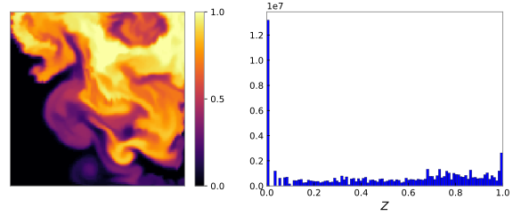{fig-alt="Contrast-adjusted continuous mixture-fraction field in a square cell, with its color scale and a histogram of the same adjusted values."}

:::

::: {.three-environment-discrete}
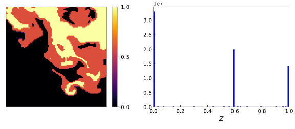{fig-alt="Three-environment representation in a square cell, with its color scale and histogram concentrated near mixture fractions zero, 0.6, and one."}

:::

::: {.three-environment-script}
See [`plot-three-environment.py`](figs/pdf_methods/plot-three-environment.py).
:::

:::

::: {.example-files}
Files: `08_Combustion/examples/variance_example/`
:::

## Three Environment Subgrid PDF: Definition {.three-environment-definition-slide .has-example-files}

::: {.three-environment-definition-layout}

::: {.three-environment-definition-figure}
{fig-alt="Square three-environment mixture-fraction field and its pixel-count histogram, generated from the tracked field image."}
:::

::: {.three-environment-definition-equation}
$$
f(\psi_{\alpha};t)
=w_1\,\delta(0-\psi_{\alpha})
+w_2\,\delta(1-\psi_{\alpha})
+w_3\,\delta\!\left(\widehat{Y}_{\alpha}[t]-\psi_{\alpha}\right)
$$
:::

::: {.three-environment-definition-script}
See [`plot-three-environment.py`](figs/pdf_methods/plot-three-environment.py).
:::

:::

::: {.example-files}
Files: `08_Combustion/examples/variance_example/`
:::

## Cell Integral Constraints {.cell-integral-slide}

::: {.cell-integral-layout}
::: {.cell-integral-pdf}
$$
f(\psi_{\alpha};t)
=w_1\,\delta(0-\psi_{\alpha})
+w_2\,\delta(1-\psi_{\alpha})
+w_3\,\delta\!\left(\widehat{Y}_{\alpha}[t]-\psi_{\alpha}\right)
$$
:::

::: {.cell-integral-normalization}
$$
\int f(\psi_{\alpha};t)\,\mathrm{d}\psi_{\alpha}=1
$$
:::

::: {.cell-integral-mean}
$$
\int f(\psi_{\alpha};t)\,\psi_{\alpha}\,\mathrm{d}\psi_{\alpha}
=\widetilde{Y}_{\alpha}(t)
$$
:::

::: {.cell-integral-weights}
$$
w_1=\zeta\left(1-\widetilde{Y}_{\alpha}^{0}\right)
$$

$$
w_2=\zeta\widetilde{Y}_{\alpha}^{0}
\vphantom{\zeta\left(1-\widetilde{Y}_{\alpha}^{0}\right)}
$$

$$
w_3=1-\zeta
\vphantom{\zeta\left(1-\widetilde{Y}_{\alpha}^{0}\right)}
$$
:::
:::

## Exercise: Check Cell Integral Constraints {.cell-integral-exercise-slide}

::: {.cell-integral-exercise-prompt}
Using the three-environment PDF and weights on the [previous slide](#cell-integral-constraints), verify the normalization and mean constraints:
:::

::: {.cell-integral-exercise-equations}
$$
\int f(\psi_{\alpha};t)\,\mathrm{d}\psi_{\alpha}=1
$$

$$
\int f(\psi_{\alpha};t)\,\psi_{\alpha}\,\mathrm{d}\psi_{\alpha}
=\widetilde{Y}_{\alpha}(t)
$$
:::

## Exercise: Subgrid Variance from Unmixed Fraction (No Reaction) {#exercise-derive-formula-for-subgrid-variance .cell-integral-exercise-slide}

::: {.cell-integral-exercise-prompt}
Using the [three-environment PDF and weights](#cell-integral-constraints), derive an expression for the subgrid variance in terms of the unmixed fraction $\zeta$, assuming no reaction.
:::

::: {.cell-integral-exercise-equations}
$$
\widetilde{Y_{\alpha}^{\prime\prime 2}}(t)
=\int f(\psi_{\alpha};t)
\left[\psi_{\alpha}-\widetilde{Y}_{\alpha}(t)\right]^2
\,\mathrm{d}\psi_{\alpha}
$$
:::

## Relating Unmixed Fraction and SGS Variance {.unmixed-sgs-slide}

::: {.unmixed-sgs-layout}
::: {.unmixed-sgs-case}
$$
\zeta=1\;;\qquad \langle\phi\rangle=0.5
$$
:::

::: {.unmixed-sgs-relation}
$$
\begin{aligned}
\langle\phi^{\prime 2}\rangle
&=\langle\phi^2\rangle-\langle\phi\rangle^2\\[0.4em]
&=\zeta\left(\langle\phi\rangle-\langle\phi\rangle^2\right)
\end{aligned}
$$
:::

::: {.unmixed-sgs-cell}
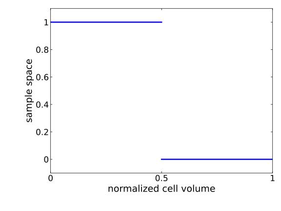{fig-alt="Scalar composition is one in half of the cell volume and zero in the other half."}
:::

::: {.unmixed-sgs-variance}
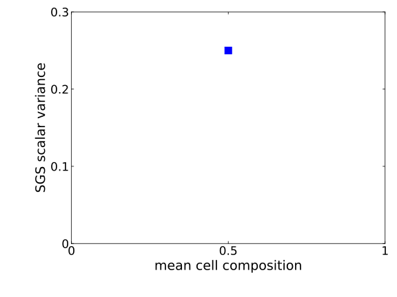{fig-alt="The fully unmixed case has mean composition 0.5 and SGS scalar variance 0.25."}
:::

::: {.unmixed-sgs-script}
See [`plot-unmixed-sgs-variance.py`](figs/pdf_methods/plot-unmixed-sgs-variance.py).
:::
:::

## Relating Unmixed Fraction and SGS Variance: Case 2 {.unmixed-sgs-slide}

::: {.unmixed-sgs-layout}
::: {.unmixed-sgs-case}
$$
\zeta=1\;;\qquad \langle\phi\rangle=0.25
$$
:::

::: {.unmixed-sgs-relation}
$$
\begin{aligned}
\langle\phi^{\prime 2}\rangle
&=\langle\phi^2\rangle-\langle\phi\rangle^2\\[0.4em]
&=\zeta\left(\langle\phi\rangle-\langle\phi\rangle^2\right)
\end{aligned}
$$
:::

::: {.unmixed-sgs-cell}
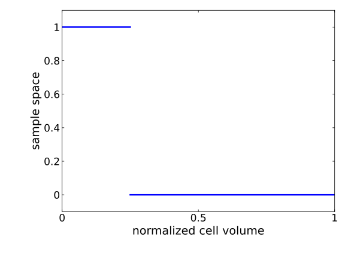{fig-alt="Scalar composition is one in one quarter of the cell volume and zero in the remaining three quarters."}
:::

::: {.unmixed-sgs-variance}
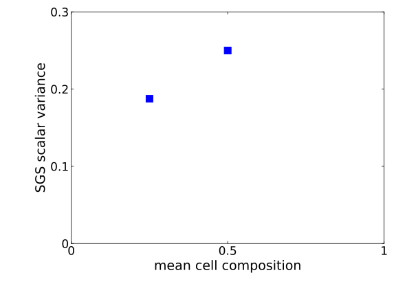{fig-alt="Cumulative case comparison including unmixed fraction 1, mean composition 0.25, and SGS scalar variance 0.1875."}
:::

::: {.unmixed-sgs-script}
See [`plot-unmixed-sgs-variance.py`](figs/pdf_methods/plot-unmixed-sgs-variance.py).
:::
:::

## Relating Unmixed Fraction and SGS Variance: Case 3 {.unmixed-sgs-slide}

::: {.unmixed-sgs-layout}
::: {.unmixed-sgs-case}
$$
\zeta=0.5\;;\qquad \langle\phi\rangle=0.5
$$
:::

::: {.unmixed-sgs-relation}
$$
\begin{aligned}
\langle\phi^{\prime 2}\rangle
&=\langle\phi^2\rangle-\langle\phi\rangle^2\\[0.4em]
&=\zeta\left(\langle\phi\rangle-\langle\phi\rangle^2\right)
\end{aligned}
$$
:::

::: {.unmixed-sgs-cell}
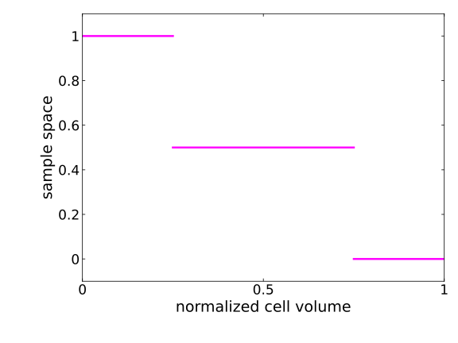{fig-alt="Scalar composition is one in the first quarter, 0.5 in the middle half, and zero in the final quarter of the cell."}
:::

::: {.unmixed-sgs-variance}
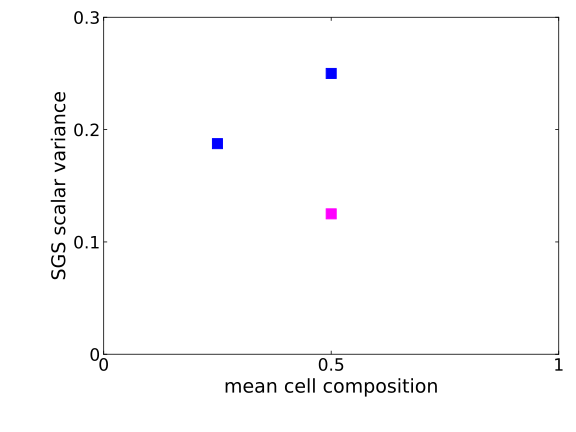{fig-alt="Cumulative case comparison including unmixed fraction 0.5, mean composition 0.5, and SGS scalar variance 0.125."}
:::

::: {.unmixed-sgs-script}
See [`plot-unmixed-sgs-variance.py`](figs/pdf_methods/plot-unmixed-sgs-variance.py).
:::
:::

## Relating Unmixed Fraction and SGS Variance: Case 4 {.unmixed-sgs-slide}

::: {.unmixed-sgs-layout}
::: {.unmixed-sgs-case}
$$
\zeta=0.5\;;\qquad \langle\phi\rangle=0.25
$$
:::

::: {.unmixed-sgs-relation}
$$
\begin{aligned}
\langle\phi^{\prime 2}\rangle
&=\langle\phi^2\rangle-\langle\phi\rangle^2\\[0.4em]
&=\zeta\left(\langle\phi\rangle-\langle\phi\rangle^2\right)
\end{aligned}
$$
:::

::: {.unmixed-sgs-cell}
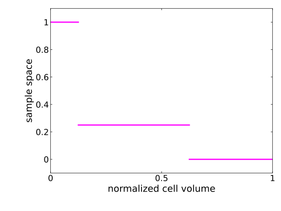{fig-alt="Scalar composition is one in the first eighth, 0.25 in the next half, and zero in the final three eighths of the cell."}
:::

::: {.unmixed-sgs-variance}
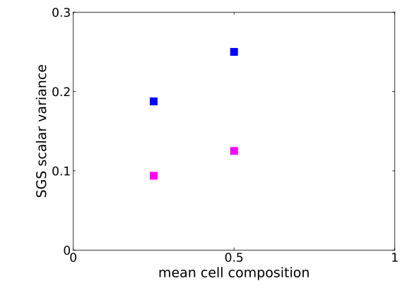{fig-alt="Cumulative case comparison including unmixed fraction 0.5, mean composition 0.25, and SGS scalar variance 0.09375."}
:::

::: {.unmixed-sgs-script}
See [`plot-unmixed-sgs-variance.py`](figs/pdf_methods/plot-unmixed-sgs-variance.py).
:::
:::

## Relating Unmixed Fraction and SGS Variance: Summary {.unmixed-sgs-slide}

::: {.unmixed-sgs-layout}
::: {.unmixed-sgs-summary-equation}
$$
\langle\phi^{\prime 2}\rangle
=\zeta\left(\langle\phi\rangle-\langle\phi\rangle^2\right)
$$
:::

::: {.unmixed-sgs-summary-figure}
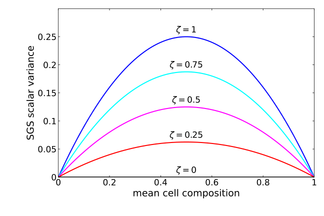{fig-alt="SGS scalar variance versus mean composition for unmixed fractions 1, 0.75, 0.5, 0.25, and 0. Each curve is zero at means zero and one and reaches its maximum at mean 0.5."}
:::

::: {.unmixed-sgs-script}
See [`plot-unmixed-sgs-variance.py`](figs/pdf_methods/plot-unmixed-sgs-variance.py).
:::
:::

## Fokker--Planck Equation {.fokker-planck-slide}

::: {.fokker-planck-layout}
::: {.fokker-heading-left}
Derivation 1: Differentiate the mean mass fraction
:::

::: {.fokker-heading-right}
Derivation 2: Transport of the subgrid PDF (Fokker–Planck)
:::

::: {.fokker-equations-left}
$$
\begin{aligned}
\widetilde{Y}_{\alpha}(t)
&=\zeta(t)\widetilde{Y}_{\alpha}^{0}
+\left(1-\zeta(t)\right)\widehat{Y}_{\alpha}(t)
\vphantom{\rule[-1.6em]{0pt}{3.6em}}\\
\frac{\mathrm{d}\widetilde{Y}_{\alpha}}{\mathrm{d}t}
&=-\frac{\mathrm{d}\zeta}{\mathrm{d}t}
\left(\widehat{Y}_{\alpha}-\widetilde{Y}_{\alpha}^{0}\right)
+(1-\zeta)\frac{\mathrm{d}\widehat{Y}_{\alpha}}{\mathrm{d}t}
\vphantom{\rule[-1.6em]{0pt}{3.6em}}\\
\overline{\dot{m}_{\alpha}^{\prime\prime\prime}}
&=\overline{\rho}\frac{\mathrm{d}\widetilde{Y}_{\alpha}}{\mathrm{d}t}
\vphantom{\rule[-1.6em]{0pt}{3.6em}}\\
&=\overline{\rho}\left[
\frac{\zeta}{\tau_{\mathrm{mix}}}
\left(\widehat{Y}_{\alpha}-\widetilde{Y}_{\alpha}^{0}\right)
+(1-\zeta)\frac{\mathrm{d}\widehat{Y}_{\alpha}}{\mathrm{d}t}
\right]
\vphantom{\rule[-1.6em]{0pt}{3.6em}}
\end{aligned}
$$
:::

::: {.fokker-equations-right}
$$
\begin{aligned}
\frac{\partial f}{\partial t}
&=-\frac{\partial}{\partial\psi_{\alpha}}
\left(f\left\langle\frac{\partial Y_{\alpha}}{\partial t}
\,\middle|\,\psi_{\alpha}\right\rangle\right)
\vphantom{\rule[-1.6em]{0pt}{3.6em}}\\
{\color{red}\left\langle\frac{\partial Y_{\alpha}}{\partial t}
\,\middle|\,\psi_{\alpha}\right\rangle}
&\mathrel{\color{red}=}{\color{red}\frac{1}{\tau_{\mathrm{mix}}}\left(\widehat{Y}_{\alpha}-\psi_{\alpha}\right)
+\frac{\mathrm{d}\widehat{Y}_{\alpha}}{\mathrm{d}t}(\psi)}
\vphantom{\rule[-1.6em]{0pt}{3.6em}}\\
\int\psi_{\beta}\frac{\partial f}{\partial t}\,\mathrm{d}\psi_{\beta}
&=-\int\psi_{\beta}\frac{\partial}{\partial\psi_{\alpha}}
\left(f\left\langle\frac{\partial Y_{\alpha}}{\partial t}
\,\middle|\,\psi_{\alpha}\right\rangle\right)\mathrm{d}\psi_{\beta}
\vphantom{\rule[-1.6em]{0pt}{3.6em}}\\
{\color{blue}\overline{\dot{m}_{\beta}^{\prime\prime\prime}}}
&\mathrel{\color{blue}=}{\color{blue}\overline{\rho}\frac{\mathrm{d}\widetilde{Y}_{\beta}}{\mathrm{d}t}}
\vphantom{\rule[-1.6em]{0pt}{3.6em}}\\
&\mathrel{\color{blue}=}{\color{blue}\overline{\rho}\left[
\frac{\zeta}{\tau_{\mathrm{mix}}}
\left(\widehat{Y}_{\beta}-\widetilde{Y}_{\beta}^{0}\right)
+(1-\zeta)\frac{\mathrm{d}\widehat{Y}_{\beta}}{\mathrm{d}t}
\right]}
\vphantom{\rule[-1.6em]{0pt}{3.6em}}
\end{aligned}
$$
:::
:::

::: {.notes}
Both derivations lead to the same chemical source-term closure. The mixing model in the second derivation is interaction by exchange with the mixed mean (IEMM), a variant of traditional IEM.
:::
