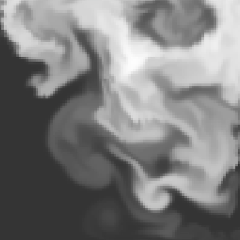
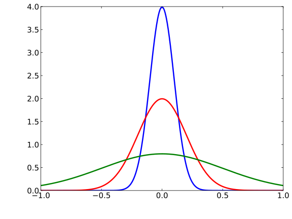
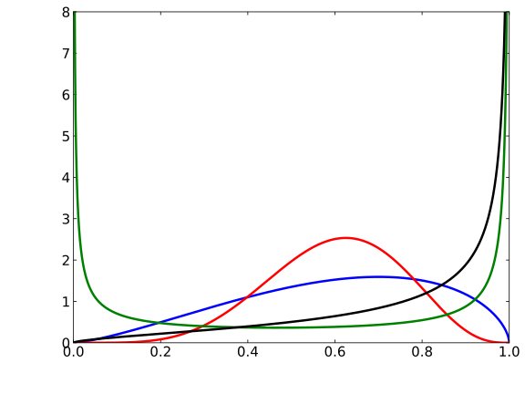
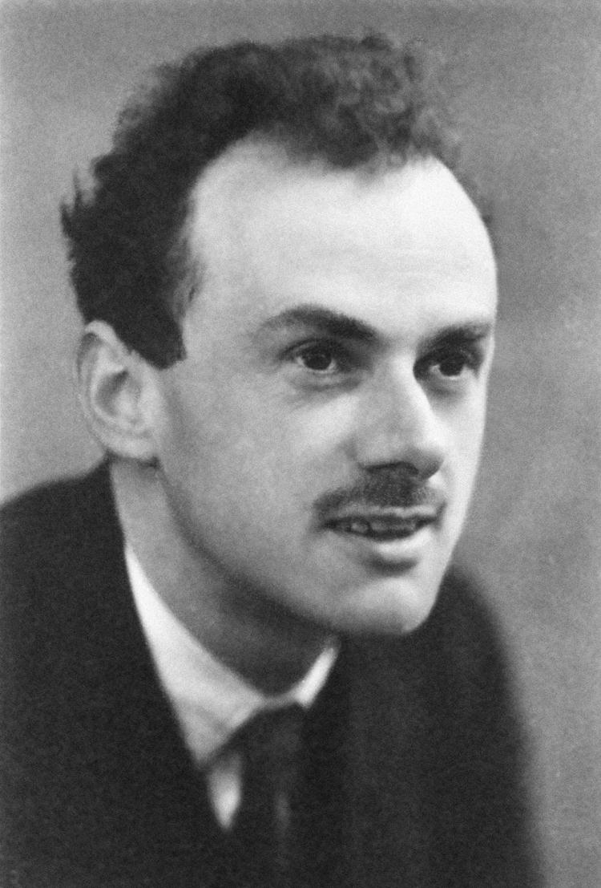

## Optional Module: PDF Methods {#optional-module-pdf-methods .pdf-methods-title-slide}

## Turbulence-Chemistry Closure Problem {.pdf-closure-slide}

::: {.pdf-closure-layout}

::: {.pdf-closure-intro}
In general, for finite-rate chemistry the Arrhenius rate laws cannot be evaluated using Favre-filtered fields.
:::

::: {.pdf-closure-inequality}
$$
\overline{\dot{m}_{\alpha}^{\prime\prime\prime}(\mathbf{Y},T)}
\neq
\dot{m}_{\alpha}^{\prime\prime\prime}(\widetilde{\mathbf{Y}},\widetilde{T})
$$
:::

::: {.pdf-closure-explanation}
However, the mean may be computed from convolution over the subgrid PDF:
:::

::: {.pdf-closure-integral}
$$
\left\langle\dot{m}_{\alpha}^{\prime\prime\prime}(\mathbf{x},t)\right\rangle
=\int f\!\left({\color{#4472c4}\underline{\psi}};\mathbf{x},t\right)
\dot{m}_{\alpha}^{\prime\prime\prime}(\underline{\psi})\,\mathrm{d}\underline{\psi}
$$
:::

::: {.pdf-closure-composition-label}
$\underline{\psi}$: thermochemical composition vector
:::

::: {.pdf-closure-field}
{fig-alt="Turbulent composition field showing unresolved variations within a grid cell."}
:::

:::

## Probability Density Functions {.normal-pdf-slide .has-example-files}

::: {.normal-pdf-layout}

::: {.normal-pdf-label}
Normal distribution:
:::

::: {.normal-pdf-equation}
$$
f(V)=\frac{1}{\sigma\sqrt{2\pi}}
\exp\!\left[-\frac{1}{2}\frac{(V-\mu)^2}{\sigma^2}\right]
$$
:::

::: {.normal-pdf-normalization}
$$
\int_{-\infty}^{\infty} f(V)\,\mathrm{d}V=1
$$
:::

::: {.normal-pdf-script}
See [`normal_pdf.py`](examples/pdf_example/normal_pdf.py).
:::

::: {.normal-pdf-plot}
{fig-alt="Normal probability densities with mean zero and standard deviations 0.1, 0.2, and 0.5, shown in blue, red, and green."}

::: {.normal-pdf-xlabel}
$V$
:::

::: {.normal-pdf-ylabel}
$f(V)$
:::

::: {.normal-pdf-legend}
[— $\mu=0,\;\sigma=0.1$]{.normal-pdf-blue}\
[— $\mu=0,\;\sigma=0.2$]{.normal-pdf-red}\
[— $\mu=0,\;\sigma=0.5$]{.normal-pdf-green}
:::

:::

:::

::: {.example-files}
Files: `08_Combustion/examples/pdf_example/`
:::

## Beta PDF {.beta-pdf-slide .has-example-files}

::: {.beta-pdf-layout}

::: {.beta-pdf-density}
$$
f(Z;a,b)=\frac{1}{B(a,b)}Z^{a-1}(1-Z)^{b-1}
$$
:::

::: {.beta-pdf-function}
$$
B(a,b)=\frac{\Gamma(a)\Gamma(b)}{\Gamma(a+b)}
\qquad {\color{#4472c4}\text{“beta function”}}
$$
:::

::: {.beta-pdf-parameters}
$$
a=\widetilde{Z}\gamma
\qquad b=(1-\widetilde{Z})\gamma
$$
:::

::: {.beta-pdf-gamma}
$$
\gamma=\frac{\widetilde{Z}(1-\widetilde{Z})}{\widetilde{Z^{\prime\prime 2}}}-1\geq 0
$$
:::

::: {.beta-pdf-script}
See [`beta_pdf.py`](examples/pdf_example/beta_pdf.py).
:::

::: {.beta-pdf-plot}
{fig-alt="Four beta probability densities showing peaked, broad, and endpoint-singular distributions for different mean and gamma values."}

::: {.beta-pdf-xlabel}
$Z$
:::

::: {.beta-pdf-ylabel}
$f(Z)$
:::

::: {.beta-pdf-legend}
[$\widetilde{Z}=0.6,\;\gamma=4$]{.beta-pdf-blue}\
[$\widetilde{Z}=0.6,\;\gamma=10$]{.beta-pdf-red}\
[$\widetilde{Z}=0.6,\;\gamma=0.5$]{.beta-pdf-green}\
[$\widetilde{Z}=0.8,\;\gamma=2$]{.beta-pdf-black}
:::

:::

:::

::: {.example-files}
Files: `08_Combustion/examples/pdf_example/`
:::

## Example: Dirac Delta Function {.dirac-delta-slide .has-example-files}

::: {.dirac-delta-layout}

::: {.dirac-delta-task-a}
a\) Using [`normal_pdf.py`](examples/pdf_example/normal_pdf.py), decrease the variance and plot the results. What do you observe?
:::

::: {.dirac-delta-task-b}
b\) The Dirac delta function is informally represented as
:::

::: {.dirac-delta-definition}
$$
\delta(x)=\begin{cases}
\infty & \text{if }x=0 \\
0 & \text{otherwise}
\end{cases}
$$
:::

::: {.dirac-delta-question}
Given your observations from part (a), what is
:::

::: {.dirac-delta-integral}
$$
\int_{-\infty}^{\infty}\delta(x)\,\mathrm{d}x\;?
$$
:::

::: {.dirac-delta-portrait}
{fig-alt="Portrait of Paul Dirac."}
:::

::: {.dirac-delta-caption}
Paul Dirac (1902–1984)
:::

:::

::: {.example-files}
Files: `08_Combustion/examples/pdf_example/`
:::

## Multiple Delta Functions {.source-slide-title}

{.reference-slide fig-align="center"}

## Lots of Deltas {.source-slide-title}

{.reference-slide fig-align="center"}

## Lots of Deltas: Random Distribution {.source-slide-title}

{.reference-slide fig-align="center"}

## The First Moment {.source-slide-title}

{.reference-slide fig-align="center"}

## The Second Central Moment {.source-slide-title}

{.reference-slide fig-align="center"}

## Example: Computing the Variance {.source-slide-title .has-example-files}

{.reference-slide .nostretch fig-align="center"}

::: {.example-files}
Files: `08_Combustion/examples/variance_example/`
:::

## Example: Computing the Variance, Continued {.source-slide-title .has-example-files}

{.reference-slide .nostretch fig-align="center"}

::: {.example-files}
Files: `08_Combustion/examples/variance_example/`
:::

## Interaction by Exchange with the Mean {.source-slide-title}

{.reference-slide fig-align="center"}

## Example: Evolution of the Variance with IEM {.source-slide-title}

{.reference-slide fig-align="center"}

## Three Environment Subgrid PDF {.source-slide-title}

{.reference-slide fig-align="center"}

## Three Environment Subgrid PDF: Definition {.source-slide-title}

{.reference-slide fig-align="center"}

## Cell Integral Constraints {.source-slide-title}

{.reference-slide fig-align="center"}

## Exercise: Check Cell Integral Constraints {.source-slide-title}

{.reference-slide fig-align="center"}

## Exercise: Derive Formula for Subgrid Variance {.source-slide-title}

{.reference-slide fig-align="center"}

## Relating Unmixed Fraction and SGS Variance {.source-slide-title}

{.reference-slide fig-align="center"}

## Relating Unmixed Fraction and SGS Variance: Case 2 {.source-slide-title}

{.reference-slide fig-align="center"}

## Relating Unmixed Fraction and SGS Variance: Case 3 {.source-slide-title}

{.reference-slide fig-align="center"}

## Relating Unmixed Fraction and SGS Variance: Case 4 {.source-slide-title}

{.reference-slide fig-align="center"}

## Relating Unmixed Fraction and SGS Variance: Summary {.source-slide-title}

{.reference-slide fig-align="center"}

## Fokker--Planck Equation {.source-slide-title}

{.reference-slide fig-align="center"}
