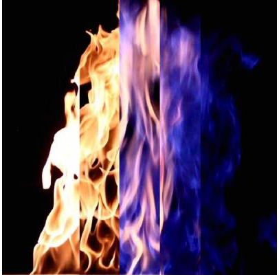
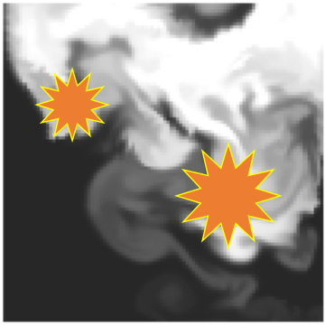
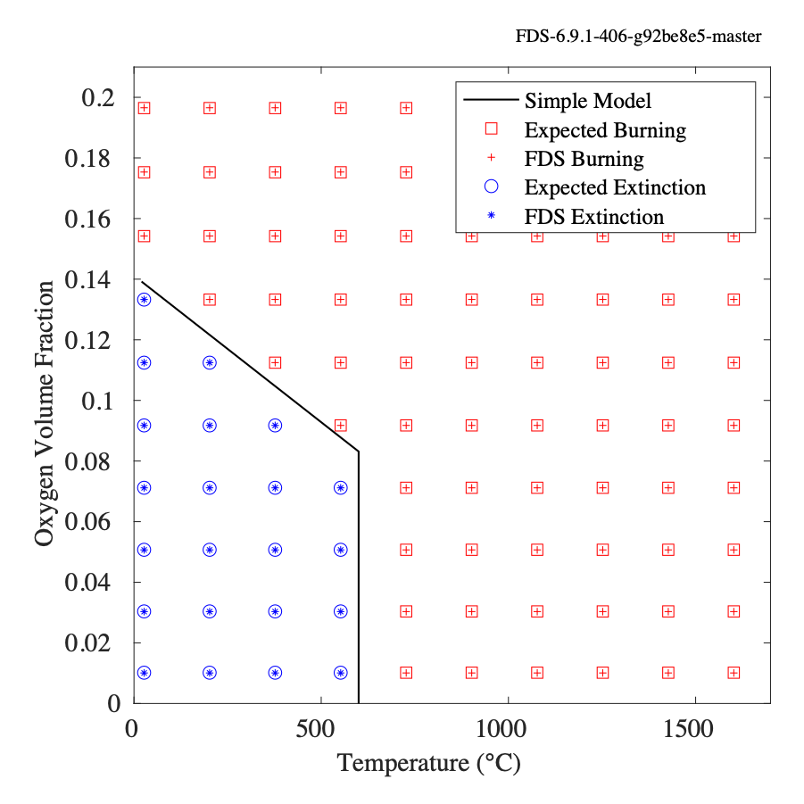
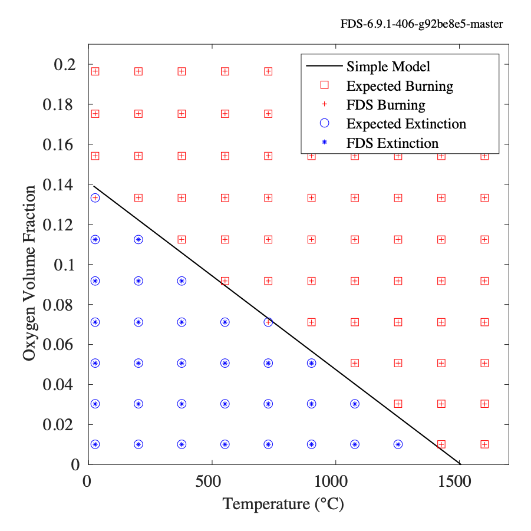
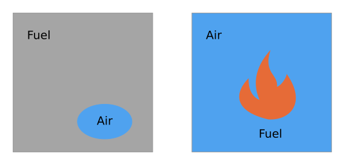
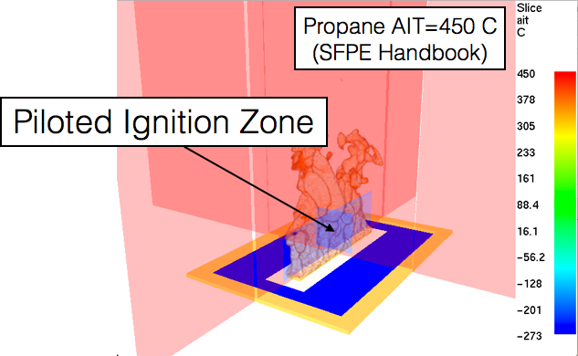
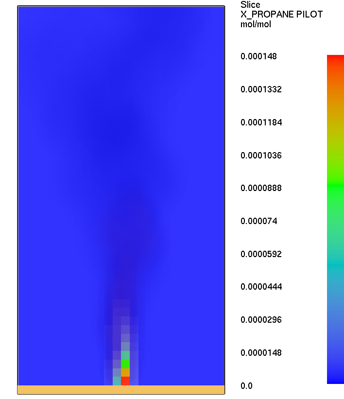
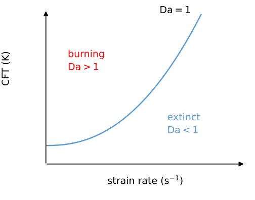
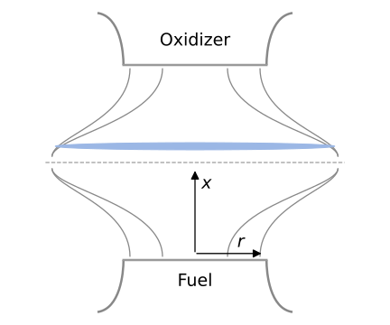
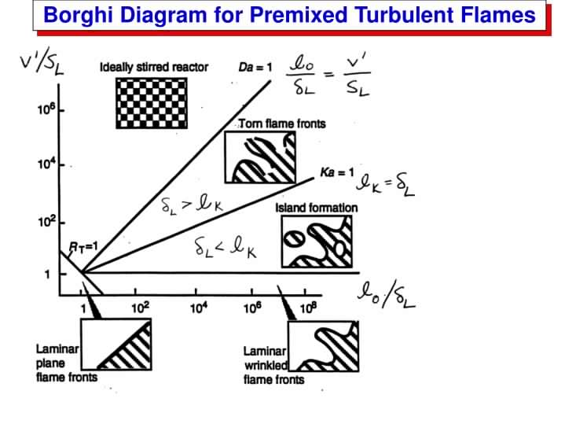

# Module III: Flame Extinction

## Fire Suppression versus Flame Extinction {.ext-slide}

::: {.ext-content .ext-two .ext-suppression}
::: {.ext-text}
::: {.ext-heading}
Fire suppression mechanisms
:::

- Fuel removal
- Fuel surface cooling
- Remove flame heat feedback

::: {.ext-heading}
Flame extinction mechanisms
:::

- Thermal extinction
- Aerodynamic quenching
- Kinetic chain breaking
:::
::: {.ext-photo-column}
{fig-alt="Composite flame photographs changing from luminous yellow to blue as the oxygen concentration decreases."}

Decreasing $X_{\mathrm{O_2}}$ $\longrightarrow$
:::
:::

::: {.ext-source}
J. P. White et al. “Radiative emissions measurements from a buoyant, turbulent line flame under oxidizer-dilution quenching conditions.” *Fire Safety Journal* 76:74–84, 2015.
:::

## Binary Flame Extinction for EDC {.ext-slide}

::: {.ext-content .ext-equations .ext-binary}
$$
\frac{\partial\bar{\rho}\widetilde{Y}_{\alpha}}{\partial t}
+\frac{\partial(\bar{\rho}\widetilde{Y}_{\alpha}\widetilde{u}_i)}{\partial x_i}
=\frac{\partial}{\partial x_i}\left(
\left[\rho D_{\alpha}+\frac{\mu_t}{\mathrm{Sc}_t}\right]
\frac{\partial\widetilde{Y}_{\alpha}}{\partial x_i}\right)
+{\color{red}\overline{\dot m_{\alpha}^{\prime\prime\prime}}}
$$

$$
\overline{\dot m_{\mathrm F}^{\prime\prime\prime}}
=-\rho\frac{\min(\widetilde{Y}_{\mathrm F},\widetilde{Y}_{\mathrm A}/s)}{\tau_{\mathrm{mix}}}
\times\mathrm{FEF}(\ldots)
$$

::: {.ext-factor-definition}
::: {.ext-factor-label}
Flame Extinction Factor (FEF)
:::

$$
\mathrm{FEF}=\begin{cases}
0 & \text{extinction}\\[0.4em]
1 & \text{no extinction}
\end{cases}
$$
:::
:::

::: {.ext-source}
S. Vilfayeau, J. P. White, P. B. Sunderland, A. W. Marshall, and A. Trouvé. “Large eddy simulation of flame extinction in a turbulent line fire exposed to air-nitrogen co-flow.” *Fire Safety Journal* 86:16–31, 2016.
:::

## Continuous Flame Extinction for EDC {.ext-slide}

::: {.ext-content .ext-continuous}
::: {.ext-large-equation}
$$
\overline{\dot m_{\mathrm F}^{\prime\prime\prime}}
=-\rho\frac{\min(\widetilde{Y}_{\mathrm F},\widetilde{Y}_{\mathrm A}/s)}{\tau_{\mathrm{mix}}}
\times\mathrm{FEF}(\ldots),\qquad \mathrm{FEF}\in[0,1]
$$
:::
::: {.ext-two}
::: {.ext-text}
Proposed continuous flame-extinction factor (under development).

::: {.ext-blue}
Depending on the regime, there could be flame islands within a cell.
:::
:::
::: {.ext-islands}
{fig-alt="Square turbulent composition field with two schematic flame islands inside the cell."}
:::
:::
:::

::: {.ext-source}
Schematic: [`draw-extinction-diagrams.py`](figs/flame_extinction/draw-extinction-diagrams.py).
:::

## Mechanisms of Flame Extinction {.ext-slide}

::: {.ext-content .ext-list}
- **Thermal (FDS)**
  - Simple oxygen limit (Mowrer)
  - Detailed thermophysical properties (Vaari et al.)
- Aerodynamic quenching
- Kinetic chain breaking
:::

::: {.ext-source}
J. Vaari, J. Floyd, and R. McDermott. [“CFD Simulations on Extinction of Co-Flow Diffusion Flames.”](https://doi.org/10.3801/IAFSS.FSS.10-781) *Fire Safety Science—Proceedings of the Tenth International Symposium*, pp. 781–794, 2011.
:::

## Oxygen Criterion: Mowrer's Model {.ext-slide}

::: {.ext-content .ext-list}
- Does not account for the fuel-specific heat of combustion.
- Does not account for differences between reactant and product thermal properties.
- Otherwise closely related to the FDS thermal extinction model discussed next.
- May be used with arbitrarily complex fuel species.
:::

## Oxygen Criterion: Derivation {.ext-slide}

::: {.ext-content .ext-mowrer}
$$
\begin{aligned}
\Delta m_{\mathrm F}\Delta h_{c,\mathrm F}
&=mC_p(T_f-T_0)\\[0.65em]
\frac{m\widehat Y_{\mathrm{O_2}}}{s}\Delta h_{c,\mathrm F}
&=mC_p(T_f-T_0)\\[0.65em]
\widehat Y_{\mathrm{O_2}}\frac{\Delta h_{c,\mathrm F}}{s}
&=C_p(T_f-T_0)
\end{aligned}
$$

::: {.ext-blue-box}
$$
\begin{aligned}
\widehat Y_{\mathrm{O_2}}&=\frac{C_p(T_f-T_0)}{\Delta h_{c,\mathrm{O_2}}}\\[0.4em]
&\approx\frac{(1.2)(1700-293)}{13100}=0.13
\end{aligned}
$$
:::
:::

## Simple Models of Flame Extinction {.ext-slide}

::: {.ext-content .ext-two .ext-comparison}
::: {.ext-panel}
::: {.ext-heading}
Extinction Model 1
:::

{fig-alt="Original FDS verification plot of burning and extinction versus oxygen volume fraction and temperature for Extinction Model 1, including its free-burn temperature cutoff."}
:::
::: {.ext-panel}
::: {.ext-heading}
Extinction Model 2
:::

{fig-alt="Original FDS verification plot of burning and extinction versus oxygen volume fraction and temperature for Extinction Model 2."}
:::
:::

::: {.ext-source}
Original verification results retained from the lecture. See [FDS manuals](https://pages.nist.gov/fds-smv/manuals.html), User Guide, “Extinction.”
:::

## Example: Simple Extinction Model {.ext-slide .has-example-files}

::: {.ext-content .ext-exercise}
Using [`Qs=1_RI=05.fds`](examples/extinction_example/Qs=1_RI=05.fds):

1. Select `EXTINCTION_MODEL='EXTINCTION 1'` on the `COMB` line.
2. Add a slice of oxygen mass fraction (`QUANTITY='MASS FRACTION'`, `SPEC_ID='OXYGEN'`).
3. Add a slice with `QUANTITY='EXTINCTION'`.

::: {.ext-small}
The supplied file already contains these settings; inspect them before running the case.
:::
:::

::: {.example-files}
Files: `08_Combustion/examples/extinction_example/`
:::

## FDS Thermal Extinction Model {.ext-slide}

::: {.ext-content .ext-thermal-balance}
::: {.ext-labeled-equation}
::: {.ext-blue}
Mass:
:::
::: {.ext-panel}
$$
\mathrm{Fuel}+s\,\mathrm{Air}+\mathrm{Diluents}
\longrightarrow(1+s)\,\mathrm{Products}+\mathrm{Diluents}
$$
:::
:::
::: {.ext-labeled-equation}
::: {.ext-blue}
Energy:
:::
::: {.ext-panel}
$$
m_{\mathrm F}h_{\mathrm F}(T_0)+m_{\mathrm A}h_{\mathrm A}(T_0)+m_{\mathrm D}h_{\mathrm D}(T_0)
=m_{\mathrm P}h_{\mathrm P}(T_f)+m_{\mathrm D}h_{\mathrm D}(T_f)
$$
:::
:::

::: {.ext-temperatures}
$T_0$: initial cell temperature\
$T_f$: final cell temperature
:::

$$
h_{\alpha}(T)=\Delta h_{f,\alpha}^{\circ}
+\int_{T_{\mathrm{ref}}}^{T} C_{p,\alpha}(T')\,\mathrm{d}T'
$$
:::

## Defining the Stoichiometric Pocket {.ext-slide}

::: {.ext-content .ext-pocket}
::: {.ext-two .ext-pocket-top}
::: {.ext-panel}
$$
1=Z_{\mathrm F}^{0}+Z_{\mathrm A}^{0}+Z_{\mathrm P}^{0}
=Z_{\mathrm F}+Z_{\mathrm A}+Z_{\mathrm P}
$$

Recall the equivalence ratio:

$$
\phi=\frac{sZ_{\mathrm F}^{0}}{Z_{\mathrm A}^{0}}
$$
:::
::: {.ext-pocket-field}
{fig-alt="Square idealized field containing unmixed and mixed environments."}
:::
:::

Consider the case of excess air, $\phi<1$:

$$
\underbrace{Z_{\mathrm F}^{0}+\phi\left(Z_{\mathrm A}^{0}+Z_{\mathrm P}^{0}\right)}_{\color{red}\text{Stoichiometric pocket}}
+(1-\phi)\left(Z_{\mathrm A}^{0}+Z_{\mathrm P}^{0}\right)
$$
:::

## FDS Thermal Extinction Model: Dilution {.ext-slide}

::: {.ext-content .ext-dilution}
::: {.ext-two .ext-dilution-top}
::: {.ext-red-box}
Diluents include excess **fuel**, but not excess **air**.
:::
::: {.ext-panel}
{fig-alt="Two square cells: an air pocket surrounded by fuel, and a burning fuel pocket surrounded by air."}
:::
:::

$$
Q=m_{\mathrm F}\Delta h_{f,\mathrm F}^{\circ}
+m_{\mathrm A}\Delta h_{f,\mathrm A}^{\circ}
-m_{\mathrm P}\Delta h_{f,\mathrm P}^{\circ}
$$

$$
\begin{aligned}
Q+m_{\mathrm F}\!\int_{T_{\mathrm{ref}}}^{T_0}\!C_{p,\mathrm F}\,\mathrm{d}T
+m_{\mathrm A}\!\int_{T_{\mathrm{ref}}}^{T_0}\!C_{p,\mathrm A}\,\mathrm{d}T
+m_{\mathrm D}\!\int_{T_{\mathrm{ref}}}^{T_0}\!C_{p,\mathrm D}\,\mathrm{d}T\\[0.5em]
= m_{\mathrm P}\!\int_{T_{\mathrm{ref}}}^{T_f}\!C_{p,\mathrm P}\,\mathrm{d}T
+m_{\mathrm D}\!\int_{T_{\mathrm{ref}}}^{T_f}\!C_{p,\mathrm D}\,\mathrm{d}T
\end{aligned}
$$
:::

## FDS Thermal Extinction Model: Criterion {.ext-slide}

::: {.ext-content .ext-dilution}
::: {.ext-two .ext-dilution-top}
::: {.ext-red-box}
Diluents include excess **fuel**, but not excess **air**.
:::
::: {.ext-panel}
{fig-alt="Two square cells contrasting excess fuel and excess air around a reacting pocket."}
:::
:::

Extinction occurs when the available energy cannot reach the critical flame temperature:

::: {.ext-green-box}
$$
\begin{aligned}
m_{\mathrm F}h_{s,\mathrm F}(T_0)+m_{\mathrm A}h_{s,\mathrm A}(T_0)
+m_{\mathrm D}h_{s,\mathrm D}(T_0)+Q\\[0.4em]
< m_{\mathrm P}h_{s,\mathrm P}(T_{\mathrm{CFT}})
+m_{\mathrm D}h_{s,\mathrm D}(T_{\mathrm{CFT}})
\end{aligned}
$$
:::
:::

## Example: FDS Thermal Extinction {.ext-slide .has-example-files}

::: {.ext-content .ext-exercise}
Using [`Qs=1_RI=05.fds`](examples/extinction_example/Qs=1_RI=05.fds), select `EXTINCTION_MODEL='EXTINCTION 2'` on the `COMB` line.

1. Compare flame heights with suppression enabled and with `SUPPRESSION=F`.
2. With suppression enabled, compare critical flame temperatures of **1700 K** and **1800 K**.

::: {.ext-blue-box .ext-small}
FDS temperature inputs are in °C: set `CRITICAL_FLAME_TEMPERATURE=1426.85` and `1526.85`, respectively, on the `REAC` line.
:::
:::

::: {.example-files}
Files: `08_Combustion/examples/extinction_example/`
:::

::: {.notes}
The original slide specified physical critical flame temperatures of 1700 K and 1800 K next to the input keyword. The FDS User Guide specifies °C for CRITICAL_FLAME_TEMPERATURE; the input values above preserve the original physical temperatures. The supplied file selects EXTINCTION 1, so switch to EXTINCTION 2 for this exercise.
:::

## Simple Ignition Model (AIT) {#simple-ignition-model .ext-slide}

::: {.ext-content .ext-two .ext-ignition}
::: {.ext-text}
::: {.ext-heading}
Auto-ignition temperature
:::

1. Compare the initial cell temperature $T_0$ with AIT.
2. If $T_0>\mathrm{AIT}$, apply the extinction model.
3. Otherwise, set $Q=0$.
:::
::: {.ext-panel}
{fig-alt="Original Smokeview illustration of a piloted ignition zone, with propane auto-ignition temperature 450 degrees Celsius."}
:::
:::

::: {.ext-source}
J. P. White, S. Vilfayeau, A. W. Marshall, A. Trouvé, and R. J. McDermott. “Modeling flame extinction and reignition in large eddy simulations with fast chemistry.” *Fire Safety Journal*, 2017.
:::

## Example: Cup Burner {.ext-slide .has-example-files}

::: {.ext-content .ext-exercise .ext-cup}
Using [`Cup_methane_n2.fds`](examples/cup_burner_example/Cup_methane_n2.fds):

1. Use a single mesh, reduce the resolution by half, and set `T_END=10`. The supplied case already has one mesh and a 10 s duration.
2. Replace the ignitor with a pilot region above the burner: specify `AUTO_IGNITION_TEMPERATURE` and an `AIT_EXCLUSION_ZONE` on the `REAC` line.
3. Add a slice with `QUANTITY='AUTO IGNITION TEMPERATURE'`.
4. Increase the size of the exclusion zone and observe the change.

::: {.ext-small}
See [`Cup_methane_n2_pilot.fds`](examples/cup_burner_example/Cup_methane_n2_pilot.fds) for an example of the pilot-zone settings.
:::
:::

::: {.example-files}
Files: `08_Combustion/examples/cup_burner_example/`
:::

::: {.notes}
The original slide names Cup_CH4_N2.fds, which is not present in this repository, and uses an older INIT/AIT formulation. The linked methane case and its pilot variant are the available files. The pilot-zone instructions follow the supplied variant and the current local FDS User Guide's AIT_EXCLUSION_ZONE syntax.
:::

## Pilot Ignition Model {.ext-slide}

::: {.ext-content .ext-two .ext-pilot}
::: {.ext-text}
1. Define a fuel with AIT $=0\,\mathrm{K}$ as the **pilot fuel**.
2. Define a second fuel for the bulk of the heat release.
3. Inject a small amount of pilot fuel.
4. Adjust `ZZ_MIN_GLOBAL` if needed.

::: {.ext-small}
In FDS input, $0\,\mathrm{K}=-273.15\,{}^{\circ}\mathrm{C}$.
:::
:::
::: {.ext-pilot-image}
{fig-alt="Original Smokeview slice showing a small propane-pilot volume fraction above the burner."}
:::
:::

## Example: Pilot Fuel Ignition {.ext-slide .has-example-files}

::: {.ext-content .ext-exercise}
Using [`test_pilot.fds`](examples/pilot_fuel_example/test_pilot.fds):

1. Check the heat release rate; it should start around **50 kW**.
2. Vary the fraction of pilot fuel.
3. Vary `ZZ_MIN_GLOBAL` and observe its effect.
:::

::: {.example-files}
Files: `08_Combustion/examples/pilot_fuel_example/`
:::

## Aerodynamic Quenching {.ext-slide}

::: {.ext-content .ext-two .ext-aerodynamic}
::: {.ext-panel}
{fig-alt="Schematic nonlinear critical-flame-temperature boundary versus strain rate, separating burning at Damkohler number greater than one from extinction below one."}
:::
::: {.ext-panel}
::: {.ext-jet-small}
{fig-alt="Opposed fuel and oxidizer jets with a flame sheet and axial and radial coordinates."}
:::

- CFT is a function of strain.
- The function is nonlinear.
- Experimental CFT represents finite strain.
:::
:::

::: {.ext-source}
Schematics: [`draw-extinction-diagrams.py`](figs/flame_extinction/draw-extinction-diagrams.py); the curve is qualitative.
:::

## Steady Laminar Flamelet {.ext-slide}

::: {.ext-content .ext-two .ext-flamelet}
::: {.ext-jet-column}
{fig-alt="Opposed fuel and oxidizer jets forming a diffusion flame."}

Opposed-jet diffusion flame\
OPPDIFF
:::
::: {.ext-flamelet-equations}
Steady, 1D species equation:

$$
\rho u\frac{\mathrm dY_{\alpha}}{\mathrm dx}
=\frac{\mathrm d}{\mathrm dx}\left(\rho D\frac{\mathrm dY_{\alpha}}{\mathrm dx}\right)
+\dot m_{\alpha}^{\prime\prime\prime}
$$

Steady, 1D mixture fraction:

$$
\rho u\frac{\mathrm dZ}{\mathrm dx}
=\frac{\mathrm d}{\mathrm dx}\left(\rho D\frac{\mathrm dZ}{\mathrm dx}\right)
$$

Coordinate transformation:

$$
\frac{\mathrm d}{\mathrm dx}=\frac{\mathrm dZ}{\mathrm dx}\frac{\mathrm d}{\mathrm dZ}
$$
:::
:::

## Steady Laminar Flamelet: Equations {.ext-slide}

::: {.ext-content .ext-flamelet-derivation}
$$
\begin{aligned}
\rho u\frac{\mathrm dZ}{\mathrm dx}\frac{\mathrm dY_{\alpha}}{\mathrm dZ}
&=\frac{\mathrm dZ}{\mathrm dx}\frac{\mathrm d}{\mathrm dZ}
\left(\rho D\frac{\mathrm dZ}{\mathrm dx}\frac{\mathrm dY_{\alpha}}{\mathrm dZ}\right)
+\dot m_{\alpha}^{\prime\prime\prime}\\[0.6em]
&=\rho D\left(\frac{\mathrm dZ}{\mathrm dx}\right)^2\frac{\mathrm d^2Y_{\alpha}}{\mathrm dZ^2}
+\frac{\mathrm dY_{\alpha}}{\mathrm dZ}\frac{\mathrm d}{\mathrm dx}
\left(\rho D\frac{\mathrm dZ}{\mathrm dx}\right)+\dot m_{\alpha}^{\prime\prime\prime}
\end{aligned}
$$

$$
\frac{\mathrm dY_{\alpha}}{\mathrm dZ}
\underbrace{\left[\rho u\frac{\mathrm dZ}{\mathrm dx}
-\frac{\mathrm d}{\mathrm dx}\left(\rho D\frac{\mathrm dZ}{\mathrm dx}\right)\right]}_{0}
=\rho D\left(\frac{\mathrm dZ}{\mathrm dx}\right)^2\frac{\mathrm d^2Y_{\alpha}}{\mathrm dZ^2}
+\dot m_{\alpha}^{\prime\prime\prime}
$$

::: {.ext-two .ext-flamelet-result}
::: {.ext-green-box}
$$
\frac{\rho\chi}{2}\frac{\mathrm d^2Y_{\alpha}}{\mathrm dZ^2}
+\dot m_{\alpha}^{\prime\prime\prime}=0
$$
:::
::: {.ext-panel}
$$
\chi=2D\left(\frac{\mathrm dZ}{\mathrm dx}\right)^2
$$

From potential flow theory: $\chi(Z;a)$, where $a$ is the strain rate.
:::
:::
:::

## Damköhler Number {.ext-slide}

::: {.ext-content .ext-damkohler}
$$
\mathrm{Da}=\frac{\text{flow time scale}}{\text{chemical time scale}}
=\frac{\tau_{\mathrm{mix}}}{\tau_{\mathrm{chem}}}
$$
:::

## Borghi Diagram {.ext-slide}

::: {.ext-content .ext-borghi}
{fig-alt="Original Borghi diagram for premixed turbulent flames, showing regimes of laminar and wrinkled flames, island formation, torn flame fronts, and an ideally stirred reactor, separated by Reynolds, Karlovitz, and Damkohler number boundaries."}
:::

::: {.notes}
This is the original premixed-turbulent-flame regime diagram embedded in the lecture. It is retained as a source figure rather than redrawn with invented quantitative boundaries; its original attribution is not provided in the source deck.
:::
